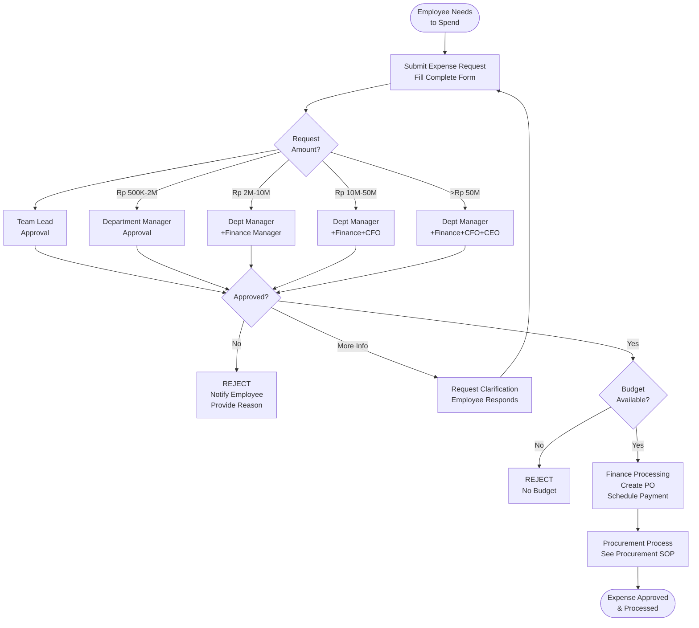

# Expense Approval Workflow - SOP

**Owner:** Finance Manager
**Frequency:** Continuous
**Approver:** CFO
**Last Updated:** December 2025

---

## Purpose

Ensure proper authorization and control of company expenses through standardized approval workflow.

## Scope

**Applies to:** All business expenses
**Roles:** All employees,managers, finance team

---

## Approval Thresholds

| Amount (IDR) | Approver 1 | Approver 2 | Approver 3 |
|--------------|-----------|------------|------------|
| < Rp 500K | Team Lead | - | - |
| Rp 500K - 2M | Department Manager | - | - |
| Rp 2M - 10M | Department Manager | Finance Manager | - |
| Rp 10M - 50M | Department Manager | Finance Manager | CFO |
| > Rp 50M | Department Manager | Finance Manager | CFO + CEO |

**Emergency Override:** CFO can approve any amount for true emergencies

---

## Expense Categories

### Operating Expenses (OPEX)
- Office supplies
- Marketing/advertising
- Software subscriptions
- Professional services
- Travel & entertainment

### Capital Expenses (CAPEX)
- Equipment (> Rp 5M, > 1 year useful life)
- Furniture/fixtures
- Technology infrastructure
- Leasehold improvements

---

## Approval Workflow

### Step 1: Employee Submits Request

**Method:** Expense Request Form (Google Form/System)

**Required Information:**
```
EXPENSE REQUEST

Submitted By: __________
Department: __________
Date: __________

EXPENSE DETAILS:
Category: [OPEX/CAPEX]
Item/Service: __________
Amount: Rp __________
Business Justification: __________

Budget:
Budget Line Item: __________
Budgeted Amount: Rp __________
Spent YTD: Rp __________
Remaining: Rp __________

Vendor:
Vendor Name: __________
Quote/Invoice Attached: Yes/No

Urgency:
 Routine (3-5 days)
 Urgent (< 2 days)
 Emergency (< 24 hours)
```

### Step 2: Auto-Routing

System routes to approvers based on amount threshold.

### Step 3: Approval Chain

**Each Approver Reviews:**
- Business justification
- Budget availability
- Vendor appropriateness
- Pricing reasonableness

**Decision:** Approve / Reject / Request More Info

**SLA:**
- Routine: 3 business days
- Urgent: 24 hours
- Emergency: 4 hours

### Step 4: Finance Processing

**Once Fully Approved:**
1. Finance creates PO (if vendor)
2. Payment scheduled per terms
3. Expense tracked against budget

---

## Flowchart



---

## Budget Checks

**Finance validates:**
```
Budget Line: Marketing - Digital Ads
Annual Budget: Rp 120,000,000
Spent YTD: Rp 87,000,000
This Request: Rp 15,000,000
Projected Total: Rp 102,000,000

Status: Within Budget (Rp 18M remaining)
```

**If Over Budget:**
- Request budget reallocation (from another line)
- Request budget increase (requires CFO approval)
- Defer expense to next period

---

## Quality Checks

- [ ] Complete expense request submitted
- [ ] Business justification provided
- [ ] Budget line identified
- [ ] Quote/invoice attached (if vendor)
- [ ] All required approvals obtained
- [ ] Budget availability confirmed
- [ ] Processed within SLA timeframe

---

## Common Issues

**Issue: Delayed Approvals**
- **Solution:** Auto-escalate if no response within SLA, notify next level manager

**Issue: Budget Overspend**
- **Solution:** Real-time budget tracking, alerts when 80% spent

---

## Related Documents

- [[products/templates/inventory-procurement/03-procurement-process|Procurement Process SOP]]
- **Annual Budget Template** (XLSX)
- **Expense Categories Guide** (PDF)

---

## Revision History

| Date | Version | Changes | Updated By |
|------|---------|---------|------------|
| 2025-12 | 1.0 | Initial SOP | Finance Team |
