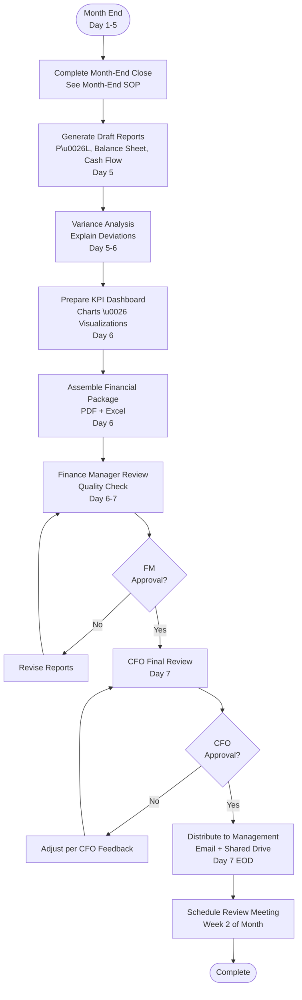

# Financial Reporting - SOP

**Owner:** Finance Manager
**Frequency:** Monthly (by 7th business day)
**Approver:** CFO
**Last Updated:** December 2025

---

## Purpose

Provide timely, accurate financial reports to management for informed decision-making and business performance monitoring.

## Scope

**Applies to:** All financial reporting
**Roles:** Finance Team, Management

---

## Monthly Financial Package

**Delivery:** By 7th business day of following month

### Standard Reports

1. **Income Statement (P&L)**
 - Current month actual vs budget
 - YTD actual vs budget vs prior year
 - Key metrics: Revenue, COGS %, Labor %, Operating margin

2. **Balance Sheet**
 - Assets, Liabilities, Equity
 - Key ratios: Current ratio, debt-to-equity

3. **Cash Flow Statement**
 - Operating, investing, financing activities
 - Cash runway calculation

4. **Variance Analysis**
 - Significant variances explained (> 10% or > Rp 5M)
 - Root cause analysis

5. **KPI Dashboard**
 ```
 MONTHLY KPIS

 Revenue Metrics:
 - Total Revenue: Rp XXX (vs budget: ___%)
 - Revenue/Location: Rp XXX
 - Revenue Growth MoM: ___%

 Profitability:
 - Gross Margin: ___% (target: 65-70%)
 - Operating Margin: ___% (target: 15-20%)
 - Net Margin: ___% (target: 10-15%)

 Efficiency:
 - COGS %: ___% (target: < 35%)
 - Labor %: ___% (target: 25-35%)
 - Operating Expense Ratio: ___%

 Cash:
 - Cash Balance: Rp XXX
 - Cash Runway: ___ months
 - Days Sales Outstanding: ___ days
 ```

---

## Reporting Flow



---

## Report Templates

### P&L Template
```
INCOME STATEMENT
For the Month Ending: December 31, 2025

 | Actual | Budget | Variance | %Var
------------------------|-----------|-----------|----------|------
Revenue
 Coffee Sales | 150,000K | 145,000K | 5,000K | 3.4%
 Food Sales | 75,000K | 80,000K | (5,000K) | -6.3%
 Catering | 25,000K | 20,000K | 5,000K | 25.0%
Total Revenue | 250,000K | 245,000K | 5,000K | 2.0%

Cost of Goods Sold
 Coffee COGS | 48,000K | 46,400K | 1,600K | 3.4%
 Food COGS | 26,250K | 28,000K | (1,750K) | -6.3%
Total COGS | 74,250K | 74,400K | (150K) | -0.2%

Gross Profit | 175,750K | 170,600K | 5,150K | 3.0%
Gross Margin % | 70.3% | 69.6% | 0.7pp |

Operating Expenses
 Labor | 75,000K | 73,500K | 1,500K | 2.0%
 Rent | 30,000K | 30,000K | - | 0.0%
 Marketing | 12,500K | 15,000K | (2,500K) | -16.7%
 Utilities | 8,000K | 8,500K | (500K) | -5.9%
 Other | 10,000K | 10,000K | - | 0.0%
Total Operating Exp | 135,500K | 137,000K | (1,500K) | -1.1%

Operating Income | 40,250K | 33,600K | 6,650K | 19.8%
Operating Margin % | 16.1% | 13.7% | 2.4pp |

Other Income/(Expense) | (2,000K) | (2,000K) | - | 0.0%

Net Income | 38,250K | 31,600K | 6,650K | 21.0%
Net Margin % | 15.3% | 12.9% | 2.4pp |
```

### Variance Commentary

**Significant Variances (>10% or >Rp 5M):**

1. **Catering Revenue: +Rp 5M (+25%)**
 - **Cause:** 2 large corporate events (Rp 12M + Rp 8M)
 - **Outlook:** One-time, not recurring monthly

2. **Marketing: -Rp 2.5M (-16.7%)**
 - **Cause:** Delayed social media campaign launch
 - **Action:** Catch-up spend in January

3. **Operating Income: +Rp 6.65M (+19.8%)**
 - **Driver:** Strong catering revenue + marketing underspend
 - **Assessment:** Partially sustainable (marketing will normalize)

---

## Distribution List

**Primary Recipients:**
- CEO
- CFO
- COO
- Department Heads (Product, Sales, Operations)

**CC:**
- Board of Directors (quarterly)
- Investors (quarterly, redacted version)

**Access Control:**
- Confidential - for management only
- Not for public distribution

---

## Quality Checks

- [ ] All financial statements balanced
- [ ] Variance analysis complete (all >10% explained)
- [ ] KPI dashboard updated
- [ ] Charts/visualizations accurate
- [ ] Finance Manager reviewed
- [ ] CFO approved
- [ ] Distributed by deadline (Day 7)

---

## Related Documents

- [[biz/departments/finance/sops/04-month-end-close|Month-End Close SOP]]
- financial-report-templates.xlsx.md
- [[biz/departments/finance/resources/kpi-definitions|KPI\ Definitions]]

---

## Revision History

| Date | Version | Changes | Updated By |
|------|---------|---------|------------|
| 2025-12 | 1.0 | Initial SOP | Finance Team |

---

**Best Practice:** Tell the story behind the numbers. Don't just report data - provide insights and recommendations.

