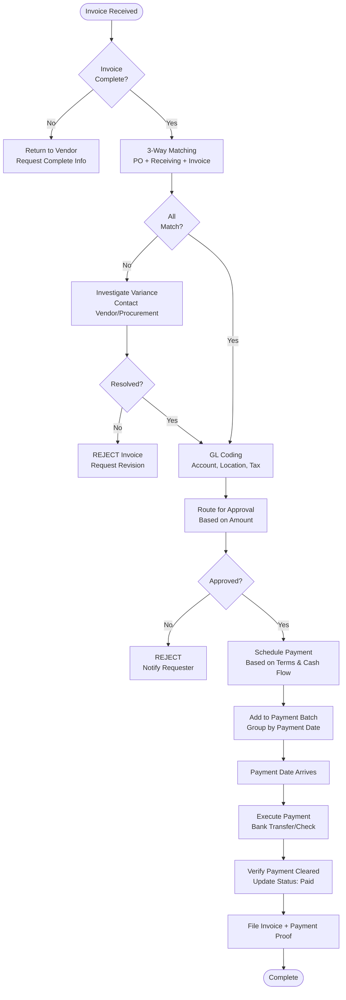

# Invoice Processing - SOP

**Owner:** Accounts Payable Team
**Frequency:** Continuous (as invoices received)
**Approver:** Finance Manager
**Last Updated:** December 2025

---

## Purpose

Ensure timely, accurate processing of vendor invoices with proper authorization and payment scheduling.

## Scope

**Applies to:** All vendor invoices
**Roles:** AP Team, Finance Manager, Approvers

---

## Invoice Processing Workflow

### Step 1: Invoice Receipt (Day 1)

**Methods:**
- Email: invoices@pwbi.co.id
- Upload: System portal
- Physical mail (scan immediately)

**AP Staff Actions:**
1. Date-stamp invoice (received date)
2. Assign invoice number if vendor didn't provide
3. Initial review for completeness

**Required Information:**
- [ ] Vendor name & address
- [ ] Invoice number & date
- [ ] PO number (if applicable)
- [ ] Line items (description, qty, price)
- [ ] Total amount
- [ ] Payment terms
- [ ] Bank details

**If Incomplete:** Return to vendor with request for complete information

### Step 2: 3-Way Matching (Day 1-2)

**Match Against:**
1. **Purchase Order:** What was ordered?
2. **Receiving Report:** What was received?
3. **Invoice:** What are we being billed?

**Verification:**
```
PO #12345: 100kg coffee beans @ Rp 85K/kg = Rp 8.5M
Receiving: 100kg received, quality OK
Invoice: 100kg @ Rp 85K/kg = Rp 8.5M

Match Status: APPROVED (all 3 documents match)
```

**If Mismatch:**
| Issue | Example | Action |
|-------|---------|--------|
| Price difference | Invoice Rp 90K, PO Rp 85K | Contact Procurement, get approval for variance |
| Quantity difference | Invoice 100kg, Received 95kg | Contact vendor, request credit or revised invoice |
| No PO | Invoice received, no PO exists | Investigate if legitimate, get retroactive approval |

### Step 3: Coding & Approval (Day 2-3)

**AP Staff Codes Invoice:**
```
Invoice #: INV-2025-1234
Vendor: ABC Coffee Supplies
Amount: Rp 8,500,000

GL Coding:
Account: 5100 - Cost of Goods Sold
SubAccount: 5110 - Coffee Beans
Location: Senayan City
Project/Campaign: N/A

Tax:
PPN (11%): Rp 935,000 (included in total)
Withholding Tax (if applicable): __________
```

**Route for Approval:**
- Amount < Rp 5M: Finance Manager
- Amount Rp 5-20M: Finance Manager + Operations Manager
- Amount > Rp 20M: Finance Manager + Operations Manager + CFO

**Approver Validates:**
- Goods/services actually received
- Price reasonable
- GL coding correct
- Budget available

### Step 4: Payment Scheduling (Day 3-4)

**AP Staff Determines Payment Date:**
```
Invoice Dated: Dec 1, 2025
Terms: Net 30
Due Date: Dec 31, 2025
Early Payment Discount: 2% if paid by Dec 11

Cash Flow Check:
Current Cash: Rp 50M
Scheduled Payments This Week: Rp 15M
This Invoice: Rp 8.5M
Remaining: Rp 26.5M Sufficient

Payment Decision:
 Pay Dec 11 (save 2% = Rp 170K)
 Pay Dec 31 (preserve cash flow)

Recommended: Dec 11 (early payment discount worth it)
```

**Add to Payment Batch:**
- Invoices grouped by payment date
- Batched for efficiency (weekly payment runs typically)

### Step 5: Payment Execution (Payment Date)

**Finance Manager Actions:**
1. Review payment batch (all invoices for today)
2. Verify total amount vs. cash available
3. Generate payment file (bank format)
4. Approve payment file

**Payment Methods:**
```
Bank Transfer (Most Common): 95%
- Generate batch file
- Upload to bank portal
- 2-factor authentication
- Confirm execution

Check (Rare): 3%
- Print check
- 2 signatures required
- Mail to vendor
- Mark as "Check issued"

E-Wallet (Small Vendors): 2%
- One-click payment via API
- Instant confirmation
```

### Step 6: Reconciliation (Day After Payment)

**AP Staff Verifies:**
- Payment cleared from bank account
- Bank statement matches payment file
- Update invoice status: "Paid"
- File payment confirmation

**If Payment Failed:**
- Investigate reason (insufficient funds, wrong account)
- Correct issue
- Reschedule payment
- Notify vendor of delay

---

## Invoice Processing Flowchart



---

## Payment Terms Guide

| Terms | Meaning | Payment Due | Example |
|-------|---------|-------------|---------|
| Net 30 | Pay within 30 days | Invoice date + 30 days | Dec 1 invoice → Due Dec 31 |
| Net 15 | Pay within 15 days | Invoice date + 15 days | Dec 1 invoice → Due Dec 16 |
| COD | Cash on delivery | Upon delivery | Pay when goods received |
| 2/10 Net 30 | 2% discount if paid in 10 days, otherwise net 30 | Discount by day 10, due day 30 | Save 2% if pay by Dec 11 |
| EOM | End of month | Last day of month | Dec invoice → Due Dec 31 |

---

## Quality Checks

- [ ] Invoice complete and legible
- [ ] 3-way match performed (PO, receiving, invoice)
- [ ] GL coding accurate
- [ ] Proper approvals obtained
- [ ] Payment scheduled per terms
- [ ] Payment executed on time
- [ ] Invoice marked "Paid" and filed

---

## Common Issues

**Issue: Duplicate Invoice**
- **Detection:** System flags same vendor + invoice number
- **Action:** Verify if truly duplicate, reject if yes

**Issue: Unmatched Invoice (No PO)**
- **Action:** Verify if legitimate expense, get retroactive approval from department

**Issue: Payment Rejected by Bank**
- **Action:** Verify vendor bank details, correct and resubmit

---

## Related Documents

- [Procure

- [[products/templates/inventory-procurement/03-procurement-process.md|Procurement Process SOP]]
- [[biz/departments/finance/sops/01-expense-approval-workflow|Expense Approval Workflow SOP]]
- [[biz/departments/finance/sops/05-payment-authorization|Payment Authorization SOP]]
- vendor-master.xlsx.md

---

## Revision History

| Date | Version | Changes | Updated By |
|------|---------|---------|------------|
| 2025-12 | 1.0 | Initial SOP | Finance Team |

