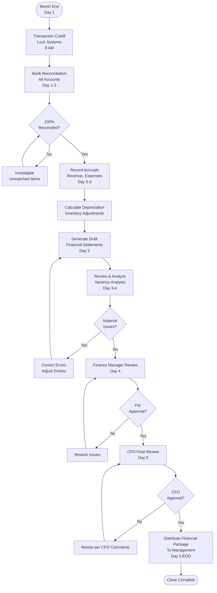

# Month-End Close - SOP

**Owner:** Finance Manager
**Frequency:** Monthly (by 5th business day of following month)
**Approver:** CFO
**Last Updated:** December 2025

---

## Purpose

Ensure accurate and timely month-end financial close, producing reliable financial statements for management decision-making.

## Scope

**Applies to:** All financial operations
**Roles:** Finance Team, Accounting Staff

---

## Month-End Close Timeline

**Target:** Close within 5 business days of month-end

### Day 1-2: Transaction Cutoff & Reconciliation

**Actions:**
1. **Transaction Cutoff** (Day 1, 9 AM):
 - Lock POS systems (no backdated transactions)
 - Confirm all month transactions recorded
 - Final bank transactions for month processed

2. **Bank Reconciliation** (Day 1-2):
 - Download bank statements (all accounts)
 - Match transactions to accounting system
 - Investigate unmatched items
 - Adjust for bank fees, interest
 - Target: 100% reconciled by end of Day 2

3. **Cash Reconciliation** (Day 1):
 - Reconcile daily cash reports for last week of month
 - Verify cash drops match deposits
 - Resolve any variances

### Day 2-3: Accruals & Adjustments

**Actions:**
1. **Revenue Recognition**:
 - Accrued revenues (services delivered but not invoiced)
 - Deferred revenues (advance payments for future service)
 - Gift card breakage (unused balances)

2. **Expense Accruals**:
 ```
 ACCRUALS CHECKLIST:
 - [ ] Utilities (estimate if bill not received)
 - [ ] Rent (if paid in advance, defer appropriately)
 - [ ] Salaries (accrue for days worked but not paid)
 - [ ] Supplier invoices (goods received but not invoiced)
 - [ ] Professional fees (legal, accounting)
 ```

3. **Depreciation**:
 - Run depreciation calculation
 - Verify new assets added to schedule
 - Review fully depreciated assets

4. **Inventory Adjustments**:
 - Post inventory variance from physical count
 - Write off expired/damaged stock
 - Adjust COGS accordingly

### Day 3-4: Financial Statement Preparation

**Actions:**
1. **Generate Draft Statements**:
 - Income Statement (P&L)
 - Balance Sheet
 - Cash Flow Statement

2. **Review & Analyze**:
 ```
 KEY CHECKS:
 - Revenue vs. budget: Variance < 10%?
 - COGS %: Within 28-35% target?
 - Labor %: Within 25-35% target?
 - Operating expenses: Any anomalies?
 - Cash balance: Sufficient for operations?
 ```

3. **Variance Analysis**:
 - Document significant variances (>10% or >Rp 5M)
 - Investigate causes
 - Prepare explanations for management

### Day 4-5: Review & Finalize

**Actions:**
1. **Finance Manager Review** (Day 4):
 - Review all financial statements
 - Check calculations and formulas
 - Verify account balances reconcile
 - Request corrections if needed

2. **CFO Review** (Day 5):
 - Final review and approval
 - Sign off on financial statements

3. **Distribution** (Day 5, End of Day):
 - Email financial package to management team
 - Post to shared drive
 - Schedule management review meeting

---

## Month-End Close Flowchart



---

## Key Reconciliation Items

| Account | Reconciliation Method | Frequency | Owner |
|---------|----------------------|-----------|-------|
| Cash | Daily cash drop logs vs bank deposits | Daily + Monthly | Finance Analyst |
| A/R | Aging report vs GL balance | Weekly + Monthly | Billing Staff |
| A/P | Vendor statements vs GL | Monthly | AP Staff |
| Inventory | Physical count vs system | Weekly + Monthly | Operations |
| Prepayments | Amortization schedule vs GL | Monthly | Finance Analyst |
| Fixed Assets | Asset register vs GL | Monthly | Finance Analyst |

---

## Critical Journal Entries

### Revenue Accrual Example
```
Scenario: Catering service delivered Dec 30, invoice sent Jan 3

Entry (Dec 31):
Dr. Accrued Revenue Rp 10,000,000
 Cr. Catering Revenue Rp 10,000,000

Reversal (Jan 3 when invoiced):
Dr. Catering Revenue Rp 10,000,000
 Cr. Accrued Revenue Rp 10,000,000

Dr. Accounts Receivable Rp 10,000,000
 Cr. Catering Revenue Rp 10,000,000
```

### Expense Accrual Example
```
Scenario: December electricity bill Rp 3M, received Jan 10

Entry (Dec 31):
Dr. Utilities Expense Rp 3,000,000
 Cr. Accrued Expenses Rp 3,000,000

Reversal (Jan 10 when recorded):
Dr. Accrued Expenses Rp 3,000,000
 Cr. Utilities Expense Rp 3,000,000

Dr. Utilities Expense Rp 3,000,000
 Cr. Accounts Payable Rp 3,000,000
```

---

## Quality Checks

- [ ] All bank accounts reconciled (100%)
- [ ] All accruals recorded and documented
- [ ] Depreciation calculated and posted
- [ ] Inventory adjustments recorded
- [ ] Financial statements prepared
- [ ] Variance analysis completed
- [ ] Finance Manager reviewed and approved
- [ ] CFO reviewed and signed off
- [ ] Statements distributed to management by deadline

---

## Common Issues & Solutions

**Issue 1: Late Vendor Invoices**
- **Problem:** Invoice for December received in January
- **Solution:** Accrue estimated amount, adjust when actual received

**Issue 2: Unreconciled Bank Items**
- **Problem:** Transactions in system but not in bank (or vice versa)
- **Solution:** Timing differences (checks not cleared), investigate old items (>30 days)

**Issue 3: Inventory Variance**
- **Problem:** Physical count ≠ system count
- **Solution:** Recount if major, investigate (theft, waste, data entry errors), adjust

---

## Escalation

**If Close Delayed Beyond Day 5:**
- Notify CFO immediately
- Provide reason and revised timeline
- Daily updates until complete

**If Material Error Found Post-Close:**
- Assess impact (>5% of any line item = material)
- If material → Correct and reissue statements
- Document error and prevention measures

---

## Related Documents

- [[products/templates/daily-operations/04-daily-financial-reconciliation.md|Daily Financial Reconciliation SOP]]
- [[biz/departments/finance/sops/03-invoice-processing|Invoice Processing SOP]]
- [[biz/departments/finance/sops/02-financial-reporting|Financial Reporting SOP]]
- chart-of-accounts.xlsx.md

---

## Revision History

| Date | Version | Changes | Updated By |
|------|---------|---------|------------|
| 2025-12 | 1.0 | Initial SOP | Finance Team |

---

**Best Practice:** Don't wait until the 1st to start. Close activities begin on the 28th with preliminary reconciliations.

