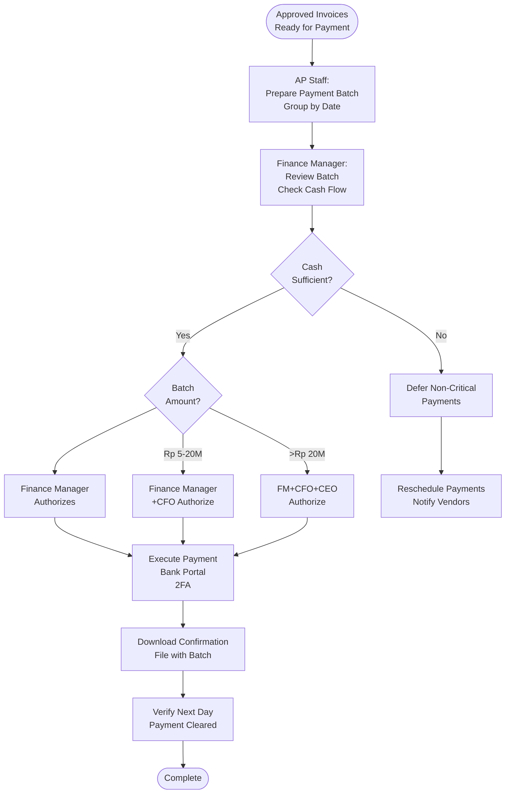

# Payment Authorization - SOP

**Owner:** Finance Manager
**Frequency:** Weekly (payment runs)
**Approver:** CFO
**Last Updated:** December 2025

---

## Purpose

Ensure proper authorization and secure execution of payment transactions with appropriate segregation of duties.

## Scope

**Applies to:** All outgoing payments
**Roles:** AP Team, Finance Manager, CFO

---

## Authorization Levels

| Payment Amount | Preparer | Reviewer | Authorizer |
|----------------|----------|----------|------------|
| < Rp 5M | AP Staff | Finance Manager | - |
| Rp 5M - 20M | AP Staff | Finance Manager | CFO |
| > Rp 20M | AP Staff | Finance Manager | CFO + CEO |

**Segregation of Duties:**
- Person who prepares batch ≠ Person who authorizes
- 2-person approval for all payments > Rp 5M

---

## Payment Process

### Step 1: Batch Preparation (AP Staff)

**Actions:**
1. Collect approved invoices for payment
2. Group by payment date
3. Generate payment batch file:

```
PAYMENT BATCH #2025-1234

Date: December 27, 2025
Payment Method: Bank Transfer
Total Amount: Rp 45,500,000
Number of Payments: 12

Payments:
Vendor | Invoice # | Amount | Account
ABC Supplies | INV-123 | Rp 8,500,000 | 5100-COGS
XYZ Services | INV-456 | Rp 3,200,000 | 6200-Professional Fees
[... additional payments ...]

Total: Rp 45,500,000

Prepared By: __________ Date: ____
```

2. Attach supporting documents (invoices, approvals)
3. Submit for review

### Step 2: Finance Manager Review

**Validates:**
- [ ] All invoices properly approved
- [ ] GL coding correct
- [ ] Amounts match invoices
- [ ] Vendor bank details accurate
- [ ] Sufficient cash balance

**Cash Flow Check:**
```
Current Bank Balance: Rp 120,000,000
This Batch: - Rp 45,500,000
Scheduled Payroll (Friday): - Rp 35,000,000
Buffer Required: Rp 20,000,000
Projected Balance: Rp 19,500,000

Status: Below buffer, delay non-urgent payments
```

**Decision:**
- Approve all
- Approve partial (prioritize critical vendors)
- Reject (insufficient funds)

### Step 3: CFO Authorization (if > Rp 5M)

**Final Approval:**
- Reviews batch summary
- Verifies business necessity
- Confirms cash position
- Authorizes payment execution

### Step 4: Payment Execution

**Finance Manager Actions:**
1. Upload batch file to bank portal
2. Enter 2-factor authentication
3. Confirm execution
4. Download payment confirmation
5. File confirmation with batch documents

---

## Payment Methods Flowchart



---

## Payment Security Controls

### Segregation of Duties
```
Role | Can Prepare | Can Review | Can Authorize | Can Execute
-----|-------------|------------|---------------|-------------
AP Staff | | | |
Finance Manager | | | (<Rp 5M) |
CFO | | | (>Rp 5M) |
CEO | | | (>Rp 20M) |
```

### Dual Control
- All payments > Rp 5M require 2 approvals
- Bank portal requires 2FA (token + password)
- Payment file encrypted in transit

### Audit Trail
- All batch files logged with timestamp
- Approver IDs recorded
- Bank confirmations filed
- Monthly audit of payments > Rp 10M

---

## Emergency Payments

**Definition:** Urgent payment required outside normal schedule

**Procedure:**
1. Requester explains urgency (email to Finance Manager + CFO)
2. Finance Manager verifies legitimacy
3. If approved:
 - Prepare single payment (not batched)
 - Fast-track approval
 - Execute same day
 - Document emergency reason

**Common Emergencies:**
- Critical equipment repair (operations stopped)
- Regulatory payment with penalty deadline
- Legal/compliance deadline

---

## Quality Checks

- [ ] All payments in batch have invoice + approval
- [ ] No duplicate payments (system check)
- [ ] Vendor bank details verified
- [ ] Cash flow sufficient
- [ ] Proper authorization obtained (per amount threshold)
- [ ] 2-factor authentication completed
- [ ] Payment confirmation filed

---

## Common Issues

**Issue: Incorrect Bank Details**
- **Prevention:** Verify against vendor master file
- **If Occurs:** Contact bank immediately, request recall (may not be possible)

**Issue: Duplicate Payment**
- **Prevention:** System flags duplicate invoice numbers
- **If Occurs:** Request refund from vendor

**Issue: Payment Bounced (Insufficient Funds)**
- **Prevention:** Real-time cash balance checks
- **If Occurs:** Apologize to vendor, execute ASAP when funds available

---

## Related Documents

- [[biz/departments/finance/sops/03-invoice-processing|Invoice Processing SOP]]
- [[biz/departments/finance/sops/01-expense-approval-workflow|Expense Approval Workflow SOP]]
- [[biz/departments/finance/sops/04-month-end-close|Month-End Close SOP]]
- vendor-master.xlsx.md

---

## Revision History

| Date | Version | Changes | Updated By |
|------|---------|---------|------------|
| 2025-12 | 1.0 | Initial SOP | Finance Team |

---

**Security Reminder:** Never share bank portal credentials. Always use 2FA. Verify large payment requests via phone call (not email - could be phishing).

