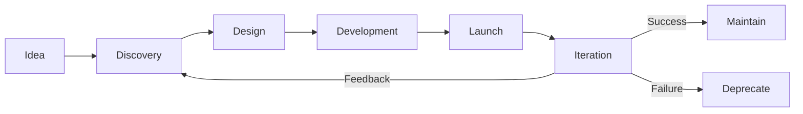

# Experimentation Framework | Hackathon Guide | Feature Request Process | Product Lifecycle

---

## Experimentation Framework

**Duration:** Max 2 weeks
**Purpose:** Validate assumptions before full build

### Experiment Design

**Hypothesis:** "We believe [action] will result in [outcome] because [reasoning]"

**Success Metrics:**
- Primary: Key metric to move
- Secondary: Side effects to monitor
- Guardrails: What must NOT degrade

**MVE:** Minimum Viable Experiment (smallest testto learn)

**Example:**
```
Hypothesis: Sending reorder alerts via WhatsApp (vs email) will increase action rate from 20% to 50% because customers check WhatsApp more frequently.

Metrics:
- Primary: Alert action rate (target: 50%+)
- Secondary: Customer satisfaction, cost/alert
- Guardrail: Unsubscribe rate < 5%

MVE: 50 customers, 2 weeks, WhatsApp alerts
```

### Run Experiment → Analyze → Decide

**Process:**
1. Design (template above)
2. Build (quick & dirty, not production-quality)
3. Run (collect data)
4. Analyze (did hypothesis hold?)
5. Decide (ship, iterate, or kill)

**Document findings:** experimentation-results.md

---

## Hackathon Guide

**Frequency:** Quarterly
**Duration:** 2 days (Thu-Fri)
**Participation:** Entire team (encouraged, not mandatory)

### Format

**Day 1 (Thursday):**
- 9 AM: Kickoff, theme announced
- 10 AM - 6 PM: Build (form teams, code/design)
- Evening: Optional social

**Day 2 (Friday):**
- 9 AM - 3 PM: Build (finish up)
- 3 PM - 5 PM: Demos (5 min each)
- 5 PM: Judging, winners, prizes

### Rules

- **Team size:** 2-5 people
- **Cross-functional:** Eng + Design + Product encouraged
- **Theme:** Announced day-of (keeps it fresh)
- **Deliverable:** Working demo (doesn't need to be polished)

### Judging Criteria

- **Impact:** Solves real problem (40%)
- **Creativity:** Novel approach (30%)
- **Execution:** Demo quality (20%)
- **Presentation:** Clear explanation (10%)

**Judges:** Leadership + guest (customer, partner, rotating)

### Prizes

**1st Place:** Rp 20M team bonus + fast-track to roadmap
**2nd Place:** Rp 10M team bonus
**3rd Place:** Rp 5M team bonus
**People's Choice:** Rp 3M (team vote)

### Post-Hackathon

**Winning ideas:**
- Product reviews (does it fit roadmap?)
- → Yes: Spec → Build → Ship
- → No: Open-source or shelve

---

## Feature Request Process

### Submission

**From Customers:**
- Support tickets tagged #feature-request
- CS aggregates weekly (top requests)

**From Team:**
- #product-ideas Slack channel
- Formal RFC (for big ideas)

### Triage (Weekly)

**Product team reviews:**
- Categorize (bug fix, enhancement, new feature)
- Assess (quick win, roadmap, future)
- Respond to customer (yes/no/maybe + timeline)

### Prioritization (Monthly)

**RICE scoring** (see Innovation Process)

**Roadmap integration:**
- High score + strategic: Next quarter
- Medium: Backlog (next 6-12 months)
- Low: Icebox (nice-to-have)

### Communication

**Customer who requested:**
- Accepted: "Great news! We're building X in Q2. We'll notify you when it ships."
- Rejected: "Thanks for suggestion. We're focused on Y priority right now. Revisit in 6 months?"

**Transparency:** Public roadmap shows what's coming

---

## Product Development Lifecycle

### Phase 1: Discovery (2-4 weeks)

**Activities:**
- User research (interviews, surveys)
- Market analysis (competitors)
- Technical feasibility (eng spike)
- Business case (ROI)

**Deliverable:** PRD (Product Requirements Doc)

### Phase 2: Design (1-2 weeks)

**Activities:**
- Lo-fi wireframes
- User flows
- Hi-fi mockups (Figma)
- Usability testing

**Deliverable:** Approved designs

### Phase 3: Development (4-8 weeks)

**Activities:**
- Sprint planning (break into stories)
- Build (2-week sprints)
- Code reviews
- QA testing

**Deliverable:** Shipped feature

### Phase 4: Launch (1 week)

**Activities:**
- Staged rollout (10% → 50% → 100%)
- Monitor metrics
- Customer communication(release notes, emails)
- Support readiness

**Deliverable:** Feature in production

### Phase 5: Iteration (Ongoing)

**Activities:**
- Collect feedback
- Analyze usage
- Fix bugs
- Improve UX

**Deliverable:** v2, v3, etc.

**Mermaid Diagram of Full Lifecycle:**



---

## Related Documents

- [[biz/departments/growth/innovation/04-innovation-process|Innovation Process]]
- [[biz/departments/growth/innovation/02-feature-request-process|Feature Request Process]]
- [[biz/strategy/planning/execution/01-product-roadmap|Product Roadmap Template]]

---

## Revision History

| Date | Version | Changes |
|------|---------|---------|
| 2025-12 | 1.0 | Combined innovation docs |

---

**Experiment. Build. Ship. Learn. Repeat.**
