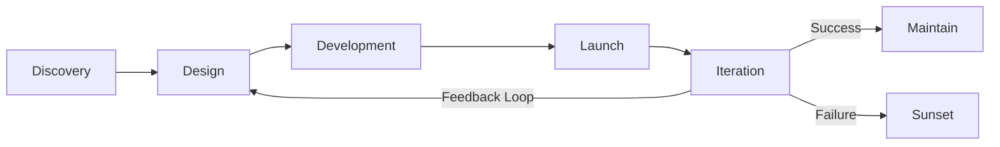

# Product Development Lifecycle

**Owner:** Product + Engineering
**Last Updated:** December 2025

---

## Overview

**How we go from idea to shipped feature.**

This lifecycle applies to all product development: new features, enhancements, new products. Phases may compress for small changes or extend for major releases.

---

## Lifecycle Phases



---

## Phase 1: Discovery (2-4 weeks)

**Goal:** Validate we're solving the right problem for the right people

### Activities

**1. Problem Definition (Week 1)**
- What problem are we solving?
- Who has this problem? (customer segment)
- How painful is it? (critical, annoying, nice-to-have)
- What's the current workaround?

**Output:** Problem statement (1-pager)

**2. User Research (Week 1-2)**
- Customer interviews (10-20)
- Surveys (if large audience)
- Support ticket analysis
- Sales call listening

**Questions to answer:**
- How do you currently solve X?
- What's frustrating about current solution?
- What would ideal solution look like?
- Would you pay for this? How much?

**Output:** Research synthesis (key insights, quotes, patterns)

**3. Market Analysis (Week 2)**
- Competitor review (do they have this?)
- Market trends (is this growing need?)
- Pricing benchmarking
- Technical feasibility scan

**Output:** Competitive analysis doc

**4. Business Case (Week 3-4)**
- Revenue opportunity (TAM, ARR potential)
- Cost estimate (eng time, infra)
- ROI calculation
- Strategic alignment

**Output:** Business case (1-pager: Investment vs Return)

### Deliverable: PRD (Product Requirements Document)

**Template:**
```markdown
# PRD: [Feature Name]

## Problem
[Clear problem statement]

## Target Users
[Who is this for? Segments, personas]

## Goals & Success Metrics
- Goal: Increase retention 10%
- Metric: 30-day active users +20%

## User Stories
- As a [role], I want [capability] so that [benefit]

## Requirements
### Must-Have (P0)
- [Critical functionality]

### Should-Have (P1)
- [Important but not blocking launch]

### Nice-to-Have (P2)
- [Future iterations]

## Non-Requirements (Out of Scope)
- [What we're explicitly NOT building]

## Technical Considerations
- [Architecture notes, dependencies, risks]

## Open Questions
- [Unresolved items]

## Alternatives Considered
- [Other approaches, why we chose this]
```

### Gate: GO/NO-GO Decision

**Decision makers:** Product + Engineering leads + Leadership

**GO if:**
- Clear customer need (validated)
- Aligns with strategy
- ROI positive
- Technically feasible

**NO-GO if:**
- Problem not validated
- Too niche
- Negative ROI
- Better alternatives exist

---

## Phase 2: Design (1-3 weeks)

**Goal:** Define what we're building and how it works

### Activities

**1. User Flows (Day 1-3)**
- Map user journey
- Identify screens/steps
- Pain points & decision points

**Tool:** Miro, FigJam

**2. Lo-Fi Wireframes (Day 4-7)**
- Sketch layouts (low fidelity)
- Focus on structure, not visuals
- Iterate quickly (cheap to change)

**Tool:** Figma, pen & paper

**3. Design Review #1 (Day 7)**
- Present to stakeholders
- Feedback: Does this solve the problem?
- Iterate based on feedback

**4. Hi-Fi Mockups (Week 2)**
-Visual design (colors, typography, images)
- Interactive prototype (Figma prototype mode)
- Edge cases (error states, empty states, loading)

**5. Usability Testing (Week 2-3)**
- Test with 5-8 customers
- Observe: Can they complete tasks?
- Iterate: Fix confusion points

**6. Design Review #2 (Week 3)**
- Final stakeholder approval
- Engineering feasibility check
- Accessibility review

### Deliverable: Approved Designs

**Includes:**
- User flows (Miro)
- Hi-fi mockups (Figma)
- Interactive prototype
- Design specs (spacing, colors, fonts)
- Accessibility notes

### Gate: Design Approval

**Approved if:**
- Solves problem (validated with users)
- Technically feasible (eng reviewed)
- Accessible (WCAG 2.1 AA)
- On-brand (design system compliant)

---

## Phase 3: Development (4-12 weeks)

**Goal:** Build it

### Sprint Planning

**Break down into stories:**
- Each story: 1-3 days of work
- Prioritize: Core → Nice-to-have
- Estimate: Story points (Fibonacci)

**2-week sprints:**
- Sprint 1-2: Core functionality
- Sprint 3: Edge cases, error handling
- Sprint 4: Polish, performance

### Activities

**1. Technical Design (Week 1)**
- Architecture doc (if complex)
- API specs
- Database schema
- Third-party integrations

**2. Implementation (Week 1-10)**
- Code (following style guide)
- Unit tests (80%+ coverage)
- Code reviews (all PRs reviewed)
- Documentation (inline + README)

**3. QA Testing (Ongoing + Week 11)**
- Test cases written (from user stories)
- Manual testing (QA team)
- Automated testing (integration, E2E)
- Edge case testing

**4. Bug Fixes (Week 11-12)**
- Triage: Critical, High, Medium, Low
- Fix blockers (can't ship without)
- Defer non-critical to v1.1

**5. Internal Alpha (Week 12)**
- Team uses feature (dogfooding)
- Find UX issues, bugs
- Feedback → quick fixes

### Deliverable: Shipped Feature (Ready for Launch)

**Definition of Done:**
- Functionality complete (meets PRD)
- Tests passing (unit, integration, E2E)
- Code reviewed + approved
- Documented (user guide, API docs)
- QA approved (no P0/P1 bugs)
- Accessible (WCAG compliant)

---

## Phase 4: Launch (1-2 weeks)

**Goal:** Get it in customers' hands safely

### Staged Rollout

**Week 1: Beta (10% of users)**
- Internal team + selected customers
- Monitor: Errors, performance, feedback
- Hotfix if needed

**Week 2: Expanded (50%)**
- Broader audience
- Monitor continued
- Marketing soft launch

**Week 3: GA (100%)**
- General availability
- Full marketing campaign

**Why staged?:**
- Catch bugs before affecting all customers
- Load testing in production
- Gather feedback early

### Launch Activities

**1. Customer Communication**
- Release notes (changelog)
- Email announcement (to relevant segment)
- In-app notification
- Social media post

**2. Support Readiness**
- CS team training (how feature works)
- FAQ prepared
- Common issues documented

**3. Monitoring**
- Error tracking (Sentry)
- Performance (response times, load)
- Usage metrics (adoption rate)
- Customer feedback (support tickets, NPS)

### Launch Checklist

**Pre-Launch:**
- [ ] Feature flagged (can be toggled off)
- [ ] Monitoring dashboards created
- [ ] CS team trained
- [ ] Docs published
- [ ] Marketing assets ready
- [ ] Rollback plan documented

**Day 1:**
- [ ] Deploy to 10% (beta)
- [ ] Monitor for 24 hours
- [ ] No critical errors

**Week 1:**
- [ ] Scale to 50%
- [ ] Send announcement email
- [ ] Monitor adoption

**Week 2:**
- [ ] 100% rollout
- [ ] Full marketing push
- [ ] Celebrate with team

---

## Phase 5: Iteration (Ongoing)

**Goal:** Make it better based on real usage

###Data Collection (Day 1-30)

**Usage metrics:**
- Adoption rate (% of users trying feature)
- Engagement (frequency of use)
- Completion rate (do they finish workflow?)
- Time to value (how long to first success?)

**Feedback:**
- Support tickets (complaints, confusion)
- NPS surveys (would you recommend?)
- User interviews (5-10 post-launch)
- Feature ratings (in-app thumbs up/down)

### Analysis (Week 4-6)

**Success criteria met?**
- Compare to goals (from PRD)
- Adoption: Target 50%, actual 65%
- Engagement: Target 3x/week, actual 2x/week **Root cause analysis:**
- Why isn't engagement higher?
- User interviews reveal: Confusing UI
- → Plan v1.1 iteration

### Iteration Planning (Week 6-8)

**Based on learnings:**
- Quick fixes (bugs, copy changes): This sprint
- UX improvements: Next sprint
- New capabilities: Quarterly roadmap

**v1.1, v1.2, v2.0...**
- Continuous improvement
- Never "done"

### Decision Points

**Success → Maintain:**
- Feature working well
- Meets goals
- Minimal support burden
- → Maintain (bug fixes only)

**Mixed Results → Iterate:**
- Some users love it, others confused
- → Improve UX, onboarding
- → Try again

**Failure → Sunset:**
- Low adoption (< 20% after 6 months)
- High cost to maintain
- Better alternative exists
- → Sunset plan (communicate, migrate users, deprecate)

---

## Roles & Responsibilities

**Product Manager:**
- Owns PRD
- Makes prioritization decisions
- Communicates to stakeholders

**Designer:**
- User research
- Visual design
- Usability testing

**Engineering Lead:**
- Technical design
- Code reviews
- Estimates

**Engineers:**
- Implementation
- Testing
- Documentation

**QA:**
- Test cases
- Manual + automated testing
- Bug triage

**Customer Success:**
- Beta feedback
- Support readiness
- Post-launch feedback collection

---

## Templates & Tools

**Discovery:**
- [[biz/templates/product/prd-template|PRD\ Template]]
- [[biz/templates/product/user-research-questions|User\ Research\ Questions]]

**Design:**
- _Figma Design System (Figma)_
- [[biz/templates/design/user-flow-template|User\ Flow\ Template]]

**Development:**
- [[biz/templates/engineering/technical-design-doc|Technical\ Design\ Doc]]
- [[biz/templates/engineering/github-issue-template|GitHub\ Issue\ Template]]

**Launch:**
- [[biz/templates/product/release-notes-template|Release\ Notes\ Template]]
- [[products/02-template-support/operations/launch-checklist.md|Launch Checklist]]

---

## Metrics

**Cycle Time:**
- Discovery → Launch: 8-14 weeks (average)
- Small feature: 4-6 weeks
- Major feature: 12-20 weeks
- New product: 6-12 months

**Quality:**
- P0 bugs at launch: 0 (target)
- Customer satisfaction: 8+/10 (post-launch survey)

---

## Related Documents

- [[biz/departments/growth/innovation/04-innovation-process|Innovation Process]]
- [[biz/departments/growth/innovation/02-feature-request-process|Feature Request Process]]
- [[biz/departments/growth/innovation/01-experimentation-framework|Experimentation Framework]]

---

## Revision History

| Date | Version | Changes | Updated By |
|------|---------|---------|------------|
| 2025-12 | 2.0 | Comprehensive expansion | Product + Engineering |
| 2025-12 | 1.0 | Initial lifecycle | Product Team |

---

**Discover. Design. Build. Ship. Learn. Repeat.**

