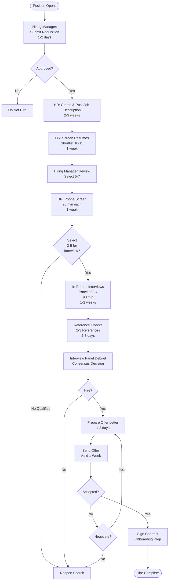

# Hiring Process - SOP

**Owner:** HR Manager
**Frequency:** As needed
**Approver:** Department Head + HR Manager
**Last Updated:** December 2025

---

## Purpose

Ensure consistent, fair, and efficient hiring process to attract and select top talent.

## Scope

**Applies to:** All full-time and part-time hires
**Roles:** Hiring Managers, HR Team, Interview Panel

---

## Hiring Workflow

### Step 1: Position Requisition (1-2 days)

**Hiring Manager Actions:**
1. Complete Hiring Requisition Form:
 ```
 Position: __________
 Department: __________
 Reports To: __________
 Employment Type: Full-Time / Part-Time / Contract
 Salary Range: Rp __________ - Rp __________
 Start Date: __________
 Justification: __________
 Budget Approved: Yes/No
 ```

2. Submit to HR + Department Head

**Approval:**
| Position Level | Approvers |
|---------------|-----------|
| Junior/Entry | Department Head |
| Mid-level | Department Head + HR Manager |
| Senior/Manager | Department Head + HR Manager + CFO |
| Director+ | Department Head + HR + CFO + Founding Team |

### Step 2: Job Posting (2-3 days)

**HR Creates Job Description:**
- Role responsibilities
- Required qualifications
- Preferred skills
- Benefits & salary range (if disclosed)

**Post On:**
- Company website careers page
- LinkedIn
- Glints
- Kalibrr
- Industry-specific job boards

**Timeline:** Open for 2-3 weeks

### Step 3: Resume Screening (1 week)

**HR Initial Screen:**
- Education requirements met
- Experience level appropriate
- Location/availability compatible
- Salary expectations aligned

**Shortlist:** Top 10-15 candidates → Send to Hiring Manager

**Hiring Manager Review:**
- Technical skills match
- Industry experience
- Career progression
- Final shortlist: 5-7 for phone screen

### Step 4: Phone Screen (1 week)

**HR Conducts 20-min Call:**
- Confirm interest & availability
- Verify salary expectations
- Explain interview process
- Answer basic questions

**Pass Forward:** 3-5 candidates for in-person interviews

### Step 5: In-Person Interviews (1-2 weeks)

**Interview Panel (3-4 people):**
- Hiring Manager
- Team member (peer level)
- Department Head
- HR Representative

**Interview Structure (90 min total):**
```
Round 1: Hiring Manager (30 min)
- Technical/functional skills
- Experience deep-dive
- Problem-solving scenarios

Round 2: Team Member (30 min)
- Team fit
- Collaboration style
- Day-to-day work scenarios

Round 3: Department Head (20 min)
- Strategic thinking
- Culture fit
- Leadership potential

Round 4: HR (10 min)
- Benefits overview
- Answer questions
- Next steps
```

**Evaluation Form:**
- Score: 1-5 on each criterion
- Recommendation: Strong Yes / Yes / Maybe / No
- Comments/concerns

### Step 6: Reference Checks (2-3 days)

**HR Contacts 2-3 References:**

**Questions:**
- Dates of employment?
- Position & responsibilities?
- Performance strengths?
- Areas for development?
- Reason for leaving?
- Would you rehire? (Y/N)
- Any concerns we should know?

**Red Flags:**
- Discrepancies in employment dates
- Negative feedback on performance
- Unwillingness to provide references

### Step 7: Offer Decision (1-2 days)

**Interview Panel Debrief:**
- All interviewers share feedback
- Discuss strengths & concerns
- Reach consensus

**Decision Matrix:**
| Votes | Decision |
|-------|----------|
| 4/4 Strong Yes | Extend offer immediately |
| 3/4 Yes, 1 Maybe | Extend offer (address concerns in onboarding) |
| 2/4 or less | Do not extend offer |

### Step 8: Offer Letter (1-2 days)

**HR Prepares Offer:**
```
OFFER LETTER

Candidate: __________
Position: __________
Department: __________
Start Date: __________

Compensation:
- Base Salary: Rp __________ per month
- Performance Bonus: Up to __% of annual salary
- BPJS (Health + Employment)
- Annual Leave: __ days

Benefits:
- Health insurance
- Transportation allowance: Rp __________
- Meal allowance: Rp __________

Employment Type: Full-Time / Permanent

Offer Valid Until: __________ (1 week)

Contingent On:
 Background check
 Reference verification
 Medical examination (if applicable)
```

**Approval & Send:**
- Department Head signs
- HR sends via email
- Follow up call to candidate

### Step 9: Offer Acceptance & Onboarding Prep (1 week)

**If Accepted:**
- Sign employment contract
- Complete pre-employment checks
- Prepare onboarding schedule
- Order equipment (laptop, access cards)
- Set up accounts (email, systems)

**If Rejected:**
- Document reason
- Move to next candidate or reopen search

---

## Hiring Flowchart



---

## Average Time-to-Hire

**Target:** 4-6 weeks from requisition approval to start date

**Breakdown:**
- Requisition approval: 1-2 days
- Job posting & applications: 2-3 weeks
- Resume screening: 1 week
- Phone screens: 1 week
- In-person interviews: 1-2 weeks
- Reference checks & offer: 3-5 days
- Offer acceptance to start: 2 weeks (standard notice period)

---

## Quality Checks

- [ ] Position requisition approved
- [ ] Job posting live on all platforms
- [ ] Minimum 3 qualified candidates interviewed
- [ ] All interviewers submitted evaluations
- [ ] Reference checks completed (2+ references)
- [ ] Offer approved by required authorities
- [ ] Employment contract signed
- [ ] Onboarding schedule prepared

---

## Related Documents

- **[[biz/departments/hr/sops/03-onboarding-workflow|Onboarding Workflow SOP]]**
- **Interview Question Bank** (PDF)
- **Offer Letter Template** (DOCX)
- **Employment Contract Template** (DOCX)

---

## Revision History

| Date | Version | Changes | Updated By |
|------|---------|---------|------------|
| 2025-12 | 1.0 | Initial SOP | HR Team |

---

**Hiring Mantra:** Hire slow, fire fast. Take time to find the right fit - a bad hire costs 3x the salary.
