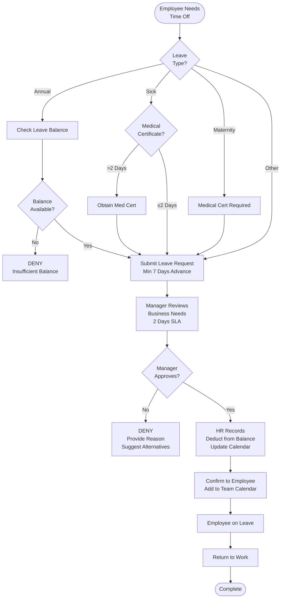

# Leave Management - SOP

**Owner:** HR Manager
**Frequency:** Continuous
**Approver:** Department Manager
**Last Updated:** December 2025

---

## Purpose

Administer employee leave accurately and fairly per Indonesian labor law and company policy.

## Scope

**Applies to:** All full-time employees
**Roles:** HR, Managers, Employees

---

## Leave Types & Entitlements

### Annual Leave

**Entitlement:** 12 days per year (after 1 year employment)
**Accrual:** 1 day per month
**Carry Forward:** Max 6 days to next year
**Payout on Exit:** Yes (unused days paid out)

**Calculation:**
```
Employee Start Date: Jan 15, 2025
First Leave Eligibility: Jan 15, 2025 (12 days)

Prorated for partial year termination:
If termination Oct 15, 2025 (9 months worked):
Leave earned: 9 days (9 months × 1 day/month)
```

### Sick Leave

**Entitlement:** Unlimited with medical certificate
**Pay:**
- Days 1-4: 100% pay
- Days 5-8: 75% pay
- Days 9-12: 50% pay
- Days 13+: 25% pay (long-term illness)

**Medical Certificate Required:** Absences > 2 consecutive days

### Maternity Leave (Female Employees)

**Entitlement:** 3 months (1.5 months before, 1.5 months after birth)
**Pay:** 100% salary
**Requirements:** Medical certificate from doctor

### Paternity Leave (Male Employees)

**Entitlement:** 2 days
**Pay:** 100% salary
**Timing:** Within 7 days of birth

### Compassionate/Bereavement Leave

**Entitlement:**
- Immediate family (parent, spouse, child, sibling): 3 days
- Extended family (grandparent, in-law): 1 day

**Pay:** 100% salary
**Documentation:** Death certificate

### Public Holidays

**Indonesia Labor Law:** 14-16 public holidays per year
**Pay:** 100% salary (no work required)
**If Work Required:** 2x or 3x pay (per law)

---

## Leave Request Process

### Step 1: Employee Requests Leave

**Submit Via:** HR system or email to manager (min 7 days advance for annual leave)

```
LEAVE REQUEST

Employee: __________
Department: __________
Leave Type: __________
Start Date: __________
End Date: __________
Total Days: __________
Reason: __________ (optional for annual, required for others)
Emergency Contact: __________
```

### Step 2: Manager Reviews

**Considerations:**
- Business needs (coverage during absence)
- Team workload
- Leave balance sufficient
- Notice adequate (except emergencies)

**Decision:** Approve / Deny / Request Alternative Dates

**SLA:** Respond within 2 business days

### Step 3: HR Records

**Once Approved:**
- Log in HR system
- Deduct from leave balance
- Add to team calendar
- Confirm with employee

---

## Leave Management Flowchart



---

## Leave Balance Tracking

**HR Maintains:**
```
LEAVE LEDGER - Employee: John Doe

Year: 2025
Annual Leave Entitlement: 12 days

Date | Type | Days | Balance
-----|------|------|--------
Jan 1 | Opening Balance | - | 12
Mar 15 | Annual Leave Taken | -3 | 9
Jun 10 | Annual Leave Taken | -2 | 7
Aug 5 | Sick Leave | -1 | 7 (sick doesn't deduct annual)
Oct 20 | Annual Leave Taken | -5 | 2

Remaining: 2 days
Carry Forward to 2025: 2 days (max 6)
```

**Employee Self-Service:** Check balance anytime in HR system

---

## Special Scenarios

### Unpaid Leave

**When:** Annual leave exhausted, need additional time off
**Approval:** Manager + HR Manager
**Impact:** No pay, benefits continue, employment tenure continues

**Max:** 30 days per year (beyond = risk of abandonment)

### Leave During Notice Period

**Policy:** Generally not allowed (transition responsibilities)
**Exception:** Pre-approved annual leave
**Payout:** Unused annual leave paid out with final pay

### Sick Leave Abuse

**Red Flags:**
- Frequent Monday/Friday sick days
- No medical certificates
- Pattern (always quarterly reviews?)

**Action:**
- Require medical certificate for ALL sick days
- Counseling conversation
- Performance management if confirmed abuse

---

## Quality Checks

- [ ] All leave requests processed within 2 days
- [ ] Leave balances accurate in system
- [ ] Medical certificates collected (sick > 2 days)
- [ ] Team calendar updated
- [ ] Unused leave paid out on termination
- [ ] Carry-forward limits enforced (max 6 days)

---

## Legal Compliance (Indonesia)

**Labor Law Requirements:**
- 12 days annual leave after 12 months
- 3 months maternity leave
- Sick leave with pay (per schedule)
- Public holidays observed
- Payout unused leave on termination

---

## Related Documents

- **[[biz/departments/hr/sops/04-performance-review-cycle|Performance Review Cycle SOP]]**
- **[[biz/departments/hr/sops/05-termination-offboarding|Termination & Offboarding SOP]]**
- **Leave Request Form** (PDF)
- **Indonesia Labor Law Summary** (PDF)

---

## Revision History

| Date | Version | Changes | Updated By |
|------|---------|---------|------------|
| 2025-12 | 1.0 | Initial SOP | HR Team |

---

**Work-Life Balance:** Encourage employees to use their leave! Well-rested teams are productive teams.
