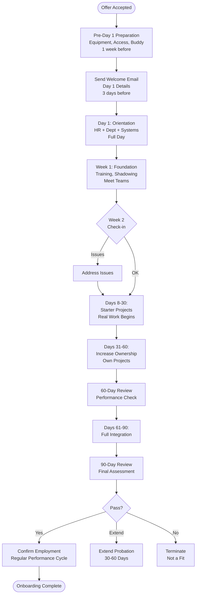

# Onboarding Workflow - SOP

**Owner:** HR Manager
**Frequency:** Per new hire
**Approver:** Department Head
**Last Updated:** December 2025

---

## Purpose

Ensure smooth, consistent onboarding experience for new employees, enabling rapid productivity and cultural integration.

## Scope

**Applies to:** All new hires
**Roles:** HR Team, IT, Hiring Manager, Onboarding Buddy

---

## 30-60-90 Day Onboarding Plan

### Pre-Day 1: Preparation (1 week before)

**HR Checklist:**
- [ ] Employment contract signed
- [ ] Background/reference checks complete
- [ ] Order equipment (laptop, phone if applicable)
- [ ] Create email account
- [ ] Set up system access (POS, accounting, etc.)
- [ ] Prepare workspace
- [ ] Assign onboarding buddy
- [ ] Schedule Day 1 activities

**Welcome Email (3 days before):**
```
Subject: Welcome to PWBI! Your Day 1 Details

Hi [Name],

We're excited to have you join the team on [Date]!

Day 1 Details:
- Arrival: 9:00 AM
- Location: [Address]
- Parking: [Instructions]
- What to bring: ID, bank details for payroll

Dress code: Business casual

Your onboarding buddy: [Name] ([email])

See you soon!
[HR Manager Name]
```

### Day 1: Welcome & Orientation (Full day)

**9:00-10:00 AM: HR Welcome**
- Office tour
- ID/access card
- Laptop & phone setup
- Sign documents (tax forms, NDAs, policies)

**10:00-12:00 PM: Company Orientation**
- Company history & mission
- Product overview
- Organizational structure
- Culture & values
- Benefits overview

**12:00-1:00 PM: Lunch with Team**
- Informal, get to know colleagues

**1:00-3:00 PM: Department Introduction**
- Meet department head
- Team introductions
- Role expectations
- Tools & systems training

**3:00-5:00 PM: System Setup**
- Email & calendar
- Slack/communication tools
- Project management tools
- Access to shared drives

**End of Day:** Debrief with HR, answer questions

### Week 1: Foundation (Days 2-5)

**Goals:**
- Understand product & business
- Learn key systems
- Meet cross-functional teams

**Activities:**
- Shadow team members
- Product training (use products)
- Customer persona training
- Meet other departments (15 min each)
- Complete mandatory training (security, compliance)

**Deliverable:** Complete security training + product familiarization

### Days 8-30: Learning & Contributing

**Goals:**
- Start contributing to real work
- Build relationships
- Understand workflows

**Activities:**
- Weekly 1:1 with manager
- Take on starter projects/tasks
- Join team meetings
- Ask questions freely
- Complete role-specific training

**Week 2 Check-in (HR + Manager):**
- How's it going?
- Any blockers?
- Equipment/access OK?
- Questions?

### Days 31-60: Increasing Ownership

**Goals:**
- Own projects independently
- Demonstrate competence
- Integrate into team

**Milestones:**
- Lead small project
- Present work to team
- Contribute to team goals

**60-Day Review (Manager):**
- Performance assessment
- Strengths & areas for development
- Adjust goals if needed
- Feedback both ways

### Days 61-90: Full Integration

**Goals:**
- Full productivity
- Cultural fit confirmed
- Ready for performance review

**90-Day Review (Manager + HR):**
```
PERFORMANCE EVALUATION

Technical Skills: 1-5
Communication: 1-5
Cultural Fit: 1-5
Initiative: 1-5
Teamwork: 1-5

Overall: Pass / Needs Improvement / Fail

Decision:
 Confirm employment (move to regular performance cycle)
 Extend probation (30-60 days, specific goals)
 Terminate (not a fit)

Next Steps: __________
```

---

## Onboarding Flowchart



---

## Onboarding Buddy Responsibilities

**Buddy Selection:** Peer-level employee, 6+ months tenure, strong performer

**Responsibilities:**
- Welcome on Day 1
- Lunch together first week
- Answer "stupid questions"
- Show them around (coffee machine, restrooms, etc.)
- Introduce to other colleagues
- Check in daily first week, weekly after
- Not formal manager - just friend/guide

---

## Quality Checks

- [ ] All equipment & access ready before Day 1
- [ ] Welcome email sent 3 days prior
- [ ] Day 1 orientation completed
- [ ] Onboarding buddy assigned
- [ ] Week 2 check-in completed
- [ ] 60-day review completed
- [ ] 90-day review completed
- [ ] Employment confirmed or action taken

---

## Common Issues

**Issue: Equipment Not Ready**
- **Impact:** Poor first impression, wasted time
- **Prevention:** Order 2 weeks before start date

**Issue: Overwhelmed New Hire**
- **Cause:** Too much info too fast
- **Fix:** Spread training over weeks, check comprehension

**Issue: Poor Cultural Fit**
- **Detection:** 60-day review
- **Action:** Candid conversation, specific improvements, extend probation or exit

---

## Related Documents

- **[[biz/departments/hr/sops/01-hiring-process|Hiring Process SOP]]**
- **[[biz/departments/hr/sops/04-performance-review-cycle|Performance Review Cycle SOP]]**
- **New Hire Checklist** (PDF)
- **Employee Handbook** (PDF)

---

## Revision History

| Date | Version | Changes | Updated By |
|------|---------|---------|------------|
| 2025-12 | 1.0 | Initial SOP | HR Team |

---

**Onboarding Goal:** Make them feel welcome, get them productive, help them succeed!
