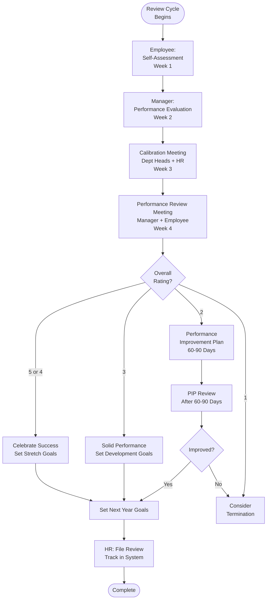

# Performance Review Cycle - SOP

**Owner:** HR Manager
**Frequency:** Quarterly (Q1, Q2, Q3, Annual in Q4)
**Approver:** Department Head
**Last Updated:** December 2025

---

## Purpose

Provide regular, structured performance feedback to drive employee development and align individual goals with company objectives.

## Scope

**Appl to:** All employees (after probation period)
**Roles:** Managers, HR, Employees

---

## Review Cycle Schedule

| Quarter | Review Type | Focus | Timing |
|---------|-------------|-------|--------|
| Q1 (Jan-Mar) | Quarterly Check-in | Q1 goals, adjust if needed | Early April |
| Q2 (Apr-Jun) | Mid-Year Review | Progress vs annual goals | Early July |
| Q3 (Jul-Sep) | Quarterly Check-in | Q3 goals, on-track? | Early October |
| Q4 (Oct-Dec) | Annual Review | Full year, set next year goals | Early January |

---

## Performance Rating Scale

| Rating | Label | Description | % of Team (Target Distribution) |
|--------|-------|-------------|-------------------------------|
| 5 | Exceptional | Far exceeds all expectations | 5-10% |
| 4 | Exceeds | Consistently exceeds expectations | 20-25% |
| 3 | Meets | Fully meets all expectations | 50-60% |
| 2 | Needs Improvement | Meets some, but improvement needed | 10-15% |
| 1 | Unsatisfactory | Does not meet expectations | <5% |

**Forced Distribution:** Prevents "everyone gets a 4" grade inflation

---

## Review Process (Annual - Most Comprehensive)

### Step 1: Self-Assessment (Week 1)

**Employee Completes:**
```
SELF-ASSESSMENT

Name: __________
Role: __________
Review Period: __________

Goals Achieved:
1. Goal: __________ | Status: __________ | Evidence: __________
2. Goal: __________ | Status: __________ | Evidence: __________

Key Accomplishments:
- __________
- __________

Challenges Faced & How Overcome:
- __________

Skills Developed:
- __________

Areas for Growth:
- __________

Career Aspirations:
- Short-term (6-12 months): __________
- Long-term (2-3 years): __________

Self-Rating (1-5): ____
```

### Step 2: Manager Assessment (Week 2)

**Manager Evaluates:**
- Review self-assessment
- Gather feedback (peers, customers if applicable)
- Assess against goals & competencies
- Prepare rating + comments

**Competencies Assessed:**
- Technical/Functional skills
- Communication
- Collaboration
- Initiative
- Problem-solving
- Leadership (if applicable)

### Step 3: Calibration Meeting (Week 3)

**Department Heads + HR:**
- Review all proposed ratings
- Ensure consistency & fairness
- Check distribution (not everyone 4s/5s)
- Adjust if needed
- Final ratings approved

### Step 4: Performance Review Meeting (Week 4)

**Manager + Employee (60 min):**

**Agenda:**
1. **Wins & Accomplishments (10 min):**
 - Celebrate successes
 - Positive start

2. **Goal Review (15 min):**
 - What was achieved?
 - What wasn't? Why?

3. **Competency Assessment (15 min):**
 - Strengths
 - Development areas

4. **Overall Rating & Feedback (10 min):**
 - Share rating
 - Explain rationale
 - Employee reaction/discussion

5. **Development Plan (10 min):**
 - Training needs
 - Stretch assignments
 - Coaching/mentoring

6. **Next Year Goals (10 min):**
 - Set 3-5 SMART goals
 - Aligned with company OKRs

**Manager Tips:**
- Specific examples (not vague)
- Balanced (praise + areas to improve)
- Forward-looking (how to grow)
- Two-way conversation (not lecture)

### Step 5: HR Review & Documentation (Week 4)

**HR Validates:**
- All reviews completed
- Ratings justified
- Development plans in place
- Employee signed acknowledgment

**File:** Performance review in employee record

---

## Quarterly Check-In (Lighter Process)

**30-Minute Conversation:**
- Progress on annual goals?
- Any blockers?
- Feedback both ways
- Adjust goals if business priorities changed

**No formal rating** - just check-in

---

## Performance Improvement Plan (PIP)

**Triggered By:** Rating of 2 or below

**60-90 Day Plan:**
```
PERFORMANCE IMPROVEMENT PLAN

Employee: __________
Issue: __________

Specific Improvements Required:
1. __________
2. __________
3. __________

Success Metrics:
- __________

Support Provided:
- Manager weekly 1:1s
- Training: __________
- Resources: __________

Review Date: __________ (60-90 days)

Consequences if Not Met:
- Extended PIP or termination
```

**Outcome After PIP Period:**
- Improved → Return to normal performance cycle
- Not improved → Termination

---

## Performance Review Flowchart



---

## Goal Setting (SMART Framework)

**S**pecific: Clear, unambiguous
**M**easurable: Quantifiable
**A**chievable: Realistic
**R**elevant: Aligned with company goals
**T**ime-bound: Deadline

**Example:**
 Bad: "Improve customer satisfaction"
 Good: "Increase NPS from 40 to 50 by Q4 through implementing customer feedback loop"

---

## Quality Checks

- [ ] All employees reviewed on schedule
- [ ] Self-assessments completed
- [ ] Manager evaluations thorough
- [ ] Calibration meeting held
- [ ] Ratings follow target distribution
- [ ] Development plans created
- [ ] Next year goals set (SMART)
- [ ] Documentation filed

---

## Related Documents

- **[[biz/departments/hr/sops/03-onboarding-workflow|Onboarding Workflow SOP]]**
- **[[biz/departments/hr/sops/05-termination-offboarding|Termination & Offboarding SOP]]**
- **Performance Review Template** (DOCX)
- **SMART Goals Guide** (PDF)

---

## Revision History

| Date | Version | Changes | Updated By |
|------|---------|---------|------------|
| 2025-12 | 1.0 | Initial SOP | HR Team |

---

**Feedback Culture:** Performance reviews are just formal checkpoints. Great managers give feedback continuously!
