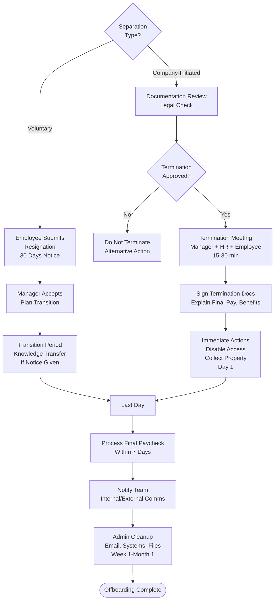

# Termination & Offboarding - SOP

**Owner:** HR Manager
**Frequency:** As needed
**Approver:** Department Head + HR + Legal (if contentious)
**Last Updated:** December 2025

---

## Purpose

Ensure legal, respectful, and secure termination and offboarding process for departing employees.

## Scope

**Applies to:** All employee separations
**Roles:** HR, Manager, IT, Legal

---

## Types of Separation

| Type | Initiated By | Notice | Severance |
|------|-------------|--------|-----------|
| Voluntary Resignation | Employee | 30 days (standard) | No |
| Mutual Agreement | Both | Negotiated | Possible |
| Performance (Post-PIP) | Company | Immediate or 30 days | Per contract |
| Redundancy/Layoff | Company | 30-60 days | Yes (per law) |
| Misconduct (Gross) | Company | Immediate | No |

---

## Termination Process

### Voluntary Resignation

**Employee Submits Resignation Letter:**
```
RESIGNATION LETTER

Date: __________

Dear [Manager Name],

I am writing to inform you of my resignation from [Position]
effective [Last Day - 30 days from now].

Reason (optional): __________

I commit to completing/transitioning my responsibilities.

Thank you for the opportunity.

Sincerely,
[Employee Name]
```

**Manager Actions:**
1. Accept resignation (can't prevent)
2. Start transition planning
3. Notify HR immediately

### Company-Initiated Termination

**Step 1: Documentation Review (Pre-Decision)**

**HR + Manager Validate:**
- [ ] Performance issues documented (PIP completed?)
- [ ] Warnings given (written, not just verbal)
- [ ] Company policy followed
- [ ] Legal risks assessed

**Legal Consultation Required If:**
- Protected class concerns (discrimination risk)
- Long tenure employee (>3 years)
- Potential wrongful termination claim
- Large severance involved

**Step 2: Approval Chain**

| Employee Level | Requires Approval From |
|---------------|----------------------|
| Entry/Junior | Manager + HR Manager |
| Mid-level | Manager + HR Manager + Department Head |
| Senior/Manager | HR Manager + Department Head + CFO |
| Director+ | HR + Department Head + CFO + Founding Team + Legal |

**Step 3: Termination Meeting (15-30 min)**

**Attendees:** Manager + HR + Employee
**Location:** Private conference room
**Day/Time:** Early in week, mid-morning (not Friday, not end of day)

**Script:**
```
Manager: "Thank you for meeting with us. This is a difficult conversation.
We've decided to end your employment, effective [immediately / in 30 days].

The reasons are: [be specific, refer to documented issues]

This is a final decision.

[HR takes over]

HR: Here are your termination documents. Let me explain:

- Final paycheck: [Amount], including accrued leave
- Severance (if applicable): [Amount, terms]
- Benefits end: [Date]
- BPJS continuation: [Explanation]
- Return of company property: [List]
- Non-compete/NDA: [Reminder]

Do you have questions?"

[Answer questions]

"Please sign acknowledgment of receipt. You have until [time] today
to collect personal belongings and return company property."
```

**What NOT to Say:**
- "This isn't personal" (it IS personal to them)
- "I know how you feel" (you don't)
- Apologies that imply wrongdoing by company
- Promises of references (unless approved)

**What to DO:**
- Brief, factual, respectful
- Acknowledge it's difficult
- Give them time to process
- Escort to desk to collect belongings

---

## Offboarding Checklist

### Immediate (Day 1 - Termination Day)

**IT:**
- [ ] Disable all system access (email, Slack, POS, etc.)
- [ ] Revoke VPN/remote access
- [ ] Reset passwords for shared accounts
- [ ] Remove from Google Workspace/Microsoft 365
- [ ] Retrieve laptop, phone, access cards

**HR:**
- [ ] Collect signed termination documents
- [ ] Process final paycheck
- [ ] Cancel benefits (effective date)
- [ ] Remove from payroll

**Manager:**
- [ ] Retrieve all company property
- [ ] Secure work files (transfer ownership)
- [ ] Notify team (after employee exits)
- [ ] Reassign responsibilities

**Security:**
- [ ] Deactivate building access
- [ ] Escort from premises (if required)
- [ ] Log termination in security system

### Week 1

**Knowledge Transfer:**
- [ ] Document handover (if notice period)
- [ ] Client/vendor contact transfer
- [ ] Password transfer (for role-specific accounts)

**Communications:**
- Internal: "[Name] has left the company. [Replacement plan]. Questions to [Manager]."
- External (if customer-facing): "[Name] is no longer with us. Your new contact is [Person]."

**Final Pay:**
- [ ] Regular salary (prorated to last day)
- [ ] Accrued leave payment
- [ ] Bonus (if earned, per policy)
- [ ] Severance (if applicable)
- [ ] Deductions (any company property not returned)

### Month 1

**Admin Cleanup:**
- [ ] Forward emails (to manager, time-limited)
- [ ] Update org chart
- [ ] Remove from company directory
- [ ] Cancel subscriptions tied to employee
- [ ] Archive employee file

---

## Offboarding Flowchart



---

## Severance Guidelines

**Statutory (Indonesia Labor Law):**
- < 1 year: 1 month salary
- 1-2 years: 2 months
- 2-3 years: 3 months
- 3-4 years: 4 months
- etc. (increases with tenure)

**Company Policy (Beyond Statutory - Optional):**
- Add 1-2 months for good performers
- Career transition support
- Extended benefits (1-3 months)

---

## Quality Checks

- [ ] Termination properly approved
- [ ] Termination meeting conducted professionally
- [ ] All company property retrieved
- [ ] System access disabled immediately
- [ ] Final pay processed correctly
- [ ] Team notified appropriately
- [ ] Knowledge transfer completed (if applicable)
- [ ] Exit interview conducted (voluntary resignations)

---

## Exit Interview (Voluntary Only)

**Conducted By:** HR (not manager)
**Purpose:** Learn why people leave, identify improvements

**Questions:**
- Why are you leaving?
- What did you like about working here?
- What could we improve?
- Would you recommend us as an employer?
- Any concerns we should know about?

**Feedback:** Aggregate trends, share with leadership quarterly

---

## Related Documents

- **[[biz/departments/hr/sops/01-hiring-process|Hiring Process SOP]]**
- **[[biz/departments/hr/sops/04-performance-review-cycle|Performance Review Cycle SOP]]**
- **Termination Letter Template** (DOCX)
- **Exit Interview Form** (PDF)

---

## Revision History

| Date | Version | Changes | Updated By |
|------|---------|---------|------------|
| 2025-12 | 1.0 | Initial SOP | HR Team |

---

**Golden Rule:** Treat people with dignity on the way out. They'll remember their last day forever.
