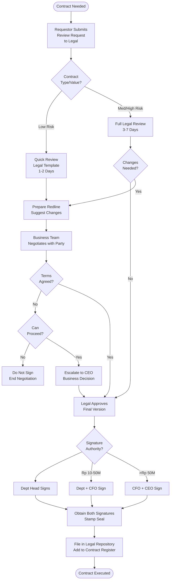

# Contract Review & Approval - SOP

**Owner:** Legal Manager / General Counsel
**Frequency:** Per contract
**Approver:** CEO (major contracts)
**Last Updated:** December 2025

---

## Purpose

Ensure all contracts protect company interests, comply with law, and are properly authorized.

## Scope

**Applies to:** All contracts & legal agreements
**Roles:** Legal Team, Department Heads, Finance, CEO

---

## Contract Types & Approval Thresholds

| Contract Type | Value | Approver(s) | Legal Review |
|---------------|-------|-------------|--------------|
| **Employment** | Any | HR Manager + Legal | Required |
| **Vendor/Supplier** | < Rp 10M | Dept Head | Optional |
| **Vendor/Supplier** | Rp 10-50M | Dept Head + Finance | Recommended |
| **Vendor/Supplier** | > Rp 50M | Dept Head + Finance + CEO | **Required** |
| **Customer** | < Rp 25M | Sales Manager | Template OK |
| **Customer** | > Rp 25M | Sales Manager + Legal | Required |
| **Partnership** | Any | CEO + Legal | **Required** |
| **Real Estate** | Any | CEO + Legal + Finance | **Required** |
| **IP/Licensing** | Any | CEO + Legal | **Required** |

---

## Contract Review Process

### Step 1: Request Submission

**Requestor submits to legal@pwbi.co.id:**
```
CONTRACT REVIEW REQUEST

Submitted By: __________
Department: __________
Contract Type: [Vendor/Customer/Partnership/etc.]
Counterparty: __________
Contract Value: Rp __________
Term/Duration: __________

Business Purpose:
__________

Urgency:
 Standard (5-7 days review)
 Urgent (2-3 days review)
 Emergency (24 hours review)

Attachments:
- Draft contract (Word/PDF)
- Previous correspondence
- Term sheet / proposal
```

### Step 2: Legal Review (3-7 days)

**Legal Counsel Reviews:**

**Key Clauses Checked:**
```
CONTRACT REVIEW CHECKLIST

 Parties correctly identified
 Scope of work/deliverables clear
 Payment terms acceptable
 Term & termination clauses
 Liability limitations
 Indemnification reasonable
 Confidentiality/NDA provisions
 Intellectual property ownership
 Dispute resolution (arbitration/court)
 Governing law (Indonesia preferred)
 Force majeure
 No unusual/unfavorable terms
```

**Risk Assessment:**
- **Low Risk:** Standard terms, small value → Quick approval
- **Medium Risk:** Non-standard terms → Negotiate improvements
- **High Risk:** Significant liability, unclear terms → Require changes

### Step 3: Negotiation (if needed)

**Legal prepares redline:**
- Mark proposed changes
- Explain rationale
- Suggest alternative language

**Business team negotiates with counterparty**

**Iterate until acceptable**

### Step 4: Final Approval

**Signature Authority:**
| Contract Value | Signature Required |
|----------------|-------------------|
| < Rp 10M | Department Head |
| Rp 10-50M | Department Head + CFO |
| > Rp 50M | CFO + CEO |
| > Rp 100M | CEO + Board approval |

**Dual signature:** Company + Counterparty

### Step 5: Execution & Filing

**Legal Admin:**
- Obtain all signatures (wet ink or digital)
- Stamp company seal (if required)
- Send fully executed copy to all parties
- File original in legal repository
- Add to contract register

---

## Contract Review Flowchart



---

## Standard Contract Terms (Company Policies)

**Payment Terms:**
- Preferred: Net 30 days
- Avoid: Upfront payment (without milestones)
- Require: Invoice with detailed breakdown

**Liability Caps:**
- General: Limit to contract value or Rp 100M, whichever lower
- Never: Unlimited liability

**IP Ownership:**
- Work-for-hire: Company owns all deliverables
- Pre-existing IP: Licensed, not transferred

**Confidentiality:**
- Standard NDA terms
- 3-5 year obligation post-contract

**Termination:**
- For convenience: 30-60 days notice
- For cause: Immediate with cure period (14 days)

---

## Red Flags (Do NOT Sign)

- Unlimited liability
- Exclusive rights without consideration
- Auto-renewal without opt-out
- Personal guarantees (from founders/directors)
- Non-compete > 1 year or > Indonesia
- Governing law in unfamiliar jurisdiction (without local counsel)
- Assignment of all IP (including company IP)

**If ANY red flag → Escalate to CEO + Legal for decision**

---

## Quality Checks

- [ ] Contract reviewed by Legal (if required)
- [ ] Key terms negotiated and acceptable
- [ ] Proper signature authority obtained
- [ ] All signatures collected
- [ ] Company seal affixed
- [ ] Filed in legal repository
- [ ] Added to contract register

---

## Contract Register

**Legal maintains central register:**
```markdown
| ID | Counterparty | Type | Value | Start Date | End Date | Status | Owner |
|----|--------------|------|-------|------------|----------|--------|-------|
| C-2025-001 | ABC Supplier | Vendor | Rp 25M | 2025-01-01 | 2025-01-01 | Active | Procurement |
| C-2025-002 | Kopi Kenangan | Customer | Rp 50M | 2025-02-15 | 2027-02-15 | Active | Sales |
```

**Track renewals:** Alert 60 days before expiry

---

## Related Documents

- [[products/templates/inventory-procurement/04-vendor-onboarding.md|Vendor Onboarding SOP]]
- [[biz/departments/legal/sops/data-privacy-compliance|Data Privacy Compliance SOP]]
- [[biz/departments/legal/contracts/contracts|Contract Templates]]

---

## Revision History

| Date | Version | Changes | Updated By |
|------|---------|---------|------------|
| 2025-12 | 1.0 | Initial SOP | Legal Team |

---

**Read before you sign. Never sign under pressure. When in doubt, ask Legal.**
