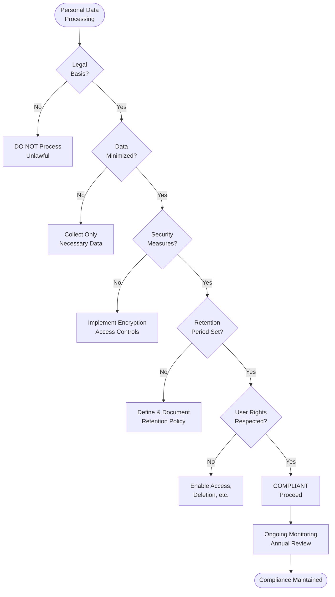

# Data Privacy Compliance - SOP

**Owner:** Data Protection Officer (DPO) / Legal
**Frequency:** Continuous + Annual review
**Approver:** CEO + Legal
**Last Updated:** December 2025

---

## Purpose

Ensure compliance with Indonesian data privacy laws and international standards (GDPR if applicable).

## Scope

**Applies to:** All personal data processing
**Roles:** All employees, DPO, IT, Legal

---

## Data Privacy Principles

1. **Lawfulness:** Process data legally and transparently
2. **Purpose Limitation:** Collect for specified purposes only
3. **Data Minimization:** Collect only what's necessary
4. **Accuracy:** Keep data accurate and up-to-date
5. **Storage Limitation:** Retain only as long as needed
6. **Security:** Protect against unauthorized access
7. **Accountability:** Demonstrate compliance

---

## Personal Data We Collect

### Customer Data
- Name, email, phone
- Company/business name
- Payment information (encrypted)
- Usage data (analytics)
- Transaction history

### Employee Data
- Personal details (name, ID number, address)
- Employment records
- Payroll information
- Performance reviews

### Data Processing Legal Basis
- **Consent:** Marketing communications
- **Contract:** Service delivery
- **Legal Obligation:** Tax/regulatory requirements
- **Legitimate Interest:** Fraud prevention

---

## Data Subject Rights (Indonesia & GDPR)

Individuals have the right to:

| Right | Description | Our Process |
|-------|-------------|-------------|
| **Access** | Request copy of their data | Provide within 30 days |
| **Rectification** | Correct inaccurate data | Update within 7 days |
| **Erasure** | Request deletion | Delete within 30 days (unless legal hold) |
| **Data Portability** | Export data in machine-readable format | Provide CSV/JSON |
| **Object** | Opt-out of marketing | Honor immediately |
| **Withdraw Consent** | Stop processing based on consent | Honor immediately |

**Request Process:**
Email to: privacy@pwbi.co.id
DPO reviews and responds within 30 days

---

## Data Breach Response

**If Personal Data Breached:**

**Within 72 Hours:**
1. Assess scope (what data, how many people affected)
2. Contain breach (prevent further access)
3. Report to Indonesian authorities (Ministry/BSSN)
4. Report to GDPR authorities (if EU data involved)

**Within 7 Days:**
5. Notify affected individuals (if high risk)
6. Document incident and response

**Ongoing:**
7. Investigate root cause
8. Implement preventive measures

---

## Privacy by Design

**New Projects/Features Checklist:**
```
PRIVACY IMPACT ASSESSMENT

Project: __________

 What personal data collected?
 Legal basis for processing?
 Data minimization applied?
 Consent mechanism (if needed)?
 Data security measures?
 Data retention period?
 Third-party data sharing?
 User rights respected (access, deletion)?

DPO Approval: __________ Date: ____
```

---

## Compliance Flowchart



---

## Data Retention Periods

| Data Type | Retention Period | Reason |
|-----------|------------------|--------|
| Customer transaction data | 7 years | Tax law |
| Marketing consent | Until withdrawn | Consent-based |
| Employee records | 5 years post-employment | Labor law |
| Support tickets | 3 years | Business need |
| System logs | 90 days | Security monitoring |
| Backup data | 30 days | Disaster recovery |

**After retention period:** Securely delete

---

## Third-Party Data Sharing

**Vendors with Data Access:**
- Payment processors (Stripe, Xendit)
- Email service (SendGrid)
- Analytics (Google Analytics)
- Cloud hosting (AWS, Google Cloud)

**Requirements:**
- Data Processing Agreement (DPA) signed
- GDPR-compliant (if applicable)
- Security standards verified
- Annual compliance review

---

## Quality Checks

- [ ] Privacy policy published and up-to-date
- [ ] Consent mechanisms in place
- [ ] User rights request process functioning
- [ ] Data retention policy enforced
- [ ] DPAs signed with all vendors
- [ ] Annual privacy audit completed
- [ ] Staff privacy training completed

---

## Related Documents

- [[biz/departments/it/sops/security-incident-response|Security\ Incident\ Response\ SOP]]
- [[biz/departments/legal/sops/contract-review-approval|Contract Review & Approval SOP]]
- [[biz/departments/legal/compliance/02-privacy-policy|Privacy Policy]]
- [[biz/departments/legal/templates/02-dpa-template|Data\ Processing\ Agreement\ Template]]

---

## Revision History

| Date | Version | Changes | Updated By |
|------|---------|---------|------------|
| 2025-12 | 1.0 | Initial SOP | Legal/DPO Team |
