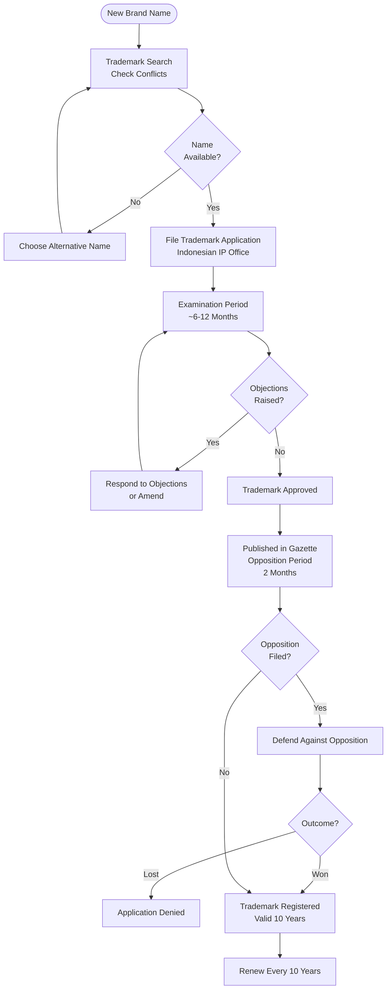
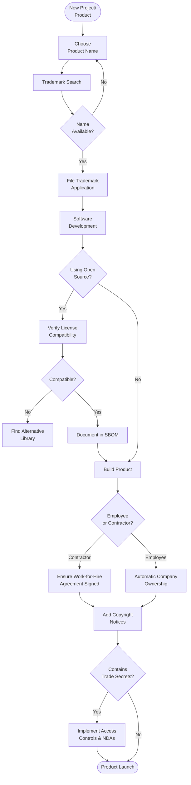

# Intellectual Property Management - SOP

**Owner:** Legal / Product Team
**Frequency:** Ongoing + Quarterly review
**Approver:** CEO + Legal Counsel
**Last Updated:** December 2025

---

## Purpose

Protect company intellectual property (IP) and respect third-party IP rights.

## Scope

**Applies to:** All IP creation and usage
**Roles:** All employees, Legal, Product, Engineering

---

## Types of IP We Own

### 1. Trademarks

**Registered:**
- "PWBI FnB Growth" (word mark)
- PWBI logo (design mark)
- Product names: "R2 Analytics Suite", etc.

**Protection:** Indonesia + International (if expanding)

**Usage:** Brand guidelines enforced

### 2. Copyrights

**Software Code:**
- Application source code
- Database schemas
- APIs

**Creative Works:**
- Marketing materials
- Website content
- Product documentation
- Training videos

**Protection:** Automatic upon creation (Indonesia law)

### 3. Trade Secrets

**Confidential Information:**
- Algorithms/formulas
- Customer lists
- Pricing strategies
- Business plans
- Financial projections

**Protection:** NDAs, access controls

### 4. Patents (If Applicable)

**None currently** - software patents difficult in Indonesia

---

## IP Ownership Policy

### Employee-Created IP

**Default Rule:** Company owns all IP created by employees in course of employment

**Employment Contract Clause:**
```
All works, inventions, and IP created during employment and related
to company business are the exclusive property of the company.
```

**Exception:** Personal projects (unrelated to business, on own time, own resources) may be employee-owned with written approval

### Contractor/Freelancer IP

**Work-for-Hire Agreement Required:**
```
WORK-FOR-HIRE CLAUSE

Contractor agrees that all deliverables are "works made for hire"
and company owns all rights, title, and interest in the work product.

If work-for-hire doctrine doesn't apply, Contractor hereby assigns
all IP rights to Company.
```

**Before engagement:** Signed agreement required

### Third-Party IP (Open Source, Licensed)

**Usage Policy:**
- Permissive licenses OK (MIT, Apache, BSD)
- Copyleft licenses (GPL) require legal review
- Commercial licenses require procurement approval

**Engineer Responsibilities:**
- Document all third-party libraries
- Verify license compatibility
- Maintain software bill of materials (SBOM)

---

## Trademark Management

### Trademark Search (Before Adoption)

**New Product/Brand Name:**
1. Preliminary search (Google, trademark databases)
2. If clear  ->  Professional trademark search
3. Legal opinion on registrability
4. If registrable  ->  File application

**Cost:** ~Rp 5-10M per trademark class

### Trademark Registration Process



### Trademark Enforcement

**If Infringement Detected:**
1. **Cease & Desist Letter** (first step)
2. **Negotiation** (settlement)
3. **Legal Action** (if unresolved)

**Monitoring:** Quarterly searches for infringement

---

## Copyright Management

### Copyright Notice

**All creative works should include:**
```
© 2025 PWBI FnB Growth. All rights reserved.
```

**Software Code:**
```
// Copyright (c) 2025 PWBI FnB Growth
// Proprietary and Confidential
```

### Open Source Compliance

**Before Using Open Source:**
1. Check license type
2. Verify compatibility with our use
3. Maintain attribution (if required)
4. Document in SBOM

**Prohibited:**
- Using GPL code in proprietary product (without release)
- Removing copyright/attribution notices
- Violating license terms

---

## Trade Secret Protection

### Access Controls
- Classify information (Public / Internal / Confidential / Secret)
- Limit access to need-to-know basis
- Mark documents "Confidential"
- Secure storage (encrypted, access logs)

### NDAs (Non-Disclosure Agreements)

**Required Before Sharing Confidential Info:**
- Investors/partners
- Vendors with data access
- Consultants/advisors

**NDA Types:**
- Mutual (both parties share secrets)
- One-way (we share, they protect)

**Terms:** 3-5 years post-disclosure

---

## IP Flowchart (New Project)



---

## Quality Checks

- [ ] All products/brands have trademark search completed
- [ ] Trademark applications filed where appropriate
- [ ] Copyright notices on all works
- [ ] Work-for-hire agreements signed (contractors)
- [ ] Open source usage documented and compliant
- [ ] NDAs signed before confidential disclosures
- [ ] Trade secrets properly protected
- [ ] Quarterly IP portfolio review

---

## Related Documents

- [[biz/departments/legal/sops/contract-review-approval|Contract Review & Approval SOP]]
- [[biz/departments/legal/contracts/employment/templates/contractor-services-agreement|Employment Contract Template]]
- [[biz/departments/legal/templates/03-work-for-hire-agreement|Work-for-Hire\ Agreement\ Template]]
- [[biz/departments/legal/contracts/employment/templates/nda-mutual|NDA Template]]

---

## Revision History

| Date | Version | Changes | Updated By |
|------|---------|---------|------------|
| 2025-12 | 1.0 | Initial SOP | Legal Team |

---

**Your IP is your competitive advantage. Protect it zealously. Respect others' IP equally.**

