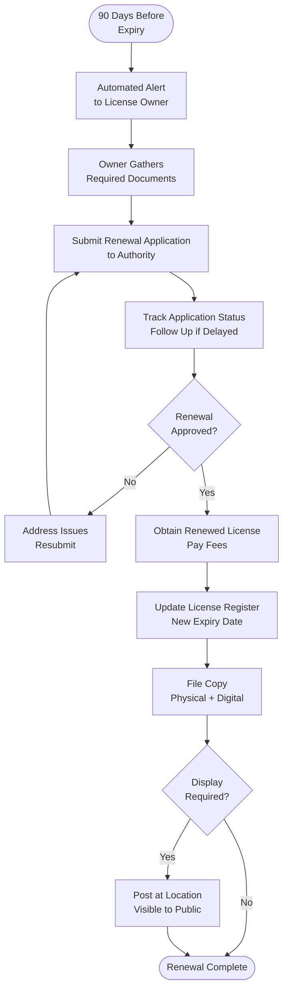

# Licensing & Permits - SOP

**Owner:** Legal / Operations Manager
**Frequency:** Ongoing monitoring, Annual renewals
**Approver:** CEO
**Last Updated:** December 2025

---

## Purpose

Maintain all required business licenses and permits to operate legally in Indonesia.

## Scope

**Applies to:** All business operations
**Roles:** Legal, Operations, Finance

---

## Required Licenses & Permits

###Company Licenses

| License | Issuing Authority | Validity | Renewal | Owner |
|---------|------------------|----------|---------|-------|
| **NIB (Nomor Induk Berusaha)** | OSS System | Indefinite | As needed | Legal |
| **NPWP (Tax ID)** | Direktorat Jenderal Pajak | Indefinite | N/A | Finance |
| **TDP (Company Registration)** | Dinas PMPTSP | Included in NIB | N/A | Legal |
| **Business License (SIUP)** | OSS System | Included in NIB | N/A | Legal |

### Location-Specific (Per Store/Office)

| License | Authority | Validity | Renewal | Owner |
|---------|-----------|----------|---------|-------|
| **HO (Building Permit)** | Local Govt (Pemda) | Varies | 5 years | Operations |
| **Health Permit (STPIRT)** | Dinas Kesehatan | 5 years | Before expiry | Operations |
| **Halal Certificate** | MUI (if applicable) | 2 years | Before expiry | Operations/QC |
| **Fire Safety (SLF)** | Dinas Pemadam Kebakaran | 2 years | Before expiry | Facilities |

### Product-Specific

| License | Authority | Validity | Owner |
|---------|-----------|----------|-------|
| **Food Registration (MD/ML)** | BPOM | 5 years | Product Team |
| **Software License** | Various vendors | Annual | IT |

---

## License Management Process

### Step 1: License Inventory (Quarterly)

**Legal maintains License Register:**
```markdown
| License | Location/Product | Issue Date | Expiry Date | Status | Action Needed |
|---------|------------------|------------|-------------|--------|---------------|
| NIB | Company | 2025-01-15 | Indefinite | Active | None |
| Health Permit | Senayan Store | 2023-06-01 | 2028-06-01 | Active | None |
| Halal Cert | Kopi Product | 2025-03-01 | 2026-03-01 | Active | Renew 2026-01 |
| Fire Safety | HQ Office | 2023-11-15 | 2025-11-15 | Expiring Soon | Renew now |
```

### Step 2: Renewal Alerts

**Automated Reminders:**
- 90 days before expiry: Initial alert to owner
- 60 days: Second reminder
- 30 days: Urgent reminder + escalate to management
- 14 days: Critical alert + daily reminders

### Step 3: Renewal Process

**Owner initiates renewal:**
1. Gather required documents
2. Submit application to authority
3. Pay fees
4. Track application status
5. Obtain renewed license
6. Update license register
7. File physical/digital copy

### Step 4: Compliance Monitoring

**Legal Reviews Monthly:**
- All licenses current?
- Any expiring soon?
- New locations/products requiring licenses?
- Regulatory changes affecting compliance?

**Annual Audit:**
- Physical verification of all licenses
- Confirm displayed where required
- Update register
- Report to management

---

## License Renewal Flowchart



---

## New Location/Product Launch

**License Checklist:**
```
NEW LOCATION LICENSES

Location: __________
Opening Date (Target): __________

Licenses Required:
 Building Permit (HO) - Apply 6 months before
 Health Permit - Apply 3 months before
 Halal Certificate (if serving food) - 3 months
 Fire Safety - 2 months before
 Signage Permit - 1 month before

Timeline:
Start applications __ months before opening
Critical path: Building Permit (longest approval time)
```

**Product Launch:**
```
 BPOM Registration (MD/ML) - 6-12 months lead time
 Halal Certification (if food) - 2-3 months
 Nutritional labeling compliance - Before production
```

---

## Non-Compliance Risks

| Scenario | Risk | Penalty | Mitigation |
|----------|------|---------|------------|
| Operating without license | Administrative sanction | Fine + Closure order | Maintain current licenses |
| Expired health permit | Health dept shutdown | Rp 5-50M fine | Renew 90 days early |
| Missing BPOM registration | Product seizure | Criminal liability | Register before selling |
| No halal cert (claimed halal) | Consumer fraud | Fine + Jail | Only claim if certified |

**If License Expires:**
1. STOP operations immediately (for that location/product)
2. Expedite renewal (request priority processing)
3. Notify customers (if affecting service)
4. Document mitigation efforts

---

## Common Licenses - Application Process

### Health Permit (STPIRT)

**Requirements:**
- Company registration documents
- Location layout/floor plan
- Water quality test results
- List of food products
- Employee health certificates
- SOP for food safety

**Process:** Submit online via OSS → Inspection → Approval (2-4 weeks)

### Halal Certificate

**Requirements:**
- Product formulation
- Supplier halal certificates (ingredients)
- Production process documentation
- Facility inspection readiness

**Process:** Apply via BPJPH → MUI audit → Certificate (2-3 months)

---

## Quality Checks

- [ ] All licenses current and valid
- [ ] License register up-to-date
- [ ] Renewal alerts functioning
- [ ] No licenses expiring within 60 days (or renewal in progress)
- [ ] Licenses displayed where required
- [ ] Annual audit completed

---

## Related Documents

- [[biz/departments/legal/sops/contract-review-approval|Contract Review & Approval SOP]]
- [[biz/departments/operations/quality-safety/01-food-safety-protocol|Food Safety Protocol SOP]]
- [[biz/departments/legal/resources/resources|License Register]]
- [[biz/departments/legal/resources/resources|Indonesia Business License Guide]]

---

## Revision History

| Date | Version | Changes | Updated By |
|------|---------|---------|------------|
| 2025-12 | 1.0 | Initial SOP | Legal Team |

---

**Never operate without proper licenses. The cost of compliance is far less than the cost of non-compliance.**
