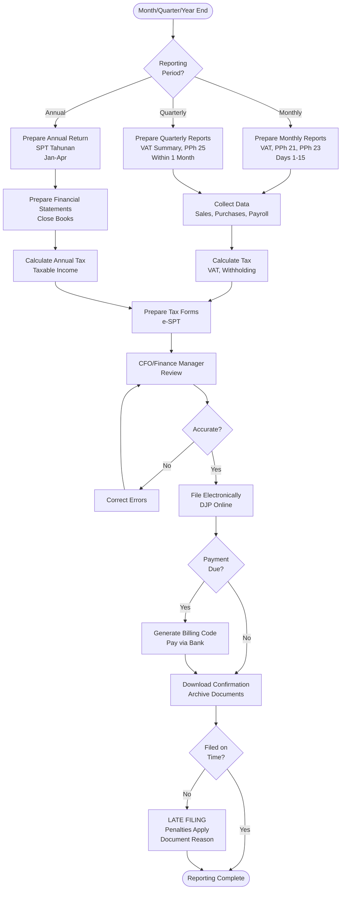

# Regulatory Reporting - SOP

**Owner:** Finance Manager + Legal
**Frequency:** Per regulatory requirements (Monthly/Quarterly/Annual)
**Approver:** CFO + CEO
**Last Updated:** December 2025

---

## Purpose

Ensure timely, accurate regulatory filings to maintain compliance with Indonesian laws.

## Scope

**Applies to:** All mandatory regulatory reports
**Roles:** Finance, Legal, HR, Operations

---

## Regulatory Reporting Calendar

### Tax Reporting (Monthly)

| Report | Due Date | Owner | Authority |
|--------|----------|-------|-----------|
| **Monthly VAT (PPN) Return** | 20th of following month | Finance | Direktorat Jenderal Pajak (DJP) |
| **Income Tax Withholding (PPh 21)** | 20th of following month | Finance/HR | DJP |
| **Income Tax Withholding (PPh 23)** | 20th of following month | Finance | DJP |

**Penalties:** 2% per month late (up to 24%) + potential audit

### Quarterly Reporting

| Report | Due Date | Owner | Authority |
|--------|----------|-------|-----------|
| **VAT Return (Quarterly Summary)** | End of Q+1 month | Finance | DJP
| **Corporate Income Tax (PPh 25)** | 15th of month following quarter | Finance | DJP |

### Annual Reporting

| Report | Due Date | Owner | Authority |
|--------|----------|-------|-----------|
| **Annual Tax Return (SPT Tahunan)** | April 30 (following year) | Finance + CFO | DJP |
| **Audited Financial Statements** | April 30 (if required) | Finance + Auditor | OJK/Min Finance |
| **Company Annual Report (LKPM)** | June 30 | Legal + Finance | OSS System |
| **BPJS Employment Report** | Annual | HR | BPJS Ketenagakerjaan |
| **BPJS Health Report** | Annual | HR | BPJS Kesehatan |

---

## Monthly Tax Reporting Process

### VAT (PPN) Return

**Timeline:** Day 1-15 of following month

**Step 1: Data Collection (Days 1-5)**
- Export sales invoices (taxable sales)
- Export purchase invoices (input VAT)
- Reconcile VAT in vs VAT out

**Step 2: Calculation (Days 6-10)**
```
OUTPUT VAT (Sales):
Total sales × 11% = Rp X

INPUT VAT (Purchases):
Total taxable purchases × 11% = Rp Y

VAT PAYABLE:
Output VAT - Input VAT = Rp (X - Y)

If positive → Pay to government
If negative → Carry forward or request refund
```

**Step 3: Filing (Days 11-18)**
- Prepare SPT Masa PPN (monthly VAT return)
- Upload to e-Filing system (DJP Online)
- Generate billing code (if payment due)
- Pay via bank (before due date)

**Step 4: Archiving (Day 19-20)**
- Download filing confirmation
- File physical/digital copies
- Update tax register

### Income Tax Withholding (PPh 21 - Employees)

**Data:**
- Employee salaries
- Tax deductions (PTKP)
- Withholding calculations

**Filing:**
- e-SPT PPh 21
- Submit by 20th of month
- Remit withheld tax

---

## Annual Tax Return Process

**Timeline:** January - April 30

### Month 1 (January): Preparation

- Close books for previous year
- Reconcile all accounts
- Prepare financial statements
- Calculate tax liability

### Month 2-3 (Feb-Mar): Review & Adjustment

- CFO reviews financial statements
- Adjustments if needed
- Tax planning (deductions, credits)
- Engage auditor ( if required)

### Month 4 (April 1-25): Filing Preparation

**Corporate Income Tax Return (SPT Tahunan Badan):**
```
TAXABLE INCOME CALCULATION

Revenue: Rp __________
- COGS: Rp __________
= Gross Profit: Rp __________

- Operating Expenses (deductible): Rp __________
= Taxable Income: Rp __________

× Tax Rate: 22% (standard corporate rate)
= Income Tax Due: Rp __________

- Tax Prepayments (PPh 25 monthly): Rp __________
- Tax Withheld (PPh 23): Rp __________
= Tax Payable/(Refundable): Rp __________
```

**Required Attachments:**
- Audited financial statements (if > Rp 50B revenue)
- Tax computation schedules
- Supporting documentation

### April 26-30: Filing & Payment

- Submit e-SPT via DJP Online
- Pay balance due (if any)
- Download confirmation
- File copies

---

## Regulatory Reporting Flowchart



---

## Non-Tax Regulatory Reporting

### BPJS (Social Security)

**Monthly Contributions:**
- Calculate based on salaries
- Submit via BPJS online system
- Pay by 10th of month

**Annual Reporting:**
- Employee participation report
- Contribution summary

### Company Annual Report (LKPM)

**Due:** June 30 annually

**Contents:**
- Company profile update
- Shareholder information
- Board/management changes
- Business activities summary

**Submit via:** OSS online system

### Environmental Reporting (if applicable)

**If F&B operations with waste:**
- Waste management report (quarterly/annual)
- Submit to local environmental agency

---

## Penalties & Consequences

| Violation | Penalty | Consequence |
|-----------|---------|-------------|
| Late VAT filing | 2% per month of tax due | Max 24% + audit risk |
| Late income tax return | Rp 1M (corporate) | Criminal liability if egregious |
| Underreporting income | 50-200% of tax shortage | Fines + potential jail time |
| Non-payment | Collection action | Bank account seizure |

**Best Practice:** File on time, even if estimate. Can amend later.

---

## Quality Checks

- [ ] All monthly reports filed by 20th of month
- [ ] Quarterly reports timely
- [ ] Annual tax return filed by April 30
- [ ] All tax payments made on time
- [ ] Confirmations downloaded and archived
- [ ] Tax register up-to-date
- [ ] Zero late filing penalties (YTD)

---

## Related Documents

- [[biz/departments/finance/sops/04-month-end-close|Month-End Close SOP]]
- [[biz/departments/finance/sops/02-financial-reporting|Financial Reporting SOP]]
- [[biz/departments/legal/resources/resources|Indonesian Tax Guide]]
- [[biz/departments/legal/resources/resources|Tax Calendar]]

---

## Revision History

| Date | Version | Changes | Updated By |
|------|---------|---------|------------|
| 2025-12 | 1.0 | Initial SOP | Finance + Legal Team |

---

**Death and taxes are inevitable. At least file taxes on time to avoid penalties!**
