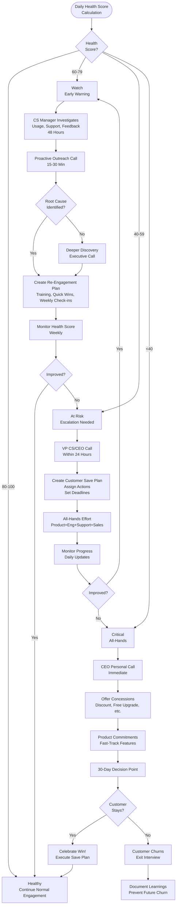

# Churn Prevention Workflow - SOP

**Owner:** Customer Success Manager
**Frequency:** Continuous monitoring
**Approver:** VP Customer Success
**Last Updated:** December 2025

---

## Purpose

Proactively identify at-risk customers and implement retention strategies to prevent churn.

## Scope

**Applies to:** All customers (focus on high-value accounts)
**Roles:** Customer Success, Sales, Support, Product

---

## Churn Risk Indicators

### Health Score Components

**Automated Tracking (Daily):**
```
CUSTOMER HEALTH SCORE (0-100)

Product Usage (40 points):
- Login frequency: __ (target: 3+ times/week)
- Feature adoption: __% (target: 70%+)
- Active users: __% (target: 80%+)
- Time in product: __ min/week (target: 60+)

Engagement (30 points):
- Responded to emails: Yes/No
- Attended training: Yes/No
- Uses support: Appropriately / Never / Excessively
- NPS score: __ (target: 7+)

Business Outcomes (20 points):
- Achieved stated goals: Yes/Partial/No
- ROI positive: Yes/Unknown/No
- Expansion potential: High/Med/Low

Sentiment (10 points):
- Support ticket sentiment: Positive/Neutral/Negative
- CS call sentiment: Positive/Neutral/Negative
- Executive relationship: Strong/OK/Weak

TOTAL SCORE: __ / 100

Status:
- 80-100: Healthy
- 60-79: Watch - 40-59: At Risk
- 0-39: Critical
```

### Red Flags (Manual Detection)

**Behavioral:**
- Usage dropped > 50% in 2 weeks
- Key users stopped logging in
- Training no-shows (2+)
- Unanswered emails (3+)

**Verbal:**
- "We're evaluating alternatives"
- "Budget is being reviewed"
- "Not seeing the value yet"
- "Too complicated for our team"

**Support Patterns:**
- Spike in critical bugs
- Frustrated tone in tickets
- Excessive escalations
- "This should just work" comments

---

## Churn Prevention Process

### Stage 1: Early Warning (Health Score 60-79)

**Automated Alert:** CS Manager notified daily

**CS Manager Actions (Within 48 hours):**

1. **Investigate Cause:**
 - Review usage data (which features not used?)
 - Check support tickets (any recent issues?)
 - Talk to support team (any red flags?)

2. **Proactive Outreach:**
 ```
 Subject: Quick Check-in - How's It Going?

 Hi [Name],

 I noticed you haven't logged into [Product] as frequently lately.
 Just wanted to check in - is everything OK?

 Common reasons I hear:
 - Too busy (let's find a lighter workflow)
 - Technical issues (let's troubleshoot)
 - Not sure how to use a feature (let's train)
 - Business priorities changed (let's realign)

 Can we jump on a 15-min call this week?

 [CS Manager]
 ```

3. **Re-engagement Plan:**
 - Additional training (focus on unused features)
 - Quick win identification (show value fast)
 - Weekly check-ins (increase touch)

### Stage 2: At Risk (Health Score 40-59)

**Alert:** CS Manager + VP CS notified immediately

**Escalation Actions (Within 24 hours):**

1. **Executive Call:**
 - VP CS or CEO calls customer directly
 - Understand issues deeply
 - "What would it take to make this work for you?"

2. **Create Save Plan:**
 ```
 CUSTOMER SAVE PLAN

 Customer: __________
 ARR: Rp __________
 Risk Level: High
 Churn Probability: __%

 ROOT CAUSES:
 1. __________
 2. __________

 RETENTION STRATEGY:
 1. Action: __________
 Owner: __________
 Deadline: __________
 Success Metric: __________

 2. Action: __________
 ...

 CONCESSIONS (if needed):
 - Pricing adjustment: __________
 - Service upgrade: __________
 - Custom feature development: __________

 DECISION DEADLINE: __________
 ```

3. **All-Hands Effort:**
 - Product: Address feature gaps
 - Engineering: Fix bugs P0 priority
 - Support: White-glove service
 - Sales: Commercial negotiations

### Stage 3: Critical (Health Score < 40)

**Alert:** Entire leadership team notified

**Last-Ditch Efforts:**

1. **CEO Involvement:**
 - Personal call from CEO
 - "We failed you. Here's how we'll fix it."
 - Commit to specific changes

2. **Commercial Offers:**
 - Discount (up to 30% for renewal)
 - Extended payment terms
 - Free upgrade to higher tier
 - Dedicated success resource

3. **Product Commitments:**
 - Fast-track feature development
 - Custom integration (if strategic)
 - Beta access to new products

**Decision Point (30 days):**
- If customer stays: Celebrate, execute save plan
- If customer churns: Conduct exit interview

---

## Churn Prevention Flowchart



---

## Exit Interview (When Churn Happens)

**Conducted By:** VP CS or CEO
**Timing:** Before contract ends

**Questions:**
```
EXIT INTERVIEW

1. What was the primary reason for leaving?
 __________

2. What could we have done differently?
 __________

3. Did you evaluate alternatives? Which one did you choose?
 __________

4. Rate our product (1-10): __
5. Rate our support (1-10): __
6. Rate our value for money (1-10): __

7. Would you consider returning in the future?
 Yes / Maybe / No

8. Can we use your feedback to improve?
 Yes / No

9. Would you be willing to be a reference (even though you churned)?
 Yes / No (shows relationship quality)
```

**Post-Interview:**
- Thank them genuinely
- Offer smooth offboarding (data export, etc.)
- Keep door open ("If things change, we'd love to work together again")
- Document learnings → Product/CS team

---

## Churn Metrics

**Track Monthly:**
```
CHURN ANALYSIS

Gross Churn Rate: __%
(Customers lost / Total customers at start of month)

Revenue Churn Rate: __%
(ARR lost / Total ARR at start of month)

Target: < 5% monthly gross churn, < 3% revenue churn

Churn Reasons (This Month):
- Product fit: 30%
- Price: 25%
- Competitor: 20%
- Business closed: 15%
- Other: 10%

Saves:
- At-risk customers: 15
- Saved: 12 (80% save rate)
- Churned: 3

Avg Health Score by Segment:
- Enterprise (>Rp 50M): 78
- Mid-market (Rp 10-50M): 65 - SMB (<Rp 10M): 58 ```

---

## Quality Checks

- [ ] Health scores calculated daily
- [ ] Early warning alerts actioned within 48 hours
- [ ] At-risk customers have save plans within 24 hours
- [ ] Weekly health score review by CS team
- [ ] Monthly churn analysis completed
- [ ] Exit interviews conducted for all churns
- [ ] Churn learnings documented and shared

---

## Related Documents

- [[biz/departments/operations/customer/03-customer-onboarding-process|Customer Onboarding Process SOP]]
- [[biz/departments/operations/customer/02-customer-feedback-handling|Customer Feedback Handling SOP]]
- [[biz/departments/operations/customer/05-support-escalation-matrix|Support Escalation Matrix SOP]]

---

## Revision History

| Date | Version | Changes | Updated By |
|------|---------|---------|------------|
| 2025-12 | 1.0 | Initial SOP | CS Team |

---

**It's 5-10x more expensive to acquire a new customer than retain an existing one. Fight for every customer!**
