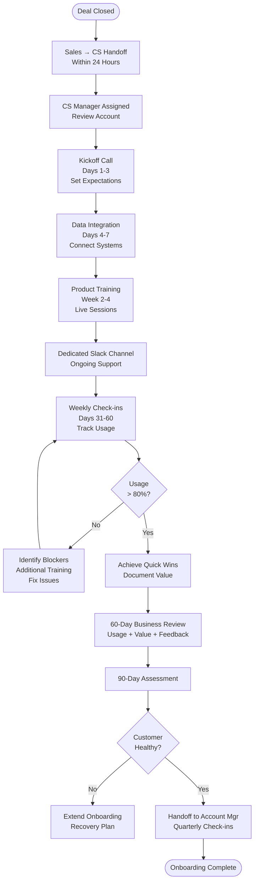

# Customer Onboarding Process - SOP

**Owner:** Customer Success Manager
**Frequency:** Per new customer
**Approver:** VP Customer Success
**Last Updated:** December 2025

---

## Purpose

Ensure smooth, consistent customer onboarding experience that drives product adoption and long-term success.

## Scope

**Applies to:** All new customers (B2B F&B businesses)
**Roles:** Sales, Customer Success, Support, Product

---

## Onboarding Timeline (30-60-90 Days)

### Pre-Sale to Day 1 (Sales Handoff)

**Sales closes deal → Handoff to Customer Success within 24 hours**

**Sales provides:**
- Customer profile (business size, locations, pain points)
- Products purchased (A1, R1, E1, R2 modules)
- Contract details (value, term, special agreements)
- Key contacts (decision maker, technical contact)

**CS Manager assigned:**
- Review account details
- Prepare personalized onboarding plan
- Schedule kickoff call (within 3 days of contract signing)

---

## Days 1-30: Foundation & Setup

### Week 1: Kickoff & Data Integration

**Day 1-3: Kickoff Call (60 min)**

**Agenda:**
```
1. Introductions (10 min)
 - CS Manager, Implementation Specialist
 - Customer: Owner, Manager, Key Users

2. Success Definition (15 min)
 - What does success look like in 90 days?
 - Key metrics to track
 - Business goals alignment

3. Product Overview (20 min)
 - Quick demo of purchased products
 - Use cases relevant to their business
 - Set expectations

4. Next Steps & Timeline (15 min)
 - Data integration requirements
 - Training schedule
 - Go-live target date
```

**Day 4-7: Data Integration**

**For Power BI Template (A1):**
- Provide data connection guide
- Customer connects POS/accounting system
- CS validates data flowing correctly
- Troubleshoot any issues

**For Web Dashboard (E1):**
- Provision account
- Set up user access
- Customer uploads historical data (if needed)
- Verify dashboard populating

### Week 2-4: Training & Adoption

**Product Training Schedule:**

| Product | Training Type | Duration | Attendees |
|---------|--------------|----------|-----------|
| A1: Power BI | Live session | 90 min | Managers, Analysts |
| R1: Support | Self-service + Q&A | 30 min | All users |
| E1: Dashboard | Live session | 60 min | Daily users |
| R2 Modules | Module-specific | 45 min each | Relevant teams |

**Training Delivery:**
- Live Zoom sessions (recorded)
- Share training materials (guides, videos)
- Q&A at end
- Homework: Use product, ask questions in Slack channel

**Dedicated Slack Channel:**
- Create private Slack channel: `#customer-[company-name]`
- CS Manager + Support team join
- Customer can ask questions anytime
- Response SLA: < 4 hours during business hours

---

## Days 31-60: Driving Usage

### Weekly Check-ins (30 min)

**CS Manager tracks:**
```
USAGE METRICS

Product | Weekly Active Users | Target | Status
A1 | __ / __ | 80% | /
R1 | __ / __ | 90% | /
E1 | __ / __ | 100% | /

Key Actions Taken:
- __________
- __________

Blockers:
- __________
```

**If Usage Low:**
1. Identify why (training gap, technical issue, feature missing?)
2. Remediate (additional training, bug fix, workaround)
3. Set specific adoption goals for next week

### Value Realization

**Help customer achieve quick wins:**

**Example Wins:**
- Identified top 3 loss-making products (A1 P&L)
- Reduced inventory waste by 15% (R2c COGS)
- Improved cash flow visibility (R2b)
- Faster financial close (saved 2 days/month)

**Document & Share:**
- "Here's what we achieved together..."
- Use in case studies (with permission)
- Reinforces value

---

## Days 61-90: Full Adoption & Handoff to Account Management

### 60-Day Business Review (60 min)

**Agenda:**
```
1. Usage Review (15 min)
 - Adoption metrics
 - Feature utilization
 - User feedback

2. Value Delivered (20 min)
 - Wins achieved
 - ROI calculation (if applicable)
 - Business impact

3. Advanced Features (15 min)
 - Introduce underutilized features
 - Expansion opportunities (additional modules)

4. Feedback & Roadmap (10 min)
 - What's working well?
 - What could be better?
 - Feature requests → Product team
```

### 90-Day Success Criteria

**Customer is "Healthy" if:**
- 80%+ user adoption
- Using product 3+ times per week
- Achieved at least 1 measurable business outcome
- NPS score > 7
- No outstanding critical issues

**If Healthy:**
- Handoff to Account Manager (ongoing relationship)
- CS Manager checks in quarterly

**If At-Risk:**
- Extend onboarding support
- Escalate to management
- Create recovery plan

---

## Onboarding Flowchart



---

## Onboarding Resources

**Customer-Facing:**
- Welcome email (template)
- Getting started guide
- Training video library
- FAQ document
- Support contact info

**Internal:**
- Onboarding playbook per product
- Data integration guide
- Training deck (customizable)
- Success metrics dashboard

---

## Quality Checks

- [ ] Kickoff call completed within 3 days
- [ ] Data integration successful (Day 7)
- [ ] All training sessions delivered
- [ ] Dedicated Slack channel active
- [ ] Weekly check-ins completed (Days 31-60)
- [ ] 60-day business review held
- [ ] 90-day success criteria met
- [ ] Handoff to Account Manager documented

---

## Common Issues & Solutions

**Issue: Low User Adoption**
- **Cause:** Lack of training, resistance to change
- **Solution:** Additional training sessions, identify champions, management buy-in

**Issue: Data Integration Problems**
- **Cause:** Complex POS system, data quality issues
- **Solution:** Implementation specialist involvement, data cleanup, custom integration

**Issue: Customer Not Seeing Value**
- **Cause:** Wrong use case, expectations mismatch
- **Solution:** Realign on goals, highlight wins, adjust product usage

---

## Related Documents

- [[biz/departments/operations/customer/05-support-escalation-matrix|Support Escalation Matrix SOP]]
- [[biz/departments/operations/customer/04-sla-management|SLA Management SOP]]
- [[biz/departments/operations/customer/02-customer-feedback-handling|Customer Feedback Handling SOP]]
- [[products/products|Product Training Guides]]

---

## Revision History

| Date | Version | Changes | Updated By |
|------|---------|---------|------------|
| 2025-12 | 1.0 | Initial SOP | Customer Success Team |

---

**First 90 days are critical. A well-onboarded customer is a retained customer!**
