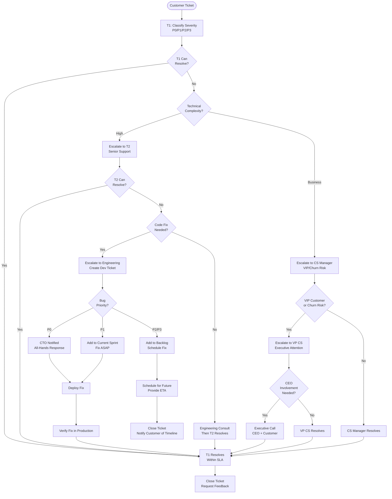

# Support Escalation Matrix - SOP

**Owner:** Support Manager
**Frequency:** Continuous
**Approver:** VP Customer Success
**Last Updated:** December 2025

---

## Purpose

Define clear escalation paths for customer support issues to ensure timely resolution and customer satisfaction.

## Scope

**Applies to:** All customer support tickets
**Roles:** Support Team, Engineering, Product, Management

---

## Support Tiers

### Tier 1: Frontline Support

**Team:** Support Specialists
**Handles:** 80% of tickets

**Ticket Types:**
- How-to questions
- Basic troubleshooting
- Account/access issues
- Feature clarifications
- Bug reports (non-critical)

**SLA:** Respond < 4 hours, Resolve < 24 hours

### Tier 2: Technical Support

**Team:** Senior Support Engineers
**Handles:** 15% of tickets (escalated from T1)

**Ticket Types:**
- Complex technical issues
- Data integration problems
- Performance issues
- Advanced feature questions
- Reproducible bugs

**SLA:** Acknowledge < 2 hours, Resolve < 48 hours

### Tier 3: Engineering

**Team:** Product Engineers
**Handles:** 5% of tickets (escalated from T2)

**Ticket Types:**
- Critical bugs (P0/P1)
- System outages
- Data corruption
- Feature development (urgent requests)
- Architecture/design questions

**SLA:** Acknowledge immediate (P0), Resolve per severity

---

## Severity Levels

| Level | Description | Examples | Response SLA | Resolution SLA |
|-------|-------------|----------|--------------|----------------|
| **P0 - Critical** | Service down, data loss | System outage, database corruption | 15 min | 4 hours |
| **P1 - High** | Major feature broken, many users affected | Login broken, reports not generating | 1 hour | 24 hours |
| **P2 - Medium** | Feature degraded, workaround exists | Slow performance, minor bug | 4 hours | 48 hours |
| **P3 - Low** | Minor issue, cosmetic, feature request | UI glitch, enhancement request | 24 hours | 7 days |

---

## Escalation Paths

### Path 1: Technical Escalation (Complexity)

```
Customer → T1 Support → T2 Support → Engineering → CTO
```

**Escalate to T2 if:**
- T1 unable to resolve in 24 hours
- Requires advanced technical knowledge
- Involves multiple systems/products

**Escalate to Engineering if:**
- Bug requires code fix
- System-level issue
- Data integrity concern
- Performance optimization needed

**Escalate to CTO if:**
- P0 incident requiring all-hands
- Architectural decision needed
- Major outage > 4 hours

### Path 2: Business Escalation (Urgency/Impact)

```
Customer → Support → CS Manager → VP CS → CEO
```

**Escalate to CS Manager if:**
- VIP customer (> Rp 100M annual value)
- Risk of churn
- Dissatisfied customer (multiple issues)
- Issue unresolved > 72 hours

**Escalate to VP CS if:**
- Enterprise customer at risk
- Potential PR issue
- Contract/commercial dispute
- Issue unresolved > 1 week

**Escalate to CEO if:**
- Lawsuit threat
- Major brand risk
- Strategic customer relationship

---

## Escalation Flowchart



---

## Escalation Criteria

### When to Escalate (T1 → T2)

**Time-Based:**
- Issue open > 24 hours with no resolution

**Complexity-Based:**
- Requires database/backend access
- Involves custom integration
- Multiple products interacting
- Error message analysis needed

**Customer-Based:**
- VIP customer (even if simple issue)
- Customer specifically requests escalation
- Multiple tickets from same customer

### When to Escalate (T2 → Engineering)

**Bug Confirmed:**
- Reproducible steps documented
- Expected vs actual behavior clear
- Impact assessment complete
- Workaround attempted (if exists)

**Customer Impact:**
- Multiple customers affected
- Revenue impact
- Data accuracy concern

**Urgency:**
- P0/P1 severity
- Blocking customer operations

---

## Escalation Communication

### Escalation Email Template

```
Subject: [P1] ESCALATION - Customer XYZ - Dashboard Not Loading

To: engineering@pwbi.co.id
CC: support-manager@pwbi.co.id

ESCALATION DETAILS:
Ticket: #12345
Customer: Kopi Kenangan (Enterprise - Rp 200M ARR)
Severity: P1
Opened: 2025-12-27 09:00
Last Updated: 2025-12-27 14:00

ISSUE SUMMARY:
Dashboard failing to load for all users since this morning.
Error: "Failed to fetch data - 500 Internal Server Error"

IMPACT:
- 50 users unable to access dashboard
- Financial reporting blocked
- Customer escalated to CS Manager (churn risk)

STEPS TAKEN:
1. Verified user has correct permissions
2. Checked system status page (all green)
3. Attempted in different browser
4. Reviewed logs - see database timeout errors

ROOT CAUSE (suspected):
Database performance issue or query timeout

ACTION REQUESTED:
Investigate database performance and resolve ASAP

WORKAROUND:
None available

DEADLINE:
P1 SLA = 24 hours (by 2025-12-28 09:00)

- Support Engineer: Ahmad
```

---

## Quality Checks

- [ ] All tickets classified by severity within 1 hour
- [ ] Escalations follow defined paths
- [ ] Escalation documented with full context
- [ ] SLAs met per severity level
- [ ] Engineering escalations include reproduction steps
- [ ] Business escalations include customer impact
- [ ] Post-resolution: Root cause documented

---

## Metrics

**Track Monthly:**
- Escalation rate (% of tickets escalated)
- Time to escalate (hours from ticket open)
- Escalation resolution time
- Re-escalations (escalated back down incorrectly)
- Customer satisfaction post-escalation

**Target:**
- <20% tickets escalated to T2
- <5% tickets escalated to Engineering
- P0 resolved 95% within SLA
- P1 resolved 90% within SLA

---

## Related Documents

- [[biz/departments/operations/customer/03-customer-onboarding-process|Customer Onboarding Process SOP]]
- [[biz/departments/operations/customer/04-sla-management|SLA Management SOP]]
- **Security Incident Response SOP** (To Be Created)

---

## Revision History

| Date | Version | Changes | Updated By |
|------|---------|---------|------------|
| 2025-12 | 1.0 | Initial SOP | Support Team |

---

**Escalate early, escalate often. Better to involve experts too soon than too late.**
