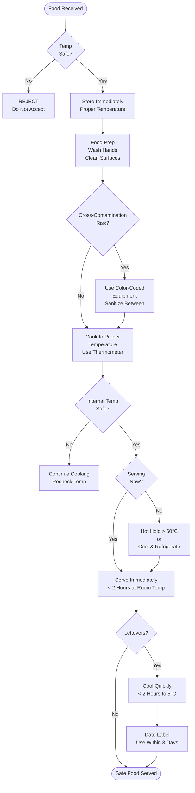

# Food Safety Protocol - SOP

**Owner:** Food Safety Manager / Kitchen Manager
**Frequency:** Continuous
**Approver:** Operations Manager
**Last Updated:** December 2025

---

## Purpose

Ensure food safety, prevent foodborne illness, and maintain compliance with Indonesian food safety regulations (BPOM).

## Scope

**Applies to:** All food handling operations
**Roles:** All kitchen and service staff

---

## Core Food Safety Principles

### 1. Personal Hygiene

**Hand Washing (Critical):**
- Before starting work
- After handling raw food
- After using restroom
- After touching hair/face
- Every 30 minutes minimum

**Method (20 seconds):**
1. Wet hands with warm water
2. Apply soap
3. Scrub all surfaces (palms, backs, between fingers, under nails)
4. Rinse thoroughly
5. Dry with paper towel
6. Use towel to turn off faucet

**Staff Health:**
```
DO NOT WORK if:
- Diarrhea or vomiting
- Fever > 38°C
- Open cuts/wounds on hands (unless covered with glove)
- Cold/flu symptoms

Report to manager immediately
```

### 2. Temperature Control

**Critical Temperatures:**
```
Danger Zone: 5°C - 60°C (bacteria multiply rapidly)

COLD Storage:
- Refrigerator: 3-5°C
- Freezer: -18°C or below

HOT Holding:
- Minimum: > 60°C

Cooking Temperatures:
- Poultry: 74°C internal
- Ground meat: 71°C internal
- Fish: 63°C internal
- Reheating: 74°C minimum
```

**Temperature Monitoring:**
- Check fridge/freezer temps: 3× daily (open, mid, close)
- Log in temperature log book
- Calibrate thermometers weekly

### 3. Cross-Contamination Prevention

**Separation:**
```
Raw → Separate from Ready-to-Eat

Color-Coded Equipment:
 Red: Raw meat/poultry
 Blue: Raw fish
 Green: Vegetables/Fruit
 White: Ready-to-eat/Cooked
 Yellow: Cleaning

Never mix!
```

**Surfaces:**
- Sanitize between each use
- Dedicated cutting boards per category
- Wash hands when switching tasks

### 4. Cleaning & Sanitizing

**Daily Schedule:**
```
As-Needed:
- Wipe spills immediately
- Clean work surfaces between tasks

Hourly:
- Sanitize cutting boards
- Wipe down equipment

End of Shift:
- Deep clean all surfaces
- Sanitize sinks
- Mop floors
- Empty

 trash
```

**Sanitizing Solution:**
- 200 ppm chlorine solution
- Or approved food-safe sanitizer
- Test concentration with strips

---

## Food Safety Flowchart



---

## Common Violations & Fixes

| Violation | Risk | Fix |
|-----------|------|-----|
| Food in danger zone (5-60°C) > 2 hours | High | Discard immediately |
| Staff with symptoms working | Critical | Send home, clean all surfaces |
| No temperature logs | Medium | Implement daily logging |
| Cross-contamination (raw/cooked contact) | Critical | Discard affected food, retrain staff |
| Improper storage (uncovered food) | Medium | Cover, label, FIFO |

---

## Quality Checks

- [ ] All staff trained on food safety (quarterly refresher)
- [ ] Temperature logs completed 3× daily
- [ ] Hand washing compliance (spot checks)
- [ ] Color-coded equipment system followed
- [ ] Cleaning schedule completed
- [ ] No food safety violations

---

## Related Documents

- [[biz/departments/operations/quality-safety/02-quality-control-checks|Quality Control Checks SOP]]
- [[biz/departments/operations/quality-safety/03-health-inspection-prep|Health Inspection Prep SOP]]
- [[biz/departments/operations/quality-safety/05-receiving-inspection|Receiving & Inspection SOP]]

---

## Revision History

| Date | Version | Changes | Updated By |
|------|---------|---------|------------|
| 2025-12 | 1.0 | Initial SOP | Food Safety Team |

---

**When in doubt, throw it out. Food safety is non-negotiable.**
