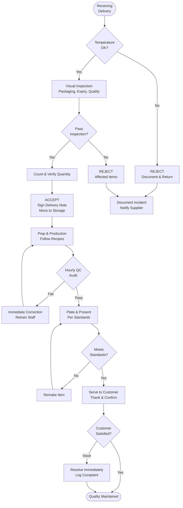

# Quality Control Checks - SOP

**Owner:** Quality Control Manager / Kitchen Lead
**Frequency:** Continuous (throughout day)
**Approver:** Operations Manager
**Last Updated:** December 2025

---

## Purpose

Maintain consistent product quality, food safety standards, and customer satisfaction through systematic quality checks at all stages of production and service.

## Scope

**Applies to:** All F&B operations
**Roles:** Kitchen Staff, Baristas, Service Staff, QC Manager

---

## Quality Check Points

### 1. Receiving Quality Check (Upon Delivery)

**Who:** Receiving Staff / Kitchen Lead
**Frequency:** Every delivery
**Duration:** 5-10 min per delivery

**Procedure:**
1. **Temperature Check:**
 ```
 Refrigerated items: Should arrive at 3-5°C
 Frozen items: Should arrive at -18°C or below

 If temp > threshold → REJECT delivery
 ```

2. **Visual Inspection:**
 - [ ] Packaging intact (no tears, dents)
 - [ ] Labels clear and readable
 - [ ] Expiry dates acceptable (min 7 days remaining)
 - [ ] No signs of spoilage (discoloration, odor)
 - [ ] Correct items per purchase order

3. **Quantity Verification:**
 - Count items
 - Match against delivery note
 - Flag discrepancies immediately

**Decision Matrix:**
| Issue | Action |
|-------|--------|
| Temperature out of range | REJECT entire delivery |
| Damaged packaging | REJECT affected items |
| < 7 days to expiry | REJECT (for perishables) |
| Quantity short | Accept partial, note on receipt |
| Wrong items | REJECT, contact supplier |

### 2. Prep & Production Quality (During Preparation)

**Who:** Kitchen Staff / Baristas
**Frequency:** Continuous

**Coffee Quality Checks:**

**A. Espresso Quality (Every Hour)**
```
Visual Check:
- [ ] Crema: Golden-brown, 3-5mm thick
- [ ] Consistency: Smooth, no bubbles
- [ ] Color: Rich caramel

Taste Test:
- [ ] Flavor: Balanced, not bitter/sour
- [ ] Temperature: 85-95°C
- [ ] Volume: 25-30ml in 25-30 seconds

If FAIL → Adjust grind, check machine, pull new shot
```

**B. Milk Frothing Quality**
```
Visual:
- [ ] Microfoam: Smooth, velvety (not large bubbles)
- [ ] Temperature: 60-65°C (thermometer check)
- [ ] Pour: Creates latte art pattern

If FAIL → Retrain staff, check steam wand pressure
```

**Food Production Quality:**

**C. Prepared Foods**
```
Sandwich/Salad:
- [ ] Temperature: Cold items < 5°C
- [ ] Presentation: As per photo guide
- [ ] Portion: Per recipe card
- [ ] Freshness: Made within 4 hours

Pastries:
- [ ] Temperature: Hot items > 60°C
- [ ] Appearance: Golden brown, not burnt
- [ ] Texture: Correct (crispy/soft as intended)
```

### 3. Plating & Presentation (Before Service)

**Who:** Service Staff
**Frequency:** Every order

**Visual Standards:**
- [ ] Matched to photo reference (training manual)
- [ ] Clean plate edges (no spills/drips)
- [ ] Garnish present and fresh
- [ ] Portion size correct
- [ ] Temperature appropriate (hot served hot, cold served cold)

**Common Mistakes:**
- Coffee with burnt taste → Remake
- Milk temperature > 70°C (scalded) → Remake
- Wilted lettuce → Replace
- Cold food when should be hot → Reheat or remake

### 4. Service Quality (At Handoff)

**Who:** Barista / Server
**Frequency:** Every order

**Final Checks:**
```
Drink Order:
- [ ] Correct drink name called
- [ ] Customer confirms receipt
- [ ] Sleeve/napkin provided
- [ ] Lid secure

Food Order:
- [ ] Correct items in bag
- [ ] Utensils/napkins included
- [ ] Receipt in bag
- [ ] Thank customer
```

### 5. Hourly Quality Audits

**Who:** Shift Manager
**Frequency:** Every hour
**Duration:** 5 min

**Audit Checklist:**
```
Station Cleanliness:
- [ ] Work surfaces wiped clean
- [ ] No clutter
- [ ] Tools in designatedplaces

Equipment Function:
- [ ] Coffee grinder: Consistent grind
- [ ] Espresso machine: Pressure OK (9 bars)
- [ ] Refrigerator: Temp log current

Product Quality:
- [ ] Pull test drink → Taste → Pass/Fail
- [ ] Check oldest food item → Still fresh?
- [ ] Verify presentation matches standard

Staff Performance:
- [ ] Uniforms clean and proper
- [ ] Following recipes/procedures
- [ ] Customer service standards met
```

**If Fail → Immediate corrective action + retrain**

---

## Quality Standards by Product

### Coffee Beverages

| Metric | Standard | Tolerance |
|--------|----------|-----------|
| Espresso volume | 25-30ml | ±2ml |
| Espresso time | 25-30 sec | ±3 sec |
| Milk temp | 60-65°C | ±2°C |
| Latte weight | 350g (12oz) | ±10g |
| Crema thickness | 3-5mm | Visual |

### Food Items

| Item | Standard | Check Method |
|------|----------|--------------|
| Sandwich weight | Per recipe (e.g., 250g) | Spot check with scale |
| Pastry temp (hot) | > 60°C | Thermometer |
| Salad freshness | < 4 hours old | Time stamp |
| Portion size | Per photo guide | Visual comparison |

---

## Quality Flowchart



---

## Approval Chain

| Issue | Response | Approver |
|-------|----------|----------|
| Single failed quality check | Immediate correction | Shift Lead |
| Repeated fails (3+ in shift) | Retraining + investigation | Store Manager |
| Customer complaint (quality) | Immediate resolution + log | Store Manager |
| Supplier quality issues (2+ rejections) | Supplier review | Operations Manager |

---

## Quality Checks

**Daily:**
- [ ] Hourly QC audits completed (8+ per day)
- [ ] All deliveries inspected before acceptance
- [ ] Quality issues logged and resolved
- [ ] Staff retraining completed (if needed)

**Weekly:**
- [ ] QC audit logs reviewed
- [ ] Trends identified (recurring issues)
- [ ] Action plans created for improvements
- [ ] Supplier performance reviewed

---

## Common Quality Issues & Solutions

**Issue 1: Bitter/Sour Coffee**
- **Cause:** Wrong grind size, over/under extraction
- **Solution:** Adjust grinder, retrain barista, check machine calibration

**Issue 2: Inconsistent Portions**
- **Cause:** Staff not using scales/scoops
- **Solution:** Enforce portioning tools, spot checks

**Issue 3: Food Not Fresh**
- **Cause:** Poor FIFO practice, over-prepping
- **Solution:** Enforce FIFO, reduce prep quantities, increase freshness checks

**Issue 4: Presentation Below Standard**
- **Cause:** Rushed service, lack of training
- **Solution:** Slow down, retrain on plating standards, use photo references

---

## Escalation

**Quality Failure During Service:**
- Remake immediately
- Apologize to customer
- Log incident
- If repeated → Stop and retrain staff

**Supplier Quality Issues:**
- Document with photos
- REJECT On delivery
- Contact supplier immediately
- If repeated (2+) → Escalate to Operations Manager for supplier review

**Equipment Malfunction Affecting Quality:**
- Stop using equipment
- Call maintenance: [Emergency Line]
- Use backup equipment if available
- Notify customers of delays

---

## Related Documents

- [[biz/departments/operations/quality-safety/01-food-safety-protocol|Food Safety Protocol SOP]]
- [[biz/departments/operations/quality-safety/05-receiving-inspection|Receiving & Inspection SOP]]
- [[biz/departments/operations/training/training|Recipe Cards & Photo Guides]]
- [[biz/departments/operations/customer/02-customer-feedback-handling|Customer Complaint Handling]]

---

## Revision History

| Date | Version | Changes | Updated By |
|------|---------|---------|------------|
| 2025-12 | 1.0 | Initial SOP | QC Team |

---

**Quality Mantra:** "If it's not right, we don't serve it. Quality is never negotiable."
