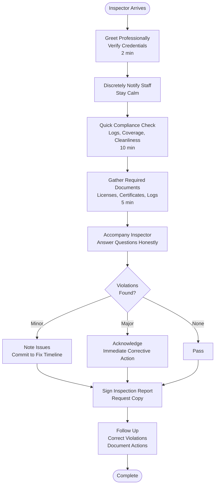

# Health Inspection Preparation - SOP

**Owner:** Store Manager
**Frequency:** As needed (inspections can be random)
**Approver:** Operations Manager
**Last Updated:** December 2025

---

## Purpose

Ensure readiness for health department inspections and achieve passing scores through ongoing compliance and rapid response preparation.

## Scope

**Applies to:** All F&B locations
**Roles:** Store Manager, Kitchen Staff

---

## Ongoing Compliance (Daily)

**Maintain These Standards Always:**

1. **Temperature Control:**
 - All food stored at safe temps
 - Temperature logs current
 - Thermometers calibrated

2. **Cleanliness:**
 - Floors, walls, ceilings clean
 - No grease buildup
 - Trash removed regularly
 - Pest-free environment

3. **Food Storage:**
 - All food covered and labeled
 - FIFO practiced
 - No expired items
 - Proper height off floor (15cm minimum)

4. **Personal Hygiene:**
 - Hand washing facilities stocked
 - Staff in clean uniforms
 - No jewelry (except plain wedding band)
 - Hair restrained

5. **Documentation:**
 - Temperature logs complete
 - Cleaning logs up to date
 - Staff health records on file
 - Supplier certificates current

---

## Inspection Notification Response (1 hour prep)

**If Inspector Arrives Unannounced:**

### Step 1: Greeting (2 min)
- Welcome inspector professionally
- Request to see credentials
- Offer coffee/water
- Inform staff discretely (avoid panic)

### Step 2: Quick Check (10 min)

**While inspector waits:**
- Check all temperature logs are current
- Ensure all food covered
- Quick wipe of visible surfaces
- Check uniform compliance
- Remove any personal items from food areas

### Step 3: Document Gathering (5 min)

Prepare these documents:
- [ ] Business license
- [ ] Food handler certificates (all staff)
- [ ] Temperature logs (last 30 days)
- [ ] Cleaning schedules
- [ ] Supplier certificates (BPOM, Halal)
- [ ] Pest control reports

### Step 4: Accompany Inspector (45 min)

- Follow inspector throughout facility
- Answer questions honestly
- Take notes of comments
- Do NOT argue or make excuses
- If issue found → Acknowledge, state corrective action

---

## Inspection Flowchart



---

## Common Inspection Points

| Area | What Inspectors Check | How to Prepare |
|------|----------------------|----------------|
| **Kitchen** | Cleanliness, organization, temps | Deep clean, current temp logs |
| **Storage** | Labeling, FIFO, proper height | Label everything, rotate stock |
| **Handwashing** | Soap, towels, hot water | Fully stocked, functional |
| **Floors/Walls** | Clean, no damage/cracks | Repair, deep clean |
| **Pest Control** | No pests, traps maintained | Monthly pest service, logs current |
| **Documentation** | Logs, certificates, training | All up-to-date, organized |

---

## Post-Inspection Actions

**If Violations Found:**

1. **Read Report Carefully** (same day)
 - Understand each violation
 - Note deadlines for correction

2. **Create Action Plan** (within 24 hours)
 ```
 Violation: [Description]
 Severity: Minor / Major / Critical
 Corrective Action: [Specific steps]
 Responsible: [Person]
 Deadline: [Date]
 Verification: [How to confirm fixed]
 ```

3. **Implement Corrections** (per deadline)
 - Fix the issue
 - Document with photos
 - Update procedures if needed

4. **Follow-Up Inspection** (if required)
 - Schedule re-inspection
 - Verify all corrections complete
 - Prepare evidence of compliance

---

## Quality Checks

- [ ] Daily compliance standards maintained
- [ ] All required documents current and organized
- [ ] Staff trained on inspection procedures
- [ ] Inspection report reviewed and signed
- [ ] Violations corrected within deadline
- [ ] Photos/documentation of corrections

---

## Related Documents

- [[biz/departments/operations/quality-safety/01-food-safety-protocol|Food Safety Protocol SOP]]
- [[biz/departments/operations/quality-safety/02-quality-control-checks|Quality Control Checks SOP]]
- [[biz/departments/operations/resources/resources|Cleaning Schedule]]

---

## Revision History

| Date | Version | Changes | Updated By |
|------|---------|---------|------------|
| 2025-12 | 1.0 | Initial SOP | Operations Team |

---

**Best defense: Always be inspection-ready. If you operate to standards daily, inspections are routine.**
