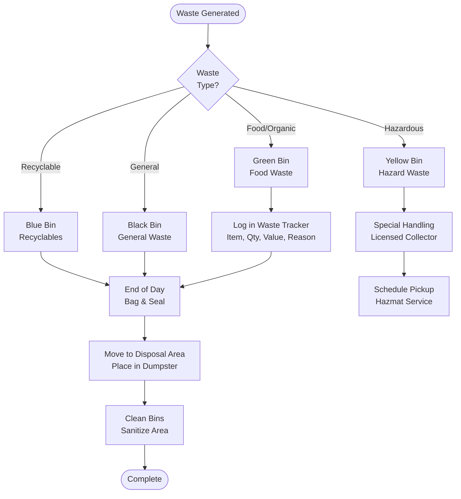

# Waste Disposal - SOP

**Owner:** Kitchen Manager / Operations Manager
**Frequency:** Daily
**Approver:** Operations Manager
**Last Updated:** December 2025

---

## Purpose

Ensure proper, safe, and compliant disposal of food waste, expired items, and packaging materials while tracking waste metrics for cost control.

## Scope

**Applies to:** All F&B operations
**Roles:** Kitchen Staff, Service Staff, Operations Team

---

## Waste Categories

### 1. Food Waste (Organic)

**Items:**
- Expired/spoiled food items
- Prep waste (vegetable peels, trimmings)
- Customer plate waste
- Over-produced items

**Disposal:**
```
Daily:
- Collect in designated food waste bins
- Separate from general trash
- Store in cool area (prevent odor)
- Municipal collection or composting service

Composting (if available):
- Separate organic waste
- No meat/dairy (unless industrial composting)
- Partner with local composting facility
```

### 2. Recyclables

**Items:**
- Cardboard boxes (flatten)
- Paper/cardboard packaging
- Glass bottles
- Plastic containers (clean)
- Aluminum cans

**Disposal:**
- Separate by category
- Store in recycling bins
- Schedule pickup (weekly)

### 3. General Waste

**Items:**
- Non-recyclable packaging
- Mixed materials
- Contaminated items

**Disposal:**
- Daily collection by municipal service
- Use proper waste bags
- Seal to prevent pests

### 4. Hazardous Waste

**Items:**
- Cleaning chemicals (expired)
- Cooking oil (used)
- Broken glass
- Medical waste (first aid)

**Disposal:**
```
Cooking Oil:
- Collect in designated container
- Schedule pickup by licensed collector
- NEVER pour down drain

Chemicals:
- Contact hazardous waste disposal service
- Follow MSDS disposal instructions

Glass:
- Wrap securely in paper/cardboard
- Label "CAUTION: BROKEN GLASS"
- Separate container for disposal
```

---

## Daily Waste Procedure

### Step 1: Waste Segregation (Throughout Day)

**Who:** All Staff
**Actions:**
- Use color-coded bins:
 - Green: Food waste/compost
 - Blue: Recyclables
 - Black: General waste
 - Yellow: Hazardous

### Step 2: Waste Logging (End of Day)

**Who:** Shift Manager
**Log waste for cost tracking:**

```
DAILY WASTE LOG

Date: __________
Location: __________

Food Waste:
- Expired items: ____ kg, Value: Rp ____
- Prep waste: ____ kg
- Customer returns: ____ kg
- Over-production: ____ kg

Reason Codes:
1. Expired/spoiled
2. Over-portioning
3. Prep waste (normal)
4. Customer complaint
5. Over-produced
6. Other: __________

Total Food Waste: ____ kg, Value: Rp ____
Waste %: ____% of revenue
```

### Step 3: Disposal Execution

**Who:** Closing Staff
**Actions:**
1. Bag all waste properly
2. Move to designated disposal area
3. Place in appropriate containers/dumpsters
4. Clean waste handling area
5. Wash hands thoroughly

### Step 4: Pest Prevention

- Empty all bins daily
- Clean bins weekly
- Ensure lids closed
- No waste left overnight in kitchen
- Dispose of cardboard promptly (pest harbor)

---

## Waste Reduction Targets

| Category | Current | Target | Action |
|----------|---------|--------|--------|
| Food waste % of COGS | 5% | < 3% | Better forecasting, portion control |
| Expired items | Rp 500K/month | < Rp 200K/month | FIFO practice, smaller orders |
| Over-production | 10 kg/day | < 5 kg/day | Demand-based prep |

---

## Flowchart



---

## Quality Checks

- [ ] Waste properly segregated (food, recycle, general, hazardous)
- [ ] Food waste logged with reason codes
- [ ] All bins emptied daily
- [ ] Disposal area clean and odor-free
- [ ] Hazardous waste properly contained
- [ ] Monthly waste report generated

---

## Related Documents

- [[biz/departments/operations/inventory/inventory|Inventory Management SOP]]
- [[biz/departments/operations/quality-safety/01-food-safety-protocol|Food Safety Protocol SOP]]
- [[biz/departments/legal/compliance/environmental-compliance|Environmental Compliance Policy]]

---

## Revision History

| Date | Version | Changes | Updated By |
|------|---------|---------|------------|
| 2025-12 | 1.0 | Initial SOP | Operations Team |

---

**Goal:** Zero waste to landfill. Every kilogram of waste is lost profit. Track, measure, reduce!
