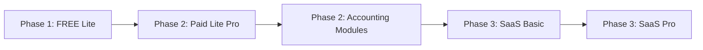
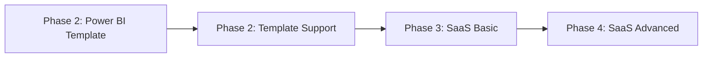
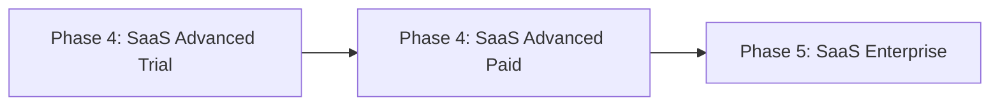

# Pillar-to-Phase Mapping

> [!NOTE]
> **Last Updated:** 2026-01-05
> **Status:** Active
> **Purpose:** Map 5 Strategic Pillars to Customer Growth Phases

---

## Framework Overview

### The Two Dimensions

**5 Strategic Pillars** (How we grow the business)
1. **Acquisition** - Capture new customers
2. **Retention** - Keep them paying
3. **Expansion** - Upgrade them to higher tiers
4. **Defense** - Create competitive moats
5. **Core Product** - The unified platform

**5 Customer Phases** (How customers evolve)
- **Phase 1:** Mikro (Warung, street food) - Survival mode
- **Phase 2:** Mikro  ->  Kecil (1-2 outlets) - Professionalizing
- **Phase 3:** Kecil (Small restaurant) - Scaling operations
- **Phase 4:** Menengah (Multi-outlet) - Managing complexity
- **Phase 5:** Enterprise (Chain) - Institutionalizing

---

## The Mapping Matrix

| Pillar | Phase 1 | Phase 2 | Phase 3 | Phase 4 | Phase 5 |
|--------|---------|---------|---------|---------|---------|
| **1. Acquisition** | [x] **FREE** | [x] **LOW** | [x] **MEDIUM** | [!] Limited | [x] Rare |
| **2. Retention** | [x] No budget | [x] **CORE** | [x] **CORE** | [x] **CORE** | [x] **CORE** |
| **3. Expansion** | [x] **PRIMARY** | [x] **PRIMARY** | [!] Plateaus | [x] Maxed out | [x] N/A |
| **4. Defense** | [x] N/A | [x] N/A | [!] Early signals | [x] **CRITICAL** | [x] **CRITICAL** |
| **5. Core Product** | [x] Too expensive | [!] Exploring | [x] **BUYING** | [x] **BUYING** | [x] **ENTERPRISE** |

**Legend:**
- [x] Primary focus
- [!] Transitional / Partial fit
- [x] Not applicable

---

## Pillar 1: ACQUISITION

### Phase 1 (Mikro) - [x] **FREE TIER ONLY**
**Why it works:**
- Zero budget for tools
- High volume, low ARPU (Average Revenue Per User)
- Validation target: "Will they even use analytics?"

**Products:**
- Web Dashboard Lite (FREE tier)
- Trial versions of accounting modules

**Strategy:** Volume play. Convert 1-5% to Phase 2 within 6 months.

---

### Phase 2 (Mikro  ->  Kecil) - [x] **LOW-PRICE ACQUISITION**
**Why it works:**
- First analytics purchase (Rp 50-200K/mo is affordable)
- Seeking "quick wins" before consulting projects
- Price-sensitive but willing to pay

**Products:**
- Power BI Template Tier 1 (Rp 2-3M one-time)
- Accounting Modules (Rp 50-100K/mo)
- Web Dashboard Lite (Paid tier Rp 200K/mo)

**Strategy:** Land-and-expand. Start with templates, upsell to subscriptions.

---

### Phase 3 (Kecil) - [x] **MEDIUM-PRICE ACQUISITION**
**Why it works:**
- Willing to invest in tools (Rp 500K-1M/mo budget)
- Comparing us to POS add-ons and consultants
- Want "complete solutions," not point products

**Products:**
- Power BI Template Tier 2 (Rp 5-7M)
- SaaS Platform Basic (Rp 300-500K/mo)

**Strategy:** Position as "POS-agnostic alternative" to vendor lock-in.

---

### Phase 4-5 (Menengah/Enterprise) - [!] **RARE NEW ACQUISITION**
**Why limited:**
- Already using enterprise tools (custom BI, ERPs)
- High switching costs
- Long sales cycles (6-12 months)

**Products:**
- SaaS Platform Advanced/Enterprise (Rp 2-8M+/mo)

**Strategy:** Relationship-based sales. Rely on Phase 3 customers graduating up.

---

## Pillar 2: RETENTION

### Phase 1 - [x] **NO RETENTION REVENUE**
**Why it fails:**
- Can't afford subscriptions
- Churn to competitors offering "lifetime free"

**Strategy:** Accept churn. Focus on Phase 1  ->  Phase 2 graduation.

---

### Phase 2-5 - [x] **CORE RETENTION STRATEGY**
**Why it works:**
- Operational dependency (accounting, inventory tracking)
- Historical data lock-in (12+ months of P&L)
- Customizations and integrations

**Products (All Phases):**
- Template Support (Rp 75K/mo) - Updates + bug fixes
- Accounting Modules (Rp 50-100K/mo) - Daily workflow
- SaaS Subscriptions (Rp 300K-8M+/mo) - Multi-user setups

**Retention Tactics:**
- **Phase 2:** Monthly template updates, WhatsApp support
- **Phase 3:** Custom dashboard requests, integration support
- **Phase 4-5:** Dedicated account managers, SLA guarantees

**Target Churn Rates:**
- Phase 2: <40% annually (high experimentation)
- Phase 3: <30% annually
- Phase 4-5: <15% annually (sticky enterprise contracts)

---

## Pillar 3: EXPANSION

### Phase 1-2 - [x] **PRIMARY EXPANSION TARGETS**
**Why it works:**
- Start on free/cheap tier  ->  Natural upgrade triggers
- Business growth = Feature needs grow
- Low switching cost (haven't invested heavily yet)

**Expansion Path:**
1. **Phase 1:** FREE Lite  ->  Paid Lite Pro (Rp 350K/mo)
2. **Phase 2:** Template  ->  Template + Support  ->  Accounting Modules  ->  SaaS Basic

**Upgrade Triggers:**
- Data limits (3 months  ->  12 months)
- User limits (1 user  ->  3 users)
- Feature requests (inventory tracking, labor scheduling)

---

### Phase 3 - [!] **PLATEAUS AT MID-TIER**
**Why it slows:**
- Already on SaaS Basic/Pro (Rp 500K-1M/mo)
- Next tier jump is steep (Rp 2-3M/mo = Advanced)
- May stay at this level for 2-3 years

**Strategy:** Micro-upsells within the tier (add-on modules, extra users).

---

### Phase 4-5 - [x] **MAXED OUT**
**Why it ends:**
- Already on Enterprise tier (Rp 8M+/mo)
- No higher tier to upgrade to

**Strategy:** Shift to usage-based pricing (per-outlet, per-user).

---

## Pillar 4: DEFENSE

### Phase 1-3 - [x]/[!] **NOT YET RELEVANT**
**Why premature:**
- No data moat yet (user base too small)
- Industry reports need 500+ customers to be valuable
- Benchmarking data insufficient

**Strategy:** Focus on Acquisition and Retention first.

---

### Phase 4-5 - [x] **CRITICAL COMPETITIVE MOAT**
**Why it works:**
- Network effects kick in (comparative benchmarks)
- Proprietary insights ("Your food cost % vs. 100 similar restaurants")
- Data becomes the product

**Products:**
- Industry Reports (Rp 500K-1M per report)
- Benchmarking Dashboard (included in Enterprise tier)

**Defense Mechanisms:**
- **Data exclusivity:** Only we have cross-restaurant data
- **Regulatory advantage:** SAK EMKM compliance reports (future)
- **Integration depth:** Multi-year API connections with POS systems

---

## Pillar 5: CORE PRODUCT

### Phase 1 - [x] **TOO EXPENSIVE**
**Why it fails:**
- SaaS Basic (Rp 300K/mo) = 30-50% of monthly profit for warung
- Prefers free tools or offline Excel

**Strategy:** Serve with Acquisition products (FREE Lite), not Core SaaS.

---

### Phase 2 - [!] **EXPLORING SaaS**
**Why transitional:**
- Budget exists (Rp 200-500K/mo) but hesitant
- Testing with Accounting Modules first
- May stay on templates for 6-12 months before SaaS

**Products:**
- Accounting Modules (Rp 50-100K/mo - gateway drug)
- Web Dashboard Lite Paid (Rp 350K/mo - SaaS preview)

**Conversion Strategy:** Offer "Template  ->  SaaS migration discount" (Rp 100K/mo off for 6 months).

---

### Phase 3 - [x] **PRIMARY SAAS BUYERS**
**Why it works:**
- Ready for "all-in-one" platform (Rp 300-900K/mo)
- Tired of juggling 5 different tools
- Sees ROI from analytics (proven with templates)

**Products:**
- SaaS Platform Basic (Rp 300-500K/mo)
- SaaS Platform Pro (Rp 900K-1.2M/mo)

**Sales Motion:** "You're already using 3 of our tools. Consolidate into one dashboard."

---

### Phase 4-5 - [x] **ENTERPRISE SAAS**
**Why it works:**
- Multi-outlet complexity requires centralized platform
- Need role-based permissions (manager vs. owner)
- API integrations with ERP, payroll, etc.

**Products:**
- SaaS Platform Advanced (Rp 2-3.5M/mo)
- SaaS Platform Enterprise (Rp 8M+/mo)

**Enterprise Features:**
- White-label dashboards
- Custom data pipelines
- Dedicated infrastructure (VPC)

---

## Customer Evolution Paths

### Path A: Warung  ->  Kecil Restaurant (Phase 1  ->  3)
**Timeline:** 2-3 years

**Revenue Journey:** Rp 0  ->  Rp 350K/mo  ->  Rp 500K/mo  ->  Rp 900K/mo
**Lifetime Value (3 years):** ~Rp 20M

---

### Path B: Tech-Savvy Kecil (Phase 2  ->  4)
**Timeline:** 1-2 years

**Revenue Journey:** Rp 3M (one-time)  ->  Rp 75K/mo  ->  Rp 500K/mo  ->  Rp 2.5M/mo
**Lifetime Value (2 years):** ~Rp 40M

---

### Path C: Enterprise Direct (Phase 4-5)
**Timeline:** 6-12 months (sales cycle)

**Revenue Journey:** Rp 2M/mo  ->  Rp 8M+/mo
**Lifetime Value (3 years):** ~Rp 200M+

---

## Strategic Implications

### Sprint 1 Focus (Current)
- **Pillar 1 (Acquisition):** Power BI Template, Web Dashboard Lite FREE
- **Pillar 2 (Retention):** Template Support
- **Target Phases:** Phase 2-3 (Primary), Phase 1 (Validation)

### Sprint 2-3 Focus (Next 8-16 weeks)
- **Pillar 2 (Retention):** Accounting Modules (R2a, R2c, R2f)
- **Pillar 3 (Expansion):** Lite Paid tiers, SaaS Basic
- **Target Phases:** Phase 2-3 (Upgrade existing customers)

### Sprint 4+ Focus (Future)
- **Pillar 4 (Defense):** Industry Reports, Benchmarking
- **Pillar 5 (Core):** SaaS Pro/Advanced/Enterprise
- **Target Phases:** Phase 4-5 (Enterprise sales)

---

## Product-Phase Fit Checklist

Before launching any new product, validate:

1. **Which phase is the primary buyer?**
 [x] Don't build "for everyone" - pick 1-2 phases.

2. **Which pillar does it serve?**
 [x] Avoid "nice to have" features - tie to growth strategy.

3. **What's the upgrade path?**
 [x] If there's no clear next product, it's a dead-end.

4. **Can we retain them for 12+ months?**
 [x] One-time products need subscription upsells.

5. **Does it move them to the next phase?**
 [x] Best products accelerate customer growth (Phase 2  ->  Phase 3).

---

---

## Related

- **[[biz/strategy/frameworks/01-vision-mission|Vision & Mission]]** - Company purpose and core values
- **[[biz/strategy/market-analysis/06-product-positioning|Product Positioning]]** - Market segmentation and competitive positioning
- **[[biz/strategy/planning/execution/01-product-roadmap|Product Roadmap]]** - 22-product prioritization
- **[[products/04-accounting-module/product-variants/R2f-expense-tracking/README|Persona Maturity Model]]** - 19 persona definitions
- **[[products/03-web-dashboard-lite/paid-tiers/pricing-strategy|Pricing Strategy]]** - Phase-based pricing logic

---

**Last Review:** 2026-01-05
**Next Review:** Q2 2026 (Post-Sprint 1 data analysis)

