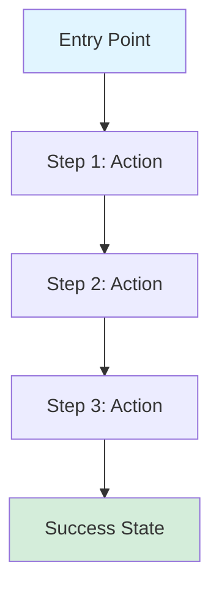
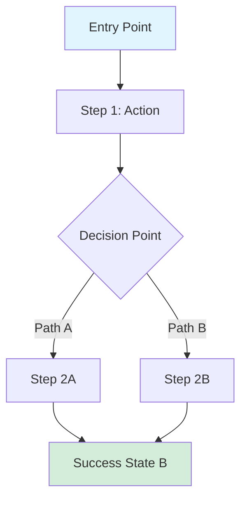
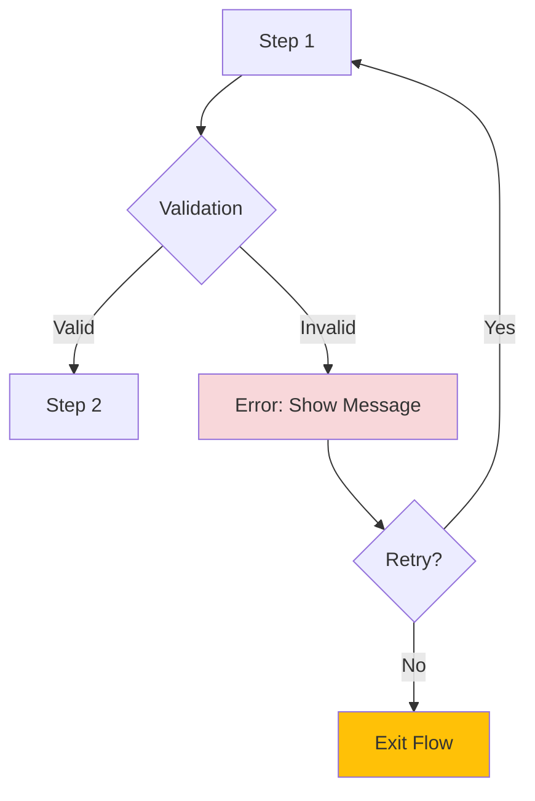
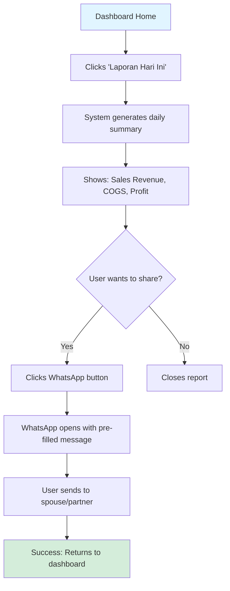

# User Flow Template

> [!NOTE]
> **Instructions:** Use this template to document user flows for features and products. Replace all placeholders `[like this]` with actual content. Include diagrams using Mermaid or screenshots. Delete this note when done.

---

## Flow Information

**Feature/Product:** [Feature or Product Name]
**Flow Name:** [e.g., "First-Time User Onboarding" or "Daily Report Export"]
**Version:** [e.g., 1.0]
**Last Updated:** [YYYY-MM-DD]
**Status:** [Draft | In Review | Approved | Implemented]
**Owner:** [Name/Role]

---

## Overview

### Purpose

[1-2 sentences describing what this flow accomplishes and why it exists]

### User Persona

**Primary User:** [Persona Name - e.g., "Phase 2 Mikro Owner"]
**Context:** [When/where does this flow happen? e.g., "Daily, after closing the restaurant"]
**Motivation:** [What drives the user to complete this flow? e.g., "Need to see if they made profit today"]

---

## Entry Points

[Where does the user start this flow?]

- **Entry Point 1:** [e.g., "Click 'New Report' button from dashboard"]
- **Entry Point 2:** [e.g., "Receive WhatsApp notification with quick action link"]
- **Entry Point 3:** [e.g., "Deep link from email campaign"]

---

## Success Criteria

**Flow is successful when:**
- [ ] [Criterion 1 - e.g., "User sees confirmation message"]
- [ ] [Criterion 2 - e.g., "Report is generated and saved"]
- [ ] [Criterion 3 - e.g., "User can share via WhatsApp"]

**Key Metrics:**
- **Completion Rate:** [Target: e.g., >80%]
- **Time to Complete:** [Target: e.g., <2 minutes]
- **Drop-off Points:** [Monitor: e.g., Step 3 payment page]

---

## User Flow Diagram

### Happy Path (Primary Flow)



### Alternative Paths



### Error/Edge Cases



---

## Detailed Flow Steps

### Step 1: [Step Name]

**User Action:** [What does the user do? e.g., "Clicks 'Export Report' button"]

**System Response:**
- [What happens on screen? e.g., "Modal opens with export options"]
- [What data is loaded? e.g., "Pre-fills date range with current month"]

**UI Elements:**
- [Button/Input/etc. - e.g., "Export button (primary CTA)"]
- [Text field - e.g., "Date range picker"]

**Validation Rules:**
- [ ] [Rule 1 - e.g., "Date range cannot exceed 12 months"]
- [ ] [Rule 2 - e.g., "At least one export format must be selected"]

**Possible Errors:**
- **Error 1:** [e.g., "No data available for selected date range"]
 **Message:** [e.g., "Belum ada data untuk periode ini. Pilih tanggal lain."]
 **Recovery:** [e.g., "User adjusts date range and retries"]

---

### Step 2: [Step Name]

[Same structure as Step 1]

---

### Step 3: [Step Name]

[Same structure as Step 1]

---

### Success State: [Outcome]

**What the user sees:**
- [Visual confirmation - e.g., "Green checkmark with 'Berhasil!' message"]
- [Result - e.g., "Report appears in download list"]

**What happens next:**
- **Primary CTA:** [e.g., "Share via WhatsApp button"]
- **Secondary CTA:** [e.g., "Download another report link"]
- **Exit:** [e.g., "Close button returns to dashboard"]

**Backend Actions:**
- [e.g., "Save report to user's history"]
- [e.g., "Log analytics event: 'report_exported'"]

---

## Alternative Flows

### Alt Flow 1: [Name - e.g., "User Cancels Mid-Flow"]

**Trigger:** [When does this happen? e.g., "User clicks 'Cancel' button on Step 2"]

**Flow:**
1. [Step - e.g., "Show confirmation dialog: 'Yakin ingin membatalkan?'"]
2. [Step - e.g., "If confirmed, discard progress and return to dashboard"]
3. [Step - e.g., "If cancelled, return to Step 2"]

**Data Handling:** [e.g., "No data is saved. Selections are discarded."]

---

### Alt Flow 2: [Name]

[Same structure as Alt Flow 1]

---

## Edge Cases & Error Handling

### Edge Case 1: [Scenario - e.g., "Offline Mode"]

**Condition:** [e.g., "User has no internet connection"]

**Behavior:**
- [What happens? e.g., "Show offline indicator banner"]
- [What's disabled? e.g., "WhatsApp sharing disabled, local save only"]
- [Recovery: e.g., "When online, show 'Sync now' option"]

---

### Edge Case 2: [Scenario - e.g., "First-Time User"]

**Condition:** [e.g., "User has never exported a report before"]

**Behavior:**
- [e.g., "Show tooltip: 'Klik di sini untuk ekspor laporan'"]
- [e.g., "Prefill with recommended settings"]
- [e.g., "Show onboarding video link"]

---

### Error Handling: [Error Type - e.g., "Server Timeout"]

**When:** [e.g., "Export takes longer than 30 seconds"]

**User Experience:**
- **Message:** [e.g., "Proses membutuhkan waktu lebih lama dari biasa..."]
- **Action:** [e.g., "Show loading spinner with progress bar"]
- **Timeout:** [e.g., "After 60s, show error: 'Gagal mengekspor. Coba lagi?'"]

---

## UX Considerations

### Design Principles

1. **[Principle 1]** - [e.g., "Mobile-first: Flow works on 4-inch screens"]
2. **[Principle 2]** - [e.g., "Indonesian context: Use 'Kas Masuk/Keluar' not 'Income/Expense'"]
3. **[Principle 3]** - [e.g., "Offline-resilient: All critical actions work offline"]

### Accessibility

- [ ] [e.g., "All buttons have tap targets ≥44x44px"]
- [ ] [e.g., "Color contrast ratio ≥4.5:1"]
- [ ] [e.g., "Screen reader labels on all interactive elements"]
- [ ] [e.g., "Keyboard navigation supported"]

### Performance

- **Target Load Time:** [e.g., "<2 seconds on 3G"]
- **Optimizations:**
 - [e.g., "Lazy load export format options"]
 - [e.g., "Cache last 5 reports for instant re-download"]

---

## Dependencies

### Technical Dependencies

- [ ] [e.g., "PDF generation library (jsPDF) must be loaded"]
- [ ] [e.g., "WhatsApp Web API integration"]
- [ ] [e.g., "User authentication (must be logged in)"]

### Data Dependencies

- [ ] [e.g., "POS data sync must be complete"]
- [ ] [e.g., "User must have at least 1 day of transaction data"]

---

## Wireframes / Mockups

### Step 1 - [Screenshot/Wireframe]


**Key Elements:**
- [Element 1 position and function]
- [Element 2 position and function]

---

### Step 2 - [Screenshot/Wireframe]


---

## User Feedback & Testing

### Usability Test Results

**Test Date:** [YYYY-MM-DD]
**Participants:** [# users, demographics]

| Step | Success Rate | Avg. Time | Issues Found |
|------|--------------|-----------|--------------|
| Step 1 | [85%] | [15s] | [Users didn't see export button] |
| Step 2 | [70%] | [30s] | [Date picker confusing] |
| Step 3 | [95%] | [10s] | [None] |

**Key Insights:**
- [Insight 1 - e.g., "Users expect export button in top-right, not bottom-left"]
- [Insight 2 - e.g., "WhatsApp icon should be green for recognition"]

---

### User Quotes

> "[Verbatim quote from user testing]"
> *— [Participant pseudonym, persona]*

> "[Another compelling quote]"
> *— [Participant pseudonym, persona]*

---

## Metrics & Analytics

### Events to Track

| Event Name | Trigger | Properties |
|------------|---------|------------|
| `flow_started` | User enters flow | `entry_point`, `user_id` |
| `step_completed` | Each step completion | `step_number`, `time_spent` |
| `flow_completed` | Success state reached | `total_time`, `export_format` |
| `flow_abandoned` | User exits early | `exit_step`, `reason` |

### Success Metrics (KPIs)

- **Completion Rate:** [Current: X% | Target: Y%]
- **Time to Complete:** [Current: Xm Ys | Target: <2 minutes]
- **Error Rate:** [Current: X% | Target: <5%]
- **Retry Rate:** [Current: X% | Target: <10%]

---

## Related Documents

- - Full product requirements
- - Implementation details
- - UI components used
- - Original user insights

---

## Version History

| Version | Date | Author | Changes |
|---------|------|--------|---------|
| 1.0 | [YYYY-MM-DD] | [Name] | Initial flow documentation |
| 1.1 | [YYYY-MM-DD] | [Name] | Updated based on usability testing |

---

## Sample User Flow Example

### Example: Daily Sales Report Export (Web Dashboard Lite)

**Persona:** Dimas (Phase 2 Mikro Owner - Warung Nasi Goreng)
**Context:** End of day, wants to see profit before going home

#### Happy Path



#### Steps

**Step 1: Access Report**
- **Action:** Taps "Laporan Hari Ini" button on dashboard
- **System:** Calculates today's transactions (8am-8pm)
- **Time:** <2 seconds

**Step 2: View Summary**
- **Action:** Reviews numbers on screen
- **System:** Shows:
 - Total Sales: Rp 1.2M
 - Food Cost: Rp 480K (40%)
 - Net Profit: Rp 720K
- **Insight:** Green indicator because profit > yesterday

**Step 3: Share (Optional)**
- **Action:** Taps WhatsApp icon
- **System:** Opens WhatsApp with message:
 ```
 Laporan Hari Ini (5 Jan 2026)
 Penjualan: Rp 1.2M
 Untung: Rp 720K

 [Link to full report]
 ```
- **User sends to spouse**

**Success:** Dimas knows his profit in 30 seconds, shared with partner.

---

**Template Version:** 1.0
**Last Updated:** 2026-01-05
**Owner:** Product/Design Team

---

## Related

- **[[biz/templates/product/prd-template|PRD Template]]** - Product requirements document template
- **[[biz/templates/engineering/technical-design-doc|Technical Design Doc]]** - Technical implementation template
- **[[biz/templates/product/user-research-questions|User Research Questions]]** - User research template
- **[[biz/design/design-system|Design System]]** - UI components and patterns
- **[[biz/strategy/market-analysis/04-user-personas|User Personas]]** - Target user personas
