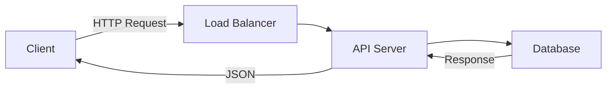
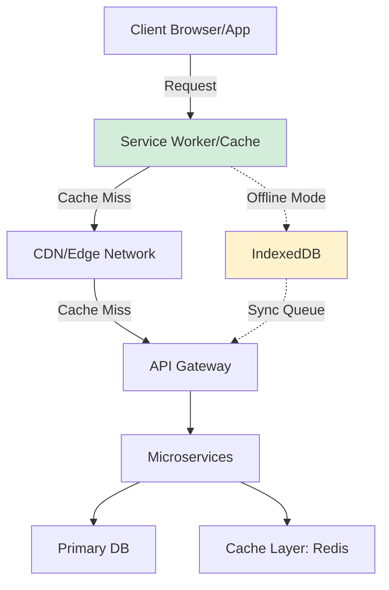
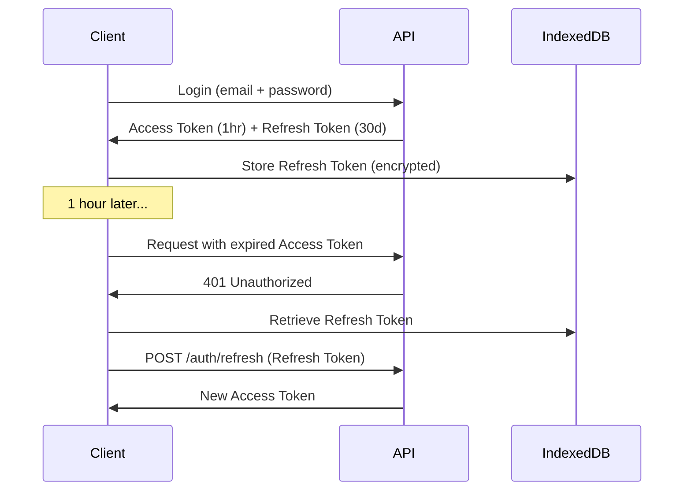

# Technical Design Document Template

> [!NOTE]
> **Instructions:** Use this template for significant technical features or architectural changes. Replace placeholders `[like this]` with actual content. Delete this note when done.

---

## Document Information

**Feature/System:** [Feature or System Name]
**Status:** [Draft | In Review | Approved | Implemented]
**Author:** [Name/Role]
**Reviewers:** [Names]
**Last Updated:** [YYYY-MM-DD]
**Version:** [e.g., 1.0]

---

## Overview

### Problem Statement

[What technical problem are we solving? 2-3 sentences.]

**Current Limitations:**
- [Limitation 1 - e.g., "Dashboard loads in 8+ seconds on 3G"]
- [Limitation 2 - e.g., "No offline data persistence"]
- [Limitation 3 - e.g., "Doesn't scale beyond 100 concurrent users"]

### Proposed Solution

[High-level description of the technical solution. 2-3 sentences.]

**Key Benefits:**
- [Benefit 1 - e.g., "Reduce load time to <2 seconds"]
- [Benefit 2 - e.g., "Support 1000+ concurrent users"]
- [Benefit 3 - e.g., "Enable offline-first architecture"]

---

## Goals & Non-Goals

### Goals

What this design accomplishes:

- [ ] [Goal 1 - e.g., "Implement client-side caching for dashboard data"]
- [ ] [Goal 2 - e.g., "Support offline CRUD operations with eventual sync"]
- [ ] [Goal 3 - e.g., "Reduce server costs by 40% via edge caching"]

### Non-Goals

What this design explicitly does NOT address:

- [Non-goal 1 - e.g., "Real-time multi-user collaboration (future work)"]
- [Non-goal 2 - e.g., "Mobile app native offline (Electron app only)"]
- [Non-goal 3 - e.g., "Historical data migration (separate project)"]

---

## Success Metrics

| Metric | Current | Target | Measurement |
|--------|---------|--------|-------------|
| [Load Time] | [8s] | [<2s] | [Lighthouse score] |
| [Offline Support] | [0%] | [100%] | [Feature flags] |
| [Server Load] | [High] | [Medium] | [CloudWatch metrics] |
| [Error Rate] | [5%] | [<1%] | [Sentry logs] |

---

## Context & Background

### Current Architecture

[Brief description of how the system works today]

**Tech Stack:**
- **Frontend:** [e.g., React 18, Electron]
- **Backend:** [e.g., Node.js + Express, Firebase Functions]
- **Database:** [e.g., PostgreSQL, Firestore]
- **Hosting:** [e.g., Vercel, AWS Lambda]

**Current Flow:**



### Problem Analysis

**Why is this needed now?**
[Explain urgency, user impact, business priority]

**Constraints:**
- [Constraint 1 - e.g., "Must support Indonesia's poor internet (3G avg)"]
- [Constraint 2 - e.g., "Budget: <Rp 5M/month infrastructure"]
- [Constraint 3 - e.g., "Must ship in 4 weeks for Sprint 1 deadline"]

---

## Proposed Design

### High-Level Architecture



### Component Breakdown

#### Component 1: [Component Name - e.g., "Client-Side Cache Manager"]

**Responsibility:**
[What does this component do? e.g., "Manages IndexedDB storage and sync queue for offline operations"]

**Technology:**
[e.g., "Workbox (Service Worker library) + Dexie.js (IndexedDB wrapper)"]

**Key Classes/Modules:**

```typescript
// Pseudo-code or actual implementation
class CacheManager {
 async set(key: string, data: any, ttl: number): Promise<void>
 async get(key: string): Promise<any | null>
 async invalidate(pattern: RegExp): Promise<void>
 async syncPendingChanges(): Promise<void>
}
```

**Interactions:**
- **Reads from:** IndexedDB, Service Worker Cache
- **Writes to:** IndexedDB, Sync Queue
- **Called by:** React components, API client wrapper

---

#### Component 2: [Component Name]

[Same structure as Component 1]

---

### Data Model

#### Existing Schema (If applicable)

**Table/Collection:** `users`

```sql
CREATE TABLE users (
 id UUID PRIMARY KEY,
 email VARCHAR(255) UNIQUE NOT NULL,
 business_name VARCHAR(255),
 created_at TIMESTAMP DEFAULT NOW()
);
```

#### Proposed Changes

> [!WARNING]
> **Breaking Change:** Field `business_type` will be renamed to `phase_category`

**Migration Script:**

```sql
-- Migration: Add offline sync metadata
ALTER TABLE transactions ADD COLUMN sync_status VARCHAR(20) DEFAULT 'synced';
ALTER TABLE transactions ADD COLUMN local_timestamp TIMESTAMP;
ALTER TABLE transactions ADD COLUMN conflict_version INT DEFAULT 1;

CREATE INDEX idx_sync_status ON transactions(sync_status) WHERE sync_status != 'synced';
```

**New Schema:**

```typescript
// IndexedDB Schema (client-side)
interface OfflineTransaction {
 id: string;
 type: 'create' | 'update' | 'delete';
 collection: string;
 data: any;
 timestamp: number;
 retryCount: number;
 syncStatus: 'pending' | 'syncing' | 'failed' | 'synced';
}
```

---

### API Design

#### New Endpoints

**Endpoint:** `POST /api/v1/sync/batch`

**Purpose:** Batch sync offline changes to server

**Request:**

```json
{
 "device_id": "abc123",
 "last_sync_timestamp": 1704441600000,
 "changes": [
 {
 "type": "create",
 "collection": "transactions",
 "data": { "amount": 50000, "date": "2026-01-05" },
 "client_timestamp": 1704441700000
 }
 ]
}
```

**Response:**

```json
{
 "server_timestamp": 1704441800000,
 "conflicts": [],
 "applied_changes": 1,
 "rejected_changes": []
}
```

**Error Handling:**
- `409 Conflict` - Data conflict detected, client must resolve
- `429 Too Many Requests` - Rate limit exceeded
- `503 Service Unavailable` - Server offline, client should retry

---

#### Modified Endpoints

**Before:** `GET /api/v1/reports/daily`
**After:** `GET /api/v1/reports/daily?include_cache_metadata=true`

**Breaking Changes:** None (backward compatible)
**New Headers:** `X-Cache-Timestamp`, `X-Stale-While-Revalidate`

---

### Algorithms & Logic

#### Conflict Resolution Strategy

**Problem:** User edits transaction offline, server has newer version.

**Algorithm:**

```
1. Compare client_timestamp vs. server_timestamp
2. If client > server: Apply client changes (Last Write Wins)
3. If server > client AND data differs:
 a. Mark as conflict
 b. Create conflict_resolution record
 c. Show user UI: "Data changed on another device. Choose version."
4. User resolves manually or accepts "server wins" default
```

**Trade-offs:**
- Simple to implement
- Works for 95% of single-user scenarios
- Not suitable for multi-user editing (future: Operational Transform)

---

#### Caching Strategy

**Cache Hierarchy:**

1. **L1: Memory Cache** (React state) - 5 minutes TTL
2. **L2: IndexedDB** (client-side) - 24 hours TTL
3. **L3: CDN Edge** (Cloudflare) - 1 hour TTL
4. **Source: Database** (PostgreSQL)

**Invalidation Rules:**
- User creates/updates data → Invalidate all L1-L3 for that user
- Daily report generated → Invalidate reports cache
- Admin updates pricing → Broadcast invalidation to all clients (WebSocket)

---

### Security Considerations

#### Authentication & Authorization

**Current:** JWT tokens with 24-hour expiry
**Change:** Add refresh tokens for offline scenarios

**New Flow:**



#### Data Encryption

> [!CAUTION]
> **PII stored in IndexedDB must be encrypted at rest**

**Implementation:**

```typescript
import { encrypt, decrypt } from 'crypto-js';

// Before storing
const encryptedData = encrypt(JSON.stringify(userData), userKey);
await db.users.put({ id, data: encryptedData });

// On retrieval
const encrypted = await db.users.get(id);
const userData = JSON.parse(decrypt(encrypted.data, userKey));
```

**Key Management:** User password-derived key (PBKDF2) + device salt

---

### Performance Optimization

#### Client-Side

**Bundle Size:**
- Before: 1.2MB (gzipped 300KB)
- After: 850KB (gzipped 210KB)
- Strategy: Code splitting, lazy load non-critical routes

**Rendering:**
- Use React.memo for expensive components
- Virtualize long lists (react-window)
- Debounce search inputs (300ms)

#### Server-Side

**Database Queries:**

```sql
-- Before (N+1 query problem)
SELECT * FROM transactions WHERE user_id = ?;
-- Then for each transaction:
SELECT * FROM transaction_items WHERE transaction_id = ?;

-- After (single query with JOIN)
SELECT t.*, ti.*
FROM transactions t
LEFT JOIN transaction_items ti ON t.id = ti.transaction_id
WHERE t.user_id = ?;
```

**Indexing:**

```sql
CREATE INDEX idx_user_date ON transactions(user_id, date DESC);
```

---

## Implementation Plan

### Phase 1: Foundation (Week 1-2)

**Deliverables:**
- [ ] Service Worker setup with Workbox
- [ ] IndexedDB schema design + Dexie.js integration
- [ ] Basic offline detection UI

**Owner:** [Name]
**Risk:** Medium - New tech for team

---

### Phase 2: Core Features (Week 3-4)

**Deliverables:**
- [ ] Offline CRUD for transactions
- [ ] Sync queue implementation
- [ ] Conflict detection (NOT resolution UI yet)

**Owner:** [Name]
**Dependencies:** Phase 1 complete

---

### Phase 3: Polish & Testing (Week 5-6)

**Deliverables:**
- [ ] Conflict resolution UI
- [ ] E2E tests (Playwright offline scenarios)
- [ ] Performance benchmarking

**Owner:** [Name]
**Gate:** Beta testing with 10 users

---

### Rollout Strategy

**Step 1:** Feature flag enabled for internal team (Week 5)
**Step 2:** Beta users opt-in (50 users, Week 6)
**Step 3:** Gradual rollout (10% → 50% → 100% over 2 weeks)
**Step 4:** Deprecate old non-offline version (Week 10)

---

## Testing Strategy

### Unit Tests

**Coverage Target:** >80%

**Key Test Cases:**
- CacheManager.set() stores data in IndexedDB
- CacheManager.get() returns cached data within TTL
- CacheManager.get() returns null after TTL expires
- SyncQueue handles network failures gracefully

---

### Integration Tests

**Scenarios:**
1. User creates transaction offline → Goes online → Data syncs
2. Server has newer data → Conflict detected → User resolves
3. Network drops mid-sync → Partial changes rolled back

**Tool:** Playwright with network throttling

---

### Performance Tests

**Benchmarks:**

| Scenario | Target | Tool |
|----------|--------|------|
| Initial page load (3G) | <3s | Lighthouse |
| Offline app launch | <1s | Custom script |
| Sync 100 transactions | <5s | Artillery |

---

## Risks & Mitigations

| Risk | Probability | Impact | Mitigation |
|------|-------------|--------|------------|
| IndexedDB quota exceeded (50MB limit) | Medium | High | Implement LRU eviction, warn user at 40MB |
| Sync conflicts overwhelm users | Low | Medium | Auto-resolve 90% cases (Last Write Wins) |
| Service Worker caching bugs | High | High | Extensive testing, kill switch feature flag |
| Older browsers lack support | Low | Low | Graceful degradation (no offline mode) |

---

## Alternatives Considered

### Alternative 1: Full Backend Rewrite to GraphQL + Apollo Client

**Pros:**
- Built-in caching and offline support
- Industry standard

**Cons:**
- 3-month migration timeline (too long)
- Team unfamiliar with GraphQL
- Overkill for current scale

**Decision:** Rejected - Too complex for Sprint 1 deadline

---

### Alternative 2: Use PouchDB + CouchDB for Sync

**Pros:**
- Battle-tested offline-first database
- Automatic conflict resolution

**Cons:**
- Additional hosting cost (Rp 2M/month)
- Vendor lock-in to CouchDB
- Learning curve

**Decision:** Rejected - Budget constraints + team capacity

---

## Dependencies

### External Libraries

| Library | Version | Purpose | License |
|---------|---------|---------|---------|
| Workbox | 7.0 | Service Worker toolkit | Apache 2.0 |
| Dexie.js | 3.2 | IndexedDB wrapper | Apache 2.0 |
| idb-keyval | 6.0 | Simple KV store | ISC |

### Internal Dependencies

- [ ] Auth system must support refresh tokens (Auth Team, Week 1)
- [ ] API gateway must handle batch sync endpoint (Backend Team, Week 2)
- [ ] Design system must have offline indicator UI (Design Team, Week 1)

---

## Monitoring & Observability

### Metrics to Track

**Client-Side (Analytics):**
- `cache_hit_rate` - % of requests served from cache
- `offline_usage_time` - Minutes spent in offline mode
- `sync_success_rate` - % of successful syncs
- `conflict_rate` - # conflicts per 1000 transactions

**Server-Side (Prometheus):**
- `sync_endpoint_latency_p95` - 95th percentile sync time
- `database_connection_pool_usage` - Connection saturation
- `cdn_cache_hit_rate` - Edge cache effectiveness

### Alerting

**Critical Alerts:**
- Sync success rate <90% for 5 minutes → Page on-call engineer
- Database connection pool >80% → Scale up immediately

**Warning Alerts:**
- Cache hit rate <60% → Investigate caching logic
- Conflict rate >5% → Review sync algorithm

---

## Rollback Plan

### Criteria for Rollback

- Sync success rate <80% after 24 hours
- >10 critical bugs reported in first week
- Infrastructure costs exceed Rp 7M/month (40% over budget)

### Rollback Procedure

1. Disable feature flag → All users revert to old version
2. Drain sync queue (process pending changes)
3. Notify users via email: "Offline feature temporarily disabled"
4. Debug issues in staging
5. Re-enable with fixes in 1 week

**Rollback Time:** <15 minutes (feature flag toggle)

---

## Open Questions

1. **Q:** How do we handle schema migrations for offline users who haven't synced in weeks?
 **Owner:** [Name]
 **Decision Needed By:** [Date]

2. **Q:** Should we support offline photo uploads (for receipt scanning)?
 **Owner:** [Name]
 **Decision Needed By:** [Date]

---

## Appendix

### References

- [Offline-First Design Principles](https://offlinefirst.org/)
- [IndexedDB Best Practices](https://web.dev/indexeddb/)
- [Workbox Documentation](https://developers.google.com/web/tools/workbox)

### Related Documents

---

## Approval

- [ ] **Engineering Lead:** [Name] - [Date]
- [ ] **Product Owner:** [Name] - [Date]
- [ ] **Security Review:** [Name] - [Date]

---

**Document Version:** 1.0
**Last Updated:** 2026-01-05
**Owner:** Engineering Team

---

## Related

- **[[biz/templates/internal/decision-record-template|Architecture Decision Record]]** - ADR template for major decisions
- **[[biz/templates/engineering/github-issue-template|GitHub Issue Template]]** - Issue tracking templates
- **[[biz/templates/product/prd-template|PRD Template]]** - Product requirements documentation
- **[[biz/templates/design/user-flow-template|User Flow Template]]** - User experience flows
- **[[products/shared-technical/architecture/system-overview|System Overview]]** - Current system architecture
