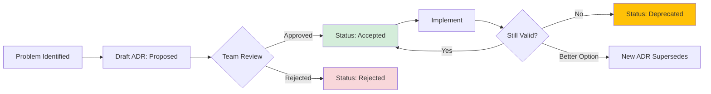

# Architecture Decision Record (ADR) Template

> [!NOTE]
> **Instructions:** Use this template to document significant architectural or technical decisions. Copy and create a new ADR for each major decision. Delete this note when done.

---

## ADR Information

**ADR Number:** [e.g., ADR-001, ADR-002, etc.]
**Title:** [Short, descriptive title - e.g., "Use IndexedDB for Offline Storage"]
**Status:** [Proposed | Accepted | Rejected | Deprecated | Superseded by ADR-XXX]
**Date:** [YYYY-MM-DD]
**Author(s):** [Name(s)]
**Decision Makers:** [Names of people who approved/rejected]

---

## Context

### What is the issue that we're seeing that is motivating this decision?

[Describe the problem, challenge, or opportunity. Provide enough context for someone reading this 6 months from now to understand why this decision was needed.]

**Background:**
- [Relevant background information]
- [Current state of the system]
- [Constraints or requirements driving this decision]

**Stakeholders:**
- [Who is affected by this decision?]
- [Who needs to be consulted?]

---

## Decision Drivers

[What factors are most important in making this decision?]

- [Driver 1 - e.g., "Must work offline in low-connectivity environments"]
- [Driver 2 - e.g., "Budget constraint: <Rp 5M/month infrastructure"]
- [Driver 3 - e.g., "Team has limited time to learn new technology"]
- [Driver 4 - e.g., "Must ship within 4 weeks for Sprint 1 deadline"]

**Priority Ranking:**
1. [Most important driver]
2. [Second most important]
3. [etc.]

---

## Decision

### We have decided to...

[Clear, actionable statement of the decision made]

**In concrete terms:**
- [Specific action 1 - e.g., "Use IndexedDB with Dexie.js wrapper"]
- [Specific action 2 - e.g., "Implement Workbox for service worker management"]
- [Specific action 3 - e.g., "Store max 50MB of data per user"]

---

## Rationale

### Why did we choose this option?

[Explain the reasoning behind the decision. What makes this the best choice given the context and drivers?]

**Key Reasons:**
1. [Reason 1 with supporting evidence]
2. [Reason 2 with supporting evidence]
3. [Reason 3 with supporting evidence]

**Trade-offs Accepted:**
- [Trade-off 1 - e.g., "Complexity increases, but worth it for offline support"]
- [Trade-off 2 - e.g., "Not real-time sync, but eventual consistency is acceptable"]

---

## Alternatives Considered

### Option A: [Alternative 1 Name]

**Description:**
[What was this option?]

**Pros:**
- [Pro 1]
- [Pro 2]

**Cons:**
- [Con 1]
- [Con 2]

**Why Rejected:**
[Specific reason this wasn't chosen]

---

### Option B: [Alternative 2 Name]

**Description:**
[What was this option?]

**Pros:**
- [Pro 1]
- [Pro 2]

**Cons:**
- [Con 1]
- [Con 2]

**Why Rejected:**
[Specific reason this wasn't chosen]

---

### Option C: [Alternative 3 Name - e.g., "Do Nothing / Status Quo"]

**Description:**
[What would happen if we made no change?]

**Pros:**
- [Pro 1 - e.g., "Zero implementation cost"]

**Cons:**
- [Con 1 - e.g., "Problem persists and gets worse"]
- [Con 2 - e.g., "Competitive disadvantage"]

**Why Rejected:**
[Why status quo is not acceptable]

---

## Consequences

### Positive Consequences

**Benefits:**
- [Benefit 1 - e.g., "Users can work offline, improving UX"]
- [Benefit 2 - e.g., "Reduced server load by 40%"]
- [Benefit 3 - e.g., "Faster page loads (2s vs. 8s)"]

**Who Benefits:**
- [Stakeholder group 1]
- [Stakeholder group 2]

---

### Negative Consequences

**Costs & Risks:**
- [Risk 1 - e.g., "Increased code complexity"]
- [Risk 2 - e.g., "Browser compatibility issues (Safari 13+)"]
- [Risk 3 - e.g., "Data sync conflicts need manual resolution"]

**Mitigation Plans:**
- [Risk 1 Mitigation - e.g., "Extensive documentation and code comments"]
- [Risk 2 Mitigation - e.g., "Graceful degradation for unsupported browsers"]
- [Risk 3 Mitigation - e.g., "Auto-resolve 90% with Last Write Wins strategy"]

---

### Neutral Consequences

[Any other side effects that are neither clearly positive nor negative]

- [Neutral consequence 1]
- [Neutral consequence 2]

---

## Implementation Notes

### Technical Implications

**What needs to change:**
- [System component 1]
- [System component 2]

**Dependencies:**
- [Dependency 1 - e.g., "Requires Service Worker API support"]
- [Dependency 2 - e.g., "Need to update auth system for refresh tokens"]

**Migration Path:**
[If this changes existing systems, how do we migrate?]

---

### Effort Estimate

**Development Time:** [e.g., "4 engineer-weeks"]
**Testing Time:** [e.g., "1 week"]
**Rollout Time:** [e.g., "Gradual rollout over 2 weeks"]

**Team Required:**
- [Role 1 - e.g., "1 Frontend Engineer"]
- [Role 2 - e.g., "1 QA Engineer for offline testing"]

---

### Success Criteria

How will we know if this decision was correct?

**Metrics to Monitor:**
- [Metric 1 - e.g., "Offline usage time >10 min/day/user"]
- [Metric 2 - e.g., "Sync success rate >95%"]
- [Metric 3 - e.g., "User satisfaction score >8/10"]

**Review Date:** [When should we review if this decision worked?]

---

## Compliance & Security

[If applicable, note any compliance, security, or regulatory implications]

**Security Considerations:**
- [Security item 1 - e.g., "PII must be encrypted in IndexedDB"]
- [Security item 2 - e.g., "Encrypt with user-derived key (PBKDF2)"]

**Compliance:**
- [Regulation 1 - e.g., "GDPR: Right to be forgotten requires data purge script"]
- [Regulation 2 - e.g., "Indonesian data residency: All data stays in Jakarta servers"]

---

## References

**Related Documents:**
**External Resources:**
- [Article or documentation 1]
- [Article or documentation 2]

**Related ADRs:**
- [ADR-XXX] - Related decision
- [Supersedes ADR-YYY] - If this replaces an older decision

---

## Revision History

| Version | Date | Author | Changes |
|---------|------|--------|---------|
| 1.0 | [YYYY-MM-DD] | [Name] | Initial decision |
| 1.1 | [YYYY-MM-DD] | [Name] | [Updated after review feedback] |

---

## Approval

- [ ] **Technical Lead:** [Name] - [Date]
- [ ] **Product Owner:** [Name] - [Date]
- [ ] **Founding Team:** [Name] - [Date]

---

## Sample ADR Examples

### Example 1: Technology Choice

```markdown
# ADR-003: Use PostgreSQL for Primary Database

**Status:** Accepted
**Date:** 2026-01-05
**Author:** Engineering Team

## Context

We need to choose a database for the SaaS Platform (Products #5-13). Requirements:
- ACID compliance for financial data (transactions, accounting)
- Support for complex queries (reporting, analytics)
- Open-source or affordable licensing
- Team has limited DB admin experience

## Decision Drivers

1. Data integrity (Critical - financial data)
2. Cost (<Rp 5M/month)
3. Team learning curve
4. Community support

## Decision

We will use **PostgreSQL** as the primary database for SaaS products.

Specifically:
- Hosted on Supabase (managed PostgreSQL)
- Version 15+
- Use pg_cron for scheduled jobs
- Implement row-level security (RLS) for multi-tenancy

## Rationale

1. **ACID compliance** - Critical for financial transactions
2. **Cost-effective** - Supabase free tier + Rp 1.5M/month for production
3. **JSON support** - Flexible schema for dynamic product data
4. **Excellent documentation** - Easy for team to learn

## Alternatives Considered

**Option A: MongoDB**
- Pros: Flexible schema, team somewhat familiar
- Cons: No ACID by default, weak for financial data
- Rejected: Financial data integrity is non-negotiable

**Option B: MySQL**
- Pros: Popular, cheap hosting
- Cons: Weaker JSON support, less feature-rich than PostgreSQL
- Rejected: PostgreSQL offers better value for same cost

**Option C: Firebase Firestore**
- Pros: Real-time sync, serverless
- Cons: Expensive at scale (Rp 8M+/month projected), limited querying
- Rejected: Cost prohibitive

## Consequences

**Positive:**
- Data integrity guaranteed
- Complex analytics queries possible
- Future-proof (can scale to millions of rows)

**Negative:**
- Requires learning PostgreSQL-specific features (vs. generic SQL)
- Supabase vendor lock-in (medium risk)

**Mitigation:**
- Use standard SQL as much as possible (portable)
- Keep backups in S3 (can migrate to self-hosted if needed)

## Implementation Notes

**Timeline:** Week 1-2 of Sprint 2
**Effort:** 3 days setup + migration scripts

**Success Criteria:**
- All CRUD operations <100ms
- Backup/restore tested successfully
- Team can write queries without constant Googling

**Review Date:** After Sprint 3 (Week 16)
```

---

### Example 2: Architectural Pattern

```markdown
# ADR-005: Adopt Offline-First Architecture for Web Dashboard Lite

**Status:** Accepted
**Date:** 2026-01-08
**Author:** Frontend Team

## Context

Web Dashboard Lite (Product #3) targets Phase 1 Mikro owners with unreliable 3G internet. Users report:
- Frequent connection drops during data entry
- Lost work when internet cuts out
- App unusable during peak hours (network congestion)

Current: App requires constant internet (cloud-only).

## Decision Drivers

1. **User impact:** 80% of Phase 1 users have poor connectivity
2. **Competitive advantage:** No competitor offers offline mode
3. **Technical feasibility:** Doable in 4 weeks with Workbox + IndexedDB
4. **Budget:** No additional infrastructure cost

## Decision

Implement **offline-first architecture** using:
- IndexedDB for local data storage (Dexie.js wrapper)
- Service Worker for background sync (Workbox)
- Eventual consistency model (Last Write Wins for conflicts)

## Rationale

1. **Solves critical user pain** (connection drops)
2. **Faster UX** (instant load from cache)
3. **Works with existing stack** (React + Electron)

Trade-off: Increased complexity acceptable for dramatic UX improvement.

## Alternatives Considered

**Option A: Optimize for slow connections (not offline)**
- Rejected: Doesn't solve connection drops

**Option B: Native mobile app with SQLite**
- Rejected: 3-month timeline too long, team lacks native skills

**Option C: Do nothing, wait for better internet infrastructure**
- Rejected: Users need solution now, infrastructure may never improve in rural areas

## Consequences

**Positive:**
- App works 100% offline
- Perceived speed: <1s load time
- Competitive differentiation

**Negative:**
- 40% more code to maintain
- Data sync conflicts (5-10% of syncs estimated)
- Testing complexity (offline scenarios)

**Mitigation:**
- Extensive documentation
- Auto-resolve 90% of conflicts
- Playwright tests for offline scenarios

## Implementation Notes

See

**Effort:** 4 weeks (2 engineers)
**Rollout:** Feature flag → Beta → Gradual rollout

**Success Criteria:**
- 50% of users engage in offline mode within first month
- Sync success rate >95%
- NPS improvement +20 points

**Review Date:** Week 8 (After Sprint 2)
```

---

### Example 3: Process Decision

```markdown
# ADR-007: Adopt Weekly Sprint Retrospectives

**Status:** Accepted
**Date:** 2026-01-10
**Non-Technical Decision**

## Context

After Sprint 1, team identified:
- Repeated mistakes (e.g., missed deadlines due to scope creep)
- No formal learning process
- Communication gaps between Builder and Seller roles

Current: No structured retrospectives.

## Decision

Conduct **30-minute retrospectives** every Friday at 4pm WIB.

Format:
- What went well?
- What didn't go well?
- What will we change next week?
- Action items (max 3)

## Rationale

1. **Quick feedback loops** (weekly vs. end-of-sprint)
2. **Low time investment** (30 min)
3. **Continuous improvement culture**

## Alternatives Considered

**Option A: Monthly retrospectives**
- Rejected: Too infrequent, issues compound

**Option B: Daily standups with retro elements**
- Rejected: Mixes operational and reflective modes

## Consequences

**Positive:**
- Catch issues early
- Team alignment improves
- Documented learnings

**Negative:**
- 2 hours/month time cost

**Mitigation:**
- Strict 30-min timeboxing
- Cancel if no meaningful topics

## Success Criteria

- 80% of action items completed within 1 week
- Team agrees it's valuable (vote after 4 weeks)

**Review Date:** End of Sprint 2 (Week 8)
```

---

## ADR Numbering & Organization

### Naming Convention

```
ADR-[000]-[short-title].md

Examples:
ADR-001-use-react-for-frontend.md
ADR-002-offline-first-architecture.md
ADR-003-postgresql-primary-database.md
```

### Folder Structure

```
docs/biz/decisions/
 README.md (Index of all ADRs)
 0001-use-react-for-frontend.md
 0002-offline-first-architecture.md
 0003-postgresql-primary-database.md
 superseded/
 0001-use-vue-for-frontend.md (superseded by ADR-001)
```

### ADR Index (README.md)

```markdown
# Architecture Decision Records (ADRs)

## Active Decisions

| ADR | Title | Status | Date |
|-----|-------|--------|------|
| 001 | Use React for Frontend | Accepted | 2026-01-03 |
| 002 | Offline-First Architecture | Accepted | 2026-01-08 |
| 003 | PostgreSQL Primary Database | Accepted | 2026-01-05 |

## Superseded / Deprecated

| ADR | Title | Status | Superseded By |
|-----|-------|--------|---------------|
| 001 | Use Vue for Frontend | Superseded | ADR-001 |
```

---

## When to Write an ADR

### DO write an ADR for:

 **Technology choices** - Database selection, framework choice, hosting platform
 **Architectural patterns** - Offline-first, microservices, monolith
 **API designs** - REST vs. GraphQL, versioning strategy
 **Security decisions** - Authentication method, encryption approach
 **Process changes** - Deployment strategy, code review process
 **Costly trade-offs** - Performance vs. maintainability decisions

### DON'T write an ADR for:

 **Trivial choices** - Variable naming, code formatting (use linter config)
 **Easily reversible** - UI color changes, button placement
 **No alternatives** - Required by law/regulation
 **Personal preference** - Unless impacts the team

**Rule of thumb:** If someone might ask "Why did we do it this way?" in 6 months, write an ADR.

---

## ADR Lifecycle



---

**Template Version:** 1.0
**Last Updated:** 2026-01-05
**Owner:** Engineering & Strategy Teams

---

## Related

- **[[biz/templates/engineering/technical-design-doc|Technical Design Doc]]** - Technical implementation details
- **[[biz/templates/internal/meeting-notes-template|Meeting Notes Template]]** - Meeting documentation
- **[[biz/strategy/frameworks/06-product-strategy-framework|Product Strategy Framework]]** - Strategic decision-making
- **[[biz/strategy/frameworks/05-decision-making-framework|Decision Making Framework]]** - Decision process guidelines
- **[[products/shared-technical/architecture/architecture-decisions|Architecture Decisions]]** - Active ADR index
