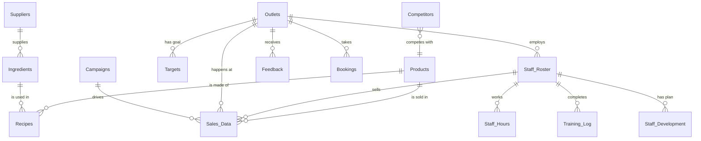

# 07 - Database Schema & Data Model

**Version:** 1.0
**Status:** Active
**Source of Truth:** `generate_templates.py` (Gold Standard)

---

## 1. Schema Overview

The data model follows a **Star Schema** optimized for Power BI.
* **Fact Tables:** Transactional data (Sales, Feedback, Staff Hours).
* **Dimension Tables:** Reference data (Products, Staff, Outlets, Targets).

### The "Hybrid" Modular Approach
The schema uses two methods to support Add-on Modules:
1. **Dedicated Tables:** For complex new data (e.g., `Ingredients`, `Feedback`).
2. **Latent Columns:** "Sleeper" columns pre-baked into Core Tables. These are always present but only "activated" (used in visuals) when the specific Module is purchased.

---

## 2. Core Tables (Tier 1 Base)

These tables are present in **ALL** versions of the template.

These tables are present in **ALL** versions of the template.

*> **Note:** These tables physically contain additional "Sleeper Columns" for Add-ons. These are documented in their respective Add-on sections below to keep the Core view clean.*

### `Sales_Data` (Fact Table)
The heart of the dashboard. Contains every transaction line item.

| Column | Type | Support | Description |
| :--- | :--- | :--- | :--- |
| **TransactionID** | Int | **Core** | **(PK)** Unique ID for specific line item |
| `TransactionDate` | Date | **Core** | Date of sale (connects to Date Table) |
| `HourOfDay` | Int | **Core** | 0-23 integer for heatmaps |
| `OrderTimestamp` | DateTime | **Core** | Exact time order taken |
| `SettledTimestamp` | DateTime | **Core** | Exact time payment received |
| `StaffID` | Int | **Core** | **(FK)** Links to `Staff_Roster` |
| `CustomerID` | String | **Core** | Customer ID or "Walk-In" |
| `TableNumber` | Int | **Core** | Physical table number |
| `IsReservation` | Int | **[P4]** | 1 = Yes, 0 = No (Support for Customer Mastery) |
| `ReservationCategory` | String | **[P4]** | e.g "Private Event", "Walk-in" |
| `Category` | String | **Core** | Product main category (Food, Bev) |
| `ItemName` | String | **Core** | Name of item sold |
| `MenuCategory` | String | **[T1-B]** | "Year-Round" or "Seasonal" (Menu Engineering) |
| `MenuSeason` | String | **[T1-B]** | "Q1-2025" etc. |
| `Quantity` | Int | **Core** | Number of items |
| `UnitPrice` | Decimal | **Core** | Price per unit |
| `GrossAmount` | Decimal | **Core** | Quantity * UnitPrice |
| `PaymentMethod` | String | **Core** | Cash, Card, QRIS, etc. |

**Computed Schema (Revenue Core - B1)**
| ID | Measure Name | Type | Logic / Description |
| :--- | :--- | :--- | :--- |
| `[1]` | `[Total Revenue]` | Currency | SUM(`GrossAmount`) |
| `[2]` | `[Weekly Revenue]` | Currency | Calculate Revenue (Last 7 Days) |
| `[3]` | `[Monthly Revenue]` | Currency | Calculate Revenue (MTD) |
| `[4]` | `[Target Achievement %]` | % | `[Total Revenue]` / `[TargetAmount]` |
| `[5]` | `[Rev Growth MoM]` | % | (This Month - Last Month) / Last Month |
| `[6]` | `[Rev Growth YoY]` | % | (This Year - Last Year) / Last Year |
| `[7]` | `[Peak Hour Rev]` | Currency | Max Revenue by Hour |
| `[8]` | `[Payment Mix]` | % | Count by PaymentMethod / Total Count |
| `[9]` | `[Walk-in Rev]` | Currency | Sales where `IsReservation = 0` |
| `[10]` | `[Res Rev]` | Currency | Sales where `IsReservation = 1` |

### `Products` (Dimension)
Master list of all sellable items.

| Column | Type | Support | Description |
| :--- | :--- | :--- | :--- |
| **ProductID** | Int | **Core** | **(PK)** Unique Product ID |
| `ItemName` | String | **Core** | Matches Sales_Data.ItemName |
| `Category` | String | **Core** | Food, Bev, Alcohol, Dessert |
| `CurrentSellPrice` | Decimal | **Core** | Current menu price |

**Computed Schema (Menu Essentials - B2)**
| ID | Measure Name | Type | Logic / Description |
| :--- | :--- | :--- | :--- |
| `[11]` | `[Top Sellers Qty]` | List | Top 10 Products by Quantity |
| `[12]` | `[Top Sellers Rev]` | List | Top 10 Products by Revenue |
| `[13]` | `[Worst Sellers]` | List | Bottom 5 Products |
| `[14]` | `[Food Cost %]` | % | *Requires CostPrice (T1-B)* or Input |
| `[15]` | `[Bev Cost %]` | % | *Requires CostPrice (T1-B)* or Input |
| `[16]` | `[Category Margin]` | Currency | Rev - COGS by Category |
| `[17]` | `[Category Mix]` | % | Rev by Category / Total Rev |
| `[18]` | `[Profit Rank]` | Rank | Ranking by Margin |
| `[19]` | `[Avg Order Val]` | Currency | `[Total Revenue]` / `[Trx Count]` |
| `[20]` | `[Menu Count]` | Integer | DISTINCTCOUNT(`ProductID`) |

### `Staff_Roster` (Dimension)
List of all active employees.

| Column | Type | Support | Description |
| :--- | :--- | :--- | :--- |
| **StaffID** | Int | **Core** | **(PK)** Unique Staff ID |
| `StaffName` | String | **Core** | Full name |
| `Role` | String | **Core** | Role (Server, Captain, Manager) |

**Computed Schema (Staff & Ops - B3)**
| ID | Measure Name | Type | Logic / Description |
| :--- | :--- | :--- | :--- |
| `[21]` | `[Sales Per Staff]` | Currency | `[Total Revenue]` / `[Active Staff]` |
| `[22]` | `[Sales Per Hour]` | Currency | *Simple Avg if T1-C missing* |
| `[23]` | `[Top 3 Staff]` | List | Top 3 Staff by Revenue |
| `[24]` | `[Active Staff]` | Integer | DISTINCTCOUNT(`StaffID`) |
| `[25]` | `[Labor Cost %]` | % | *Manual Input* / `[Total Revenue]` |
| `[26]` | `[Total Customers]` | Integer | DISTINCTCOUNT(`CustID` or `TrxID`) |
| `[27]` | `[Avg Check Size]` | Currency | `[Total Revenue]` / `[Total Customers]` |
| `[28]` | `[Retention Rate]` | % | Return Customers / Total |
| `[29]` | `[Customer Trend]` | Trend | Count over time |
| `[30]` | `[Trx Count]` | Integer | COUNTROWS(`Sales_Data`) |

### `Targets` (Fact/Dim)
Monthly revenue targets.

| Column | Type | Description |
| :--- | :--- | :--- |
| `MonthStartDate` | Date | 1st of each month (e.g. 2025-01-01) |
| `Year` | Int | 2025 |
| `Month` | Int | 1-12 |
| `TargetAmount` | Decimal | Revenue goal for that month |

**Computed Schema (Targets)**
| ID | Measure Name | Type | Logic / Description |
| :--- | :--- | :--- | :--- |
| `[T1]` | `[Total Target]` | Currency | SUM(`TargetAmount`) |
| `[T2]` | `[Target Variance]` | Currency | `[Total Revenue]` - `[Total Target]` |

---

## 3. Tier 1 Modular Add-ons

These tables are optional but work with **ANY** Tier (1 or 2).

### Pack: Revenue Intelligence (Tier 1)
**Type:** Logical Extension (No New Table)
**Integration:** Extends `Sales_Data` with the following columns:

| Column | Type | Description |
| :--- | :--- | :--- |
| `DiscountAmount` | Decimal | Discounts applied |
| `IsUpsellItem` | Int | 1 = Upsell Category (Dessert/Alc), 0 = No |

**Computed Schema (DAX Measures)**
*These measures constitute the 'Semantic Layer' for this module.*

**Home Table: `Sales_Data`**
| ID | Measure Name | Type | Logic / Description |
| :--- | :--- | :--- | :--- |
| `[31]` | `[Upsell Revenue]` | Currency | SUM of rows where `IsUpsellItem = 1` |
| `[32]` | `[Discount Impact]` | Currency | SUM of `DiscountAmount` |
| `[33]` | `[Net Revenue]` | Currency | `[Gross Sales]` - `[Discount Impact]` |
| `[34]` | `[Rev Waterfall]` | Table | Visual breakdown bridge (Gross -> Net) |
| `[35]` | `[Forecast Year-End]` | Currency | `[Avg Daily Sales]` * Days Remaining + `[YTD]` |
| `[36]` | `[Rev Gap to Target]` | Currency | `[Annual Target]` - `[Forecast Year-End]` |
| `[37]` | `[Run Rate Required]` | Currency | `[Rev Gap]` / Days Remaining |
| `[38]` | `[MTD vs Target]` | % | `[MTD Revenue]` / `[Monthly Target]` |
| `[39]` | `[Weekly Trend]` | Trend | Sparkline logic (Last 8 Weeks) |
| `[40]` | `[QTD Performance]` | % | `[QTD Revenue]` / `[Quarterly Target]` |

### Pack: Menu Engineering (Tier 1)
**Type:** Hybrid (Extension + New Table)

**1. Extension: `Products` Table**
| Column | Type | Description |
| :--- | :--- | :--- |
| `CostPrice` | Decimal | COGS for this item |

**Computed Schema (Products - T1-B)**
| ID | Measure Name | Type | Logic / Description |
| :--- | :--- | :--- | :--- |
| `[42]` | `[Profit Margin $]` | Currency | `[SellPrice]` - `[Recipe Cost]` |
| `[43]` | `[BCG Star]` | Boolean | High Sales + High Margin |
| `[44]` | `[BCG Cash Cow]` | Boolean | High Sales + Low Margin |
| `[45]` | `[BCG Dog]` | Boolean | Low Sales + Low Margin |
| `[46]` | `[BCG ?]` | Boolean | Low Sales + High Margin |
| `[50]` | `[Menu Score]` | 0-10 | Optimization Health Score |

**2. Extension: `Sales_Data` Table**
| Column | Type | Description |
| :--- | :--- | :--- |
| `MenuCategory` | String | "Year-Round" or "Seasonal" |
| `MenuSeason` | String | "Q1-2025" etc. |

**Computed Schema (Sales_Data - T1-B)**
| ID | Measure Name | Type | Logic / Description |
| :--- | :--- | :--- | :--- |
| `[47]` | `[Item Velocity]` | # | Units sold per day |
| `[49]` | `[Category Profit]` | % | Margin % by Category |

**3. New Table: `Recipes`**
| Column | Description |
| :--- | :--- |
| `ProductID` | **(FK)** Link to Product Master |
| `IngredientID` | Link to Ingredient Inventory |
| `IngredientName` | Name of raw material |
| `Quantity` | Amount used per recipe |
| `UnitCost` | Cost per unit (Snapshot) |

**Computed Schema (Recipes - T1-B)**
| ID | Measure Name | Type | Logic / Description |
| :--- | :--- | :--- | :--- |
| `[41]` | `[Recipe Cost]` | Currency | SUM(`Qty` * `IngredientCost`) |
| `[48]` | `[Portion Cost]` | Currency | Cost per serving |

### Pack: Staff Performance (Tier 1)
**Type:** Hybrid (Extension + New Table)

**1. Extension: `Staff_Roster` Table**
| Column | Type | Description |
| :--- | :--- | :--- |
| `MonthlyTarget` | Decimal | Individual sales target |
| `BonusThreshold` | Decimal | Target for bonus activation |
| `TierLevel` | String | Gold/Silver/Bronze (Gamification) |
| `Persona` | String | e.g. "The Upseller", "Rookie" |

**Computed Schema (Staff_Roster - T1-C)**
| ID | Measure Name | Type | Logic / Description |
| :--- | :--- | :--- | :--- |
| `[51]` | `[Performance Score]` | 0-100 | Weighted Avg of all sub-metrics |
| `[56]` | `[Conflict Res]` | Score | Manual Input / Placeholder |
| `[57]` | `[Tier Level]` | Text | Gold/Silver/Bronze based on Score |
| `[58]` | `[Gap to Bonus]` | Currency | `[BonusThreshold]` - `[My Sales]` |
| `[60]` | `[Staff Profile]` | Table | Drill-through detail view |

**2. Extension: `Sales_Data` Table**
| Column | Type | Description |
| :--- | :--- | :--- |
| `IsVoid` | Int | 1 = Voided/Cancelled |

**Computed Schema (Sales_Data - T1-C)**
| ID | Measure Name | Type | Logic / Description |
| :--- | :--- | :--- | :--- |
| `[55]` | `[Order Accuracy]` | % | 1 - (`[Void Count]` / `[Trx Count]`) |

**3. New Table: `Staff_Hours`**
| Column | Description |
| :--- | :--- |
| `StaffID` | **(FK)** Link to Staff Roster |
| `OutletID` | **(FK)** Location worked (Tier 2 only) |
| `Date` | Shift date |
| `ShiftType` | Lunch/Dinner |
| `ScheduledClockIn` | Planned start |
| `ActualClockIn` | Actual start |

**Computed Schema (Staff_Hours - T1-C)**
| ID | Measure Name | Type | Logic / Description |
| :--- | :--- | :--- | :--- |
| `[52]` | `[Punctuality %]` | % | `[On-Time]` / `[Total Shifts]` |
| `[53]` | `[Full Shift %]` | % | `[Completed]` / `[Scheduled]` |
| `[54]` | `[Attendance %]` | % | `[Worked]` / `[Scheduled]` |
| `[59]` | `[WoW Trend]` | Trend | This Week vs Last Week |

---

## 4. Tier 2 Base & Multi-Outlet (P1)

**Implementation Note:**
This Tier introduces the `Outlets` table and links it to all Core Tables.

### Pack: Multi-Outlet Operations (P1)

**1. New Table: `Outlets`**
Only present in Tier 2+. Defines the locations.

| Column | Type | Description |
| :--- | :--- | :--- |
| **OutletID** | Int | **(PK)** Unique ID (1, 2, 3...) |
| `OutletName` | String | e.g. "Jakarta South - Flagship" |
| `Location` | String | City or Area |
| `ManagerName` | String | Head Manager |
| `OpenDate` | Date | When outlet opened |
| `SeatingCapacity` | Int | Total seats |

**Computed Schema (Outlets - P1)**
| ID | Measure Name | Type | Logic / Description |
| :--- | :--- | :--- | :--- |
| `[61]` | `[Outlet Perf Rank]` | Rank | Rank by Revenue |
| `[62]` | `[Outlet Leaderboard]` | Table | List of Outlets by Sales |
| `[63]` | `[Outlet Food Cost]` | % | FC% per Location |
| `[64]` | `[Outlet Labor Cost]` | % | LC% per Location |
| `[65]` | `[Outlet Margin]` | % | Profitability per Location |
| `[66]` | `[Outlet Traffic]` | # | Customer Count per Location |
| `[67]` | `[Outlet Avg Check]` | Currency | AOV per Location |
| `[68]` | `[Outlet Peak Hour]` | Time | Busiest Hour per Location |
| `[69]` | `[Outlet Staff Eff]` | Currency | Sales/Staff per Location |
| `[70]` | `[Transfer Count]` | # | Inter-outlet transfers |
| `[71]` | `[Best/Worst Outlet]` | Text | Names of outliers |
| `[72]` | `[Network View]` | Table | Consolidated Summary |

**2. Extension: `Sales_Data` Table**
| Column | Type | Description |
| :--- | :--- | :--- |
| `OutletID` | Int | **(FK)** Links transaction to Outlet |

**3. Extension: `Staff_Roster` Table**
| Column | Type | Description |
| :--- | :--- | :--- |
| `OutletID` | Int | **(FK)** Links staff to home Outlet |

**4. Extension: `Targets` Table**
| Column | Type | Description |
| :--- | :--- | :--- |
| `OutletID` | Int | **(FK)** Defines target per Outlet |

## 5. Tier 2 Modular Add-ons

These tables **REQUIRE** the Tier 2 Base (Multi-Outlet) to function.

### Pack: Menu Optimization (Tier 2)
**1. New Table: `Ingredients`**
| Column | Description |
| :--- | :--- |
| **IngredientID** | **(PK)** Unique ID |
| `IngredientName` | Name |
| `UnitCost` | Cost per unit |
| `CurrentStockLevel` | Inventory amount |
| `ReorderPoint` | Low stock alert level |

**Computed Schema (Ingredients - P2)**
| ID | Measure Name | Type | Logic / Description |
| :--- | :--- | :--- | :--- |
| `[73]` | `[Ing Cost Trend]` | Trend | Cost change over time |
| `[74]` | `[Recipe Variance]` | Currency | Standard vs Actual Cost |
| `[75]` | `[Portion Variance]` | % | Theoretical vs Actual Usage |
| `[76]` | `[Menu Mix Analysis]` | Table | Detailed Category breakdown |
| `[77]` | `[Cannibalization]` | % | Impact of new items on old |
| `[78]` | `[Cross-Sell Matrix]` | Table | Items bought together |
| `[79]` | `[Daypart Velocity]` | Heatmap | Sales by Time/Day |
| `[80]` | `[Seasonal Perf]` | % | Performance in season |
| `[81]` | `[Launch Success]` | % | New Item vs Target |
| `[82]` | `[Adv Menu Score]` | 0-100 | ML-based Health Score |
| `[83]` | `[Star Contribution]` | % | Revenue from Stars |
| `[84]` | `[Dog Waste Cost]` | Currency | Waste from low sellers |
| `[85]` | `[Cow Stability]` | Trend | Consistency of Cash Cows |
| `[86]` | `[Question Potential]` | Trend | Growth of low-share items |
| `[87]` | `[Action List]` | Text | Recommendation (Keep/Cut) |

### Pack: Workforce Analytics (Tier 2)
**1. New Table: `Training_Log`**
| Column | Description |
| :--- | :--- |
| `TrainingID` | Unique ID |
| `StaffID` | **(FK)** Who was trained |
| `TrainingModule` | Topic (e.g. "Upselling 101") |
| `Score` | 0-100 Result |
| `Status` | Pass/Fail |

**Computed Schema (Training_Log - P3)**
| ID | Measure Name | Type | Logic / Description |
| :--- | :--- | :--- | :--- |
| `[88]` | `[Adv Perf Score]` | 0-100 | 6-Component Score |
| `[89]` | `[Disc Breakdown]` | Table | Discipline detailed view |
| `[90]` | `[Shift Efficiency]` | Index | Rev/Hour vs Labor Cost |
| `[91]` | `[Training Completion]` | % | Staff Trained / Total Staff |
| `[92]` | `[Staff Deep Dive]` | Table | 8-metric individual view |
| `[93]` | `[Team Average]` | Benchmark | Avg for Comparison |
| `[94]` | `[Rev Per Head]` | Currency | Organizational Productivity |
| `[95]` | `[Turnover Rate]` | % | Staff Left / Avg Staff |
| `[96]` | `[Retention Cost]` | Currency | Cost of Turnover |
| `[97]` | `[Prod Index]` | Index | Composite Productivity |
| `[98]` | `[Sched Efficiency]` | % | Actual Hours vs Scheduled |
| `[99]` | `[Overtime Burn]` | Currency | Cost of Overtime |

### Pack: Customer Mastery (Tier 2)
**Type:** Hybrid (Extension + New Tables)

**1. Extension: `Sales_Data` Table**
| Column | Type | Description |
| :--- | :--- | :--- |
| `IsReservation` | Int | 1 = Yes, 0 = No |
| `ReservationCategory` | String | "Private Event", "Walk-in" |

**Computed Schema (Sales_Data - P4)**
| ID | Measure Name | Type | Logic / Description |
| :--- | :--- | :--- | :--- |
| `[100]` | `[New Customers]` | # | First-time visitors |
| `[101]` | `[Repeating Cust]` | # | 2-3 Visits |
| `[102]` | `[Regulars]` | # | 4-6 Visits |
| `[103]` | `[VIPs]` | # | 7+ Visits |
| `[104]` | `[Conversion Rate]` | % | 1st to 2nd Visit % |
| `[105]` | `[Repeat Rate]` | % | Repeat Visitors / Total |
| `[106]` | `[VIP Churn]` | # | VIPs not seen in 45 days |
| `[107]` | `[Risk Value]` | Currency | Est. Lost Revenue |
| `[108]` | `[Visit Freq]` | Days | Avg Days between visits |

**2. New Table: `Feedback`**
| Column | Description |
| :--- | :--- |
| **FeedbackID** | **(PK)** Unique ID |
| `OutletID` | **(FK)** Location |
| `TransactionDate` | Link to Sales date |
| `NPS` | 0-10 Score |
| `FoodQuality` | 1-5 Stars |
| `ServiceSpeed` | 1-5 Stars |
| `ReviewText` | Customer comment |

**Computed Schema (Feedback - P4)**
| ID | Measure Name | Type | Logic / Description |
| :--- | :--- | :--- | :--- |
| `[109]` | `[NPS Score]` | -100 to 100 | Promoters - Detractors |
| `[110]` | `[NPS Breakdown]` | % | Promoter/Passive/Detractor |

**3. New Table: `Bookings`**
| Column | Description |
| :--- | :--- |
| **BookingID** | **(PK)** Unique ID |
| `ScheduledDate` | When they are coming |
| `PartySize` | Pax count |
| `Status` | Completed/Cancelled/No-Show |
| `ActualRevenue` | Revenue realized |

**Computed Schema (Bookings - P4)**
| ID | Measure Name | Type | Logic / Description |
| :--- | :--- | :--- | :--- |
| `[B1]` | `[Booking Count]` | # | Count of Bookings |
| `[B2]` | `[No-Show Rate]` | % | Cancelled/No-Show / Total |
| `[B3]` | `[Booking Rev]` | Currency | SUM of ActualRevenue |
| `[B4]` | `[Total Pax]` | # | SUM of PartySize |

---

## 6. Tier 3 Strategic Modules

**Tier 3 Base Requirement:**
Tier 3 functions as a strategic overlay. Its "Base" is the **Tier 2 Complete** infrastructure (Multi-Outlet + All Professional Packs). Accessing Strategic modules requires the full data foundation of Tier 2.

These tables enable Executive, Advanced Menu, Workforce, and Customer Intelligence modules.

### Pack: Executive Intelligence (S1)
**1. New Table: `Forecasts`**
| Column | Description |
| :--- | :--- |
| **ForecastID** | **(PK)** Unique ID |
| `Date` | Forecast date |
| `Scenario` | Best/Expected/Worst |
| `ForecastRevenue` | Predicted amount |

**Computed Schema (Forecasts - S1)**
| ID | Measure Name | Type | Logic / Description |
| :--- | :--- | :--- | :--- |
| `[111]` | `[Gap Breakdown]` | Tree | Component analysis of gap |
| `[112]` | `[Run Rate Reqd]` | Currency | Daily/Weekly/Monthly targets |
| `[113]` | `[Scenario Best]` | Currency | Best-case forecast |
| `[114]` | `[Scenario Exp]` | Currency | Expected forecast |
| `[115]` | `[Scenario Worst]` | Currency | Risk scenario forecast |
| `[116]` | `[Fcst Variance]` | % | Forecast vs Actual |
| `[117]` | `[Strategic KPI]` | Dashboard | Executive Summary View |
| `[118]` | `[Board Metrics]` | Table | High-level monthly view |
| `[119]` | `[Investor View]` | Table | Growth and Margin focus |
| `[120]` | `[QBR Package]` | Report | Quarterly Business Review |
| `[121]` | `[YoY Compare]` | % | Annual performance view |
| `[122]` | `[Long-term Trend]` | Trend | 12-24 month trajectory |
| `[123]` | `[Vs Competition]` | % | Market share proxy |
| `[124]` | `[Growth Velocity]` | Index | Acceleration metric |
| `[125]` | `[Exec Scorecard]` | Card | One-page summary |

### Pack: Advanced Menu (S2)
**1. New Table: `Competitors`**
| Column | Description |
| :--- | :--- |
| **CompetitorID** | **(PK)** Unique ID |
| `CompetitorName` | Name |
| `ItemName` | Comparable item |
| `Price` | Their price |

**Computed Schema (Competitors - S2)**
| ID | Measure Name | Type | Logic / Description |
| :--- | :--- | :--- | :--- |
| `[130]` | `[Price Benchmark]` | Index | Our Price vs Competitor |

**2. New Table: `Suppliers`**
| Column | Description |
| :--- | :--- |
| **SupplierID** | **(PK)** Unique ID |
| `SupplierName` | Name |
| `QualityScore` | 0-100 Rating |
| `LeadTime` | Days to deliver |

**Computed Schema (Suppliers - S2)**
| ID | Measure Name | Type | Logic / Description |
| :--- | :--- | :--- | :--- |
| `[134]` | `[Auto Recipe Cost]` | Currency | Real-time COGS update |
| `[135]` | `[Supplier Perf]` | Score | Quality/Timeliness score |

**3. Extension: `Sales_Data` (S2)**
**Computed Schema (Sales_Data - S2)**
| ID | Measure Name | Type | Logic / Description |
| :--- | :--- | :--- | :--- |
| `[126]` | `[Price Elasticity]` | Index | Demand change vs Price |
| `[127]` | `[Cross-Sell Eff]` | % | Success of suggestions |
| `[128]` | `[Adv Menu Score]` | Score | ML-Optimization Score |
| `[129]` | `[Launch ROI]` | % | New Item Return |
| `[131]` | `[Profit Matrix]` | Matrix | Advanced Margin Map |
| `[132]` | `[ABC Analysis]` | Class | Pareto (A/B/C items) |
| `[133]` | `[Dead Stock]` | List | Zero velocity items |
| `[136]` | `[Refresh Signal]` | Alert | Time to update menu |
| `[137]` | `[Seasonal Analysis]` | Trend | Year-over-Year Seasonality |

### Pack: Advanced Workforce (S3)
**1. New Table: `Staff_Development`**
| Column | Description |
| :--- | :--- |
| **GoalID** | **(PK)** Unique ID |
| `StaffID` | **(FK)** Link to Staff |
| `GoalType` | Performance/Skill |
| `Status` | On-Track/Risk |

**Computed Schema (Staff_Development - S3)**
| ID | Measure Name | Type | Logic / Description |
| :--- | :--- | :--- | :--- |
| `[146]` | `[Career Path]` | % | Progression to next role |
| `[147]` | `[Succession Ready]` | # | Staff ready for promo |

**2. Extension: `Staff_Hours` (S3)**
**Computed Schema (Staff_Hours - S3)**
| ID | Measure Name | Type | Logic / Description |
| :--- | :--- | :--- | :--- |
| `[138]` | `[Labor Opt Model]` | # | Ideal staff count |
| `[139]` | `[Prod/Hour]` | Currency | Revenue / Labor Hour |
| `[140]` | `[Sched Efficiency]` | % | Planned vs Actual |
| `[141]` | `[Shift Cost]` | Currency | Cost per shift block |
| `[142]` | `[OT Cost Track]` | Currency | Overtime impact |
| `[143]` | `[Utilization Rate]` | % | Productive time % |
| `[144]` | `[Training ROI]` | % | Perf lift post-training |
| `[145]` | `[Perf Improvement]` | Trend | Score growth rate |
| `[148]` | `[Comp Effectiveness]` | Index | Pay vs Performance |
| `[149]` | `[Retention Risk]` | Probability | ML Churn Prediction |

### Pack: Customer Intelligence (S4)
**1. New Table: `Campaigns`**
| Column | Description |
| :--- | :--- |
| **CampaignID** | **(PK)** Unique ID |
| `CampaignName` | Name |
| `Cost` | Marketing spend |
| `StartDate` | Launch date |
| `EndDate` | End date |

**Computed Schema (Campaigns - S4)**
| ID | Measure Name | Type | Logic / Description |
| :--- | :--- | :--- | :--- |
| `[153]` | `[CAC]` | Currency | Cost per Acquisition |
| `[154]` | `[Campaign ROI]` | % | Rev / Cost |
| `[158]` | `[Win-Back ROI]` | % | Reactivation success |
| `[159]` | `[Loyalty ROI]` | % | Program value |

**2. Extension: `Sales_Data` (S4)**
**Computed Schema (Sales_Data - S4)**
| ID | Measure Name | Type | Logic / Description |
| :--- | :--- | :--- | :--- |
| `[150]` | `[Cohort Analysis]` | Matrix | Retention by vintage |
| `[151]` | `[RFM Segment]` | Segment | Recency/Freq/Monetary |
| `[152]` | `[Churn Alert]` | List | High-risk customers |
| `[155]` | `[Segment Profit]` | Currency | Profit by User Group |
| `[156]` | `[LTV]` | Currency | Lifetime Value |
| `[157]` | `[Churn Prob]` | % | AI Prediction |
| `[160]` | `[NPS Segments]` | Group | Promoter Analysis |

---

## 7. Relationships Diagram

---

## Related

- **[[products/01-power-bi-template/01-power-bi-template|Power BI Template Product]]** - Product overview
- **[[products/02-template-support/innovation-proposals/option-3-ai-insights/04-technical-architecture|Technical Architecture]]** - System architecture
- **[[products/01-power-bi-template/product-strategy/tiers/02-tier-2-strategy|Tier 2 Product Strategy]]** - Multi-outlet data requirements
- **[[products/01-power-bi-template/product-strategy/roadmap/04-week-5-8-execution|Week 5-8 Execution Plan]]** - T2 Professional implementation
- **[[products/01-power-bi-template/training/05-advanced-features-guide|Advanced Features Guide]]** - Custom reports and measures
