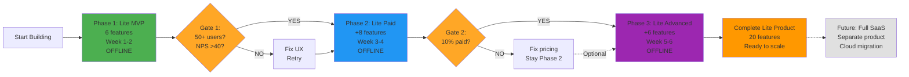

# Product Feature Prioritization Framework
**Web Dashboard Lite: 2-Phase MVP**

**Product Scope:** Web Dashboard Lite (Offline Electron app, Freemium model, Mikro segment)
**Not Covered:** Power BI Template, Full SaaS Platform (separate products)

**Problem Solved:** Not confident about which features to build → Need phased validation approach

**Philosophy:** Ship minimum viable features, validate engagement, THEN expand based on real usage data

---

## 3-Phase MVP: Lite Dashboard → Full SaaS Migration

### **Phase 1: Lite Foundation (Weeks 1-2) - 6 Features**
**Product:** Web Dashboard Lite (Offline Electron)
**Goal:** Prove basic engagement (50+ users check 3+ days/week)
**Build:** Essential infrastructure + 2 core features + UX essentials
**Validate:** Daily active usage, NPS >40

### **Phase 2: Lite Paid Expansion (Weeks 3-4) - +8 Features**
**Product:** Still Lite (Offline)
**Gate:** Only proceed if Phase 1 hits 50+ active users
**Build:** More analytics depth + polish features
**Validate:** 10%+ paid conversion (Free → Rp 200-350K/month)

### **Phase 3: Lite Advanced Features (Weeks 5-6) - +6 Features**
**Product:** Still Lite (Offline, advanced features)
**Gate:** Only proceed if Phase 2 hits 10%+ paid conversion
**Build:** Advanced analytics, data management, premium polish
**Validate:** 20%+ users upgrade to highest tier (Rp 350K/month)

**Total by Week 6:** 20 features = Complete mature Lite Dashboard product

**All 3 Phases = ONE Product:** Web Dashboard Lite (offline Electron app throughout)

**What about Full SaaS?** That's a separate product entirely. See "Future Products" section.

---

## Development Flow: 3-Phase Lite Dashboard



**All 3 Phases = Web Dashboard Lite (offline Electron app)**
**Full SaaS = Future, separate product (not in this framework)**

---

## Phase 1 MVP: Foundation (6 Features - Option B)

**Build Time:** 2 weeks (AI-coded)
**Validation Target:** 50+ users, 30% check 3+ days/week, NPS >40
**If Fails:** Fix UX/messaging, extend 2 weeks, retry

**Why 6 (not 7)?** Cut "Beautiful Empty States" - use plain text instead. Speed matters more than polish for MVP.

**Why 6 (not 4)?** Keep Staff Leaderboard - viral hook (staff share rankings), drives acquisition.

**Scope:**
1. Login/Security (offline auth)
2. CSV Import (simplified - manual format selection)
3. Smart Defaults (auto-set monthly target)
4. Revenue Dashboard (2 numbers: Today vs Target, MTD %)
5. Staff Leaderboard (rankings + badges)
6. 1-Screen Onboarding (prevent confusion)

---

## Scoring Methodology

### **Core Features Score:**
```
Score = (Pain Solved × Engagement × Viral Potential) ÷ Implementation Complexity

Pain Solved: 1-5 (How bad is the problem this solves?)
Engagement: 1-5 (Will they use it daily/weekly?)
Viral Potential: 1-5 (Will they show others? WOM factor)
Implementation: 1-5 (How hard to build/maintain?)
```

### **Supporting Features Score:**
```
Score = (UX Impact × Retention Value × Love Factor) ÷ Implementation Complexity

UX Impact: 1-5 (Does this reduce friction significantly?)
Retention Value: 1-5 (Does this prevent churn?)
Love Factor: 1-5 (Will they say "wow, they thought of everything"?)
Implementation: 1-5 (How hard to build?)
```

**Target Scores:**
- **80+:** MUST HAVE (Lite MVP)
- **50-79:** HIGH PRIORITY (Lite Paid)
- **30-49:** MEDIUM (Full SaaS Basic)
- **<30:** FUTURE (Pro/Advanced)

---

## Infrastructure Features: User & Data Management

**Critical Note:** These are NOT "nice-to-have" - they're foundational. Analytics features mean nothing if users can't get their data in or manage their team.

### **User Management Features**

#### **U1. User Profiles & Roles**
**Score: 95** (UX Impact: 5, Retention: 5, Love: 3, Complexity: 3)

**What:** Role-based access control
- **Owner:** Sees everything (revenue, costs, all outlets)
- **Manager:** Sees single outlet only
- **Staff:** Sees only personal performance card (not others' data)

**Why MVP:** Security, privacy, multi-user access (Owner + 2 managers = 3 licenses)

**Supporting Features:**
- Quick role switching ("View as Staff" mode for testing)
- Invite team members (email/phone invite with auto-setup)
- Beautiful user profile page (photo, name, role badge)

---

#### **U2. Onboarding New Users (Team Members)**
**Score: 88** (UX Impact: 4, Retention: 5, Love: 4, Complexity: 2)

**What:** Smooth team member onboarding
- Owner sends invite link (WhatsApp)
- New user opens link → Auto-setup account (no complex registration)
- Personalized welcome: "Hi Andi! Your manager added you. Here's your performance card."

**Why MVP:** Reduces friction (staff won't use if signup is complex)

**Supporting Features:**
- SMS/WhatsApp invite (not just email - Mikro segment doesn't check email)
- Skip password (use phone verification instead)
- Video tutorial for staff ("How to check your performance")

---

#### **U3. Permission Management (Who Sees What)**
**Score: 82** (UX Impact: 4, Retention: 4, Love: 3, Complexity: 3)

**What:** Granular privacy controls
- Hide salary data from staff (they see rank, not money)
- Hide costs from staff (revenue only)
- Manager can't see other outlets' data
- Export permissions (only Owner can export full data)

**Why MVP:** Privacy concerns (staff don't want salary public), legal compliance

---

### **Data Management Features**

#### **D1. Painless Data Import (CSV Upload)**
**Score: 98** (UX Impact: 5, Retention: 5, Love: 4, Complexity: 2)

**What:** Upload sales data in 3 clicks
- Drag-and-drop CSV file
- Auto-detect format (Moka, Pawoon, Qasir, Excel)
- Auto-clean data (remove duplicates, fix formatting)
- Preview before import ("5,234 transactions detected, looks good?")

**Why MVP:** #1 abandonment reason is "Can't import data". Must be frictionless.

**Supporting Features:**
- Error handling ("Row 45 has invalid date - skip or fix?")
- Sample CSV template (download example file)
- Import history (see all past imports, re-import if needed)

---

#### **D2. POS Integration Setup (1-Click Connect)**
**Score: 92** (UX Impact: 5, Retention: 5, Love: 5, Complexity: 4)

**What:** Connect to POS automatically
- Select POS provider (Moka/Pawoon/Qasir)
- Enter API key OR login with POS credentials
- Auto-sync daily (no manual CSV uploads)

**Why MVP:** Differentiation (competitors require manual CSV), sticky (auto-sync = habitual)

**Supporting Features:**
- Test connection ("Sync successful! 1,234 transactions imported")
- Sync frequency settings (Daily, Hourly, Real-time for Full SaaS)
- Conflict resolution (what if manual CSV + auto-sync both exist?)

---

#### **D3. Data Validation & Cleaning**
**Score: 85** (UX Impact: 4, Retention: 4, Love: 4, Complexity: 3)

**What:** Proactive data quality checks
- Detect outliers ("Transaction Rp 15M - is this correct? [Yes] [Fix]")
- Missing data alerts ("10 transactions have no staff assigned")
- Duplicate detection ("Same transaction imported twice - merge?")

**Why MVP:** Bad data = wrong insights = user loses trust

**Supporting Features:**
- Data quality score ("Your data quality: 92% - Good!")
- Fix suggestions ("Add staff names to improve performance tracking")

---

#### **D4. Data Backup & Export**
**Score: 78** (UX Impact: 3, Retention: 4, Love: 4, Complexity: 2)

**What:** Data portability & safety
- Auto-backup daily (cloud storage)
- Export anytime (CSV, Excel, PDF report)
- "Download all my data" (GDPR compliance, trust)

**Why MVP:** Trust factor ("What if app shuts down? I want my data back")

**Supporting Features:**
- Backup status visible ("Last backup: 2 hours ago")
- Scheduled exports (WhatsApp daily report as CSV attachment)

---

#### **D5. Data Security & Privacy**
**Score: 90** (UX Impact: 4, Retention: 5, Love: 4, Complexity: 3)

**What:** Trustworthy data handling
- Local encryption (SQLite encrypted)
- Cloud encryption (data at rest + in transit)
- Privacy policy (simple, Bahasa Indonesia)
- "Your data is NEVER sold or shared" (explicit promise)

**Why MVP:** Trust is everything. One data leak = business over.

**Supporting Features:**
- Visible security indicators (icon, "Encrypted" badge)
- Data retention settings ("Delete my data after 90 days of inactivity")

---

### **Infrastructure (3 features)**

#### **1. Login & Security (Offline-First Auth)**
**Score: 100** (Complexity: 2)

**What:** Device-level protection for offline Electron app

**Implementation Details:**

**A. First-Time Setup (Account Creation)**
- User opens app → "Create your PIN" screen
- 4-6 digit numeric PIN (easier than password on mobile)
- Confirm PIN (enter twice to prevent typos)
- Optional: Phone number for recovery (SMS verification)
- Store PIN hash locally (bcrypt, not plaintext)

**B. Daily Login Flow**
- App locks after 5 minutes inactive OR app close
- "Enter PIN" screen (numeric keypad)
- 3 failed attempts → 30-second cooldown
- 5 failed attempts → "Forgot PIN?" option

**C. Forgot PIN Recovery**
- Option 1: SMS code to registered phone
- Option 2: Security question ("What's your restaurant name?")
- Reset PIN after verification

**D. Data Encryption**
- SQLite database encrypted (SQLCipher or better-sqlite3-encryption)
- Encryption key derived from PIN (PBKDF2)
- Data unreadable without correct PIN

**E. Biometric Support (Optional Phase 2)**
- Face ID / Touch ID / Fingerprint (if device supports)
- Falls back to PIN if biometric fails

**Why Phase 1:** Cannot ship without. Legal requirement (data privacy), trust factor (business data security).

**Security Model:**
- **Threat:** Device lost/stolen → PIN prevents access
- **Threat:** Data breach → Encryption makes DB unreadable
- **NOT protecting against:** Server-side attacks (offline app, no server)

**Technical Stack:**
- Electron app: `electron-store` for encrypted settings
- PIN hashing: `bcrypt` (10 rounds)
- SQLite encryption: `@journeyapps/sqlcipher` or `better-sqlite3-multiple-ciphers`
- Recovery: Twilio SMS API (pay-per-use, Rp 1K per SMS)

**Known Limitations:**
- If user forgets PIN AND no phone registered → Data lost (acceptable for MVP, warn during setup)
- Encryption adds 10-15% performance overhead (acceptable)

**UX Spec:**
- PIN entry screen: Large numeric buttons (easy thumb typing)
- Show dots (••••) as user types
- Green checkmark animation on success
- Red shake animation on wrong PIN
- "Forgot PIN?" link always visible

**Testing Checklist:**
- [ ] PIN creation validates 4-6 digits
- [ ] Wrong PIN shows error, doesn't crash
- [ ] 5 failed attempts triggers cooldown
- [ ] Encrypted DB cannot be opened without PIN
- [ ] Recovery flow works (SMS sent, PIN reset)

---

#### **2. CSV Data Import**
**Score: 98** (UX Impact: 5, Retention: 5, Love: 4, Complexity: 2)

**What:** 3-click data upload
- Drag-and-drop CSV
- Auto-detect format (Moka/Pawoon/Qasir)
- Preview before import

**Why Phase 1:** #1 abandonment reason = "Can't import data"

---

#### **3. Smart Defaults (Zero Config)**
**Score: 90** (UX Impact: 5, Retention: 4, Love: 4, Complexity: 2)

**What:** Works immediately
- Auto-set monthly target (last month + 10%)
- Default alert thresholds
- Pre-configured metric displays

**Why Phase 1:** Reduces setup friction (90% accept defaults)

---

### **Core Analytics (2 features)**

#### **4. Revenue Health Dashboard**
**Score: 95** (Pain: 5, Engagement: 5, Viral: 3, Complexity: 2)

**What:** Single-screen profit check
- Today's Revenue (big number, vs target)
- MTD progress bar
- Gross Profit
- Food Cost % (Good/Warning/Danger)

**Why Phase 1:** Solves #1 pain ("Am I profitable?")

**Metrics:** Today's Revenue, MTD Target %, Gross Profit, Food Cost %

---

#### **5. Staff Leaderboard**
**Score: 92** (Pain: 4, Engagement: 5, Viral: 5, Complexity: 3)

**What:** Performance rankings
- Rank #1-10
- Performance Score composite
- Top 3 badges
- "Improved 2 positions!" indicator

**Why Phase 1:** High engagement, viral (staff share), creates competition

**Metrics:** Performance Score, Rank Position, Sales Per Hour

---

### **UX Essentials (1 feature)**

#### **6. First-Time Onboarding (1-Screen)**
**Score: 95** (UX Impact: 5, Retention: 5, Love: 5, Complexity: 2)

**What:** Single-screen explainer (not multi-step tour)
- "This shows if you're hitting your revenue target. Check it every morning."
- Large "Got it" button
- Never show again after first view

**Why Phase 1:** Prevents 80% abandonment (users confused on first open)

**Simplified from original:** Cut multi-step tour, just 1 screen. Faster to build.

---

**Note:** Empty States (illustrations, CTAs) moved to Phase 2. For MVP, use plain text:
- No data: "Upload CSV to see your dashboard"
- No staff: "Add team data to see leaderboard"

---

## Phase 1 Validation Gate (Week 2)

**Decision Criteria:**
- **50+ active users?** → Proceed to Phase 2
- **30%+ daily check rate?** → Engagement proven
- **NPS > 40?** → Users love it
- **Any metric fails?** → Fix before Phase 2

**If fails:** Don't build Phase 2. Fix UX/messaging, extend 2 weeks, retry.

---

## Phase 2: Paid Expansion (8 More Features)

**Build Time:** Weeks 3-4 (AI-coded)
**Validation Target:** 10%+ paid conversion (Free → Rp 200-350K/month)
**If Fails:** Fix pricing or simplify features before considering Full SaaS

**Still Lite Dashboard:** All features stay offline-first, Electron app. NOT cloud migration yet.

### **Core Analytics (+3 features)**

#### **8. Smart Alerts System**
**Score: 88** (Pain: 5, Engagement: 4, Viral: 4, Complexity: 3)

**What:** Proactive notifications
- "Revenue 15% below target"
- "3 staff late this week"
- "On track for monthly target!"

**Why Phase 2:** Creates daily habit

---

#### **9. Top/Bottom Sellers**
**Score: 75** (Pain: 5, Engagement: 3, Viral: 4, Complexity: 2)

**What:** Menu snapshot
- Top 5 sellers (revenue %)
- Bottom 5 (cut candidates)

**Why Phase 2:** Menu engineering need

---

#### **10. Week-over-Week Trend**
**Score: 65** (Pain: 4, Engagement: 3, Viral: 2, Complexity: 2)

**What:** Progress tracking
- 7-day line chart
- +12% or -8% indicator

**Why Phase 2:** Motivational

---

### **UX Polish (+5 features)**

#### **11. Contextual Tooltips**
**Score: 82** (UX Impact: 4, Retention: 4, Love: 4, Complexity: 2)

**What:** Explain metrics in-context
- Tap "?" icon → simple explanation
- Bahasa Indonesia

**Why Phase 2:** Educational

---

#### **12. Quick Actions**
**Score: 78** (UX Impact: 4, Retention: 3, Love: 4, Complexity: 2)

**What:** Shortcuts
- Floating "+" button
- Swipe gestures
- Long-press to share

**Why Phase 2:** Power user delight

---

#### **13. Mobile-First Refinements**
**Score: 88** (UX Impact: 5, Retention: 4, Love: 3, Complexity: 3)

**What:** Phone optimization
- One-handed nav
- Dark mode
- Offline-first

**Why Phase 2:** 95% mobile usage

---

#### **14. Micro-Animations**
**Score: 72** (UX Impact: 3, Retention: 3, Love: 5, Complexity: 2)

**What:** Celebratory moments
- Hit target → Confetti
- #1 staff → Crown animation

**Why Phase 2:** Emotional connection

---

#### **15. Export & Share**
**Score: 80** (UX Impact: 3, Retention: 3, Love: 5, Complexity: 2)

**What:** 1-tap screenshots
- Branded watermark
- WhatsApp-optimized

**Why Phase 2:** Viral growth

---

## Phase 2 Validation Gate (Week 4)

**Decision Criteria:**
- **10%+ paid conversion?** → Lite Dashboard validated, consider Full SaaS
- **Which 3-5 features used most?** → Data for future products
- **30%+ want "more features"?** → Demand for Full SaaS proven
- **<5% conversion?** → Fix pricing/value prop, stay on Lite

**If passes:** Web Dashboard Lite is complete. NOW decide: Scale Lite OR migrate to Full SaaS?

**If fails:** Iterate on Lite, don't rush to Full SaaS.

---

## Phase 3: Lite Advanced Features (6 More Features)

**Build Time:** Weeks 5-6 (AI-coded)
**Validation Target:** 20%+ upgrade to highest tier (Rp 350K/month Pro)
**If Fails:** Stick with Phases 1-2 (14 features is enough)

**Still Offline Lite:** All features remain in Electron app, local storage. NO cloud migration.

**Why Phase 3?** Premium features for power users willing to pay top tier.

### **Advanced Data Management (+3 features)**

#### **15. POS Auto-Sync (Local Network)**
**Score: 88** (UX Impact: 5, Retention: 5, Love: 4, Complexity: 3)

**What:** Automatic daily sync from POS (NOT cloud, local network)
- Detect POS on same WiFi network
- Auto-import CSV at midnight
- No manual upload needed

**Why Phase 3:** Nice-to-have, not critical for validation

---

#### **16. Data Backup & Export**
**Score: 82** (UX Impact: 3, Retention: 4, Love: 4, Complexity: 2)

**What:** Local backup + export options
- Auto-backup to USB/external drive
- Export to Excel/PDF
- "Download all my data" option

**Why Phase 3:** Trust factor for premium users

---

#### **17. Multi-Device Sync (Local Network)**
**Score: 75** (UX Impact: 4, Retention: 3, Love: 4, Complexity: 3)

**What:** Sync between phone + tablet (same WiFi)
- Owner's phone + Manager's tablet
- Local network sync (not cloud)

**Why Phase 3:** Premium feature, not MVP

---

### **Premium Analytics (+3 features)**

#### **18. Individual Staff Performance Card**
**Score: 85** (Pain: 4, Engagement: 5, Viral: 3, Complexity: 3)

**What:** Detailed 8-metric drill-through per staff
- Gap to Bonus tracker
- Coaching suggestions
- Weekly performance trend

**Why Phase 3:** Deep analytics for serious operators

---

#### **19. Customer Patronage Funnel**
**Score: 78** (Pain: 4, Engagement: 4, Viral: 3, Complexity: 3)

**What:** Customer lifecycle tracking
- First Timer → Returner → Regular → VIP
- Lapsed customer alerts
- CLV estimates

**Why Phase 3:** Advanced CRM feature

---

#### **20. Revenue Breakdown Waterfall**
**Score: 72** (Pain: 4, Engagement: 3, Viral: 4, Complexity: 3)

**What:** Visual revenue components
- Walk-in → +Reservations → +Upsells → -Discounts → Net
- Waterfall chart visualization

**Why Phase 3:** Premium visual analytics

---

## Phase 3 Validation Gate (Week 6)

**Decision Criteria:**
- **20%+ upgrade to top tier?** → Premium features validated
- **Users request "cloud sync"?** → Demand for Full SaaS proven
- **<10% upgrade?** → Phase 3 features not valuable, stick with Phase 2

**If passes:** Complete mature Lite product. NOW consider Full SaaS (separate product).

**If fails:** 14 features (Phase 1-2) is enough. Scale Lite horizontally (more users).

---

## Complete Lite Dashboard (All 3 Phases)

**Phase 1 (Week 1-2): 6 features**
1-6. Foundation (Login, Import, Defaults, Revenue, Leaderboard, Onboarding)

**Phase 2 (Week 3-4): +8 features**
7-14. Paid Expansion (Alerts, Sellers, Trends, Tooltips, Actions, Mobile, Animations, Export)

**Phase 3 (Week 5-6): +6 features**
15-20. Advanced (POS Sync, Backup, Multi-Device, Staff Cards, Customer Funnel, Waterfall)

**Total: 20 features = Complete mature Web Dashboard Lite**

---

## Future: Full SaaS Platform (Separate Product)

**ONLY build if:**
- Lite has 200+ paying users
- 40%+ request multi-outlet features
- Clear demand for cloud product

**What Full SaaS is:**
- **Different product** (not Lite Phase 4)
- Cloud web app (Next.js, Supabase)
- Multi-tenant architecture
- Rp 300K-500K/month (higher pricing)

**Features Full SaaS adds:**
- Multi-outlet support (2+ locations)
- Team collaboration (Owner + Managers + Staff roles)
- Real-time cloud sync (not local)
- Mobile web app (not Electron)

**Build timeline:** 8+ weeks (rebuild from scratch on cloud stack)

**See:** `docs/products/saas-platform-full/` for Full SaaS specs

---

**Last Updated:** December 25, 2025
**Status:** Lite Dashboard 3-phase framework complete
**Next Step:** Build Phase 1 (6 features, 2 weeks)
**Focus:** Validate Lite FIRST before considering Full SaaS


#### **16. User Roles & Permissions**
**Score: 95** (UX Impact: 5, Retention: 5, Love: 3, Complexity: 3)

**What:** RBAC
- Owner/Manager/Staff roles
- Privacy controls

**Why Phase 3:** Multi-user licensing

---

#### **17. Team Member Onboarding**
**Score: 88** (UX Impact: 4, Retention: 5, Love: 4, Complexity: 2)

**What:** WhatsApp invites
- Auto-setup accounts
- Personalized welcome

**Why Phase 3:** Team collaboration

---

#### **18. Granular Permissions**
**Score: 82** (UX Impact: 4, Retention: 4, Love: 3, Complexity: 3)

**What:** Who sees what
- Hide salary from staff
- Export permissions

**Why Phase 3:** Privacy compliance

---

### **Advanced Data Management (+3 features)**

#### **19. POS Integration (Auto-Sync)**
**Score: 92** (UX Impact: 5, Retention: 5, Love: 5, Complexity: 4)

**What:** 1-click POS connect
- Moka/Pawoon/Qasir
- Daily auto-sync

**Why Phase 3:** Differentiator, sticky

---

#### **20. Data Validation & Cleaning**
**Score: 85** (UX Impact: 4, Retention: 4, Love: 4, Complexity: 3)

**What:** Quality checks
- Outlier detection
- Duplicate merging

**Why Phase 3:** Trust (bad data kills trust)

---

#### **21. Cloud Backup & Export**
**Score: 78** (UX Impact: 3, Retention: 4, Love: 4, Complexity: 2)

**What:** Data portability
- Auto-backup daily
- Export anytime

**Why Phase 3:** Trust factor

---

## Phase 3 Validation Gate (Week 16)

**Decision Criteria:**
- **20+ Full SaaS customers?** → Scale (Pro/Advanced tiers)
- **30%+ Lite upgrade rate?** → Funnel working
- **Churn <20%?** → Product sticky
- **Any fails?** → Optimize Basic, don't build Pro yet

---

## Complete Feature Roadmap Summary

| Phase | Weeks | Features | Validation | Build If... |
|-------|-------|----------|------------|-------------|
| **Phase 1 MVP** | 1-2 | 6 features | 50+ users, NPS >40 | Always build first |
| **Phase 2** | 3-4 | +8 features | 10%+ paid conversion | Phase 1 passes |
| **Phase 3** | 5-8 | +6 features | 20+ SaaS customers | Phase 2 passes |
| **Total** | 8 weeks | 20 features | Full product | All gates pass |

**Reality Check:** Most products fail at Phase 1. Build minimum (6 features), validate ruthlessly.

**Speed Optimization:** With AI-coding, 8 weeks total vs traditional 16+ weeks.

---

## Next Immediate Action

**This Week:**
1. Review Phase 1 MVP (7 features) - Agree?
2. Interview 5-10 Pak Budi types - Would they use daily?
3. AI-code Phase 1 ONLY (don't build Phase 2 yet)

**Week 4 Decision:**
IF Phase 1 validates → Build Phase 2
IF NOT → Fix & retry

---

### **S1. First-Time Onboarding Tour**
**Score: 95** (UX Impact: 5, Retention: 5, Love: 5, Complexity: 2)

**What:** 3-step guided tour on first open
- Step 1: "This is your Revenue Health Dashboard - check it every morning"
- Step 2: "Tap any number to see details"
- Step 3: "Set up alerts so you never miss issues"

**Why MVP:** Reduces abandonment (80% never return if confused), shows we care

**Implementation:** Overlay tooltips with "Next" button, persist completion state

---

### **S2. Beautiful Empty States**
**Score: 85** (UX Impact: 4, Retention: 4, Love: 5, Complexity: 1)

**What:** Instead of "No data", show:
- " Upload your first sales data to see magic happen!"
- "Connect your POS in 2 minutes" (CTA button)
- Illustration (not just text)

**Why MVP:** First impression matters, reduces confusion, shows polish

**Examples:**
- No alerts yet: " You're doing great! No issues detected."
- No staff data: " Add your team to see performance leaderboard"

---

### **S3. Smart Defaults (Zero Configuration)**
**Score: 90** (UX Impact: 5, Retention: 4, Love: 4, Complexity: 2)

**What:** App works immediately, no setup required
- Auto-detect POS format (Moka, Pawoon, Qasir CSV)
- Default monthly target = last month's revenue + 10%
- Default metric thresholds (Revenue alert if -10%, Late if >3 staff)

**Why MVP:** Removes friction (90% of users accept defaults), "just works"

---

### **S4. Contextual Tooltips (Learn by Using)**
**Score: 82** (UX Impact: 4, Retention: 4, Love: 4, Complexity: 2)

**What:** Explain metrics in-context (tap "?" icon)
- "Food Cost %" → "Your ingredients cost ÷ revenue. Healthy range: 28-35%"
- "Performance Score" → "Combines sales, upsells, rating, punctuality. Higher = better"

**Why MVP:** Educational (users learn analytics), reduces support burden

**Implementation:** Tooltip component, Bahasa Indonesia language, simple explanations

---

### **S5. Quick Actions (1-Tap Common Tasks)**
**Score: 78** (UX Impact: 4, Retention: 3, Love: 4, Complexity: 2)

**What:** Shortcuts for frequent actions
- Floating "+" button: Upload sales data, Add staff, Set target
- Swipe gestures: Swipe left on staff → "View performance card"
- Long-press: Long-press metric → "Share screenshot"

**Why MVP:** Power users love shortcuts, feels premium

---

### **S6. Mobile-First Design (Built for Phone)**
**Score: 88** (UX Impact: 5, Retention: 4, Love: 3, Complexity: 3)

**What:** Optimized for on-the-go checks
- One-handed use (nav bar at bottom)
- Large tap targets (48px minimum)
- Dark mode (for night shifts)
- Works offline (SQLite local storage)

**Why MVP:** 95% of Mikro users check analytics on phone, not desktop

---

### **S7. Celebratory Micro-Animations**
**Score: 72** (UX Impact: 3, Retention: 3, Love: 5, Complexity: 2)

**What:** Positive reinforcement
- Hit monthly target → Confetti animation + " Target smashed!"
- Staff reaches #1 → Crown animation + " New champion!"
- Revenue beats yesterday → Green pulse animation

**Why MVP:** Emotional connection, makes success feel good, shareable moments

---

### **S8. Export & Share (Social Proof)**
**Score: 80** (UX Impact: 3, Retention: 3, Love: 5, Complexity: 2)

**What:** 1-tap share beautiful screenshots
- "Share Revenue Health" → Auto-generates branded image (watermark: "Powered by [App Name]")
- "Export Weekly Report" → PDF with charts
- WhatsApp-optimized (vertical format, compressed)

**Why MVP:** Viral growth (owners share in F&B groups), free marketing

---

## Feature Dependency Mapping

### **Revenue Health Dashboard requires:**
**Core Metrics:** Today's Revenue, MTD Target %, Gross Profit, Food Cost %
**Supporting Features:** Smart defaults (auto-set target), Tooltip (explain Food Cost %), Beautiful empty state (no data yet)

### **Smart Alerts requires:**
**Core Metrics:** Revenue Gap, Late Count, Inventory Status, Target Pacing
**Supporting Features:** Alert customization settings, Push notifications, Quick actions (dismiss alert)

### **Leaderboard requires:**
**Core Metrics:** Performance Score, Sales Per Hour, Rank Position, Punctuality %
**Supporting Features:** Individual drill-through card, Celebratory animations (#1 achieved), Share screenshot

### **Top/Bottom Sellers requires:**
**Core Metrics:** Top 5 Sellers, Bottom 5 Sellers, Revenue Contribution %
**Supporting Features:** Drill-down (tap → full menu), Contextual tooltip (explain %)

### **Week-over-Week Trend requires:**
**Core Metrics:** Week-over-Week Revenue, Best Day
**Supporting Features:** Interactive chart (pinch-zoom), Contextual explanation ("Why down this week?")

---

## Lite MVP Feature List (Complete Build)

### **5 Core Features:**
1. Revenue Health Dashboard
2. Smart Alerts System
3. Top/Bottom Sellers
4. Staff Leaderboard
5. Week-over-Week Trend

### **8 Supporting Features:**
1. First-Time Onboarding Tour
2. Beautiful Empty States
3. Smart Defaults (Zero Config)
4. Contextual Tooltips
5. Quick Actions (Floating +, Swipe)
6. Mobile-First Design (Dark Mode, Offline)
7. Celebratory Micro-Animations
8. Export & Share

**Total:** 13 features (5 core + 8 supporting) = Polished, lovable MVP

---

## Lite Paid: Additional Features (Next Tier)

### **Core Features (+3):**

**6. Individual Staff Performance Card**
- 8-metric drill-through per staff
- Gap to Bonus tracker
- Coaching suggestions ("Improve punctuality to earn +Rp 500K bonus")
- **Score: 85** (Pain: 4, Engagement: 5, Viral: 3, Complexity: 3)

**7. Customer Patronage Funnel**
- First Timer → Returner → Regular → VIP (4-stage funnel)
- Lapsed VIP alerts ("5 VIPs haven't returned in 30 days")
- **Score: 78** (Pain: 4, Engagement: 4, Viral: 3, Complexity: 3)

**8. Revenue Breakdown Waterfall**
- Walk-in Sales → +Reservations → +Upsells → -Discounts → Net Revenue
- Visual waterfall chart
- **Score: 70** (Pain: 4, Engagement: 3, Viral: 4, Complexity: 3)

### **Supporting Features (+5):**

**S9. Advanced Filtering & Slicing**
- Filter by: Date range, Staff, Shift, Menu category
- "Compare this week vs last week"
- **Score: 75** (UX Impact: 4, Retention: 3, Love: 4, Complexity: 3)

**S10. Scheduled Reports (WhatsApp Delivery)**
- "Send me daily revenue summary every night at 10pm"
- Delivered directly to WhatsApp
- **Score: 80** (UX Impact: 3, Retention: 5, Love: 4, Complexity: 3)

**S11. Goal Setting & Tracking**
- Set custom targets per metric
- Progress bars with milestones
- "78% to monthly target - 5 days left!"
- **Score: 72** (UX Impact: 4, Retention: 4, Love: 3, Complexity: 2)

**S12. Multi-Device Sync (Cloud Backup)**
- Phone + Tablet + Desktop sync
- "Continue where you left off"
- **Score: 68** (UX Impact: 4, Retention: 4, Love: 3, Complexity: 4)

**S13. Customizable Dashboard (Drag-and-Drop)**
- Reorder widgets (prioritize what matters to YOU)
- Hide irrelevant metrics
- **Score: 65** (UX Impact: 3, Retention: 3, Love: 4, Complexity: 3)

---

## Full SaaS Basic: Multi-Outlet Features

### **Core Features (+2):**

**9. Multi-Outlet Comparison Dashboard**
- Side-by-side outlet performance
- "Jakarta outlet: +15% vs Bandung outlet: -8%"
- **Score: 90** (Pain: 5, Engagement: 5, Viral: 2, Complexity: 4)

**10. Consolidated Cross-Outlet Leaderboard**
- Staff rankings across ALL outlets
- "Andi (Jakarta) is #1 company-wide!"
- **Score: 85** (Pain: 4, Engagement: 5, Viral: 3, Complexity: 3)

### **Supporting Features (+3):**

**S14. Real-Time Sync (Not Daily Batch)**
- Live data (refresh every 5 minutes)
- "Revenue just updated: +Rp 150K"
- **Score: 75** (UX Impact: 3, Retention: 4, Love: 4, Complexity: 4)

**S15. Mobile App Notifications**
- Push alerts to phone (even when app closed)
- Customizable per outlet ("Alert me only for Jakarta")
- **Score: 78** (UX Impact: 4, Retention: 4, Love: 3, Complexity: 3)

**S16. Role-Based Access Control**
- Owner sees everything, Manager sees 1 outlet only
- "Share performance card with staff (hide salary data)"
- **Score: 70** (UX Impact: 4, Retention: 3, Love: 3, Complexity: 4)

---

## Feature Prioritization by Customer Love Impact

### **High Love Factor (85+):**
Features that make users say "Wow, they really care!"

1. **S2. Beautiful Empty States** (Love: 5)
2. **S7. Celebratory Micro-Animations** (Love: 5)
3. **S8. Export & Share** (Love: 5)
4. **S1. First-Time Onboarding Tour** (Love: 5)
5. **S3. Smart Defaults** (Love: 4)
6. **S4. Contextual Tooltips** (Love: 4)

**Build these FIRST in Sprint 1** - They create emotional connection

---

### **High Retention Value (80+):**
Features that prevent churn

1. **S3. Smart Defaults** (Retention: 4 - "just works")
2. **S1. Onboarding Tour** (Retention: 5 - prevents abandonment)
3. **S10. Scheduled Reports** (Retention: 5 - habit formation)
4. **S6. Mobile-First Design** (Retention: 4 - accessible anywhere)

**These are non-negotiable for MVP** - Without them, users churn

---

### **High Viral Potential (75+):**
Features that drive word-of-mouth

1. **Leaderboard** (Viral: 5 - staff share rankings)
2. **Smart Alerts** (Viral: 4 - "Look at this cool alert!")
3. **Top/Bottom Sellers** (Viral: 4 - owners share menu insights)
4. **S8. Export & Share** (Viral: watermarked screenshots)

**Build shareability into every feature** - Free marketing

---

## Implementation Sequence (Sprint 1 - Lite MVP)

### **Week 1: Core Features (Foundation)**
1. Revenue Health Dashboard
2. Top/Bottom Sellers
3. Week-over-Week Trend

### **Week 2: Core Features (Engagement)**
4. Staff Leaderboard
5. Smart Alerts System

### **Week 3: Supporting Features (Polish)**
6. S3. Smart Defaults (setup flow)
7. S2. Beautiful Empty States
8. S6. Mobile-First Design (responsive)

### **Week 4: Supporting Features (Love)**
9. S1. Onboarding Tour
10. S4. Contextual Tooltips
11. S7. Celebratory Animations
12. S8. Export & Share
13. S5. Quick Actions

**Philosophy:** Don't launch Week 1 foundation without Week 3-4 polish. Ship complete, polished experience.

---

## Customer Love Checklist (Every Feature)

Before marking any feature "done," verify:

- [ ] **Mobile-optimized?** (Tap targets 48px, one-handed use)
- [ ] **Empty state designed?** (Illustration + helpful CTA, not just "No data")
- [ ] **Tooltip/Help available?** (Explain in Bahasa, simple language)
- [ ] **Smart defaults set?** (Works without configuration)
- [ ] **Loading states graceful?** (Skeleton screens, not blank white)
- [ ] **Error messages helpful?** ("No internet. We'll sync when you're back online" vs "Error 500")
- [ ] **Success feedback clear?** (Animation, toast message, visual confirmation)
- [ ] **Accessible for low-literacy users?** (Icons + text, not text-only)
- [ ] **Works offline?** (Graceful degradation)
- [ ] **Fast (<2 sec load)?** (Optimize performance)

**If any checkbox is , feature is NOT done** - Polish is product.

---

## Validation Strategy: Measure Customer Love

### **Week 4 Metrics (After Lite MVP launch):**

**Engagement:**
- % users who complete onboarding tour (Target: >70%)
- Daily active users (Target: >50% check 3+ days/week)
- Feature usage: Which features opened most? (Expect: Leaderboard + Alerts)

**Love:**
- NPS Score after 7 days (Target: >40)
- Support tickets: How many "Confused/broken" vs "Feature request"?
- Share count: How many users exported/shared screenshots?

**Retention:**
- Day 7 retention (Target: >30%)
- Day 30 retention (Target: >20%)
- Churn reasons: Exit survey ("Why uninstalling?")

**If Love Metrics Fail:**
- NPS <30 → Interview users, find UX friction
- Day 7 retention <20% → Onboarding broken
- 0 shares → Export feature not discoverable OR not valuable

---

## Next Steps

### **This Week:**
1. **Review this framework** - Do you agree with Lite MVP features (5 core + 8 supporting)?
2. **User interviews** - Show mockups to 5-10 Pak Budi types, ask: "Would you use this daily?"
3. **AI-code Lite MVP** - Build all 13 features (not just 5 core)

### **Week 2-4:**
- Polish supporting features (don't ship without S1-S8)
- Internal testing (is onboarding clear? Empty states helpful?)
- Beta launch (50 users, collect NPS + feature requests)

---

## Summary: Showing Love Through Product

**Core Features solve pain** → Customers say "This is useful"
**Supporting Features show care** → Customers say "They really thought of everything"

**Our Promise:**
- Every empty state has an illustration
- Every metric has a tooltip
- Every success has a celebration
- Every error is helpful, not cryptic
- Every interaction is delightful

**This is how you compete with bigger, richer competitors** - Out-care them, out-polish them, out-love them.

---

## Related

- **[[products/03-web-dashboard-lite/03-web-dashboard-lite|Web Dashboard Lite]]** - Product overview
- **[[products/03-web-dashboard-lite/specifications/02-feature-specification|Feature Specification]]** - Detailed feature specs
- **[[products/03-web-dashboard-lite/specifications/05-pmf-validation-plan|PMF Validation Plan]]** - Validation gates
- **[[products/03-web-dashboard-lite/specifications/06-upgrade-triggers|Upgrade Triggers]]** - Free → Paid conversion strategy
- **[[products/03-web-dashboard-lite/marketing/10-validation-gtm-checklist|GTM Checklist]]** - Launch readiness

---

**Last Updated:** December 25, 2025
**Status:** Framework ready for validation
**Next Step:** User validation (show mockups, get feedback on 13 features)
**Philosophy:** Polish IS the product. Ship complete experiences, not half-baked features.

---

**Related Documents:**
- [[competitive-intel|Competitive Intel]]
- [[product-scope|Product Scope]]
