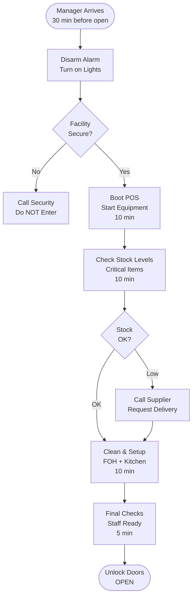
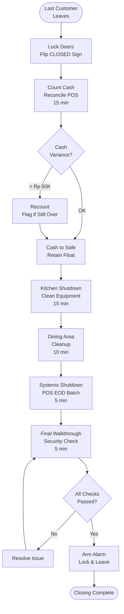

# Opening & Closing Checklist - SOP

**Owner:** Store Manager
**Frequency:** Daily (Opening & Closing)
**Approver:** Operations Manager
**Last Updated:** December 2025

---

## Purpose

Ensure consistent, safe, and efficient store opening and closing procedures to maintain operational excellence and security.

## Scope

**Applies to:** All store locations (coffee shops, restaurants)
**Roles:** Opening Manager, Closing Manager, Shift Leads

---

## Prerequisites

- [ ] Manager access keys/codes
- [ ] Opening/Closing checklist (digital or printed)
- [ ] Access to alarm system
- [ ] POS admin credentials

---

## Opening Procedure

### Timeline: 30 minutes before store opens

### Step 1: Facility Entry & Security (5 min)

**Who:** Opening Manager
**Actions:**
1. Disarm alarm system (code: stored in manager app)
2. Turn on all lights (main dining, kitchen, restrooms, storage)
3. Check for any signs of break-in or damage
4. If issue detected  ->  Call Security (24/7: 021-XXX-XXXX)  ->  Do NOT enter until cleared

### Step 2: Systems Activation (10 min)

**Who:** Opening Manager + 1 Staff
**Actions:**
1. **POS System:**
 - Boot up all POS terminals
 - Verify network connectivity
 - Login and verify till balance = Rp 0 (new day)
 - Load opening cash float: Rp 2 juta per register

2. **Kitchen Equipment:**
 - Coffee machines: Warm-up cycle (15 min)
 - Ovens: Preheat to operating temp
 - Refrigeration: Verify temps (3-5°C fridge, -18°C freezer)
 - If temp out of range  ->  Log in incident system  ->  Call maintenance

3. **Digital Systems:**
 - WiFi router check (customer + staff networks)
 - Digital menu boards
 - Kitchen display system (KDS)

### Step 3: Inventory Checks (10 min)

**Who:** Shift Lead
**Actions:**
1. Check critical stock levels:
 - Coffee beans: Min 10kg on hand
 - Milk: Min 20L
 - Essential ingredients per prep sheet
2. If below minimum  ->  Contact supplier immediately (morning delivery possible)
3. Check expiration dates:
 - Dairy products
 - Prepared items from previous day
 - Dispose of expired items per [[biz/departments/operations/quality-safety/04-waste-disposal|waste disposal SOP]]

### Step 4: Cleanliness & Setup (10 min)

**Who:** Opening Team (2-3 staff)
**Actions:**
1. **Front of House:**
 - Wipe down all tables and chairs
 - Sweep and mop floors
 - Clean windows and glass surfaces
 - Stock napkins, straws, condiments
 - Ensure restrooms are clean and stocked

2. **Service Area:**
 - Clean espresso machines (portafilters, steam wands)
 - Stock cups, lids, sleeves
 - Prepare syrups and toppings
 - Fill ice bins

3. **Kitchen:**
 - Sanitize prep surfaces
 - Set up mise en place
 - Prepare daily specials

### Step 5: Final Checks & Open (5 min)

**Who:** Opening Manager
**Checklist:**
- [ ] All equipment operational
- [ ] Staff in proper uniform and ready
- [ ] Menu boards updated (daily specials, sold-out items)
- [ ] Music/ambiance set
- [ ] Opening cash float verified
- [ ] Digital systems online
- [ ] Unlock front doors
- [ ] Flip "OPEN" sign

**Document:** Log opening time in POS system

---

## Closing Procedure

### Timeline: 30 minutes after last customer

### Step 1: Customer Exit & Secure Entry (5 min)

**Who:** Closing Manager
**Actions:**
1. Lock front doors at closing time (9 PM or specified time)
2. Flip "CLOSED" sign
3. Politely inform any remaining customers of closing time
4. Allow 15 min grace period for customers to finish

### Step 2: Cash Handling & Reconciliation (15 min)

**Who:** Closing Manager
**Actions:**
1. **Cash Register Close:**
 - Run end-of-day report on all POS terminals
 - Count cash in each till
 - Separate: Bills, coins, credit card slips
 - Complete [[04-daily-financial-reconciliation|daily reconciliation SOP]]

2. **Cash Drop:**
 - Subtract opening float (Rp 2 juta)
 - Place excess cash in drop safe
 - Record amount in drop log
 - Retain opening float for next day in register (locked)

3. **Reconciliation:**
 ```
 POS Reported Sales: Rp X
 Cash in Drawer: Rp Y
 Credit Card: Rp Z
 Total: Y + Z
 Variance: (Y + Z) - X

 Acceptable variance: ±Rp 50,000
 If > Rp 50,000  ->  Recount  ->  If still over  ->  Flag for manager review
 ```

### Step 3: Kitchen Shutdown (15 min)

**Who:** Kitchen Staff + Shift Lead
**Actions:**
1. **Equipment:**
 - Coffee machines: Backflush, clean group heads
 - Ovens: Cool down, wipe interior
 - Grills/fryers: Clean and cover
 - Refrigeration: Organize, discard waste, verify temps logged

2. **Food Storage:**
 - Label and date all prepared items
 - Store per FIFO (First In, First Out)
 - Cover all items properly
 - Complete [[products/templates/inventory-procurement/01-inventory-management|inventory management SOP]] for perishables

3. **Cleaning:**
 - Wash all dishes, utensils, equipment
 - Sanitize prep surfaces
 - Sweep and mop kitchen floor
 - Empty and clean grease traps
 - Take out all trash to dumpster

### Step 4: Dining Area Cleanup (10 min)

**Who:** Front of House Staff
**Actions:**
1. Clear all tables, wipe down
2. Stack chairs on tables (for floor cleaning)
3. Sweep all floors
4. Mop all floors (use proper signage)
5. Clean restrooms thoroughly
6. Restock for next day (napkins, condiments, etc.)
7. Check and empty all trash bins

### Step 5: Systems Shutdown (5 min)

**Who:** Closing Manager
**Actions:**
1. **POS System:**
 - Ensure EOD batch processed
 - Shut down terminals (leave main server on for overnight data sync)

2. **Digital Systems:**
 - Turn off menu boards
 - KDS system shutdown
 - Music/TV off

3. **Kitchen Equipment:**
 - Verify all cooking equipment OFF
 - Refrigeration: Keep running, verify lights off when doors closed
 - Gas lines: Verify closed (where applicable)

### Step 6: Security & Exit (5 min)

**Who:** Closing Manager
**Final Walkthrough Checklist:**
- [ ] All windows and doors locked (except exit door)
- [ ] All lights off (except security lights)
- [ ] All equipment off (except refrigeration)
- [ ] Cash secured in safe
- [ ] Trash removed to dumpster
- [ ] No staff/customers remaining
- [ ] Thermostat set to night mode
- [ ] Alarm system ready to arm

**Exit:**
1. Exit through designated door
2. Lock door from outside
3. Arm alarm system (60-second delay)
4. Verify door fully closed and locked
5. Document closing time in manager log (via mobile app)

---

## Process Flowchart

### Opening Flow



### Closing Flow



---

## Approval Chain

| Decision | Approver |
|----------|----------|
| Opening delay (> 15 min) | Operations Manager |
| Closing delay (> 30 min) | Operations Manager |
| Cash variance > Rp 100K | General Manager |
| Security incident | Security + GM (immediate) |

---

## Quality Checks

**Opening:**
- [ ] All equipment operational before opening
- [ ] Minimum stock levels met
- [ ] Cleanliness standards met (photo log)
- [ ] Opening time logged in POS

**Closing:**
- [ ] Cash reconciliation complete and documented
- [ ] All cleaning tasks verified (photo log)
- [ ] Security checklist 100% complete
- [ ] Closing time logged

---

## Escalation

**Opening Issues:**
- Equipment failure  ->  Maintenance: 0812-XXX-XXXX
- Security concern  ->  Security: 021-XXX-XXXX
- Staff shortage  ->  Operations Manager: [Slack @ops-manager]

**Closing Issues:**
- Cash variance  ->  Recount  ->  If unresolved  ->  GM notification
- Equipment won't shut down  ->  Maintenance (emergency)
- Security system failure  ->  Security company + GM

---

## Related Documents

- [[04-daily-financial-reconciliation|Daily Financial Reconciliation SOP]]
- [[products/templates/inventory-procurement/01-inventory-management|inventory management SOP]]
- [[biz/departments/operations/quality-safety/04-waste-disposal|waste disposal SOP]]
- [[products/templates/facilities/02-incident-reporting|Incident Reporting SOP]]

---

## Revision History

| Date | Version | Changes | Updated By |
|------|---------|---------|------------|
| 2025-12 | 1.0 | Initial SOP | Operations Team |

---

**Critical Reminder:** Never compromise security for speed. If something doesn't feel right during opening/closing, **STOP** and call management immediately.

