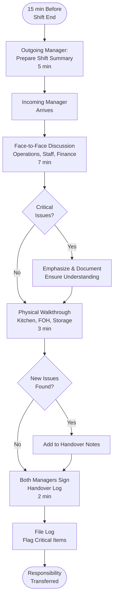

# Shift Handover Protocol - SOP

**Owner:** Shift Manager
**Frequency:** End of every shift
**Approver:** Store Manager
**Last Updated:** December 2025

---

## Purpose

Ensure seamless transition between shifts with complete information transfer regarding operations, issues, and pending tasks.

## Scope

**Applies to:** All shifts (morning, afternoon, evening)
**Roles:** Outgoing Shift Manager, Incoming Shift Manager

---

## Prerequisites

- [ ] Shift handover log (digital or paper)
- [ ] Access to POS reports
- [ ] Pending tasks list
- [ ] 15-minute overlap between shifts

---

## Handover Procedure (15 min)

### Step 1: Pre-Handover Preparation (5 min)

**Who:** Outgoing Manager
**Actions:**

1. **Complete Shift Summary:**
 ```
 Shift: Morning / Afternoon / Evening
 Date: __________
 Outgoing Manager: __________
 Incoming Manager: __________

 SHIFT PERFORMANCE:
 - Sales: Rp __________ (vs target Rp __________)
 - Transactions: ____ (vs target ____)
 - Labor hours: ____ hours
 - Staff on duty: ____ people
 ```

2. **Document Issues/Incidents:**
 - Equipment failures
 - Customer complaints
 - Staff issues
 - Stock-outs
 - Any deviations from standard

3. **List Pending Tasks:**
 - Orders placed (expected delivery times)
 - Maintenance requests submitted
 - Follow-ups needed
 - Incomplete deep-cleaning tasks

### Step 2: Face-to-Face Handover (7 min)

**Who:** Outgoing + Incoming Managers
**Location:** Manager office or quiet area

**Discussion Points:**

**A. Operations Status (2 min)**
```
Current Status:
[x] All equipment operational
[!] Ice machine running slow (maintenance called)
[x] WiFi intermittent (IT ticket #1234 submitted)

Staff Status:
[x] Full team present
[!] Barista Ahmad leaving early (family emergency)
[x] Server Siti called in sick

Inventory:
[x] Stock levels good
[!] Low on oat milk (supplier delivering tomorrow 10 AM)
[x] Out of cinnamon powder (emergency order placed)
```

**B. Critical Handoffs (2 min)**
```
IMMEDIATE ACTION REQUIRED:
1. VIP reservation at 3 PM (10 pax, birthday cake ordered)
2. Health inspector may visit today (random check)
3. Cash delivery from HQ arriving 2-3 PM (Rp 5M for change)

FOLLOW-UP NEEDED:
1. Customer complaint #789 - awaiting manager callback
2. Vendor invoice dispute (wrong quantity)
3. Staff John - performance conversation needed this week
```

**C. Financial Handoff (2 min)**
```
Till Status:
- Opening float: Rp 2,000,000
- Current cash: Rp 4,500,000 (counted at 1:50 PM)
- Large bills need breaking (many Rp 100K notes)

Pending Transactions:
- Card terminal batch NOT yet closed (will auto-close at 11 PM)
- 2 voided transactions (documented in POS)
- 1 refund processed (Rp 45K, customer receipt on file)
```

**D. Safety & Security (1 min)**
```
- No security incidents
- CCTV all operational
- Safe combination unchanged
- Keys accounted for
```

### Step 3: Physical Walkthrough (3 min)

**Who:** Both Managers
**Route:** Quick tour of premises

**Check Points:**
- [ ] Kitchen: Equipment status, cleanliness
- [ ] Front of house: Customer flow, staff positions
- [ ] Storage: Any visible issues
- [ ] Restrooms: Cleanliness, supplies OK
- [ ] Back office: Safe locked, documents secure

**Flag anything unusual immediately**

### Step 4: Sign Off & Document (2 min)

**Who:** Both Managers
**Actions:**

1. **Complete Handover Log:**
 ```
 HANDOVER COMPLETED:
 Date: __________ Time: __________

 Outgoing Manager Signature: __________
 Incoming Manager Signature: __________

 Outstanding Issues Count: ____
 Critical Items: ____ (list in notes)

 Incoming Manager Acknowledgment:
 [ ] I have received complete handover
 [ ] I understand all pending issues
 [ ] I accept responsibility for shift operations
 ```

2. **File Handover Log:**
 - Digital: Upload to shared drive
 - Physical: Place in binder
 - Flag critical items for Store Manager review

---

## Handover Flowchart



---

## Handover Checklist Template

```markdown
# SHIFT HANDOVER LOG

**Date:** __________
**Outgoing Shift:** Morning / Afternoon / Evening
**Outgoing Manager:** __________
**Incoming Manager:** __________
**Handover Time:** __________

## SHIFT SUMMARY
- Sales: Rp __________ (Target: Rp __________)
- Transactions: ____ (Target: ____)
- Staff Count: ____

## EQUIPMENT STATUS
- [ ] All operational
- [ ] Issues: _________________________________

## INVENTORY ALERTS
- [ ] All stock adequate
- [ ] Low stock items: _________________________________
- [ ] Pending deliveries: _________________________________

## PENDING TASKS
1. _________________________________
2. _________________________________
3. _________________________________

## CRITICAL ITEMS (Immediate Attention)
- [ ] None
- [ ] List: _________________________________

## INCIDENTS/ISSUES
- Customer complaints: ____
- Equipment failures: ____
- Staff issues: ____
- Details: _________________________________

## FINANCIAL HANDOFF
- Till count: Rp __________
- Voided transactions: ____
- Pending refunds: ____

## SIGNATURES
Outgoing Manager: __________ Time: ____
Incoming Manager: __________ Time: ____

[ ] Handover complete and accepted
```

---

## Best Practices

**DO:**
- [x] Start handover 15 min before shift end
- [x] Face-to-face discussion (not just notes)
- [x] Physical walkthrough every time
- [x] Highlight critical items clearly
- [x] Document everything in writing
- [x] Incoming manager asks questions

**DON'T:**
- [x] Rush handover (minimum 15 min)
- [x] Skip face-to-face (email/text only)
- [x] Assume incoming manager knows everything
- [x] Leave without incoming manager signature
- [x] Forget to highlight urgent items

---

## Approval Chain

| Issue | Response | Approver |
|-------|----------|----------|
| Incomplete handover | Outgoing manager stays until complete | Store Manager |
| Critical issue not communicated | Disciplinary action | Store Manager |
| Recurring handover problems | Process review | Operations Manager |

---

## Related Documents

- [[02-opening-closing-checklist|Opening & Closing Checklist SOP]]
- [[products/templates/facilities/02-incident-reporting|Incident Reporting SOP]]
- [[04-daily-financial-reconciliation|Daily Financial Reconciliation SOP]]

---

## Revision History

| Date | Version | Changes | Updated By |
|------|---------|---------|------------|
| 2025-12 | 1.0 | Initial SOP | Operations Team |

---

**Remember:** A good handover prevents problems. A bad handover creates chaos. Take the time to do it right!


---

**Related Documents:**
- [[products/templates/templates|Product Overview]] - Main product documentation


