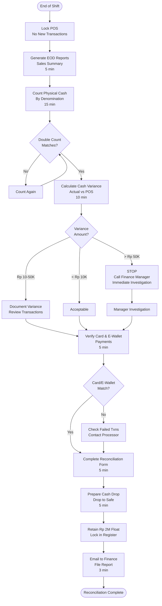

# Daily Financial Reconciliation - SOP

**Owner:** Store Manager / Shift Manager
**Frequency:** Daily (End of Shift/Day)
**Approver:** Finance Manager
**Last Updated:** December 2025

---

## Purpose

Ensure accurate daily financial reconciliation between POS systems, physical cash, and payment records to maintain financial integrity and identify discrepancies promptly.

## Scope

**Applies to:** All cash-handling locations
**Roles:** Shift Manager, Store Manager, Finance Team

---

## Prerequisites

- [ ] POS admin access
- [ ] Access to reconciliation template (Google Sheets/Excel)
- [ ] Calculator
- [ ] Cash counting area (secure, camera-monitored)
- [

] Bill/coin counter (if available)

---

## Procedure

### Step 1: Initialize Reconciliation (2 min)

**Who:** Shift/Store Manager
**When:** At shift end or closing time
**Actions:**
1. Lock POS system to prevent new transactions
2. Print End-of-Day (EOD) report from POS
3. Gather all payment records (cash, card receipts, e-wallet confirmations)
4. Move to secure counting area

### Step 2: Run POS Reports (5 min)

**Who:** Manager
**System Actions:**

Navigate to: **POS  ->  Reports  ->  End of Shift**

**Reports to Generate:**
1. **Sales Summary Report:**
 ```
 Total Sales: Rp XXX
 - Cash Sales: Rp XXX
 - Credit Card: Rp XXX
 - Debit Card: Rp XXX
 - E-Wallet (GoPay/OVO/Dana): Rp XXX
 - Vouchers/Discounts: -Rp XXX
 Net Sales: Rp XXX
 ```

2. **Transaction Count:**
 ```
 Total Transactions: XXX
 - Completed: XXX
 - Voided: XX
 - Refunded: X
 ```

3. **Payment Method Breakdown:**
 ```
 Cash: XX transactions, Rp XXX
 BCA Debit: XX transactions, Rp XXX
 Visa/Mastercard: XX transactions, Rp XXX
 GoPay: XX transactions, Rp XXX
 ```

**Save:** Export reports as PDF, email to finance@pwbi.co.id

### Step 3: Count Physical Cash (15 min)

**Who:** Manager + 1 Witness (for amounts > Rp 5 juta)
**Actions:**

1. **Separate Cash:**
 - Place all bills by denomination
 - Separate coins

2. **Count Systematically:**
 ```
 Rp 100,000 bills: ___ × Rp 100,000 = Rp ___
 Rp 50,000 bills: ___ × Rp 50,000 = Rp ___
 Rp 20,000 bills: ___ × Rp 20,000 = Rp ___
 Rp 10,000 bills: ___ × Rp 10,000 = Rp ___
 Rp 5,000 bills: ___ × Rp 5,000 = Rp ___
 Rp 2,000 bills: ___ × Rp 2,000 = Rp ___
 Rp 1,000 bills: ___ × Rp 1,000 = Rp ___
 Coins: = Rp ___

 TOTAL CASH IN DRAWER: Rp ___________
 ```

3. **Double Count:**
 - Count again to verify
 - If witness present, they count independently
 - Both sign count sheet if amounts match

### Step 4: Reconcile Cash (10 min)

**Who:** Manager
**Calculation:**

```
Opening Float: Rp 2,000,000 (standard)

Physical Cash Count: Rp _________
- Opening Float: - Rp 2,000,000
= Cash Sales (Actual): Rp _________

POS Reported Cash Sales: Rp _________
Actual Cash in Drawer: - Rp _________
= Cash Variance: Rp _________ (Over/Short)
```

**Variance Thresholds:**
- **Acceptable:** ±Rp 10,000 (counting errors, small change rounding)
- **Investigation Required:** Rp 10,001 - Rp 50,000
- **Critical:** > Rp 50,000 (immediate escalation)

**If Over/Short:**
1. Recount cash
2. Review voided transactions (potential input errors)
3. Check for unrecorded transactions
4. Document variance in reconciliation form

### Step 5: Verify Non-Cash Payments (5 min)

**Who:** Manager
**Actions:**

**Credit/Debit Cards:**
```
POS Reported Card Sales: Rp _________
Card Terminal Batch Total: Rp _________
Variance: Rp _________ (should be Rp 0)
```

**E-Wallet Payments:**
```
POS Reported E-Wallet: Rp _________
E-Wallet App Settlements:
 - GoPay: Rp _________
 - OVO: Rp _________
 - Dana: Rp _________
Total: Rp _________
Variance: Rp _________
```

**If Variance:**
- Check for failed transactions (customer side)
- Verify all transactions settled (not pending)
- Contact payment processor if unresolved

### Step 6: Complete Reconciliation Form (5 min)

**Who:** Manager
**Document:**

Use template: `Daily Reconciliation Form` (Google Sheet or paper)

**Required Fields:**
```
Date: __________
Location: __________
Shift: Morning / Afternoon / Evening / Full Day
Manager: __________

SALES SUMMARY:
Cash Sales (POS): Rp __________
Card Sales (POS): Rp __________
E-Wallet Sales (POS): Rp __________
Total Sales: Rp __________

CASH RECONCILIATION:
Physical Cash: Rp __________
Opening Float: - Rp 2,000,000
Cash Receipts: Rp __________
POS Cash Sales: Rp __________
Cash Variance: Rp __________ (Over/Short)

CARD RECONCILIATION:
POS Card Total: Rp __________
Terminal Batch: Rp __________
Card Variance: Rp __________

NOTES:
[Any issues, explanations for variances]

SIGNATURES:
Manager: __________ Date: ____ Time: ____
Witness (if applicable): __________ Date: ____
```

### Step 7: Cash Drop & Secure (5 min)

**Who:** Manager
**Actions:**

1. **Calculate Drop Amount:**
 ```
 Total Cash: Rp __________
 - Retain Float: - Rp 2,000,000
 = Drop Amount: Rp __________
 ```

2. **Prepare Drop:**
 - Place cash in deposit bag
 - Fill out deposit slip:
 - Date, Time, Amount, Manager Name
 - Seal bag (use tamper-evident seal)

3. **Secure Drop:**
 - Place in drop safe (time-delay safe)
 - Log in drop log book:
 ```
 Date | Time | Amount | Manager | Bag # | Seal #
 ```

4. **Retain Float:**
 - Keep Rp 2 juta in register (locked drawer)
 - Ensure denominations appropriate for next day:
 - Rp 50K bills: 10 (Rp 500K)
 - Rp 20K bills: 20 (Rp 400K)
 - Rp 10K bills: 40 (Rp 400K)
 - Rp 5K bills: 40 (Rp 200K)
 - Rp 2K bills: 100 (Rp 200K)
 - Coins: Rp 300K
 - Total: Rp 2M

### Step 8: Submit & File (3 min)

**Who:** Manager
**Actions:**

1. **Digital Submission:**
 - Email reconciliation form to finance@pwbi.co.id
 - Subject: "Daily Recon - [Location] - [Date]"
 - Attach: EOD reports (PDF), reconciliation form

2. **Physical Filing:**
 - File printed reports in binder (by date)
 - Retain for 3 months on-site
 - Archive with finance after 3 months

3. **Flag Issues:**
 - If variance > Rp 50K  ->  Slack message to @finance-team immediately
 - Include: Date, shift, variance amount, investigation notes

---

## Process Flowchart



---

## Approval Chain

| Variance Amount | Action | Approver |
|----------------|--------|----------|
| ±Rp 0-10,000 | Document, no approval needed | - |
| Rp 10,001-50,000 | Document + Explanation | Finance Manager (next day) |
| > Rp 50,000 | Immediate notification + Investigation | Finance Manager + GM (same day) |
| Repeated variances (3+ days) | Pattern investigation | Finance Manager + Audit |

---

## Quality Checks

- [ ] All POS reports generated and saved
- [ ] Cash counted twice (or with witness if > Rp 5M)
- [ ] Variance documented and explained
- [ ] Card/E-Wallet batches match POS
- [ ] Cash drop logged and secured
- [ ] Reports emailed to finance within 1 hour of shift end
- [ ] Physical reports filed

---

## Common Issues & Solutions

### Issue 1: Cash Short (POS > Physical)

**Possible Causes:**
- Cash given as change from large bills not recorded
- Voided transaction cash not returned to register
- Theft (investigate if repeated)

**Action:**
1. Review all voided transactions
2. Check security footage (if significant amount)
3. Interview shift staff (if needed)

### Issue 2: Cash Over (Physical > POS)

**Possible Causes:**
- Transaction not rung up (forgot to press "Complete Sale")
- Wrong amount entered in POS
- Customer overpayment not returned

**Action:**
1. Review transaction log for gaps
2. Check for manual corrections
3. Count again to verify

### Issue 3: Card Sales Don't Match

**Possible Causes:**
- Card declined but recorded in POS
- Settlement batch not closed
- Wrong terminal used

**Action:**
1. Check terminal for pending batch
2. Close batch if open
3. Review declined transaction log
4. Contact bank if unresolved

---

## Escalation

**Normal Hours (9 AM - 6 PM):**
- Finance Team: finance@pwbi.co.id
- Slack: #finance-daily-recon

**After Hours:**
- Critical variances (> Rp 100K): Call Finance Manager: 0812-XXX-XXXX
- Security incidents: Security + GM immediately

---

## Related Documents

- [[02-opening-closing-checklist|Opening & Closing Checklist SOP]]
- [[products/templates/training/pos-manual|POS\ User\ Manual]]
- [[products/templates/facilities/02-incident-reporting|Incident Reporting SOP]]

---

## Revision History

| Date | Version | Changes | Updated By |
|------|---------|---------|------------|
| 2025-12 | 1.0 | Initial SOP | Finance Team |

---

**Critical Reminder:** Never leave cash unsecured. Always have a witness for large amounts (> Rp 5 juta). If you suspect theft, preserve evidence and escalate immediately.

