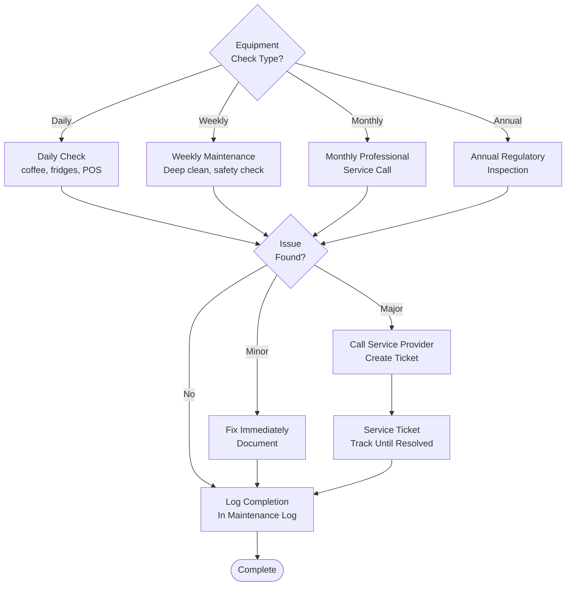

# Equipment Maintenance - SOP

**Owner:** Facilities Manager / Store Manager
**Frequency:** Per maintenance schedule
**Approver:** Operations Manager
**Last Updated:** December 2025

---

## Purpose

Ensure all equipment operates safely and efficiently through preventive maintenance, reducing downtime and extending equipment life.

## Scope

**Applies to:** All food service equipment
**Roles:** Maintenance Team, Store Staff

---

## Equipment Categories & Schedules

### Daily Checks (All Staff)

**Coffee Equipment:**
- Espresso machine: Backflush, wipe down
- Grinder: Empty hopper, brush clean
- Steam wands: Purge, wipe after each use

**Refrigeration:**
- Temperature check & log (3× daily)
- Check door seals
- Wipe exterior

**POS & Tech:**
- Check all terminals operational
- Clean screens

### Weekly Maintenance (Store Manager)

**Deep Cleaning:**
- Espresso machine: Group head deep clean
- Grinders: Disassemble, full clean
- Refrigerators: Interior wipe-down, check temps
- Ovens: Interior clean, check function

**Safety Checks:**
- Fire extinguishers: Pin in place, gauge OK
- First aid kit: Stocked, nothing expired
- Emergency exits: Clear, lights functional

### Monthly Preventive

**Professional Service:**
```
Equipment | Maintenance Task | Service Provider
---------|------------------|------------------
HVAC | Filter change, function check | AC Service Co.
Coffee Machines | Descale, calibrate | Supplier tech
 Refrigeration | Coil cleaning, temp calibration | Ref Tech
Fire Systems | Inspection, battery check | Fire Safety Co.
Grease Trap | Pump out | Waste Service
```

**Document:**
- Service date
- Work performed
- Next service due
- Technician name

### Annual Inspection

**Regulatory:**
- Fire suppression system (required)
- Gas lines (if applicable)
- Electrical safety
- Elevator/lift

**Certificate:**
- Keep current certificate displayed
- Schedule renewal 30 days before expiry

---

## Maintenance Flowchart



---

## Equipment Failure Response

**If Equipment Breaks During Service:**

1. **Assess Impact:**
 - Can operations continue without it?
 - Is there backup equipment?

2. **Immediate Action:**
 ```
 CRITICAL (affects operations):
 - Call emergency service immediately
 - Notify customers if delays
 - Use backup/workaround if available

 NON-CRITICAL:
 - Create service ticket
 - Schedule repair within 24-48 hours
 - Continue operations
 ```

3. **Document:**
 - What failed
 - When it failed
 - Impact on operations
 - Actions taken

---

## Quality Checks

- [ ] Daily checks completed and logged
- [ ] Weekly maintenance performed
- [ ] Monthly professional service on schedule
- [ ] Annual inspections current
- [ ] Equipment failures documented
- [ ] Service records filed

---

## Related Documents

- [[products/templates/daily-operations/02-opening-closing-checklist|Opening & Closing Checklist SOP]]
- [[02-incident-reporting|Incident Reporting SOP]]
- equipment-schedule.xlsx.md

---

## Revision History

| Date | Version | Changes | Updated By |
|------|---------|---------|------------|
| 2025-12 | 1.0 | Initial SOP | Facilities Team |


