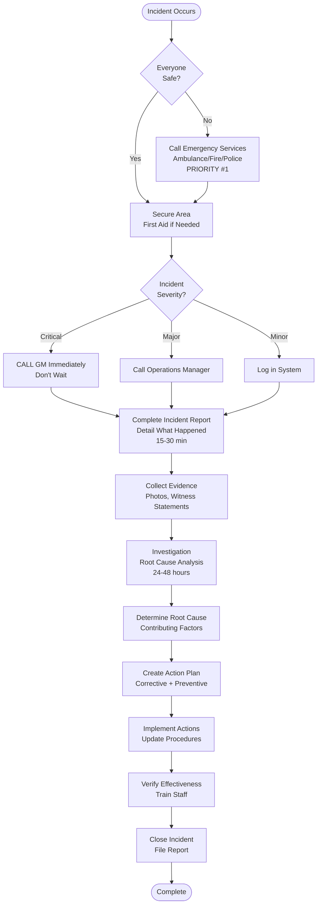

# Incident Reporting - SOP

**Owner:** Store Manager
**Frequency:** As needed (immediate)
**Approver:** Operations Manager
**Last Updated:** December 2025

---

## Purpose

Ensure all incidents are properly documented, investigated, and resolved to prevent recurrence and maintain safe operations.

## Scope

**Applies to:** All incident types
**Roles:** All staff

---

## Incident Categories

### 1. Safety Incidents
- Employee injury
- Customer injury
- Fire/emergency
- Security breach

### 2. Operational Incidents
- Equipment failure affecting operations
- Power outage
- Supply shortage causing closure
- Staff shortage (multiple call-outs)

### 3. Quality Incidents
- Food safety issue
- Customer illness report
- Product recall
- Contamination

### 4. Financial Incidents
- Cash shortage/overage > Rp 100K
- Theft (suspected or confirmed)
- Damage to property
- Payment system failure

### 5. Customer Service Incidents
- Complaint escalation
- Refund > Rp 200K
- Social media escalation
- Regulatory complaint

---

## Reporting Procedure

### Step 1: Immediate Response (0-5 min)

**Priority: Safety First**
1. Ensure everyone safe
2. Call emergency services if needed (ambulance, fire, police)
3. Secure area if necessary
4. Administer first aid if qualified

### Step 2: Notify Management (5-15 min)

**Who to Contact:**
```
CRITICAL INCIDENTS:
- Employee/customer injury
- Fire/emergency
- Theft
- Food safety issue
 ->  Call GM immediately: [Phone]

MAJOR INCIDENTS:
- Equipment failure
- Large customer complaint
- Cash variance > Rp 100K
 ->  Call Operations Manager: [Phone]

MINOR INCIDENTS:
- Small customer complaint
- Minor equipment issue
 ->  Log in system, review at EOD
```

### Step 3: Document (15-30 min)

**Complete Incident Report Form:**
```
INCIDENT REPORT

Date: __________ Time: __________
Location: __________
Reported By: __________

INCIDENT DETAILS:
Type: [Safety/Operational/Quality/Financial/Customer]
Severity: [Critical/Major/Minor]

Description (What happened?):
____________________________________

Immediate Actions Taken:
____________________________________

People Involved:
- Staff: __________
- Customers: __________
- Witnesses: __________

Impact:
- Injuries: Yes/No, Details: __________
- Financial: Rp __________
- Operations: Affected/Not Affected
- Reputation: High/Medium/Low Risk

Photos/Evidence: [Attach]
```

### Step 4: Investigation (24-48 hours)

**Who:** Store Manager + Operations Manager (for major incidents)

**Investigate:**
1. Interview witnesses
2. Review security footage
3. Examine physical evidence
4. Review relevant procedures/SOPs

**Determine:**
- Root cause
- Contributing factors
- Was SOP followed?
- Could it have been prevented?

### Step 5: Corrective Actions

**Create Action Plan:**
```
ROOT CAUSE: __________

CORRECTIVE ACTIONS:
1. Immediate: __________
2. Short-term (< 1 week): __________
3. Long-term (process change): __________

PREVENTIVE MEASURES:
1. __________
2. __________

RESPONSIBLE: __________
DEADLINE: __________
VERIFICATION: __________
```

### Step 6: Follow-Up & Close

- Implement corrective actions
- Verify effectiveness
- Update procedures if needed
- Train staff on changes
- Close incident report
- File for records

---

## Incident Reporting Flowchart



---

## Escalation Matrix

| Incident Type | Severity | Immediate Notification | Investigation Lead |
|---------------|----------|------------------------|-------------------|
| Employee injury | Any | GM + HR | GM + Safety Officer |
| Customer injury | Any | GM + Legal | GM |
| Food safety | Any | GM + Health Dept | Operations + QC |
| Theft > Rp 1M | Major | GM + Police | GM + Security |
| Customer complaint | Minor | Operations Mgr | Store Manager |
| Equipment failure | Critical | Operations Mgr | Facilities |
| Cash shortage > Rp 100K | Major | Finance + Operations | Finance Manager |

---

## Quality Checks

- [ ] Incident reported immediately (within 15 min of occurrence)
- [ ] Proper authority notified per severity
- [ ] Incident report completed fully
- [ ] Evidence collected (photos, statements)
- [ ] Investigation completed within 48 hours
- [ ] Corrective actions implemented
- [ ] Staff trained on changes
- [ ] Incident closed and filed

---

## Related Documents

- [[biz/departments/operations/quality-safety/01-food-safety-protocol|Food Safety Protocol SOP]]
- [[01-equipment-maintenance|Equipment Maintenance SOP]]
- [[biz/departments/operations/customer/02-customer-feedback-handling|Customer Feedback Handling Process]]

---

## Revision History

| Date | Version | Changes | Updated By |
|------|---------|---------|------------|
| 2025-12 | 1.0 | Initial SOP | Operations Team |

---

**Remember: Report all incidents, no matter how small. Patterns emerge from data. What seems minor today could prevent a major incident tomorrow.**

