# Inventory Management - SOP

**Owner:** Inventory Manager / Store Manager
**Frequency:** Daily (counts) + Weekly (full audit)
**Approver:** Operations Manager
**Last Updated:** December 2025

---

## Purpose

Maintain accurate inventory levels, minimize waste, optimize stock levels, and ensure FIFO (First In, First Out) practices for F&B operations.

## Scope

**Applies to:** All locations with inventory
**Roles:** Inventory Manager, Kitchen Staff, Receiving Staff

---

## Prerequisites

- [ ] Access to inventory management system (R2c COGS module if available)
- [ ] Inventory count sheets (digital or paper)
- [ ] Barcode scanner (optional but recommended)
- [ ] Understanding of product shelf life and storage requirements

---

## Daily Inventory Procedures

### Morning Inventory Check (15 min)

**Who:** Opening Manager / Kitchen Lead
**Actions:**

1. **Critical Items Check:**
 ```
 Coffee Beans: Current ___kg, Min 10kg
 Milk (Fresh): Current ___L, Min 20L
 Bread/Pastries: Current ___ units
 Key Proteins (if restaurant): Current stock
 ```

2. **Temperature Logs:**
 - Refrigerator: ___°C (Target: 3-5°C)
 - Freezer: ___°C (Target: -18°C or below)
 - If out of range  ->  Immediate action (see equipment maintenance SOP)

3. **Expiration Date Check:**
 - Scan all dairy products
 - Check prepared items from previous day
 - Mark items expiring today with color-coded stickers
 - Dispose of expired items per waste disposal SOP

### Prep & Usage Tracking (Throughout Day)

**Who:** Kitchen Staff
**Actions:**

1. **FIFO Practice:**
 - Always use oldest stock first
 - Date-label all opened items
 - Rotate stock when restocking

2. **Usage Recording:**
 - Log major ingredient usage in system
 - Note any waste or spoilage immediately
 - Flag low-stock items for reorder

### End-of-Day Count (20 min)

**Who:** Closing Manager
**Actions:**

1. **Critical Items Recount:**
 - Verify closing quantities vs. morning count
 - Calculate day's usage
 - Compare to sales (variance check)

2. **Prepare Tomorrow's Orders:**
 - Review next day's forecast
 - Calculate needed quantities
 - Submit orders to suppliers

---

## Weekly Full Inventory Audit

### Timing: Every Monday, 7-9 AM (Before Opening)

**Who:** Inventory Manager + 2 Staff Members
**Duration:** 2 hours

### Procedure

**Step 1: Preparation (15 min)**
1. Print inventory count sheets (by category)
2. Assign zones:
 - Person A: Dry Storage
 - Person B: Refrigerated
 - Person C: Freezer + Bar
3. Gather clipboards, pens, scanner (if used)

**Step 2: Physical Count (90 min)**

**Count Method:**
```
Category: Coffee Beans
Item: Ethiopian Single Origin
Unit: Kg
Physical Count: ___ bags × 1kg = ___ kg
System Count: ___ kg
Variance: ___ kg (±___%)
```

**Count by Category:**
1. **Dry Goods:**
 - Coffee beans (by variety)
 - Sugar, flour, rice
 - Canned goods
 - Disposables (cups, lids, napkins)

2. **Refrigerated:**
 - Dairy products
 - Fresh produce
 - Prepared sauces
 - Perishables

3. **Frozen:**
 - Frozen proteins
 - Ice cream/desserts
 - Backup stock

4. **Beverages:**
 - Syrups
 - Bottled drinks
 - Alcoholic beverages (if applicable)

5. **Packaging:**
 - To-go containers
 - Bags
 - Utensils

**Step 3: Variance Investigation (15 min)**

**Acceptable Variance:**
- Dry goods: ±2%
- Perishables: ±5% (due to waste/sampling)
- High-value items: ±1%

**If Variance > Threshold:**
-Recount the item
2. Check for:
 - Unreported waste
 - Theft
 - Receiving errors (not logged in system)
 - System data entry errors
3. Document investigation in variance log

**Step 4: System Update (10 min)**

1. Enter actual counts into system
2. System calculates variance
3. Adjust inventory to physical count
4. Generate variance report

**Step 5: Reorder Review (10 min)**

Calculate reorder quantities using formula:

```
Reorder Quantity =
 (Avg Daily Usage × Lead Time Days × Safety Factor)
 - Current Stock

Example:
Coffee Beans:
Avg Daily Usage: 5kg
Lead Time: 3 days
Safety Factor: 1.5 (50% buffer)
Current Stock: 12kg

Reorder = (5kg × 3 × 1.5) - 12kg = 22.5kg - 12kg = 10.5kg
Order: 11kg (round up)
```

---

## Inventory Flowchart

```mermaid
flowchart TD
 Start([Daily: Morning]) --> CheckCritical[Check Critical Items<br/>Coffee, Milk, Key Ingredients]
 CheckCritical --> LowStock{Below<br/>Minimum?}
 LowStock -->|Yes| EmergencyOrder[Emergency Order<br/>Contact Supplier]
 LowStock -->|No| TempCheck[Log Refrigerator/Freezer Temps]
 EmergencyOrder --> TempCheck
 TempCheck --> TempOK{Temps<br/>OK?}
 TempOK -->|No| FixTemp[Call Maintenance<br/>Move Stock if Needed]
 TempOK -->|Yes| ExpCheck[Check Expiration Dates]
 FixTemp --> ExpCheck
 ExpCheck --> Expired{Items<br/>Expiring?}
 Expired -->|Yes| MarkDispose[Mark/Dispose<br/>Per Waste SOP]
 Expired -->|No| DayOps
 MarkDispose --> DayOps[Day Operations<br/>FIFO Practice<br/>Log Usage]
 DayOps --> EOD[End of Day Count<br/>Critical Items]
 EOD --> PrepOrders[Calculate Tomorrow's Needs<br/>Submit Orders]
 PrepOrders --> WeeklyCheck{Is it<br/>Monday?}
 WeeklyCheck -->|Yes| FullAudit[Full Inventory Audit<br/>2 hours<br/>All Categories]
 WeeklyCheck -->|No| End
 FullAudit --> PhysCount[Physical Count<br/>All Items<br/>90 min]
 PhysCount --> Variance[Calculate Variance<br/>Actual vs System]
 Variance --> VarOK{Variance<br/>Acceptable?}
 VarOK -->|No| Investigate[Investigate & Document<br/>Recount if Major]
 VarOK -->|Yes| UpdateSys[Update System<br/>Adjust to Physical Count]
 Investigate --> UpdateSys
 UpdateSys --> Reorder[Calculate Reorder Quantities<br/>Submit POs]
 Reorder --> End([Complete])
```



---

## Par Levels by Category

**Critical Items (Check Daily):**

| Item | Unit | Min Level | Max Level | Reorder Point |
|------|------|-----------|-----------|---------------|
| Coffee Beans | kg | 10 | 50 | 15 |
| Fresh Milk | L | 20 | 100 | 30 |
| Sugar | kg | 5 | 25 | 8 |
| Cups (12oz) | pcs | 500 | 3000 | 800 |
| Lids | pcs | 500 | 3000 | 800 |

**Adjust based on:**
- Sales volume trends
- Upcoming events/promotions
- Supplier lead times
- Storage capacity

---

## Approval Chain

| Action | Approver |
|--------|----------|
| Emergency order (< 24h delivery) | Store Manager |
| Write-off (waste/expiry) < Rp 500K | Store Manager |
| Write-off > Rp 500K | Operations Manager |
| Inventory variance > 5% | Operations Manager + Finance |
| Change in par levels | Operations Manager |

---

## Quality Checks

**Daily:**
- [ ] Critical items at/above minimum levels
- [ ] Temperature logs completed and within range
- [ ] Expired items identified and disposed
- [ ] FIFO being practiced (spot check)

**Weekly:**
- [ ] Full physical count completed
- [ ] Variance < acceptable threshold or investigated
- [ ] System updated with actual counts
- [ ] Reorder points reviewed and adjusted if needed

---

## Common Issues & Solutions

**Issue 1: Persistent High Variance**
- **Cause:** Theft, poor logging, over-portioning
- **Solution:**
 - Camera review
 - Staff retraining on portion control
 - Implement spot audits (mid-week counts)

**Issue 2: Frequent Stock-Outs**
- **Cause:** Inaccurate forecasting, supplier delays
- **Solution:**
 - Increase safety stock levels
 - Add backup suppliers
 - Review historical usage patterns

**Issue 3: Excessive Waste**
- **Cause:** Over-ordering, poor FIFO, storage issues
- **Solution:**
 - Reduce order quantities
 - Retrain staff on FIFO
 - Improve labeling system

---

## Escalation

**Stock-Out (Critical Item):**
- Contact primary supplier
- If unavailable  ->  Contact backup supplier
- If still unavailable  ->  Notify customers, adjust menu

**Temperature Failure:**
- Move stock to backup refrigeration immediately
- Call maintenance: [Emergency Line]
- Document temperatures and action taken

**Major Variance (> 10% high-value items):**
- STOP and recount
- Review security footage
- Notify Operations Manager + Finance Manager
- Conduct investigation before continuing operations

---

## Related Documents

- [[biz/departments/operations/quality-safety/04-waste-disposal|Waste Disposal SOP]]
- [[03-procurement-process|Procurement Process SOP]]
- [[biz/departments/operations/quality-safety/05-receiving-inspection|Receiving & Inspection SOP]]
- fifo-training.mp4.md

---

## Revision History

| Date | Version | Changes | Updated By |
|------|---------|---------|------------|
| 2025-12 | 1.0 | Initial SOP | Operations Team |

---

**Pro Tip:** Good inventory management = higher profit margins. A 1% reduction in waste can add Rp 10-15 juta annually per location!


