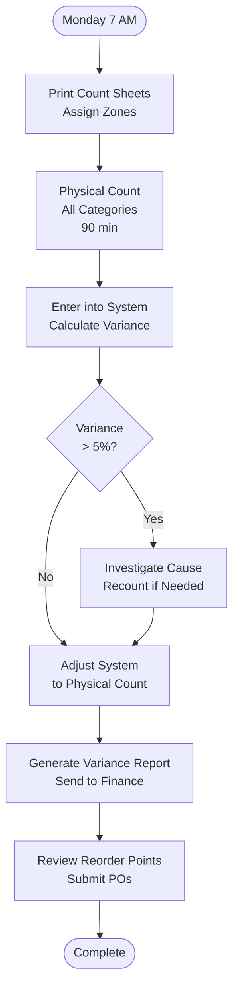

# Stock Taking Procedure - SOP

**Owner:** Inventory Manager
**Frequency:** Weekly full count, Monthly audit
**Approver:** Finance Manager
**Last Updated:** December 2025

---

## Purpose

Maintain accurate inventory records through systematic physical counts and reconciliation with system data.

## Scope

**Applies to:** All inventory locations
**Roles:** Inventory Team, Store Managers

---

## Weekly Stock Take (Every Monday, 2 hours)

### Procedure

**Step 1: Preparation**
- Print count sheets by category
- Assign zones to counters
- Brief team on count procedures

**Step 2: Physical Count**
Count all items systematically:
```
Category: __________
Item: __________
Unit: __________
Physical Count: ____ units
System Count: ____ units
Variance: ____ units (____%)
```

**Step 3: Reconciliation**
- Enter counts into system
- Investigate variances > 5%
- Adjust system to actual count
- Generate variance report

**Step 4: Reorder Review**
- Check items below reorder point
- Calculate required quantities
- Submit purchase requests

---

## Monthly Full Audit

**Additional Steps:**
- Full valuation (quantity × unit cost)
- Spot-check expiry dates
- Verify storage conditions
- Review slow-moving items (> 60 days)

---

## Flowchart



---

## Quality Checks

- [ ] All categories counted
- [ ] Variances documented and explained
- [ ] System updated
- [ ] Variance report submitted to finance
- [ ] Reorders submitted

---

## Related Documents

- [[01-inventory-management|Inventory Management SOP]]
- [[03-procurement-process|Procurement Process SOP]]

---

## Revision History

| Date | Version | Changes | Updated By |
|------|---------|---------|------------|
| 2025-12 | 1.0 | Initial SOP | Operations Team |


---

**Related Documents:**
- [[products/templates/templates|Product Overview]] - Main product documentation

