# Procurement Process - SOP

**Owner:** Procurement Manager / Store Manager
**Frequency:** As needed (typically weekly)
**Approver:** Operations Manager
**Last Updated:** December 2025

---

## Purpose

Ensure systematic procurement of supplies with proper approvals, competitive pricing, quality standards, and timely delivery.

## Scope

**Applies to:** All procurement activities
**Roles:** Store Managers, Procurement Team, Finance

---

## Procurement Workflow

### Step 1: Identify Need (Daily/Weekly)

**Who:** Store Manager
**Triggers:**
- Inventory below reorder point
- New item needed for menu
- Scheduled recurring order
- Emergency stock-out

**Action:** Create requisition in system or fill procurement request form

### Step 2: Create Purchase Request (10 min)

**Required Information:**
```
PURCHASE REQUEST

Date: __________
Requested by: __________
Location: __________
Urgency: Routine / Urgent / Emergency

ITEMS:
Item | Quantity | Unit | Estimated Price | Total
____ | ________ | ____ | _______________ | _____

Total Estimated: Rp __________
Budget Code: __________
Justification: ___________________________

Requested Delivery Date: __________
```

### Step 3: Approval Chain (Varies by Amount)

| Amount | Approver 1 | Approver 2 | Approver 3 |
|--------|-----------|------------|------------|
| < Rp 1M | Store Manager | - | - |
| Rp 1-5M | Store Manager | Operations Manager | - |
| Rp 5-20M | Store Manager | Operations Manager | Finance Manager |
| > Rp 20M | Store Manager | Operations Manager | GM + Finance Manager |

**Emergency Override:** GM can approve any amount for true emergencies

### Step 4: Vendor Selection (30 min - 2 days)

**Routine Orders (< Rp 5M):**
- Use preferred vendor list
- No quotes needed if price unchanged

**New/Large Orders (>= Rp 5M):**
1. Request quotes from 3 vendors minimum
2. Compare:
 - Price
 - Quality
 - Delivery time
 - Payment terms
 - Track record
3. Document vendor comparison
4. Select best value (not always lowest price)

### Step 5: Issue Purchase Order (15 min)

**Who:** Procurement Team
**Actions:**

1. **Generate PO:**
 ```
 PURCHASE ORDER #XXXX

 To: [Vendor Name]
 Contact: [Name, Phone, Email]
 Delivery Address: [Location]

 PO Date: __________
 Delivery Required: __________
 Payment Terms: Net 30 / Net 15 / COD

 ITEMS:
 Line | Item | Description | Qty | Unit Price | Total
 ____ | ____ | ___________ | ___ | __________ | _____

 Subtotal: Rp __________
 PPN (11%): Rp __________
 TOTAL: Rp __________

 Special Instructions: ______________________

 Authorized by: __________ Date: ____
 ```

2. **Send PO:**
 - Email to vendor
 - CC: receiving team, finance
 - Request confirmation

3. **Log in System:**
 - PO number
 - Expected delivery date
 - Notify receiving team

### Step 6: Track & Follow Up

**Who:** Procurement Team
**Frequency:** Daily

**Actions:**
- Check PO status dashboard
- Follow up 1 day before delivery
- If late  ->  Contact vendor  ->  Escalate if needed
- Update delivery date in system

---

## Procurement Flowchart

```mermaid
flowchart TD
 Start([Need Identified<br/>Stock Low/New Item]) --> Request[Create Purchase Request<br/>Fill Form/System]
 Request --> Amount{Request<br/>Amount?}
 Amount -->|<Rp 1M| SM[Store Manager<br/>Approval]
 Amount -->|Rp 1-5M| SM2[Store Manager<br/>+Ops Manager]
 Amount -->|Rp 5-20M| SM3[Store Manager<br/>+Ops+Finance]
 Amount -->|>Rp 20M| GM[Store Manager<br/>+Ops+Finance+GM]
 SM --> Approved{Approved?}
 SM2 --> Approved
 SM3 --> Approved
 GM --> Approved
 Approved -->|No| Revise[Revise Request<br/>or Cancel]
 Approved -->|Yes| VendorSel{Order<br/>Size?}
 VendorSel -->|<Rp 5M| UsePreferred[Use Preferred Vendor<br/>No Quotes Needed]
 VendorSel -->|≥Rp 5M| GetQuotes[Request Quotes<br/>Min 3 Vendors]
 GetQuotes --> Compare[Compare Quotes<br/>Price, Quality, Time]
 Compare --> Select[Select Best Value Vendor]
 UsePreferred --> PO
 Select --> PO[Generate Purchase Order<br/>With All Details]
 PO --> Send[Send PO to Vendor<br/>CC Finance & Receiving]
 Send --> Confirm{Vendor<br/>Confirms?}
 Confirm -->|No| Followup[Follow Up<br/>Clarify/Resolve]
 Confirm -->|Yes| Log[Log in System<br/>Set Delivery Alert]
 Followup --> Log
 Log --> Track[Track Delivery<br/>Follow Up if Late]
 Track --> End([Receive & Inspect<br/>See Receiving SOP])
```



---

## Vendor Management

### Preferred Vendor List

Maintain approved vendor list with:
- Vendor name & contact
- Products supplied
- Pricing (last 3 purchases)
- Quality rating (1-5 stars)
- Delivery reliability
- Payment terms

**Review quarterly:**
- Performance evaluation
- Price competitiveness
- Add/remove vendors

### New Vendor Onboarding

See: [[04-vendor-onboarding|Vendor Onboarding SOP]]

---

## Emergency Procurement

**Definition:** Critical need within 24 hours (stock-out affecting operations)

**Procedure:**
1. Verbal approval from GM (document later)
2. Contact vendors immediately
3. Accept best available option (may pay premium)
4. Expedited delivery
5. Backfill paperwork within 24 hours

**Common Emergencies:**
- Equipment breakdown (need parts)
- Supplier failed to deliver
- Unexpected high demand
- Contamination/recall

---

## Quality Checks

- [ ] Purchase request complete and justified
- [ ] Approvals obtained per amount thresholds
- [ ] Competitive quotes for orders >= Rp 5M
- [ ] PO issued with all details
- [ ] Vendor confirmed delivery date
- [ ] Logged in procurement system
- [ ] Receiving team notified

---

## Related Documents

- [[04-vendor-onboarding|Vendor Onboarding SOP]]
- [[biz/departments/operations/quality-safety/05-receiving-inspection|Receiving & Inspection SOP]]
- [[biz/departments/finance/sops/03-invoice-processing|Invoice Processing SOP]]
- approved-vendors.xlsx.md

---

## Revision History

| Date | Version | Changes | Updated By |
|------|---------|---------|------------|
| 2025-12 | 1.0 | Initial SOP | Procurement Team |


