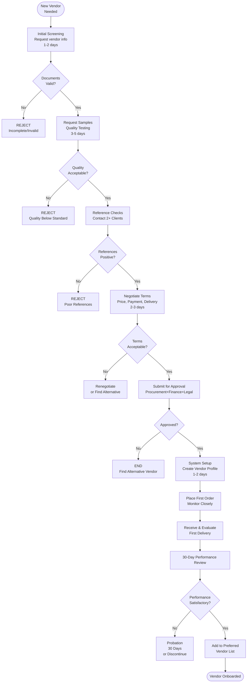

# Vendor Onboarding - SOP

**Owner:** Procurement Manager
**Frequency:** As needed (new vendors)
**Approver:** Operations Manager
**Last Updated:** December 2025

---

## Purpose

Establish standard process for vetting, approving, and onboarding new vendors to ensure quality, reliability, compliance, and favorable terms.

## Scope

**Applies to:** All new vendor relationships
**Roles:** Procurement Team, Finance, Legal

---

## Onboarding Process

### Phase 1: Initial Screening (1-2 days)

#### Step 1: Vendor Information Request

**Who:** Procurement Team
**Action:** Send vendor information form requesting:

```
VENDOR INFORMATION FORM

Company Details:
- Legal business name
- NPWP (Tax ID)
- Business registration number
- Address
- Years in business

Contact Information:
- Primary contact name & role
- Phone, email
- Emergency contact

Products/Services:
- What do you supply?
- Minimum order quantity
- Lead time (days from order to delivery)

References:
- 3 current clients (name, contact, relationship duration)

Certifications:
- Food safety (BPOM, Halal if applicable)
- Quality certifications (ISO, etc.)
- Insurance (product liability)
```

#### Step 2: Document Verification

**Who:** Procurement + Finance
**Checks:**
- [ ] NPWP valid (verify on DJP website)
- [ ] Business registration authentic
- [ ] Certifications current (not expired)
- [ ] Insurance coverage adequate

**Red Flags:**
- Recently established (< 1 year) require extra diligence
- No references provided
- Incomplete documentation
- Reluctance to share information

### Phase 2: Quality Assessment (3-5 days)

#### Step 3: Sample Request & Testing

**Who:** Procurement + QC Team
**Actions:**

1. **Request Samples:**
 - For food items: Request 3 sample units
 - For equipment/supplies: Request demo or trial period

2. **Quality Testing:**
 ```
 SAMPLE EVALUATION

 Product: __________
 Vendor: __________
 Sample Date: __________

 Visual Inspection:
 - Packaging: [ ] Excellent [ ] Good [ ] Acceptable [ ] Poor
 - Labeling: [ ] Clear [ ] Adequate [ ] Unclear
 - Appearance: [ ] Fresh [ ] Acceptable [ ] Questionable

 Testing:
 - Taste (if food): [ ] Excellent [ ] Good [ ] Acceptable [ ] Poor
 - Quality: [ ] Excellent [ ] Good [ ] Acceptable [ ] Poor
 - Consistency: [ ] Uniform [ ] Some variation [ ] Inconsistent

 Temperature (if applicable): ___°C (Required: __°C)

 Pass/Fail: [ ] PASS [ ] FAIL

 Notes: _______________________________
 ```

3. **Trial Order (Optional for High-Value):**
 - Place small trial order
 - Test delivery reliability
 - Verify invoicing accuracy

#### Step 4: Reference Checks

**Who:** Procurement Team
**Action:** Contact 2+ references

**Questions:**
- How long have you worked with this vendor?
- Quality of products/services? (1-5 scale)
- Delivery reliability? (on-time %)
- How do they handle issues/complaints?
- Would you recommend them?

**Document** responses

### Phase 3: Negotiation (2-3 days)

#### Step 5: Commercial Terms Discussion

**Who:** Procurement Manager
**Negotiate:**

1. **Pricing:**
 - Unit prices
 - Volume discounts
 - Price lock duration
 - Annual review terms

2. **Payment Terms:**
 ```
 Preferred: Net 30 days
 Acceptable: Net 15 days
 Avoid: COD (cash on delivery)

 Early payment discount: 2/10 Net 30
 (2% discount if paid within 10 days)
 ```

3. **Delivery:**
 - Lead time (order to delivery)
 - Minimum order quantity
 - Delivery schedule (weekly, bi-weekly)
 - Delivery charges

4. **Quality Guarantees:**
 - Return policy for defective items
 - Replacement timeline
 - Quality standards documentation

5. **Contract Duration:**
 - Initial term (typically 1 year)
 - Auto-renewal clause
 - Termination notice period (30/60/90 days)

### Phase 4: Approval & Setup (1-2 days)

#### Step 6: Internal Approval

**Approval Required From:**
- Procurement Manager: All vendors
- Finance Manager: Payment terms
- Legal (if applicable): Contracts > Rp 50M annually

**Submit Vendor Approval Packet:**
- Completed vendor information form
- Sample evaluation results
- Reference check notes
- Proposed commercial terms
- Recommendation (approve/reject)

#### Step 7: System Setup

**Who:** Procurement Team
**Once Approved:**

1. **Create Vendor Profile:**
 ```
 VENDOR MASTER DATA

 Vendor Code: V-XXXX (auto-generated)
 Legal Name: __________
 Trading Name: __________
 NPWP: __________

 Contact: __________
 Phone: __________
 Email: __________

 Payment Terms: Net __ days
 Bank Account: __________
 Bank Name: __________

 Product Categories: __________
 Lead Time: __ days
 Minimum Order: Rp __________

 Status: ACTIVE
 Effective Date: __________
 ```

2. **Set Up in Financial System:**
 - Vendor code
 - Bank details (for payments)
 - Payment terms
 - Tax information

3. **Communicate to Teams:**
 - Notify procurement team (new vendor available)
 - Notify receiving team (expect deliveries)
 - Notify finance (payment processing)

### Phase 5: First Order & Monitoring (30 days)

#### Step 8: Place First Order

**Who:** Procurement Team
**Special Attention:**

- Double-check all order details
- Confirm delivery date explicitly
- Request delivery confirmation
- Alert receiving team

#### Step 9: First Delivery Evaluation

**Who:** Receiving Team + Procurement
**Evaluate:**
- On-time delivery? (Y/N)
- Correct items/quantities? (Y/N)
- Quality as expected? (Y/N)
- Packaging adequate? (Y/N)
- Invoice accurate? (Y/N)

**Document** results  ->  Share with procurement

#### Step 10: 30-Day Review

**Who:** Procurement Manager
**After 1 Month:**

Review vendor performance:
```
VENDOR PERFORMANCE REVIEW (First 30 Days)

Vendor: __________
Review Date: __________

Deliveries: __ (total)
On-Time: __%
Quality Acceptance: __%
Invoice Accuracy: __%

Issues Encountered:
1. __________
2. __________

Resolution:
1. __________
2. __________

Continue/Discontinue: [ ] Continue [ ] Probation [ ] Discontinue

Next Review: __________ (90 days)
```

**Decision:**
- Continue: Add to preferred vendor list
- Probation: Monitor closely for another 30 days
- Discontinue: End relationship, find alternative

---

## Onboarding Flowchart



---

## Vendor Categories

**Critical Vendors: (Extra diligence)**
- Food suppliers (safety critical)
- Equipment suppliers (high value)
- Payment processors

**Standard Vendors:**
- Packaging supplies
- Cleaning supplies
- Office supplies

**Low-Risk Vendors:**
- Marketing materials
- Non-food items

---

## Quality Checks

- [ ] All vendor documents verified
- [ ] Quality samples tested and passed
- [ ] References checked (2+ positive)
- [ ] Commercial terms negotiated and documented
- [ ] Internal approvals obtained
- [ ] Vendor set up in all systems
- [ ] First order delivered successfully
- [ ] 30-day review completed

---

## Related Documents

- [[03-procurement-process|Procurement Process SOP]]
- [[biz/departments/operations/quality-safety/05-receiving-inspection|Receiving & Inspection SOP]]
- approved-vendors.xlsx.md
---

## Revision History

| Date | Version | Changes | Updated By |
|------|---------|---------|------------|
| 2025-12 | 1.0 | Initial SOP | Procurement Team |

---

**Remember:** vendor relationships are partnerships. Choose wisely, treat fairly, expect excellence!


