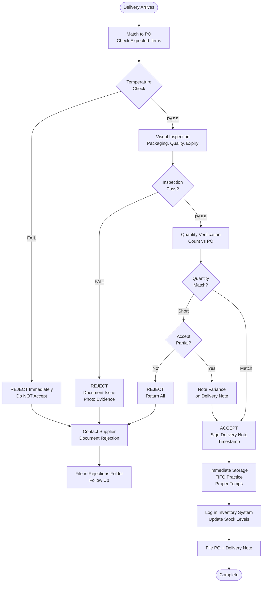

# Receiving & Inspection - SOP

**Owner:** Receiving Staff / Kitchen Lead
**Frequency:** Every delivery
**Approver:** Operations Manager
**Last Updated:** December 2025

---

## Purpose

Ensure all deliveries are properly inspected, meet quality standards, and accurately recorded before acceptance.

## Scope

**Applies to:** All incoming deliveries
**Roles:** Receiving Team, Kitchen Staff

---

## Receiving Procedure

### Step 1: Pre-Delivery Preparation (5 min)

**Who:** Receiving Staff
**When:** Daily AM, check expected deliveries

**Actions:**
- Review PO log for today's expected deliveries
- Prepare receiving area (clear space)
- Have inspection tools ready (thermometer, scale, clipboard)
- Print PO copies for reference

###Step 2: Delivery Arrival (2 min)

**Who:** Receiving Staff
**Actions:**

1. **Greet Driver:**
 - Request delivery note/invoice
 - Note delivery time
 - Ask driver to wait for inspection

2. **Match to PO:**
 ```
 Delivery Note #: __________
 PO #: __________
 Supplier: __________
 Expected Items: __ items
 ```

### Step 3: Temperature Check (CRITICAL - 2 min)

**Who:** Receiving Staff
**For ALL refrigerated/frozen items:**

```
TEMPERATURE LOG

Item: __________
Expected Temp: __°C
Actual Temp: __°C
Result: [ ] PASS [ ] FAIL

If FAIL  ->  REJECT immediately, do NOT proceed
```

**Thresholds:**
- Refrigerated: 3-5°C (REJECT if > 7°C)
- Frozen: -18°C or below (REJECT if > -15°C)

### Step 4: Visual Inspection (5-10 min)

**Who:** Receiving Staff + Kitchen Lead (for food items)

**Check Each Item:**

```
INSPECTION CHECKLIST

Packaging:
[ ] Intact (no tears, dents, leaks)
[ ] Labeled correctly
[ ] Batch/lot numbers visible

Product:
[ ] Correct item vs PO
[ ] No signs of damage/spoilage
[ ] Color/appearance acceptable
[ ] No unusual odors
[ ] Expiry date acceptable (min 7 days for perishables)

Quantity:
Count: ____ units
PO Quantity: ____ units
Variance: ____ units
```

**Reject Criteria:**
- [x] Temperature out of range
- [x] Damaged packaging
- [x] Wrong expiry date (< 7 days remaining)
- [x] Signs of spoilage
- [x] Wrong items
- [x] Significant quantity variance (>5%)

### Step 5: Quantity Verification (5 min)

**Who:** Receiving Staff
**Actions:**

1. **Count Carefully:**
 - Cases: Open random sample (inspect inside)
 - Bulk items: Weigh if applicable
 - Individual items: Count each

2. **Document Variance:**
 ```
 If quantity ≠ PO:

 Ordered: ____ units
 Delivered: ____ units
 Variance: ____ units (____%)

 Action:
 [ ] Accept partial (note on delivery note)
 [ ] Reject (return to driver)
 [ ] Contact supplier for clarification
 ```

### Step 6: Accept or Reject Decision (2 min)

#### IF ALL CHECKS PASS: ACCEPT

**Actions:**
1. Sign delivery note
2. Note: "Received in good condition, [Qty] units"
3. Timestamp delivery note
4. Give copy to driver
5. Proceed to Step 7 (Storage)

#### IF ANY CHECK FAILS: REJECT

**Actions:**
1. **Do NOT sign delivery note**
2. Note on delivery note: "REJECTED - [Reason]"
 - Examples: "Temperature out of range: 10°C"
 - "Damaged packaging on 5 cases"
 - "Wrong expiry date"
3. Take photos of issue
4. Request driver to sign acknowledged rejection
5. Keep copy of delivery note for records
6. Contact supplier immediately
7. Document in rejection log

### Step 7: Storage & Recording (10 min)

**Who:** Receiving + Kitchen Staff
**Actions:**

1. **Immediate Storage:**
 ```
 FIFO Practice:
 - Date-label all items with production date
 - Place NEW stock BEHIND existing stock
 - Rotate older items to front
 ```

2. **Temperature Storage:**
 - Refrigerated items  ->  Fridge immediately (within 15 min)
 - Frozen items  ->  Freezer immediately
 - Dry goods  ->  Dry storage (cool, ventilated)

3. **System Entry:**
 - Log receipt in inventory system
 - Enter: Item, Quantity, Unit Cost, Total, Supplier, Date
 - Attach delivery note scan/photo
 - Update stock levels

4. **File Documents:**
 - PO + Delivery Note  ->  File together
 - If rejected  ->  Special "Rejections" file
 - Retention: 3 months

---

## Receiving Flowchart



---

## Rejection Log Template

```markdown
# DELIVERY REJECTION LOG

**Date:** __________
**Supplier:** __________
**Delivery Note #:** __________
**PO #:** __________

**Rejection Reason:**
[ ] Temperature out of range: ___°C (Required: ___°C)
[ ] Damaged packaging
[ ] Wrong/expired items
[ ] Quantity short
[ ] Quality below standard
[ ] Other: __________

**Items Rejected:**
| Item | Ordered Qty | Delivered Qty | Issue |
|------|-------------|---------------|-------|
| ____ | ___________ | _____________ | _____ |

**Photos Attached:** [ ] Yes [ ] No

**Supplier Notified:**
- Date/Time: __________
- Contact Person: __________
- Response: __________

**Resolution:**
[ ] Replacement delivery scheduled: __________
[ ] Credit issued
[ ] Partial acceptance
[ ] Order cancelled

**Authorized By:** __________ **Date:** ____
```

---

## Quality Checks

- [ ] All expected deliveries received or accounted for
- [ ] Temperature checks completed for all refrigerated/frozen
- [ ] Visual inspection performed
- [ ] Quantities verified and documented
- [ ] Accepted items stored properly (FIFO)
- [ ] System updated with receipt
- [ ] Delivery notes filed
- [ ] Rejections logged and supplier notified

---

## Related Documents

- [[03-procurement-process|Procurement Process SOP]]
- [[04-vendor-onboarding|Vendor Onboarding SOP]]
- [[01-inventory-management|Inventory Management SOP]]
- [[biz/departments/operations/quality-safety/01-food-safety-protocol|Food Safety Protocol SOP]]

---

## Revision History

| Date | Version | Changes | Updated By |
|------|---------|---------|------------|
| 2025-12 | 1.0 | Initial SOP | Operations Team |

---

**Golden Rule:** When in doubt, REJECT. It's easier to request a replacement than to serve unsafe or substandard products.


---

**Related Documents:**
- [[products/templates/templates|Product Overview]] - Main product documentation


