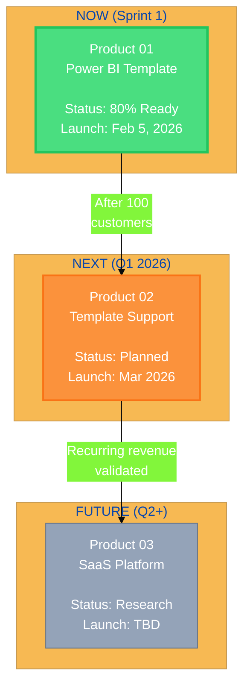

# Product Requirement Document (PRD): Vault UX Enhancements

**Product:** Clario Vault - Interactive Experience Layer
**Type:** Internal (UX Enhancement)
**Status:** APPROVED
**Parent:** Vault Overview PRD
**Purpose:** Make Vault magnetic and engaging for Operations Partner onboarding

---

## 1. Executive Summary

This PRD defines the **interactive and visual enhancements** that transform Vault from a documentation portal into an **engaging discovery experience**.

**Goal:** Partner opens Vault → Feels **excited** to explore → Understands the vision **without** you explaining.

**Key Principle:** "Show, don't tell. Guide, don't dump."

---

## 2. The Problem

### 2.1 Current State (Boring)
- **Vault Dashboard:** Generic "Welcome back" with recent items list
- **Biz Lab:** Wall of markdown text in Nextra sidebar
- **Products Lab:** Technical playground (intimidating for non-devs)
- **Partner Experience:** "Here's 100 docs, please read everything"

### 2.2 Partner's Perspective
**What they see:**
- Overwhelming amount of content
- No clear starting point
- Unclear what's important vs nice-to-know
- No sense of progress or achievement

**What we want them to feel:**
- "This is **impressive** - I can see the vision"
- "I know exactly where to start"
- "I'm making progress, I'm learning"
- "This team is **organized** and **professional**"

---

## 3. UX Enhancement Features

### 3.1 Mission Control Dashboard

**Purpose:** Visual command center showing company state, progress, and next actions

**Layout:**
```

 Clario Mission Control [Your Name] [@]


 Current Sprint: Sprint 1 - Power BI Template Launch
 Timeline: Week 0 (Pre-Launch) → Week 5 (Feb 5 Launch)
 [] 80% Complete


 Your Progress Recommended Hot
 Topics
 Strategy: 12/15 → GTM Strategy
 Product: 8/10 (15 min) • Pre-
 UI: 23 explored Sale
 → User Personas • Tier 2
 [View Details] (Critical!) • Week 0


 Recent Achievements:
 Strategy Explorer - Read all Market Analysis docs
 Product Visionary - Reviewed all Product 01 specs
 Deep Diver - Comment on 5+ docs (3/5 progress)

 Company Snapshot:
 • Products in Portfolio: 2 (1 active, 1 planned)
 • Target Customers: 50 in Sprint 1
 • Revenue Goal: Rp 200M Year 1
 • Team Size: 2 (You + Ops Partner)

```

**Key Features:**
- **Live Progress Bars** - Visual representation of completion
- **Smart Recommendations** - AI suggests what to read next based on:
 - What you haven't read
 - What's critical for current week
 - What's related to what you just read
- **Achievement System** - Gamified exploration milestones
- **Company Snapshot** - High-level context at a glance

### 3.2 Interactive Product Portfolio Map

**Purpose:** Visual journey through Clario's product strategy

**Implementation:** Mermaid diagram + click handlers

**Example Visualization:**


**Interactive Features:**
- **Click Product Box** → Opens product deep dive:
 - Strategy docs (with read/unread badges)
 - Specifications (with completion %)
 - Marketing materials
 - Financial projections
- **Hover** → Shows quick stats:
 - Target revenue
 - Customer count goal
 - Key metrics
- **Animated Transitions** → Smooth expand/collapse

### 3.3 Document Hover Previews

**Purpose:** Preview doc content before committing to full read

**Visual Design:**
```
Hovering over "05-gtm-strategy.md" in Biz Lab →


 Go-to-Market Strategy

 File Info:
 • 15 min read (4,200 words)
 • Last updated: Jan 5, 2026
 • Status: Reviewed

 Key Topics:
 • Week 0 Pre-Sale Validation
 • 3 Verbal Commits Target
 • Feb 5 Launch Timeline
 • Lead Generation Channels

 Quick Preview:
 "Sprint 1 GTM follows a 'Validate-First'
 philosophy. We secure commitments BEFORE
 building. Week 0 target: 3+ verbal..."

 Related Docs:
 → Sales Playbook
 → One-Pager Marketing

 [ Read Full Doc] [ Bookmark] [ Comment]

```

**Implementation:**
- Shadcn `Popover` component
- Content extracted from markdown frontmatter + first 200 chars
- Read status tracked in Clerk user metadata

### 3.4 "Why This Matters" Contextual Tooltips

**Purpose:** Explain the strategic importance of every doc/section

**Example:**
```
Reading: "02-cultural-context.md" - Section: "WhatsApp as Business OS"

[i icon with glowing pulse] ← Hover here

Tooltip appears:

 Why This Matters

 This isn't just cultural trivia.

 80% of our target customers use WhatsApp for
 ALL business communication. If we build
 email-first UX, we FAIL.

 This context directly shapes:
 • Product UX (WhatsApp CTAs everywhere)
 • Sales process (no cold emails, WhatsApp DMs)
 • Support channels (WhatsApp Business API)

 Related: Sales Playbook, Product Specs

```

**Placement:** Every major section heading in Biz Lab docs

### 3.5 Progress Tracking & Achievements

**Purpose:** Gamify exploration, give sense of accomplishment

**Achievement Categories:**

** Knowledge Achievements:**
- **Strategy Explorer** - Read all Market Analysis docs (5/5)
- **Product Visionary** - Reviewed all Product 01 specs (10/10)
- **Financial Guru** - Read all financial projections (0/3)

** Engagement Achievements:**
- **Deep Diver** - Comment on 5+ docs (3/5 progress)
- **Collaboration Champion** - Share 3+ insights with team

** Milestone Achievements:**
- **Week 0 Ready** - Complete all "Critical for Week 0" docs
- **Launch Ready** - Understand full Sprint 1 plan

**Visual Display:**
```

 Your Achievements (7/15 Unlocked)

 Strategy Explorer [Unlocked Jan 7]
 Product Visionary [Unlocked Jan 8]

 In Progress:
 Deep Diver [] 60%
 → Comment on 2 more docs to unlock!

 Locked:
 Week 0 Ready [] 0%
 → Read 8 more docs to start progress

```

### 3.6 Animated Customer Journey Flow

**Purpose:** Visualize the sales funnel with live stats

**Interactive Diagram:**
```

 Customer Journey - Sprint 1 Power BI Template

 [Cold Lead] > [Landing Page] > [WhatsApp]

 100 leads [Bounce] 40% [Qualified]
 (Week 3-4) ↓ ↓
 60 visitors 36 calls

 [Discovery]
 ↓
 18 demos

 [Convert]
 ↓
 10 sales
 (Target: 10)

```

**Interactive Features:**
- **Hover each node** → Shows detailed stats
 - "Landing Page: 60 visitors, avg time 2m 30s"
 - "WhatsApp DMs: 36 sent, 30 replied (83% response rate)"
- **Click node** → Deep link to relevant doc
 - Landing Page → `../03-web-dashboard-lite/marketing/01-one-pager.md`
 - Discovery Call → `sales/01-sales-playbook.md`
- **Animated Flow** → Numbers incrementanimating (simulated or real from Clerk metadata)

### 3.7 Knowledge Graph View (Notion-Inspired Floating Panels)

**Purpose:** Visual map of all Biz Lab documents with flexible, floating UI panels

**Core Paradigm:** Instead of split-panes, use **draggable floating panels** that overlay the graph (like Notion's flexible workspace).

---

#### Default View: Floating Note Panel

**Visual Design:**
```
┌─────────────────────────────────────────────────────┐
│  GRAPH (full background with force-directed nodes)  │
│                                                     │
│   ⚫ Market Research        ┌─────────────────┐    │
│    ╱│╲                      │ 📄 GTM Strategy │    │
│   ● ● ●   Cultural         │ ───────────────│    │
│                             │                 │    │
│        ┌─── Position ────┐  │ Sprint 1 GTM    │    │
│        │ ◀ [ L C● R ] ▶ │  │ follows a...    │    │
│        │    1/3 ━━▓━ 1/2│  │                 │    │
│        └────────────────┘  │ [Read Full 🔗]  │    │
│                             └─────────────────┘    │
│                              ↑ Draggable panel      │
└─────────────────────────────────────────────────────┘
```

**Panel Controls (Sticky Toolbar):**
- **Position Quick-Select**: `◀ [L] [C] [R] ▶`
  - **L**: Snap to left edge
  - **C**: Center on screen
  - **R**: Snap to right edge
- **Width Slider**: Adjusts from 1/3 to 1/2 of viewport width
- **Drag Handle**: Top bar to freely drag anywhere
- **Minimize Button**: Collapse to small "📄" icon in corner

**Click Node Behavior:**
- Click any node → Note panel opens with that doc
- Panel slides in from chosen position (smooth animation)
- Graph remains visible in background (slightly dimmed 20%)

---

#### Full-Window Mode: Graph + Floating Panels

**Visual Design:**
```
┌─────────────────────────────────────────────────────┐
│  GRAPH (full canvas, no dimming)                    │
│                                                     │
│  ┌──────┐                      ┌─────────────────┐ │
│  │ 📁   │    ⚫ Market         │ 📄 GTM Strategy │ │
│  │ Str. │     ╱│╲             │ ───────────────│ │
│  │ Prod │    ● ● ●            │ Sprint 1 GTM... │ │
│  │ Fin. │                      │                 │ │
│  └──────┘                      └─────────────────┘ │
│   ↑ Navbar                          ↑ Note Panel   │
│   (expands on hover)                                │
└─────────────────────────────────────────────────────┘
```

**Smart Panel Logic:**
- **If Note Panel on LEFT**: Navbar + Note combine into **one** floating panel
- **If Note Panel on CENTER/RIGHT**: Navbar stays as **separate** panel on left edge

**Toggle:** "Full Window" button in top-right toolbar

---

#### Dynamic Navbar (Hover Behavior)

**User Setting: Choose Navbar Mode**

**Expansion Modes:**

**Mode A: Full Expand (Notion-style)**
```
Collapsed (60px):             Hover (220px):
┌──────┐                     ┌───────────────────────┐
│ 📁   │                     │ 📁  Strategy         ● │
│ 💼   │  ──(hover)──>       │ 💼  Products           │
│ 💰   │                     │ 💰  Financial          │
└──────┘                     │ 🎯  Achievements    3/8│
                              └───────────────────────┘
```
- Entire "island" expands to show labels
- Smooth slide-out animation (300ms spring)
- Smart behaviors:
  - Delay: 150ms after hover (prevents accidental triggers)
  - Sticky hover: Panel stays open while cursor inside
  - Click lock: Clicking item keeps panel open for 1 second

**Mode B: Icon Animation Only**
```
Collapsed (60px):             Hover (60px):
┌──────┐                     ┌──────┐
│ 📁   │                     │ 📁💫 │ ← icon glows + scales 1.15x
│ 💼   │  ──(hover)──>       │ 💼   │
│ 💰   │                     │ 💰   │
└──────┘                     └──────┘
```
- Only icons pulse/glow on hover
- Navbar width stays constant
- Tooltip appears on hover (500ms delay)

---

**Positioning Modes:**

**Static (Always Visible)**
- Navbar permanently visible on screen edge
- Fixed position: `left: 16px` or `right: 16px`
- Never hides, always accessible
- Best for power users

**Appear-on-Hover (Auto-Hide)**
```
Hidden:                      Hover:
│ ▓ (4px edge strip)    →   ┌──────┐
│                            │ 📁   │
│                            │ 💼   │
```
- Navbar hides by default (only 4px orange strip visible)
- Slides in when cursor approaches edge (20px hotzone)
- Slide in delay: 200ms
- Slide out delay: 500ms
- Smooth spring animation

---

**Advanced Features:**

**Unread Badges:**
- Orange circle with count (max "9+")
- Bounces in when count increases
- Counts: Strategy docs, new experiments, unlockable achievements

**Recent Activity Indicator:**
- Orange dot if section visited in last 2 hours
- Fades out with 500ms transition

**Keyboard Shortcuts:**
- `Cmd/Ctrl + 1/2/3`: Jump to sections
- `Tab`: Cycle through items
- `Arrow Up/Down`: Navigate
- `Enter/Space`: Activate
- `Esc`: Close expanded panel

**Right-Click Context Menu:**
```
📁 Strategy
├─ 📍 Pin to Top
├─ 🔔 Watch for Updates
├─ 📊 View Analytics
└─ ⚙️ Section Settings
```

**Accessibility:**
- Full ARIA labels for screen readers
- High-contrast focus rings
- Keyboard navigation support
- Announces unread counts and active states

**User Customization:**
```
⚙️ Navbar Settings
├─ Expansion Mode: [Full Panel ▼] or [Icon Only]
├─ Position: [Left ▼] or [Right]
├─ Visibility: [Static ▼] or [Auto-Hide]
├─ Auto-collapse delay: [───▓──] 300-1000ms
└─ Auto-hide delay: [───▓──] 200-800ms
```

**Setting Location:** User profile → Preferences → "Navbar Behavior"

---

#### Node Styling

- **Color by Category**:
  - Strategy docs: `#3b82f6` (Blue)
  - Product docs: `#f97316` (Orange)
  - Financial docs: `#10b981` (Green)
- **Size by Importance**:
  - High connections = Larger node
  - Low connections = Smaller node
- **Current Doc**: Highlighted with orange glow ring
- **Unread Docs**: Subtle pulsing animation

---

#### Technical Implementation

**Libraries:**
- `react-force-graph-2d`: Graph rendering (Canvas)
- `framer-motion`: Smooth panel animations & transitions
- `react-draggable`: Draggable panel functionality

**Component Architecture:**
```tsx
<GraphCanvas>
  {/* Background */}
  <ForceGraph2D graphData={data} />
  
  {/* Floating Overlays */}
  <FloatingNotePanel 
    position="center" // L | C | R
    width={0.4} // 0.33 - 0.5
    isDraggable
  />
  
  <DynamicNavbar 
    mode="full-expand" // or "icon-only"
    isHidden={notePanelPosition === "left"}
  />
</GraphCanvas>
```

**State Persistence:**
- Panel position, width, navbar mode saved to `localStorage`
- Restores on next visit

**Performance:**
- Graph: 60 FPS (Canvas rendering)
- Panels: GPU-accelerated CSS transforms
- Bundle: ~120KB additional

**Access Point:**
- "🗺️ Graph View" button in Biz Lab sidebar
- Route: `/biz/graph`

---

## 4. Technical Implementation

### 4.1 Tech Stack Additions

**New Dependencies:**
```bash
npm install framer-motion # Animations
npm install recharts # Progress charts
npm install @radix-ui/react-tooltip # Contextual tooltips
npm install react-confetti # Achievement celebrations
npm install react-force-graph-2d # Knowledge graph view
npm install react-draggable # Draggable floating panels
```

**Already in Stack:**
- Shadcn UI (Popover, Card, Badge components)
- Mermaid (Diagrams)
- Clerk (User metadata for progress tracking)

### 4.2 Data Model (Clerk Metadata)

**User Progress Tracking:**
```json
{
 "vaultProgress": {
 "docsRead": [
 "biz/strategy/market-analysis/01-market-research.md",
 "biz/strategy/market-analysis/03-cultural-context.md"
 ],
 "docsBookmarked": [...],
 "commentsCount": 3,
 "achievements": [
 "strategy-explorer",
 "product-visionary"
 ],
 "lastVisit": "2026-01-08T21:00:00Z",
 "weeklyActivity": {
 "docsRead": 12,
 "timeSpent": 180 // minutes
 }
 }
}
```

### 4.3 Component Architecture

**Key Components:**
```
/apps/vault/components/enhanced-ux
 DashboardMissionControl.tsx (Main dashboard)
 ProductPortfolioMap.tsx (Interactive diagram)
 DocumentHoverPreview.tsx (Hover cards)
 WhyThisMattersTooltip.tsx (Contextual help)
 AchievementTracker.tsx (Gamification)
 CustomerJourneyFlow.tsx (Animated funnel)
 KnowledgeGraphView.tsx (Obsidian-style graph)
 ProgressBar.tsx (Reusable progress indicators)
```

---

## 5. Content Requirements

### 5.1 Markdown Frontmatter Additions

**Every Biz Lab doc needs:**
```yaml
---
title: "Go-to-Market Strategy"
readTime: 15
status: "reviewed" # draft, reviewed, final
criticalFor: ["week-0", "launch"] # Tags
relatedDocs:
 - "sales/01-sales-playbook.md"
 - "../03-web-dashboard-lite/marketing/01-one-pager.md"
keyTakeaways:
 - "Pre-sale validation before building"
 - "3+ verbal commits target"
whyItMatters: |
 This GTM strategy is the execution playbook for Sprint 1.
 Without understanding this, you won't know what we're doing
 in Week 0 vs Week 5.
---
```

### 5.2 Achievement Definitions

**File:** `/apps/vault/config/achievements.ts`
```typescript
export const achievements = [
 {
 id: 'strategy-explorer',
 name: 'Strategy Explorer',
 description: 'Read all Market Analysis docs',
 icon: '',
 requirement: {
 type: 'docsRead',
 count: 5,
 category: 'biz/strategy/market-analysis'
 },
 reward: ' Confetti animation'
 },
 // ... more achievements
]
```

---

## 6. Development Timeline

### Phase 1: Dashboard & Progress (Week 1)
- Mission Control dashboard
- Progress tracking backend (Clerk metadata)
- Achievement system (definitions + unlocking logic)

### Phase 2: Interactive Elements (Week 2)
- Document hover previews
- "Why This Matters" tooltips
- Product Portfolio Map (interactive Mermaid)

### Phase 3: Animations & Polish (Week 3)
- Customer Journey Flow
- Achievement unlock animations (confetti)
- Smooth page transitions (Framer Motion)

**Total:** 3 weeks (can overlap with Vault core build)

---

## 7. Success Metrics

### 7.1 Engagement Metrics
* **Exploration Rate:** % of docs opened by partner in first week (Target: >60%)
* **Session Duration:** Avg time spent in Vault per visit (Target: >20 minutes)
* **Return Rate:** Partner visits Vault X times per week (Target: 5+)

### 7.2 Understanding Metrics
* **Achievement Unlocks:** Partner unlocks X achievements in first week (Target: 5+)
* **Comments:** Partner leaves feedback on docs (Target: 3+ in first 2 weeks)
* **Questions Reduction:** Fewer "What does this mean?" questions in Slack (Target: -50%)

### 7.3 Qualitative Metrics
* **Wow Factor:** Partner's reaction on first login ("This is impressive!")
* **Onboarding Speed:** Time to "get it" reduces from 2 weeks to 3 days
* **Confidence:** Partner can explain product strategy to outsiders

---

## 8. Future Enhancements (Post-Sprint 1)

* **AI Chat Assistant:** "Ask anything about our strategy" (Embedded in Vault)
* **Video Narration:** Your voice explaining key docs (loom embeds)
* **Collaboration Features:** Inline comments, threaded discussions
* **Version History:** See how docs evolved over time (Git integration)
* **Mobile App:** Access Vault on phone (PWA or native)

---

**Last Updated:** January 8, 2026
**Next Review:** After wireframe feedback

---

## PRD Approval Checklist

### Pre-Development Requirements

**UX Layer Specific:**
- [ ] Framer Motion installed for animations
- [ ] Recharts installed for progress visualizations
- [ ] React Confetti installed for achievements
- [ ] Achievement definitions finalized (15 milestones)

**Design:**
- [ ] Mission Control dashboard wireframes approved
- [ ] Document hover preview design approved
- [ ] Achievement unlock animation tested

**Content:**
- [ ] Markdown frontmatter template created (readTime, keyTakeaways, whyItMatters)
- [ ] Sample docs updated with frontmatter

### Stakeholder Approvals

- [ ] **Founder Approval** - Gamification approach approved
- [ ] **Partner Feedback** - UX mockups shown to Operations Partner (if available)

### Ready-to-Build Criteria

- [ ] Vault core build complete (Products, Biz, Admin sections functional)
- [ ] UX wireframes/mockups approved
- [ ] 3-week timeline for UX layer confirmed

---

**Status History:**
- **DRAFT** (Jan 8, 2026) - Initial PRD created
- **REVIEW** (Jan 9, 2026) - Interactive features and gamification defined
- **APPROVED** (TBD) - Ready for development
- **IMPLEMENTED** (TBD) - Live with full interactive experience
