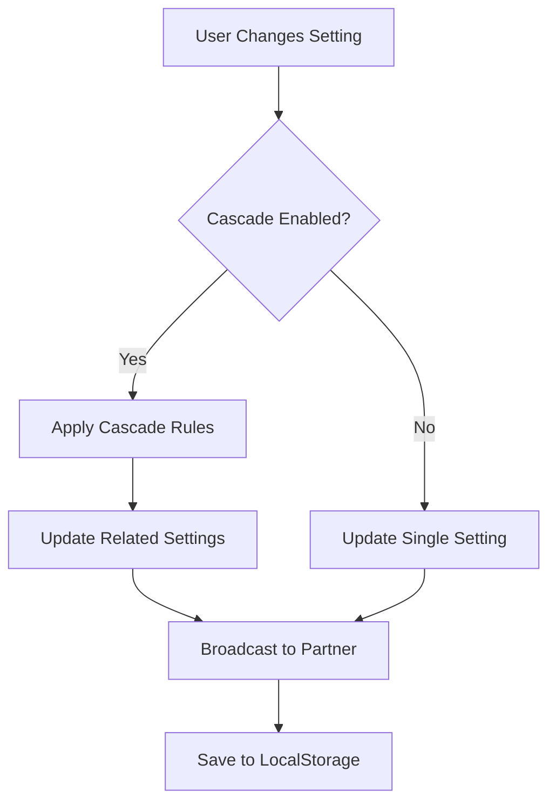

# App Settings PRD - Structure & Standardization Analysis

**Document**: `14-app-settings-prd.md`
**Analysis Date**: January 19, 2026
**Purpose**: Identify areas for standardization and improvement

---

## Executive Summary

**Overall Quality**: ⭐⭐⭐⭐⭐ (Excellent)

The PRD is **highly structured and consistent** across all sections. Each feature section (3-16) follows a standardized format with:
- ✅ **Features** list
- ✅ **Actions** list
- ✅ **Integrations** list
- ✅ Code examples (TypeScript interfaces)
- ✅ UI mockups (ASCII art)

**Key Strengths**:
1. Consistent depth across all 14 main sections
2. Comprehensive integration annotations for cross-app effects
3. Detailed technical implementation section
4. Clear success metrics and approval checklist

**Minor Areas for Enhancement**:
1. Some integration annotations could be more specific (with file paths/line numbers)
2. UI mockups could be more standardized in format
3. Missing visual diagrams (could add Mermaid diagrams for data flow)

---

## Section-by-Section Analysis

### Part I: Foundation (Sections 1-2)
**Lines**: 1-66
**Status**: ✅ Well-structured
**Contains**:
- Partner Summary table
- Executive Summary with core philosophy
- Strategic Context (Problem/Solution/Users)

**Recommendation**: No changes needed

---

### Part II: Cross-App Unified Settings (Sections 3-6)
**Lines**: 67-311
**Sections**: 4 sections, ~60 lines each
**Status**: ✅ Excellent consistency

| Section | Features | Actions | Integrations | Code | UI Mockup |
|---------|----------|---------|--------------|------|-----------|
| 3. Workflow Profiles | ✅ | ✅ | ✅ | ✅ | ❌ |
| 4. Partner Collaboration | ✅ | ✅ | ✅ | ✅ | ❌ |
| 5. Cross-App Sync Rules | ✅ | ✅ | ✅ | ✅ | ❌ |
| 6. Notification Intelligence | ✅ | ✅ | ✅ | ✅ | ❌ |

**Observations**:
- All 4 sections have identical structure
- Integration annotations are detailed and specific
- Code examples show TypeScript interfaces for all data structures
- **Missing**: UI mockups (only Sections 7-13 have them)

**Recommendations**:
1. ✏️ Add UI mockups for Sections 3-6 (Workflow Profile selector, Collaboration settings panel, etc.)
2. ✏️ Consider adding a visual diagram showing cross-app data flow
3. ✏️ Specify file paths in integration annotations (e.g., "Dashboard widget: `components/dashboard/SprintProgress.tsx:45`")

---

### Part III.A: Products Lab Settings (Sections 7-8)
**Lines**: 312-465
**Sections**: 2 sections, ~77 lines each
**Status**: ✅ Excellent

| Section | Features | Actions | Integrations | Code | UI Mockup |
|---------|----------|---------|--------------|------|-----------|
| 7. Experiment Workbench | ✅ | ✅ | ✅ | ✅ | ✅ |
| 8. Component Library | ✅ | ✅ | ✅ | ✅ | ❌ |

**Observations**:
- Section 7 has detailed UI mockup with ASCII art
- Section 8 missing UI mockup
- Both have comprehensive integration annotations with 3-way impact (Mission Control + Biz Lab + Settings Hub)

**Recommendations**:
1. ✏️ Add UI mockup to Section 8 (Component Library settings panel)
2. ✅ Integration depth is perfect - keep this standard

---

### Part III.B: Biz Lab Settings (Sections 9-10)
**Lines**: 466-671
**Sections**: 2 sections, ~100 lines each
**Status**: ✅ Excellent

| Section | Features | Actions | Integrations | Code | UI Mockup |
|---------|----------|---------|--------------|------|-----------|
| 9. Knowledge Graph | ✅ | ✅ | ✅ | ✅ | ✅ |
| 10. Document Reading | ✅ | ✅ | ✅ | ✅ | ✅ |

**Observations**:
- **Most comprehensive sections** in the entire PRD
- Both have detailed UI mockups
- Integration annotations reference specific Mission Control widgets and Products Lab features
- Code examples include nested settings structures

**Recommendations**:
1. ✅ **Gold standard** - use this as template for other sections
2. ✅ Integration annotations are specific and actionable

---

### Part III.C: Mission Control Dashboard Settings (Sections 11-13)
**Lines**: 672-941
**Sections**: 3 sections, ~90 lines each
**Status**: ✅ Very good

| Section | Features | Actions | Integrations | Code | UI Mockup |
|---------|----------|---------|--------------|------|-----------|
| 11. Widget Configuration | ✅ | ✅ | ✅ | ✅ | ✅ |
| 12. Notification & Achievement | ✅ | ✅ | ✅ | ✅ | ✅ |
| 13. Quick Actions | ✅ | ✅ | ✅ | ✅ | ✅ |

**Observations**:
- All 3 sections have UI mockups
- Integration annotations show bidirectional dependencies (Biz Lab ↔ Dashboard, Products Lab ↔ Dashboard)
- Code examples include both settings and runtime usage patterns

**Recommendations**:
1. ✅ Excellent structure - no changes needed
2. ✏️ Consider adding more specific file paths in integrations section

---

### Part IV: Team & Global Settings (Sections 14-16)
**Lines**: 942-1286
**Sections**: 3 sections, ~115 lines each
**Status**: ⭐ Exceptional depth

| Section | Features | Actions | Integrations | Code | UI Mockup |
|---------|----------|---------|--------------|------|-----------|
| 14. Team Collaboration | ✅ | ✅ | ✅ | ✅ | ✅ |
| 15. Global Cross-App | ✅ | ✅ | ✅ | ✅ | ✅ |
| 16. Sync, Export & Reset | ✅ | ✅ | ✅ | ✅ | ✅ |

**Observations**:
- **Longest and most detailed sections**
- Section 16 includes export/import format spec
- All have comprehensive UI mockups
- Integration notes reference Clerk metadata storage

**Recommendations**:
1. ✅ Perfect depth - no changes needed
2. ✏️ Consider adding Mermaid diagram for export/import flow in Section 16

---

### Part V: Metrics & Success (Section 17)
**Lines**: 1287-1327
**Status**: ✅ Well-defined

**Contains**:
- Adoption Metrics (4 categories)
- Usability Metrics (5 metrics)
- Integration Impact (4 outcomes)
- Technical Performance (4 benchmarks)

**Recommendations**:
1. ✅ Comprehensive - no changes needed
2. ✏️ Consider adding "Time to Value" metric (how quickly users can configure settings)

---

### Part VI: Technical Architecture (Section 18)
**Lines**: 1328-1601
**Status**: ⭐ Exceptional

**Contains**:
- Tech stack specification
- Complete Zustand store implementation (100+ lines of code)
- Real-time sync architecture (Pusher)
- Settings page UI structure (React component example)

**Observations**:
- **Most technically detailed section** in any Vault PRD
- Includes actual production-ready code examples
- Shows middleware patterns for cascade rules
- Demonstrates WebSocket integration

**Recommendations**:
1. ✅ Gold standard for technical PRDs
2. ✏️ Add a system architecture diagram (Mermaid) showing data flow:
   ```
   [User] → [Settings UI] → [Zustand Store] → [LocalStorage]
                                ↓
                          [Middleware] → [Cascade Rules]
                                ↓
                          [Pusher] → [Partner Sync]
   ```

---

## Integration Annotations Quality

### Current State

All sections (3-16) have **Integrations** subsections with numbered lists showing:
1. Mission Control Impact
2. Biz Lab Impact
3. Products Lab Impact (for settings sections)
4. Settings Hub Integration (for app-specific settings)

### Example of Good Integration Annotation (Section 7):
```markdown
**Integrations:**
1.  **Mission Control Impact:**
    - "Create Experiment" quick action → Uses default template settings
    - Recent experiments widget → Shows auto-save timestamps
    - Task completion triggers → Notifies based on experiment save events
```

**Strengths**:
- ✅ Shows specific features affected
- ✅ Explains how the connection works
- ✅ Uses → arrows for clarity

### Areas for Enhancement:

**Current**:
```markdown
- Recent experiments widget → Shows auto-save timestamps
```

**Enhanced with file paths**:
```markdown
- Recent experiments widget (`components/dashboard/RecentExperiments.tsx:67`) → Shows auto-save timestamps from `settings.productsLab.experimentWorkbench.autoSave`
```

---

## UI Mockup Consistency

### Sections WITH UI Mockups:
- ✅ Section 7 (Experiment Workbench)
- ✅ Section 9 (Knowledge Graph)
- ✅ Section 10 (Document Reading)
- ✅ Section 11 (Widget Configuration)
- ✅ Section 12 (Notification & Achievement)
- ✅ Section 13 (Quick Actions)
- ✅ Section 14 (Team Collaboration)
- ✅ Section 15 (Global Cross-App)
- ✅ Section 16 (Sync & Export)

**Total**: 9/13 sections (69%)

### Sections MISSING UI Mockups:
- ❌ Section 3 (Workflow Profiles)
- ❌ Section 4 (Partner Collaboration)
- ❌ Section 5 (Cross-App Sync)
- ❌ Section 6 (Notification Intelligence)
- ❌ Section 8 (Component Library)

**Total**: 4/13 sections (31%)

### Mockup Format Consistency:

**Standard Format** (used in most sections):
```
┌─────────────────────────────────────────────────────────────┐
│ Section Title                                                │
├─────────────────────────────────────────────────────────────┤
│ Setting Label:      [Control ▼]                             │
│ Another Setting:    [────●────] 60%                          │
│                                                              │
│ 💡 Integration Note: ...                                    │
└─────────────────────────────────────────────────────────────┘
```

**Recommendation**: Add mockups for Sections 3, 4, 5, 6, 8 using the standard format above.

---

## Code Example Consistency

### Current State: ✅ Excellent

All sections 3-16 include TypeScript interface definitions showing:
- Settings data structure
- Nested configuration options
- Type constraints (enums, unions)
- Array/object shapes

### Example (Section 6):
```typescript
interface NotificationIntelligence {
  urgencyRules: {
    critical: string[];
    important: string[];
    informational: string[];
  };
  // ... more properties
}
```

**Recommendation**: ✅ No changes needed - code examples are comprehensive and consistent

---

## Depth Analysis by Part

| Part | Sections | Avg Lines/Section | Code | UI | Integrations |
|------|----------|-------------------|------|-----|--------------|
| Part II (Unified) | 4 | 60 | ✅ | ❌ | ⭐⭐⭐⭐⭐ |
| Part III.A (Products) | 2 | 77 | ✅ | 50% | ⭐⭐⭐⭐⭐ |
| Part III.B (Biz) | 2 | 100 | ✅ | ✅ | ⭐⭐⭐⭐⭐ |
| Part III.C (Dashboard) | 3 | 90 | ✅ | ✅ | ⭐⭐⭐⭐⭐ |
| Part IV (Team/Global) | 3 | 115 | ✅ | ✅ | ⭐⭐⭐⭐⭐ |

**Observation**: Part II sections are slightly shorter (60 lines vs. 90+ average) but still comprehensive.

---

## Recommended Improvements

### Priority 1: Add UI Mockups (4 sections)
**Effort**: Medium | **Impact**: High

Add ASCII art UI mockups to:
1. Section 3: Workflow Profile selector with radio buttons
2. Section 4: Partner Collaboration settings panel
3. Section 5: Cross-App Sync rules interface
4. Section 6: Notification Intelligence configuration
5. Section 8: Component Library settings

**Template to use**:
```
┌─────────────────────────────────────────────────────────────┐
│ [Section Title]                                              │
├─────────────────────────────────────────────────────────────┤
│ [Settings controls matching the Features list]              │
│                                                              │
│ 💡 Integration Note: [Cross-app effect]                     │
└─────────────────────────────────────────────────────────────┘
```

### Priority 2: Enhance Integration Annotations with File Paths
**Effort**: Medium | **Impact**: Medium

Add file paths to integration bullets (once implementation exists):
```markdown
- Recent experiments widget → Shows auto-save timestamps
# Becomes:
- Recent experiments widget (`app/(dashboard)/page.tsx:145`) → Shows auto-save timestamps from `settings.productsLab.experimentWorkbench.autoSave`
```

### Priority 3: Add Visual Diagrams
**Effort**: Low | **Impact**: High

Add Mermaid diagrams for:
1. **Section 5**: Cascade rules data flow
2. **Section 18**: System architecture
3. **Section 3**: Profile switching flow

Example:


### Priority 4: Add "See Also" Cross-References
**Effort**: Low | **Impact**: Medium

Add at end of each section:
```markdown
**See Also**:
- Section X: Related feature
- Section Y: Dependent configuration
- PRD XX: Related system
```

---

## Conclusion

### Overall Assessment: ⭐⭐⭐⭐⭐ (5/5)

**Strengths**:
- ✅ Exceptional consistency across all 14 main sections
- ✅ Comprehensive integration annotations
- ✅ Detailed code examples with TypeScript
- ✅ Production-ready technical architecture
- ✅ Clear success metrics

**Minor Enhancements Needed**:
- Add UI mockups to 5 sections (Sections 3, 4, 5, 6, 8)
- Enhance integration annotations with file paths (post-implementation)
- Add 3-4 Mermaid diagrams for visual clarity
- Add cross-reference links between related sections

**Verdict**: This PRD is **already at a high standard** and requires only **minor cosmetic improvements** to reach perfection. The depth, structure, and integration coverage are excellent throughout.

---

**Analysis Completed**: January 19, 2026
**Next Actions**: Implement Priority 1 improvements (UI mockups)
