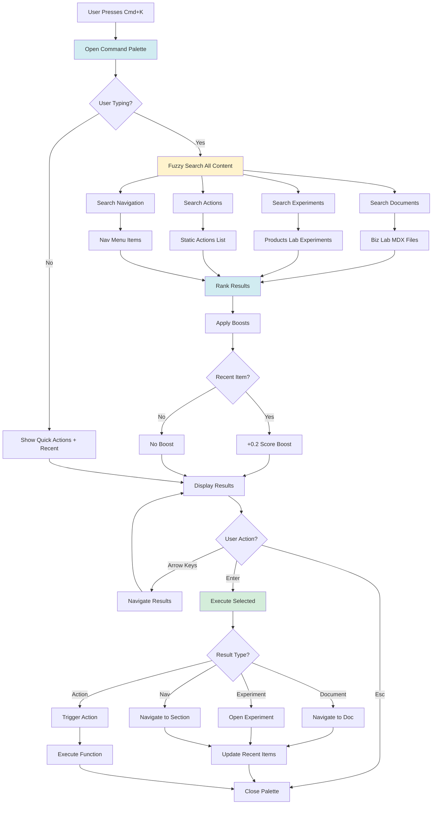
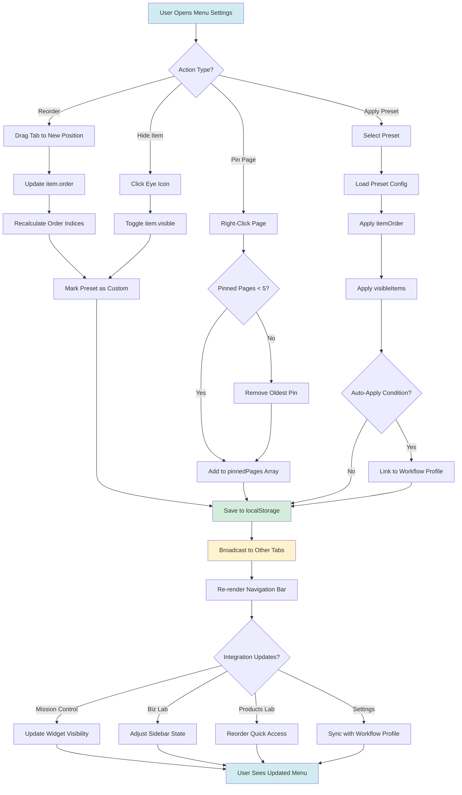
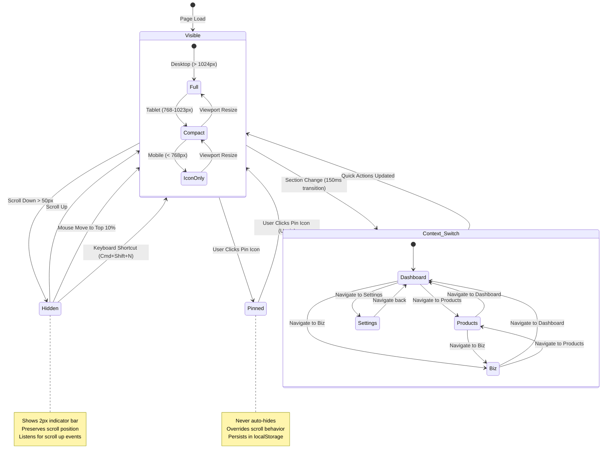
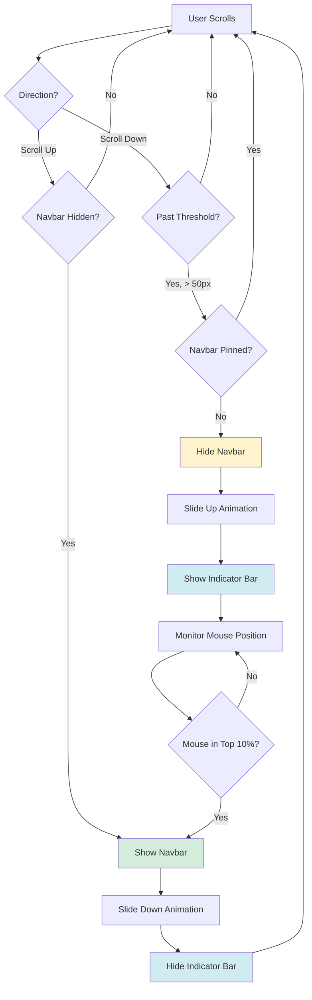
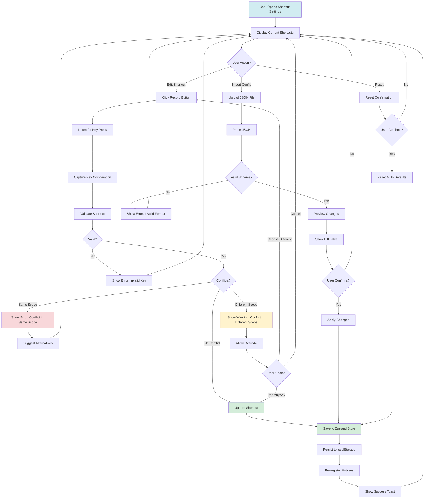

# Product Requirement Document (PRD): Global Navigation

**Product:** Global Navigation & Command System
**Type:** Internal (Cross-Vault Navigation)
**Status:** 📋 PLANNED (Sprint 3+)
**Domain:** `vault.klario-world.com` (global features)
**Parent:** Clario Vault (see `00-vault-overview-prd.md`)

> **Technical Implementation:** See `specifications/global-navigation-system.md` for Command Palette architecture, Dynamic Navbar state management, Keyboard Shortcuts system, and integration patterns.

---

# Part I: Foundation

## 📋 Partner Summary

| Field | Details |
| :--- | :--- |
| **For** | Power Users (You & Partner) |
| **Goal** | Navigate 3x faster using keyboard or quick menus. |
| **Key Actions** | • `Cmd+K` to search anything<br>• `Cmd+R` to request review<br>• Custom sidebar Shortcuts<br>• Dynamic floating navbar with context-aware actions |

---

## 🚀 1. Executive Summary

**Global Navigation** provides unified navigation and quick access features across all Vault sections (Products, Biz, Settings). It centers around a command palette (⌘K), dynamic floating navbar, customizable global menu, and keyboard shortcuts.

**Core Function:** "Command center for power users" - instant access to any feature, document, or action through context-aware navigation and quick actions.

---

## 2. Strategic Context

**Problem:**
- Users navigate between 3+ Vault sections (Products, Biz, Dashboard)
- Frequently accessed features buried in menus
- Power users need keyboard-first workflows
- Mobile users need quick actions

**Solution:**
- ⌘K Command Palette for instant search & actions
- Dynamic floating navbar with context-aware quick actions
- Customizable global menu order
- Keyboard shortcuts manager
- Smart auto-hide with glassmorphism design

**Users:**
- **2 Co-founders:** Power user navigation & quick actions
- **Key Goal:** Speed up coordination between partners

---

## 3. Product Scope

### Core Features (MVP)

**3.1 Command Palette (⌘K)**
- Global search across all content
- Quick actions (create experiment, open doc, etc.)
- Recent items history
- Smart suggestions

**3.2 Dynamic Floating Navbar**
- Context-aware quick actions that adapt to current section (Products, Biz, Dashboard)
- Smart auto-hide on scroll with glassmorphism design
- Horizontal (top/bottom) or vertical (left/right) orientation
- Live status indicators (build status, review queue badges, sprint progress)
- Persistent global actions (Command Palette, Settings, User Avatar)
- Pin/unpin for always-visible mode
- Integration with Studio Tuner themes and workflow profiles

**3.3 Global Menu Configuration**
- Reorder Vault sections
- Hide/show menu items
- Pin frequently used pages
- Save/restore presets

**3.4 Keyboard Shortcuts Manager**
- View all shortcuts
- Customize key bindings
- Conflict detection
- Export/import configs

---

# Part II: Command Palette (⌘K)

## 4. Command Palette System

**Universal search and action launcher accessible from anywhere in Vault.**

**Features:**
1. **Global Fuzzy Search:** Search across all documents, experiments, and strategic content with fuzzy matching.
2. **Quick Actions Launcher:** Instant access to create experiments, request reviews, open dashboard, view partner activity.
3. **Smart Suggestions:** Recent items, frequently accessed pages, and context-aware recommendations.
4. **Multi-Category Results:** Documents, Actions, Navigation, Recent - grouped and prioritized intelligently.
5. **Keyboard-First UX:** Fully navigable via keyboard with arrow keys, enter, escape, and shortcuts.

**Actions:**
1. **`Cmd+K` (Open Palette):** Trigger command palette from any page in Vault.
2. **`Type to Search`:** Real-time fuzzy search across all indexed content.
3. **`Execute Action`:** Press Enter to navigate to result or trigger quick action.
4. **`Cmd+1/2/3` (Quick Nav):** Direct navigation shortcuts to main sections.
5. **`Esc` (Close):** Dismiss palette and return to current page.

**Integrations:**
1. **Mission Control Impact:**
    - Dashboard search → Searches active widgets, achievements, sprint progress
    - Quick Actions → Create experiment, request review, view partner activity
    - Recent Items → Shows last visited dashboard widgets and documents
2. **Biz Lab Impact:**
    - Document search → Full-text search across all strategic documents
    - Knowledge Graph search → Find nodes, connections, and strategic themes
    - Quick Capture → Instant note creation from command palette
3. **Products Lab Impact:**
    - Experiment search → Find experiments by name, tags, framework
    - Component search → Search component library and design tokens
    - Template launcher → Quick access to experiment templates
4. **Settings Hub Integration:**
    - Search scope controlled by Global Settings (Section 15 in App Settings PRD)
    - Keyboard shortcuts customizable in Settings
    - Recent items respects privacy settings (hide in Focus Mode)

**Command Palette Architecture:**
```typescript
interface CommandPaletteState {
  open: boolean;
  searchQuery: string;
  results: SearchResult[];
  selectedIndex: number;
  recentItems: RecentItem[];
}

interface SearchResult {
  id: string;
  title: string;
  description: string;
  icon: string;
  category: 'documents' | 'actions' | 'navigation' | 'recent';
  path?: string; // For navigation
  action?: () => void; // For quick actions
  score: number; // Fuse.js relevance score
}

// Fuzzy search implementation
import Fuse from 'fuse.js';

const searchIndex = {
  documents: getAllDocs(), // From Biz Lab MDX files
  experiments: getAllExperiments(), // From Products Lab
  actions: getQuickActions(), // Static actions list
  navigation: getVaultSections(), // Main nav items
  widgets: getDashboardWidgets(), // Mission Control widgets
};

const fuse = new Fuse(Object.values(searchIndex).flat(), {
  keys: ['title', 'description', 'tags', 'content'],
  threshold: 0.3, // 70% similarity required
  includeScore: true,
  useExtendedSearch: true,
});

// Ranking algorithm
function rankResults(results: SearchResult[]): SearchResult[] {
  return results.map(result => {
    let boost = 0;

    // Exact match boost
    if (result.title.toLowerCase() === searchQuery.toLowerCase()) {
      boost += 1.0;
    }

    // Title prefix match boost
    if (result.title.toLowerCase().startsWith(searchQuery.toLowerCase())) {
      boost += 0.5;
    }

    // Recent items boost
    if (recentItems.some(item => item.id === result.id)) {
      boost += 0.2;
    }

    // Category priority: actions > navigation > documents > recent
    if (result.category === 'actions') boost += 0.3;
    if (result.category === 'navigation') boost += 0.2;

    result.score += boost;
    return result;
  }).sort((a, b) => b.score - a.score);
}
```

**Quick Actions Configuration:**
```typescript
const quickActions: QuickAction[] = [
  {
    id: 'create-experiment',
    title: 'Create New Experiment',
    description: 'Start a new UI/UX experiment in Products Lab',
    icon: '🆕',
    shortcut: 'Cmd+N',
    category: 'actions',
    action: () => router.push('/products/experiments/new'),
    integrations: {
      productsLab: 'Uses default template from settings',
      missionControl: 'Adds to Recent Experiments widget'
    }
  },
  {
    id: 'request-review',
    title: 'Request Partner Review',
    description: 'Send document or experiment for partner approval',
    icon: '📨',
    shortcut: 'Cmd+R',
    category: 'actions',
    action: () => triggerReviewModal(),
    integrations: {
      bizLab: 'Triggers Decision Governance workflow',
      missionControl: 'Updates Review Queue widget',
      settings: 'Uses notification routing rules'
    }
  },
  {
    id: 'view-activity',
    title: 'View Partner Activity',
    description: 'See what your partner is currently working on',
    icon: '👁️',
    shortcut: 'Cmd+Shift+A',
    category: 'actions',
    action: () => toggleActivityFeed(),
    integrations: {
      settings: 'Respects presence sharing settings',
      missionControl: 'Shows in Team Activity widget'
    }
  },
  {
    id: 'open-graph',
    title: 'Knowledge Graph',
    description: 'Open strategic document knowledge graph',
    icon: '🗺️',
    shortcut: 'Cmd+G',
    category: 'navigation',
    action: () => router.push('/biz/graph'),
    integrations: {
      bizLab: 'Opens with configured visualization settings',
      settings: 'Uses graph color scheme from settings'
    }
  },
  {
    id: 'toggle-focus',
    title: 'Toggle Focus Mode',
    description: 'Switch to Focus Mode workflow profile',
    icon: '🎯',
    shortcut: 'Cmd+Shift+F',
    category: 'actions',
    action: () => switchProfile('Focus Mode'),
    integrations: {
      settings: 'Triggers workflow profile change (Section 3)',
      missionControl: 'Hides non-essential widgets',
      bizLab: 'Collapses sidebar',
      productsLab: 'Disables hot reload'
    }
  }
];
```

**Example UI:**
```
┌─────────────────────────────────────────────────────────────┐
│ 🔍 Search or run command...                           Cmd+K │
├─────────────────────────────────────────────────────────────┤
│                                                             │
│ ⚡ Quick Actions                                            │
│   🆕 Create New Experiment                           Cmd+N  │
│   📨 Request Partner Review                          Cmd+R  │
│   🎯 Toggle Focus Mode                          Cmd+Shift+F │
│   👁️ View Partner Activity                     Cmd+Shift+A  │
│                                                             │
│ 📄 Documents (Search: "gtm")                                │
│ › 📄 GTM Strategy                        /biz/strategy/gtm  │
│   📄 Market Analysis                  /biz/strategy/market  │
│   📄 GTM Q2 2026 Plan               /biz/strategy/gtm-q2    │
│                                                             │
│ 🧭 Go To                                                    │
│   🎨 Products Lab                              Cmd+1        │
│   📚 Biz Lab                                   Cmd+2        │
│   ⚙️ Settings                                  Cmd+3        │
│                                                             │
│ 🕐 Recent                                                   │
│   📄 2026 Strategy Overview          Last opened 5 min ago  │
│   🎨 Glass Card Experiment           Last opened 1 hour ago │
│                                                             │
│ 💡 Tip: Use ↑↓ to navigate, Enter to select, Esc to close  │
└─────────────────────────────────────────────────────────────┘
```

**Search Flow Diagram:**


**See:** `specifications/global-navigation-system.md` #1 for Command Palette technical implementation (CMDK integration, search index, contextual actions hook)

---

# Part III: Global Menu & Floating Navbar

## 5. Global Menu Configuration

**Customizable navigation structure allowing partners to prioritize their most-used Vault sections.**

**Features:**
1. **Drag-to-Reorder Navigation:** Rearrange main navigation tabs (Home, Products, Biz, Settings) via drag & drop with instant visual feedback.
2. **Pin Frequent Pages:** Pin up to 5 strategic documents or experiments to global menu for one-click access from anywhere.
3. **Hide/Show Menu Items:** Toggle visibility of navigation sections (hide Settings when not needed, show only active workspace).
4. **Workflow-Based Presets:** Pre-configured menu layouts (Developer Mode, Strategy Mode, Minimal Mode) that reorganize navigation for specific tasks.
5. **Cross-Device Sync:** Menu configuration persists via Zustand + localStorage and syncs across browser tabs in real-time.

**Actions:**
1. **`Drag Tab to Reorder`:** Click and drag any navigation tab to change order. New order saves automatically.
2. **`Pin Page`:** Right-click any document/experiment → "Pin to Menu" → Appears in global navigation bar.
3. **`Toggle Section Visibility`:** Click eye icon on menu item → Hide from navigation → Reduces clutter for focused work.
4. **`Apply Preset`:** Settings → Menu Presets → Select "Developer Mode" → Navigation reorders to Products → Biz → Settings.
5. **`Reset to Default`:** Settings → Menu Configuration → "Reset to Default" → Restores original tab order and visibility.

**Integrations:**
1. **Mission Control Impact:**
    - Dashboard widgets can be pinned to global menu for quick access
    - Active sprint indicator shows in menu bar when sprint is in progress
    - Menu preset changes trigger widget visibility updates (e.g., Strategy Mode shows Review Queue widget)
2. **Biz Lab Impact:**
    - Strategic documents can be pinned to menu (GTM Strategy, Market Analysis appear as quick links)
    - Knowledge Graph accessible via pinned menu item (⌘G or click pinned "Graph" button)
    - Menu presets control sidebar default state (Strategy Mode opens with sidebar expanded)
3. **Products Lab Impact:**
    - Active experiments can be pinned to menu for quick switching between prototypes
    - Component library accessible via pinned menu item
    - Developer Mode preset prioritizes Products Lab first in navigation order
4. **Settings Hub Integration:**
    - Menu configuration stored in Global Settings (Section 15 in App Settings PRD)
    - Workflow profiles automatically apply menu presets (Focus Mode → Minimal Mode menu)
    - Menu customization syncs with theme preferences (dark mode affects menu styling)

**Global Menu Architecture:**
```typescript
interface GlobalMenuConfig {
  items: MenuItemConfig[];
  pinnedPages: PinnedPage[];
  preset: MenuPreset | null;
  lastModified: Date;
}

interface MenuItemConfig {
  id: 'home' | 'products' | 'biz' | 'settings';
  label: string;
  icon: string;
  order: number; // 0-indexed position
  visible: boolean;
  shortcut?: string; // Optional keyboard shortcut
}

interface PinnedPage {
  id: string;
  title: string;
  icon: string;
  path: string;
  category: 'document' | 'experiment' | 'widget' | 'tool';
  addedAt: Date;
}

interface MenuPreset {
  name: 'Default' | 'Developer Mode' | 'Strategy Mode' | 'Minimal Mode' | 'Custom';
  description: string;
  config: {
    itemOrder: string[]; // ['products', 'biz', 'home', 'settings']
    visibleItems: string[];
    autoApplyConditions?: {
      workflowProfile?: string; // Auto-apply when switching to this profile
      timeOfDay?: string; // Auto-apply during specific hours
    };
  };
}

// Zustand store for global menu state
import { create } from 'zustand';
import { persist } from 'zustand/middleware';

interface MenuStore {
  config: GlobalMenuConfig;

  // Actions
  reorderItem: (itemId: string, newOrder: number) => void;
  toggleVisibility: (itemId: string) => void;
  pinPage: (page: Omit<PinnedPage, 'addedAt'>) => void;
  unpinPage: (pageId: string) => void;
  applyPreset: (presetName: string) => void;
  resetToDefault: () => void;

  // Computed
  getVisibleItems: () => MenuItemConfig[];
  getPinnedPages: (limit?: number) => PinnedPage[];
}

export const useMenuStore = create<MenuStore>()(
  persist(
    (set, get) => ({
      config: {
        items: [
          { id: 'home', label: 'Mission Control', icon: '📊', order: 0, visible: true, shortcut: 'Cmd+D' },
          { id: 'products', label: 'Products Lab', icon: '🎨', order: 1, visible: true, shortcut: 'Cmd+1' },
          { id: 'biz', label: 'Biz Lab', icon: '📚', order: 2, visible: true, shortcut: 'Cmd+2' },
          { id: 'settings', label: 'Settings', icon: '⚙️', order: 3, visible: true, shortcut: 'Cmd+3' },
        ],
        pinnedPages: [],
        preset: null,
        lastModified: new Date(),
      },

      reorderItem: (itemId, newOrder) => set((state) => {
        const items = [...state.config.items];
        const itemIndex = items.findIndex(i => i.id === itemId);
        const [item] = items.splice(itemIndex, 1);
        items.splice(newOrder, 0, item);

        // Recalculate order indices
        items.forEach((item, index) => {
          item.order = index;
        });

        return {
          config: {
            ...state.config,
            items,
            preset: { ...state.config.preset, name: 'Custom' }, // Mark as custom after manual reorder
            lastModified: new Date()
          }
        };
      }),

      toggleVisibility: (itemId) => set((state) => ({
        config: {
          ...state.config,
          items: state.config.items.map(item =>
            item.id === itemId ? { ...item, visible: !item.visible } : item
          ),
          preset: { ...state.config.preset, name: 'Custom' },
          lastModified: new Date()
        }
      })),

      pinPage: (page) => set((state) => {
        // Limit to 5 pinned pages
        const pinnedPages = [...state.config.pinnedPages, { ...page, addedAt: new Date() }];
        if (pinnedPages.length > 5) {
          pinnedPages.shift(); // Remove oldest
        }

        return {
          config: {
            ...state.config,
            pinnedPages,
            lastModified: new Date()
          }
        };
      }),

      unpinPage: (pageId) => set((state) => ({
        config: {
          ...state.config,
          pinnedPages: state.config.pinnedPages.filter(p => p.id !== pageId),
          lastModified: new Date()
        }
      })),

      applyPreset: (presetName) => set((state) => {
        const presets = {
          'Developer Mode': {
            itemOrder: ['products', 'biz', 'home', 'settings'],
            visibleItems: ['products', 'biz', 'settings']
          },
          'Strategy Mode': {
            itemOrder: ['biz', 'home', 'products', 'settings'],
            visibleItems: ['biz', 'home', 'products', 'settings']
          },
          'Minimal Mode': {
            itemOrder: ['home', 'products', 'biz', 'settings'],
            visibleItems: ['home'] // Only show current section
          },
          'Default': {
            itemOrder: ['home', 'products', 'biz', 'settings'],
            visibleItems: ['home', 'products', 'biz', 'settings']
          }
        };

        const preset = presets[presetName];
        if (!preset) return state;

        const items = preset.itemOrder.map((id, index) => {
          const item = state.config.items.find(i => i.id === id);
          return {
            ...item,
            order: index,
            visible: preset.visibleItems.includes(id)
          };
        });

        return {
          config: {
            ...state.config,
            items,
            preset: { name: presetName, description: '', config: preset },
            lastModified: new Date()
          }
        };
      }),

      resetToDefault: () => set((state) => {
        get().applyPreset('Default');
        return {
          config: {
            ...state.config,
            pinnedPages: [],
            lastModified: new Date()
          }
        };
      }),

      getVisibleItems: () => {
        return get().config.items
          .filter(item => item.visible)
          .sort((a, b) => a.order - b.order);
      },

      getPinnedPages: (limit = 5) => {
        return get().config.pinnedPages.slice(0, limit);
      }
    }),
    {
      name: 'vault-menu-config',
      version: 1
    }
  )
);
```

**Menu Configuration UI:**
```
┌─────────────────────────────────────────────────────────────────┐
│ ⚙️  Menu Configuration                                     [×]   │
├─────────────────────────────────────────────────────────────────┤
│                                                                 │
│ 🗂️  Navigation Order (Drag to reorder)                          │
│                                                                 │
│ ┌───────────────────────────────────────────────────────────┐   │
│ │ ≡  📊 Mission Control              Cmd+D         👁 [↑↓] │   │
│ │ ≡  🎨 Products Lab                 Cmd+1         👁 [↑↓] │   │
│ │ ≡  📚 Biz Lab                      Cmd+2         👁 [↑↓] │   │
│ │ ≡  ⚙️  Settings                     Cmd+3         👁 [↑↓] │   │
│ └───────────────────────────────────────────────────────────┘   │
│                                                                 │
│ 📌 Pinned Pages (5 max)                          [+ Add Pin]    │
│                                                                 │
│ ┌───────────────────────────────────────────────────────────┐   │
│ │ 📄 GTM Strategy                      /biz/strategy/gtm [×]│   │
│ │ 🎨 Glass Card Experiment    /products/glass-card-v2 [×]│   │
│ │ 🗺️ Knowledge Graph                     /biz/graph      [×]│   │
│ └───────────────────────────────────────────────────────────┘   │
│                                                                 │
│ 🎛️  Menu Presets                                                │
│                                                                 │
│ ┌───────────────────────────────────────────────────────────┐   │
│ │ ○ Default              Home → Products → Biz → Settings   │   │
│ │ ● Developer Mode       Products → Biz → Settings (no Home)│   │
│ │ ○ Strategy Mode        Biz → Home → Products → Settings   │   │
│ │ ○ Minimal Mode         Only current section visible       │   │
│ └───────────────────────────────────────────────────────────┘   │
│                                                                 │
│ [Apply Preset]  [Reset to Default]                     [Save]   │
│                                                                 │
└─────────────────────────────────────────────────────────────────┘

Active Menu Bar Preview:
┌─────────────────────────────────────────────────────────────────┐
│ 🎨 Products  📚 Biz  ⚙️ Settings  |  📄 GTM  🎨 Glass  🗺️ Graph  │
└─────────────────────────────────────────────────────────────────┘
```

**Menu Customization Flow:**


**Integration Example - Menu Preset Triggers:**
```typescript
// When switching workflow profiles, automatically apply menu preset
import { useMenuStore } from '@/lib/store/menu-store';
import { useSettingsStore } from '@/lib/store/settings-store';

export function WorkflowProfileSwitcher() {
  const { applyPreset } = useMenuStore();
  const { switchProfile } = useSettingsStore();

  const handleProfileSwitch = (profileName: string) => {
    // Apply settings profile
    switchProfile(profileName);

    // Apply corresponding menu preset
    const menuPresetMap = {
      'Focus Mode': 'Minimal Mode',
      'Collaboration Mode': 'Default',
      'Deep Work': 'Developer Mode',
      'Strategic Planning': 'Strategy Mode'
    };

    const menuPreset = menuPresetMap[profileName];
    if (menuPreset) {
      applyPreset(menuPreset);
    }
  };

  return (
    <button onClick={() => handleProfileSwitch('Focus Mode')}>
      Enter Focus Mode
    </button>
  );
}
```

**See Also:**
- Section 4: Command Palette System (⌘K to access pinned pages)
- Section 6: Keyboard Shortcuts Manager (customize navigation shortcuts)
- App Settings PRD Section 3: Workflow Profiles (menu presets linked to profiles)
- App Settings PRD Section 15: Global Settings (menu config persistence)

---

## 5.5 Dynamic Floating Navbar

**Context-aware floating navigation bar that adapts to user activity, scroll position, and current workspace with auto-hide behavior and glassmorphism design.**

**Features:**
1. **Smart Auto-Hide Behavior:** Navbar hides on scroll down (reading mode), reappears on scroll up or mouse move to top 10% of viewport, ensuring distraction-free content consumption.
2. **Context-Aware Navigation:** Navbar content adapts to current section (Products Lab shows experiment quick actions, Biz Lab shows document tools, Mission Control shows sprint controls).
3. **Glassmorphism Design:** Floating bar with backdrop-blur, semi-transparent background (rgba(255,255,255,0.8) light / rgba(20,20,20,0.8) dark), 1px border, subtle shadow matching Clario design system.
4. **Quick Action Slots:** 3-5 contextual action buttons change based on current page (e.g., in experiment: Preview, Save, Share; in document: Edit, Link, Review).
5. **Persistent Global Actions:** Command Palette trigger (⌘K), Global Menu dropdown, User Avatar, and Settings always visible in navbar regardless of context.

**Actions:**
1. **`Auto-Hide on Scroll Down`:** When user scrolls down > 50px, navbar slides up with smooth 300ms transition, leaving only 2px colored indicator bar at top.
2. **`Show on Scroll Up`:** Any upward scroll or mouse move to top 10% of screen triggers navbar slide-down animation with 200ms transition.
3. **`Context Switch`:** When navigating between Vault sections (Products ↔ Biz ↔ Dashboard), navbar quick action slots morph to show relevant tools with 150ms fade transition.
4. **`Pin Navbar (Optional)`:** Click pin icon to lock navbar in always-visible mode (useful for users who prefer persistent navigation), persists in settings.
5. **`Compact Mode`:** On narrow viewports (< 1024px), navbar collapses to icon-only mode with tooltips on hover, maintaining functionality while saving vertical space.

**Integrations:**
1. **Mission Control Impact:**
    - Dashboard navbar shows: Sprint Progress indicator, Review Queue badge (unread count), Quick Actions (Start Sprint, View Achievements)
    - Navbar adapts to workflow profile (Focus Mode hides non-essential buttons, Collaboration Mode highlights Review Queue)
    - Achievement notifications slide down from navbar when unlocked
2. **Biz Lab Impact:**
    - Document editing: Navbar shows Save status, Word count, Share button, Knowledge Graph quick link
    - Knowledge Graph view: Navbar shows Graph controls (Zoom, Filter, Export), Node focus breadcrumb
    - Sidebar toggle button appears in navbar (synced with sidebar state from Section 11)
3. **Products Lab Impact:**
    - Experiment workbench: Navbar shows Preview toggle, Hot Reload indicator, Framework selector, Publish button
    - Component library: Navbar shows Search components, Filter by category, Copy code snippet
    - Template creation: Navbar shows Template name input, Save template, Preview template
4. **Settings Hub Integration:**
    - Navbar behavior controlled by Global Settings (Section 15 in App Settings PRD)
    - Auto-hide can be disabled in Accessibility settings for users with motor impairments
    - Navbar height, transition speed, and glassmorphism intensity customizable in Studio Tuner
    - Keyboard shortcut to toggle navbar visibility (Cmd+Shift+N)

**Dynamic Floating Navbar Architecture:**
```typescript
interface FloatingNavbarState {
  visible: boolean; // Is navbar currently shown?
  pinned: boolean; // Is navbar locked to always-visible?
  mode: 'full' | 'compact' | 'icon-only'; // Display mode based on viewport
  context: 'dashboard' | 'biz' | 'products' | 'settings'; // Current section
  quickActions: QuickAction[]; // Context-aware actions
  scrollThreshold: number; // Pixels before hide (default: 50)
}

interface QuickAction {
  id: string;
  label: string;
  icon: string;
  action: () => void;
  tooltip: string;
  badge?: number; // Optional notification badge
  active?: boolean; // Highlight state
  shortcut?: string; // Keyboard shortcut hint
}

interface NavbarConfig {
  autoHide: boolean;
  transitionSpeed: number; // milliseconds (150-500)
  glassmorphism: {
    enabled: boolean;
    blur: number; // px (8-24)
    opacity: number; // 0.7-0.95
    borderOpacity: number; // 0.1-0.3
  };
  orientation: 'horizontal' | 'vertical'; // Layout direction (row vs column)
  height: number; // px (48-72) for horizontal, width for vertical
  position: 'top' | 'bottom' | 'left' | 'right'; // Navbar position
  showIndicatorWhenHidden: boolean; // Show colored bar when auto-hidden
}

// Zustand store for navbar state
import { create } from 'zustand';
import { persist } from 'zustand/middleware';

interface NavbarStore {
  state: FloatingNavbarState;
  config: NavbarConfig;
  scrollY: number;
  lastScrollY: number;

  // Actions
  show: () => void;
  hide: () => void;
  togglePin: () => void;
  setContext: (context: string) => void;
  updateQuickActions: (actions: QuickAction[]) => void;
  setMode: (mode: string) => void;

  // Scroll handling
  handleScroll: (scrollY: number) => void;

  // Config
  updateConfig: (config: Partial<NavbarConfig>) => void;
  resetConfig: () => void;
}

export const useNavbarStore = create<NavbarStore>()(
  persist(
    (set, get) => ({
      state: {
        visible: true,
        pinned: false,
        mode: 'full',
        context: 'dashboard',
        quickActions: [],
        scrollThreshold: 50
      },
      config: {
        autoHide: true,
        transitionSpeed: 300,
        glassmorphism: {
          enabled: true,
          blur: 16,
          opacity: 0.8,
          borderOpacity: 0.2
        },
        orientation: 'horizontal',
        height: 56,
        position: 'top',
        showIndicatorWhenHidden: true
      },
      scrollY: 0,
      lastScrollY: 0,

      show: () => set((state) => ({
        state: { ...state.state, visible: true }
      })),

      hide: () => set((state) => {
        // Don't hide if pinned
        if (state.state.pinned) return state;

        return {
          state: { ...state.state, visible: false }
        };
      }),

      togglePin: () => set((state) => ({
        state: {
          ...state.state,
          pinned: !state.state.pinned,
          visible: !state.state.pinned ? true : state.state.visible // Force show when pinning
        }
      })),

      setContext: (context) => set((state) => {
        // Update quick actions based on context
        const contextActions = getQuickActionsForContext(context);

        return {
          state: {
            ...state.state,
            context,
            quickActions: contextActions
          }
        };
      }),

      updateQuickActions: (actions) => set((state) => ({
        state: { ...state.state, quickActions: actions }
      })),

      setMode: (mode) => set((state) => ({
        state: { ...state.state, mode }
      })),

      handleScroll: (scrollY) => set((state) => {
        const { lastScrollY, config, state: navState } = state;

        // Don't auto-hide if pinned or auto-hide disabled
        if (navState.pinned || !config.autoHide) {
          return { scrollY, lastScrollY: scrollY };
        }

        const scrollingDown = scrollY > lastScrollY;
        const scrollingUp = scrollY < lastScrollY;
        const pastThreshold = scrollY > navState.scrollThreshold;

        // Hide when scrolling down past threshold
        if (scrollingDown && pastThreshold && navState.visible) {
          return {
            scrollY,
            lastScrollY: scrollY,
            state: { ...navState, visible: false }
          };
        }

        // Show when scrolling up
        if (scrollingUp && !navState.visible) {
          return {
            scrollY,
            lastScrollY: scrollY,
            state: { ...navState, visible: true }
          };
        }

        return { scrollY, lastScrollY: scrollY };
      }),

      updateConfig: (newConfig) => set((state) => ({
        config: { ...state.config, ...newConfig }
      })),

      resetConfig: () => set((state) => ({
        config: {
          autoHide: true,
          transitionSpeed: 300,
          glassmorphism: {
            enabled: true,
            blur: 16,
            opacity: 0.8,
            borderOpacity: 0.2
          },
          orientation: 'horizontal',
          height: 56,
          position: 'top',
          showIndicatorWhenHidden: true
        }
      }))
    }),
    {
      name: 'vault-navbar-config',
      version: 1,
      partialize: (state) => ({
        state: { pinned: state.state.pinned }, // Only persist pinned state
        config: state.config // Persist all config
      })
    }
  )
);

// Context-aware quick actions generator
function getQuickActionsForContext(context: string): QuickAction[] {
  const actionsByContext = {
    dashboard: [
      { id: 'sprint-start', label: 'Start Sprint', icon: '🚀', action: () => {}, tooltip: 'Begin new sprint cycle', shortcut: 'Cmd+Shift+S' },
      { id: 'review-queue', label: 'Reviews', icon: '📨', action: () => {}, tooltip: 'View review queue', badge: 3 },
      { id: 'achievements', label: 'Achievements', icon: '🏆', action: () => {}, tooltip: 'View achievements', shortcut: 'Cmd+A' },
    ],
    biz: [
      { id: 'doc-save', label: 'Save', icon: '💾', action: () => {}, tooltip: 'Save document', shortcut: 'Cmd+S' },
      { id: 'doc-share', label: 'Share', icon: '🔗', action: () => {}, tooltip: 'Share document', shortcut: 'Cmd+Shift+S' },
      { id: 'doc-graph', label: 'Graph', icon: '🗺️', action: () => {}, tooltip: 'Open knowledge graph', shortcut: 'Cmd+G' },
      { id: 'doc-review', label: 'Review', icon: '📨', action: () => {}, tooltip: 'Request review', shortcut: 'Cmd+R' },
    ],
    products: [
      { id: 'exp-preview', label: 'Preview', icon: '👁️', action: () => {}, tooltip: 'Toggle preview', shortcut: 'Cmd+P', active: true },
      { id: 'exp-save', label: 'Save', icon: '💾', action: () => {}, tooltip: 'Save experiment', shortcut: 'Cmd+S' },
      { id: 'exp-hot-reload', label: 'Hot Reload', icon: '🔥', action: () => {}, tooltip: 'Toggle hot reload', active: true },
      { id: 'exp-publish', label: 'Publish', icon: '🚀', action: () => {}, tooltip: 'Publish experiment' },
    ],
    settings: [
      { id: 'settings-export', label: 'Export', icon: '📤', action: () => {}, tooltip: 'Export settings' },
      { id: 'settings-import', label: 'Import', icon: '📥', action: () => {}, tooltip: 'Import settings' },
      { id: 'settings-reset', label: 'Reset', icon: '🔄', action: () => {}, tooltip: 'Reset to defaults' },
    ]
  };

  return actionsByContext[context] || [];
}
```

**Floating Navbar UI - Horizontal Orientation (Visible State):**
```
┌─────────────────────────────────────────────────────────────────────────────────┐
│ 🎨 Products Lab    │  👁️ Preview  💾 Save  🔥 Hot Reload  🚀 Publish  │  🔍 ⌘K  ⚙️  👤 │
└─────────────────────────────────────────────────────────────────────────────────┘
  ↑ Section Context  ↑ Quick Actions (context-aware)           ↑ Global Actions

Glassmorphism Styling:
- Background: rgba(255, 255, 255, 0.8) with backdrop-blur(16px)
- Border: 1px solid rgba(0, 0, 0, 0.1)
- Shadow: 0 4px 12px rgba(0, 0, 0, 0.08)
- Height: 56px
- Padding: 0 24px
- Transition: transform 300ms cubic-bezier(0.4, 0, 0.2, 1)
- Flex Direction: row (horizontal layout)
```

**Floating Navbar UI - Horizontal Orientation (Hidden State):**
```
▬▬▬▬▬▬▬▬▬▬▬▬▬▬▬▬▬▬▬▬▬▬▬▬▬▬▬▬▬▬▬▬▬▬▬▬▬▬▬▬▬▬▬▬▬▬▬▬▬▬▬▬▬▬▬▬▬▬▬▬▬▬▬▬▬▬▬▬▬▬▬▬▬▬▬▬▬▬▬▬▬
↑ 2px colored indicator bar (accent color) remains when navbar is hidden

Behavior:
- Navbar slides up with transform: translateY(-100%) for top position
- Navbar slides down with transform: translateY(100%) for bottom position
- Indicator bar shows current section color (Products = blue, Biz = green, Dashboard = purple)
- Hover on indicator or scroll up → Navbar slides back
```

---

**Floating Navbar UI - Vertical Orientation (Visible State):**
```
┌────────────┐
│ 🎨         │  ← Section Context (rotated or icon-only)
│ Products   │
│ Lab        │
├────────────┤
│            │
│ 👁️         │  ← Quick Actions (stacked vertically)
│ Preview    │
│            │
│ 💾         │
│ Save       │
│            │
│ 🔥         │
│ Hot Reload │
│            │
│ 🚀         │
│ Publish    │
│            │
├────────────┤
│            │
│ 🔍         │  ← Global Actions (bottom section)
│            │
│ ⚙️         │
│            │
│ 👤         │
│            │
└────────────┘

Glassmorphism Styling:
- Background: rgba(255, 255, 255, 0.8) with backdrop-blur(16px)
- Border: 1px solid rgba(0, 0, 0, 0.1)
- Shadow: 4px 0 12px rgba(0, 0, 0, 0.08) for left position
- Width: 72px (icon-only) or 200px (with labels)
- Padding: 24px 0
- Transition: transform 300ms cubic-bezier(0.4, 0, 0.2, 1)
- Flex Direction: column (vertical layout)
```

**Floating Navbar UI - Vertical Orientation (Hidden State):**
```
▐  ← 2px colored indicator bar (accent color) remains when navbar is hidden
▐     (vertical bar on left edge when position='left')
▐
▐
▐     OR
▐
▐  → 2px colored indicator bar on right edge when position='right'
▐
▐

Behavior:
- Navbar slides left with transform: translateX(-100%) for left position
- Navbar slides right with transform: translateX(100%) for right position
- Indicator bar shows current section color (vertical bar)
- Hover on indicator or mouse move to edge (5% of viewport) → Navbar slides back
```

**Vertical Navbar - Expanded vs Collapsed:**
```
Expanded (width: 200px):          Collapsed (width: 72px):
┌──────────────────┐              ┌────────┐
│ 🎨 Products Lab  │              │   🎨   │
├──────────────────┤              ├────────┤
│ 👁️  Preview      │              │   👁️   │
│ 💾  Save         │              │   💾   │
│ 🔥  Hot Reload   │              │   🔥   │
│ 🚀  Publish      │              │   🚀   │
├──────────────────┤              ├────────┤
│ 🔍  Command      │              │   🔍   │
│ ⚙️  Settings     │              │   ⚙️   │
│ 👤  Profile      │              │   👤   │
└──────────────────┘              └────────┘
  ↑ Full labels                    ↑ Icons only with tooltips
```

**Context Switching Example:**
```
Navigation Flow: Dashboard → Products Lab

┌────────────────────────────────────────────────────────────────────────────┐
│ 📊 Mission Control │ 🚀 Start Sprint  📨 Reviews (3)  🏆 Achievements │ 🔍 ⚙️ 👤 │
└────────────────────────────────────────────────────────────────────────────┘
                                    ↓ User clicks "Products Lab"
                                    ↓ 150ms fade transition
┌────────────────────────────────────────────────────────────────────────────┐
│ 🎨 Products Lab │ 👁️ Preview  💾 Save  🔥 Hot Reload  🚀 Publish │ 🔍 ⚙️ 👤 │
└────────────────────────────────────────────────────────────────────────────┘

Quick Actions morphed based on new context
Global Actions (🔍 ⌘K ⚙️ 👤) remain consistent
```

**Navbar State Machine Diagram:**


**Scroll Behavior Flow:**


**Implementation Example - Navbar Component:**
```typescript
// components/navigation/FloatingNavbar.tsx
'use client';

import { useEffect, useState } from 'react';
import { usePathname } from 'next/navigation';
import { useNavbarStore } from '@/lib/store/navbar-store';
import { useThemeStudio } from '@/lib/store/theme-studio-store';

export function FloatingNavbar() {
  const pathname = usePathname();
  const { state, config, handleScroll, setContext, togglePin } = useNavbarStore();
  const { currentTheme } = useThemeStudio();
  const [mouseY, setMouseY] = useState(0);

  // Update context based on current path
  useEffect(() => {
    const context = pathname.startsWith('/dashboard') ? 'dashboard'
      : pathname.startsWith('/biz') ? 'biz'
      : pathname.startsWith('/products') ? 'products'
      : pathname.startsWith('/settings') ? 'settings'
      : 'dashboard';

    setContext(context);
  }, [pathname, setContext]);

  // Handle scroll events
  useEffect(() => {
    const onScroll = () => {
      handleScroll(window.scrollY);
    };

    const onMouseMove = (e: MouseEvent) => {
      setMouseY(e.clientY);

      // Show navbar based on orientation and position
      const isHorizontal = config.orientation === 'horizontal';
      const shouldShow = isHorizontal
        ? (config.position === 'top' && e.clientY < window.innerHeight * 0.1) ||
          (config.position === 'bottom' && e.clientY > window.innerHeight * 0.9)
        : (config.position === 'left' && e.clientX < window.innerWidth * 0.05) ||
          (config.position === 'right' && e.clientX > window.innerWidth * 0.95);

      if (shouldShow && !state.visible) {
        useNavbarStore.getState().show();
      }
    };

    window.addEventListener('scroll', onScroll, { passive: true });
    window.addEventListener('mousemove', onMouseMove, { passive: true });

    return () => {
      window.removeEventListener('scroll', onScroll);
      window.removeEventListener('mousemove', onMouseMove);
    };
  }, [handleScroll, state.visible]);

  // Keyboard shortcut to toggle visibility
  useEffect(() => {
    const handleKeydown = (e: KeyboardEvent) => {
      if (e.metaKey && e.shiftKey && e.key === 'n') {
        e.preventDefault();
        state.visible ? useNavbarStore.getState().hide() : useNavbarStore.getState().show();
      }
    };

    document.addEventListener('keydown', handleKeydown);
    return () => document.removeEventListener('keydown', handleKeydown);
  }, [state.visible]);

  // Responsive mode detection
  useEffect(() => {
    const updateMode = () => {
      const width = window.innerWidth;
      const mode = width >= 1024 ? 'full' : width >= 768 ? 'compact' : 'icon-only';
      useNavbarStore.getState().setMode(mode);
    };

    updateMode();
    window.addEventListener('resize', updateMode);
    return () => window.removeEventListener('resize', updateMode);
  }, []);

  const getSectionLabel = () => {
    const labels = {
      dashboard: '📊 Mission Control',
      biz: '📚 Biz Lab',
      products: '🎨 Products Lab',
      settings: '⚙️ Settings'
    };
    return labels[state.context] || labels.dashboard;
  };

  const getSectionColor = () => {
    const colors = {
      dashboard: currentTheme.colors.purple || '#8b5cf6',
      biz: currentTheme.colors.green || '#10b981',
      products: currentTheme.colors.primary || '#3b82f6',
      settings: currentTheme.colors.gray || '#6b7280'
    };
    return colors[state.context] || colors.dashboard;
  };

  // Calculate positioning and transform based on orientation
  const isHorizontal = config.orientation === 'horizontal';
  const navbarPosition = isHorizontal
    ? {
        top: config.position === 'top' ? 0 : 'auto',
        bottom: config.position === 'bottom' ? 0 : 'auto',
        left: 0,
        right: 0,
      }
    : {
        top: 0,
        bottom: 0,
        left: config.position === 'left' ? 0 : 'auto',
        right: config.position === 'right' ? 0 : 'auto',
      };

  const navbarTransform = () => {
    if (!state.visible) {
      if (isHorizontal) {
        return config.position === 'top' ? 'translateY(-100%)' : 'translateY(100%)';
      } else {
        return config.position === 'left' ? 'translateX(-100%)' : 'translateX(100%)';
      }
    }
    return isHorizontal ? 'translateY(0)' : 'translateX(0)';
  };

  const navbarSize = isHorizontal
    ? { height: `${config.height}px`, width: '100%' }
    : { width: `${config.height}px`, height: '100%' };

  const indicatorPosition = () => {
    if (isHorizontal) {
      return {
        top: config.position === 'top' ? 0 : 'auto',
        bottom: config.position === 'bottom' ? 0 : 'auto',
        left: 0,
        right: 0,
        width: '100%',
        height: '2px',
      };
    } else {
      return {
        top: 0,
        bottom: 0,
        left: config.position === 'left' ? 0 : 'auto',
        right: config.position === 'right' ? 0 : 'auto',
        width: '2px',
        height: '100%',
      };
    }
  };

  return (
    <>
      {/* Indicator bar when hidden */}
      {!state.visible && config.showIndicatorWhenHidden && (
        <div
          className="fixed z-50 transition-opacity duration-300"
          style={{
            ...indicatorPosition(),
            backgroundColor: getSectionColor(),
          }}
        />
      )}

      {/* Main floating navbar */}
      <nav
        className="fixed z-50"
        style={{
          ...navbarPosition,
          ...navbarSize,
          transform: navbarTransform(),
          transition: `transform ${config.transitionSpeed}ms cubic-bezier(0.4, 0, 0.2, 1)`,
          backgroundColor: config.glassmorphism.enabled
            ? `rgba(255, 255, 255, ${config.glassmorphism.opacity})`
            : currentTheme.colors.background,
          backdropFilter: config.glassmorphism.enabled
            ? `blur(${config.glassmorphism.blur}px)`
            : 'none',
          border: config.glassmorphism.enabled
            ? `1px solid rgba(0, 0, 0, ${config.glassmorphism.borderOpacity})`
            : 'none',
          boxShadow: isHorizontal
            ? '0 4px 12px rgba(0, 0, 0, 0.08)'
            : config.position === 'left'
            ? '4px 0 12px rgba(0, 0, 0, 0.08)'
            : '-4px 0 12px rgba(0, 0, 0, 0.08)',
        }}
        role="navigation"
        aria-label="Main navigation"
      >
        <div className={`
          ${isHorizontal ? 'h-full px-6 flex flex-row items-center justify-between gap-4' : 'w-full py-6 flex flex-col items-center justify-between gap-4 h-full'}
        `}>
          {/* Section context */}
          <div className="flex items-center gap-4">
            <span className="font-semibold text-sm whitespace-nowrap">
              {getSectionLabel()}
            </span>
          </div>

          {/* Quick actions (context-aware) */}
          <div className="flex items-center gap-2 flex-1 justify-center">
            {state.quickActions.map((action) => (
              <button
                key={action.id}
                onClick={action.action}
                className={`
                  px-3 py-1.5 rounded-lg text-sm font-medium
                  transition-all duration-150 relative
                  hover:bg-black/5 active:scale-95
                  ${action.active ? 'bg-primary/10 text-primary' : ''}
                  ${state.mode === 'icon-only' ? 'p-2' : ''}
                `}
                title={action.tooltip}
              >
                <span className="mr-1.5">{action.icon}</span>
                {state.mode !== 'icon-only' && action.label}
                {action.badge && (
                  <span className="absolute -top-1 -right-1 bg-red-500 text-white text-xs rounded-full w-4 h-4 flex items-center justify-center">
                    {action.badge}
                  </span>
                )}
              </button>
            ))}
          </div>

          {/* Global actions */}
          <div className="flex items-center gap-3">
            {/* Command Palette */}
            <button
              onClick={() => document.dispatchEvent(new Event('open-command-palette'))}
              className="p-2 hover:bg-black/5 rounded-lg transition-colors"
              title="Command Palette (⌘K)"
            >
              <span className="text-lg">🔍</span>
            </button>

            {/* Pin/Unpin navbar */}
            <button
              onClick={togglePin}
              className="p-2 hover:bg-black/5 rounded-lg transition-colors"
              title={state.pinned ? 'Unpin navbar' : 'Pin navbar'}
            >
              <span className="text-lg">{state.pinned ? '📌' : '📍'}</span>
            </button>

            {/* Settings */}
            <button
              onClick={() => router.push('/settings')}
              className="p-2 hover:bg-black/5 rounded-lg transition-colors"
              title="Settings (⌘3)"
            >
              <span className="text-lg">⚙️</span>
            </button>

            {/* User avatar */}
            <button
              className="w-8 h-8 rounded-full bg-gradient-to-br from-primary to-accent flex items-center justify-center text-white font-semibold text-sm"
              title="User menu"
            >
              👤
            </button>
          </div>
        </div>
      </nav>

      {/* Spacer to prevent content jump */}
      {state.visible && (
        <div style={{ height: `${config.height}px` }} aria-hidden="true" />
      )}
    </>
  );
}
```

**Navbar Configuration in Settings:**
```typescript
// app/(settings)/navigation/page.tsx
import { useNavbarStore } from '@/lib/store/navbar-store';

export default function NavigationSettingsPage() {
  const { config, updateConfig, resetConfig } = useNavbarStore();

  return (
    <div className="settings-section">
      <h2>Floating Navbar Settings</h2>

      <div className="setting-group">
        <label>Auto-Hide Behavior</label>
        <input
          type="checkbox"
          checked={config.autoHide}
          onChange={(e) => updateConfig({ autoHide: e.target.checked })}
        />
        <p className="help-text">Navbar hides when scrolling down</p>
      </div>

      <div className="setting-group">
        <label>Navbar Orientation</label>
        <select
          value={config.orientation}
          onChange={(e) => updateConfig({
            orientation: e.target.value as 'horizontal' | 'vertical',
            // Auto-adjust position when switching orientation
            position: e.target.value === 'horizontal'
              ? (config.position === 'left' || config.position === 'right' ? 'top' : config.position)
              : (config.position === 'top' || config.position === 'bottom' ? 'left' : config.position)
          })}
        >
          <option value="horizontal">Horizontal (Row)</option>
          <option value="vertical">Vertical (Column)</option>
        </select>
        <p className="help-text">Choose between horizontal (top/bottom) or vertical (left/right) layout</p>
      </div>

      <div className="setting-group">
        <label>Navbar Position</label>
        <select
          value={config.position}
          onChange={(e) => updateConfig({ position: e.target.value as any })}
        >
          {config.orientation === 'horizontal' ? (
            <>
              <option value="top">Top</option>
              <option value="bottom">Bottom</option>
            </>
          ) : (
            <>
              <option value="left">Left</option>
              <option value="right">Right</option>
            </>
          )}
        </select>
        <p className="help-text">
          {config.orientation === 'horizontal'
            ? 'Position the navbar at the top or bottom of the screen'
            : 'Position the navbar on the left or right side of the screen'}
        </p>
      </div>

      <div className="setting-group">
        <label>Transition Speed (ms)</label>
        <input
          type="range"
          min={150}
          max={500}
          value={config.transitionSpeed}
          onChange={(e) => updateConfig({ transitionSpeed: parseInt(e.target.value) })}
        />
        <span>{config.transitionSpeed}ms</span>
      </div>

      <div className="setting-group">
        <label>
          {config.orientation === 'horizontal' ? 'Navbar Height (px)' : 'Navbar Width (px)'}
        </label>
        <input
          type="range"
          min={config.orientation === 'horizontal' ? 48 : 72}
          max={config.orientation === 'horizontal' ? 72 : 240}
          value={config.height}
          onChange={(e) => updateConfig({ height: parseInt(e.target.value) })}
        />
        <span>{config.height}px</span>
        <p className="help-text">
          {config.orientation === 'horizontal'
            ? 'Height of horizontal navbar (48-72px recommended)'
            : 'Width of vertical navbar (72px = icon-only, 200px = with labels)'}
        </p>
      </div>

      <div className="setting-group">
        <label>Glassmorphism</label>
        <input
          type="checkbox"
          checked={config.glassmorphism.enabled}
          onChange={(e) => updateConfig({
            glassmorphism: { ...config.glassmorphism, enabled: e.target.checked }
          })}
        />
      </div>

      {config.glassmorphism.enabled && (
        <>
          <div className="setting-group">
            <label>Blur Intensity (px)</label>
            <input
              type="range"
              min={8}
              max={24}
              value={config.glassmorphism.blur}
              onChange={(e) => updateConfig({
                glassmorphism: { ...config.glassmorphism, blur: parseInt(e.target.value) }
              })}
            />
            <span>{config.glassmorphism.blur}px</span>
          </div>

          <div className="setting-group">
            <label>Opacity</label>
            <input
              type="range"
              min={0.7}
              max={0.95}
              step={0.05}
              value={config.glassmorphism.opacity}
              onChange={(e) => updateConfig({
                glassmorphism: { ...config.glassmorphism, opacity: parseFloat(e.target.value) }
              })}
            />
            <span>{(config.glassmorphism.opacity * 100).toFixed(0)}%</span>
          </div>
        </>
      )}

      <button onClick={resetConfig} className="reset-button">
        Reset to Defaults
      </button>
    </div>
  );
}
```

---

**Navbar Layout Configuration Examples:**

```typescript
// Example configurations for different use cases

// 1. Classic Top Navbar (Default)
const classicConfig: NavbarConfig = {
  orientation: 'horizontal',
  position: 'top',
  height: 56,
  autoHide: true,
  // ... other settings
};

// 2. Bottom Command Bar (Developer Mode)
const devModeConfig: NavbarConfig = {
  orientation: 'horizontal',
  position: 'bottom',
  height: 48,
  autoHide: false, // Always visible for quick access
  // ... other settings
};

// 3. Left Sidebar Navigation (Expanded)
const leftSidebarConfig: NavbarConfig = {
  orientation: 'vertical',
  position: 'left',
  height: 200, // Width in vertical mode
  autoHide: false,
  // ... other settings
};

// 4. Left Sidebar Navigation (Icon-Only)
const leftIconOnlyConfig: NavbarConfig = {
  orientation: 'vertical',
  position: 'left',
  height: 72, // Minimal width for icons
  autoHide: false,
  // ... other settings
};

// 5. Right Side Contextual Panel
const rightContextConfig: NavbarConfig = {
  orientation: 'vertical',
  position: 'right',
  height: 240,
  autoHide: true, // Slides out when not needed
  // ... other settings
};
```

**Visual Layout Examples:**

```
Configuration 1: Horizontal Top (Default)
┌───────────────────────────────────────────────────────┐
│ 🎨 Products │ 👁️ Preview 💾 Save 🚀 Publish │ 🔍 ⚙️ 👤 │  ← Navbar at top
├───────────────────────────────────────────────────────┤
│                                                       │
│                  Main Content Area                    │
│                                                       │
│                                                       │
└───────────────────────────────────────────────────────┘

Configuration 2: Vertical Left (Icon-Only)
┌───┬───────────────────────────────────────────────────┐
│ 🎨│                                                   │
│───│                                                   │
│ 👁️│                                                   │
│ 💾│               Main Content Area                   │
│ 🚀│                                                   │
│───│                                                   │
│ 🔍│                                                   │
│ ⚙️│                                                   │
│ 👤│                                                   │
└───┴───────────────────────────────────────────────────┘
↑ Vertical navbar (72px width)

Configuration 3: Vertical Left (Expanded with Labels)
┌──────────────┬────────────────────────────────────────┐
│ 🎨 Products  │                                        │
│──────────────│                                        │
│ 👁️  Preview  │                                        │
│ 💾  Save     │        Main Content Area               │
│ 🚀  Publish  │                                        │
│──────────────│                                        │
│ 🔍  Command  │                                        │
│ ⚙️  Settings │                                        │
│ 👤  Profile  │                                        │
└──────────────┴────────────────────────────────────────┘
↑ Vertical navbar (200px width)

Configuration 4: Horizontal Bottom
┌───────────────────────────────────────────────────────┐
│                                                       │
│                  Main Content Area                    │
│                                                       │
│                                                       │
├───────────────────────────────────────────────────────┤
│ 🎨 Products │ 👁️ Preview 💾 Save 🚀 Publish │ 🔍 ⚙️ 👤 │  ← Navbar at bottom
└───────────────────────────────────────────────────────┘

Configuration 5: Vertical Right
┌───────────────────────────────────────┬──────────────┐
│                                       │ 🎨 Products  │
│                                       │──────────────│
│                                       │ 👁️  Preview  │
│        Main Content Area              │ 💾  Save     │
│                                       │ 🚀  Publish  │
│                                       │──────────────│
│                                       │ 🔍  Command  │
│                                       │ ⚙️  Settings │
│                                       │ 👤  Profile  │
└───────────────────────────────────────┴──────────────┘
                                         ↑ Right vertical navbar
```

**Responsive Behavior:**

```typescript
// Navbar automatically adapts orientation based on screen size and user preference
export function useResponsiveNavbarOrientation() {
  const { config, updateConfig } = useNavbarStore();
  const [screenWidth, setScreenWidth] = useState(window.innerWidth);

  useEffect(() => {
    const handleResize = () => setScreenWidth(window.innerWidth);
    window.addEventListener('resize', handleResize);
    return () => window.removeEventListener('resize', handleResize);
  }, []);

  // Auto-switch to vertical on wide screens (> 1920px) if user hasn't manually configured
  useEffect(() => {
    if (!config.userConfigured && screenWidth > 1920) {
      updateConfig({
        orientation: 'vertical',
        position: 'left',
        height: 72, // Icon-only for ultra-wide screens
      });
    }
  }, [screenWidth, config.userConfigured, updateConfig]);
}
```

---

**See Also:**
- Section 4: Command Palette System (⌘K trigger in navbar)
- Section 5: Global Menu Configuration (navbar respects menu visibility settings)
- Section 6: Keyboard Shortcuts Manager (Cmd+Shift+N to toggle navbar)
- Studio Tuner PRD: Theme Studio System (navbar glassmorphism controlled by theme)
- App Settings PRD Section 15: Global Settings (navbar config persistence)

---

## 5.6 Dynamic Navbar Consumption Examples

**This section demonstrates how the floating navbar deeply integrates with and consumes configurations from the entire Vault ecosystem (Studio Tuner, Mission Control widgets, Workflow Profiles, Knowledge Graph, Experiments, Layout Presets).**

---

### 5.6.1 Studio Tuner Integration - Theme & Accessibility Consumption

**How navbar consumes theme configurations, animation settings, and accessibility preferences:**

```typescript
// components/navigation/FloatingNavbar.tsx
import { useThemeStudio } from '@/lib/store/theme-studio-store';
import { useAnimationControl } from '@/lib/store/animation-control-store';
import { useAccessibilityControl } from '@/lib/store/accessibility-control-store';
import { useNavbarStore } from '@/lib/store/navbar-store';

export function FloatingNavbar() {
  const { currentTheme } = useThemeStudio();
  const { config: animConfig } = useAnimationControl();
  const { config: a11yConfig } = useAccessibilityControl();
  const { state, config } = useNavbarStore();

  // Compute navbar styles from Studio Tuner theme
  const navbarStyles = {
    backgroundColor: currentTheme.mode === 'dark'
      ? `rgba(20, 20, 20, ${config.glassmorphism.opacity})`
      : `rgba(255, 255, 255, ${config.glassmorphism.opacity})`,
    backdropFilter: config.glassmorphism.enabled
      ? `blur(${config.glassmorphism.blur}px)`
      : 'none',
    borderBottom: `1px solid ${currentTheme.colors.border}`,
    boxShadow: currentTheme.elevation.medium,

    // Apply theme typography
    fontFamily: currentTheme.typography.fontFamily.sans.join(', '),
    fontSize: `calc(0.875rem * ${currentTheme.typography.fontSize.multiplier})`,

    // Apply accessibility contrast
    '--navbar-text': a11yConfig.highContrast
      ? (currentTheme.mode === 'dark' ? '#FFFFFF' : '#000000')
      : currentTheme.colors.text.primary,
    '--navbar-bg-hover': a11yConfig.highContrast
      ? (currentTheme.mode === 'dark' ? 'rgba(255,255,255,0.2)' : 'rgba(0,0,0,0.2)')
      : 'rgba(0,0,0,0.05)',
  };

  // Respect animation preferences
  const transitionDuration = animConfig.speedMultiplier === 0
    ? 0 // No animations
    : config.transitionSpeed * animConfig.speedMultiplier;

  // Auto-hide disabled for accessibility
  const shouldAutoHide = config.autoHide && !a11yConfig.reduceMotion && !state.pinned;

  // Larger touch targets for accessibility
  const buttonSize = a11yConfig.largerClickTargets ? '48px' : '36px';
  const iconScale = currentTheme.typography.fontSize.multiplier;

  return (
    <nav
      className="floating-navbar"
      style={{
        ...navbarStyles,
        height: `${config.height}px`,
        transition: a11yConfig.reduceMotion
          ? 'none'
          : `transform ${transitionDuration}ms ${animConfig.timingFunction}`,
        transform: state.visible ? 'translateY(0)' : 'translateY(-100%)',
      }}
      role="navigation"
      aria-label="Main navigation"
    >
      {/* Quick action buttons with theme + accessibility styling */}
      {state.quickActions.map((action) => (
        <button
          key={action.id}
          onClick={action.action}
          style={{
            backgroundColor: action.active
              ? currentTheme.colors.primary + '20'
              : 'transparent',
            color: action.active
              ? currentTheme.colors.primary
              : currentTheme.colors.text.primary,
            minWidth: buttonSize,
            minHeight: buttonSize,
            fontSize: `calc(0.875rem * ${iconScale})`,
            borderRadius: currentTheme.borderRadius.medium,
            // High contrast focus ring for accessibility
            outline: a11yConfig.highContrast
              ? `2px solid ${currentTheme.colors.primary}`
              : 'none',
            outlineOffset: '2px',
          }}
          aria-label={action.tooltip}
          aria-pressed={action.active}
        >
          <span aria-hidden="true">{action.icon}</span>
          {state.mode !== 'icon-only' && (
            <span className="ml-2">{action.label}</span>
          )}

          {/* Badge with theme colors */}
          {action.badge && (
            <span
              style={{
                backgroundColor: currentTheme.colors.accent,
                color: currentTheme.colors.onAccent,
                fontSize: `calc(0.75rem * ${iconScale})`,
              }}
              className="badge"
              aria-label={`${action.badge} pending`}
            >
              {action.badge}
            </span>
          )}
        </button>
      ))}
    </nav>
  );
}
```

**Key Integration Points:**
- **Theme Colors**: Navbar background, text, borders consume `currentTheme.colors.*`
- **Typography**: Font family and size multiplier from theme
- **Animations**: Transition speed respects `animConfig.speedMultiplier` and timing function
- **Accessibility**: `reduceMotion` disables animations, `highContrast` enhances focus rings, `largerClickTargets` increases button sizes
- **Dark Mode**: Navbar automatically adapts to theme mode with appropriate opacity

---

### 5.6.2 Mission Control Widget Integration - Live Badge Updates

**How navbar receives real-time updates from dashboard widgets:**

```typescript
// components/navigation/FloatingNavbar.tsx
import { useReviewQueue } from '@/lib/store/review-queue-store';
import { useSprintProgress } from '@/lib/store/sprint-progress-store';
import { useAchievements } from '@/lib/store/achievements-store';

export function useDashboardNavbarActions() {
  const reviewQueue = useReviewQueue();
  const sprintProgress = useSprintProgress();
  const achievements = useAchievements();
  const { updateQuickActions } = useNavbarStore();

  useEffect(() => {
    // Update navbar actions with live widget data
    const actions: QuickAction[] = [
      {
        id: 'sprint-progress',
        label: sprintProgress.active ? `Sprint ${sprintProgress.currentDay}/${sprintProgress.totalDays}` : 'Start Sprint',
        icon: sprintProgress.active ? '⏱️' : '🚀',
        action: () => sprintProgress.active ? openSprintDetails() : startNewSprint(),
        tooltip: sprintProgress.active
          ? `Day ${sprintProgress.currentDay} - ${sprintProgress.tasksCompleted}/${sprintProgress.totalTasks} tasks`
          : 'Begin new sprint cycle',
        active: sprintProgress.active,
        shortcut: 'Cmd+Shift+S'
      },
      {
        id: 'review-queue',
        label: 'Reviews',
        icon: '📨',
        action: () => openReviewQueueWidget(),
        tooltip: `${reviewQueue.pendingCount} items need review`,
        badge: reviewQueue.pendingCount > 0 ? reviewQueue.pendingCount : undefined,
        shortcut: 'Cmd+Shift+R'
      },
      {
        id: 'achievements',
        label: 'Achievements',
        icon: '🏆',
        action: () => openAchievementsPanel(),
        tooltip: `${achievements.unlockedToday} new achievements today`,
        badge: achievements.unseenCount > 0 ? achievements.unseenCount : undefined,
        shortcut: 'Cmd+A'
      }
    ];

    updateQuickActions(actions);
  }, [
    reviewQueue.pendingCount,
    sprintProgress.active,
    sprintProgress.currentDay,
    achievements.unseenCount,
    updateQuickActions
  ]);
}

// In Mission Control dashboard page
export default function DashboardPage() {
  useDashboardNavbarActions(); // Hook updates navbar in real-time

  return <DashboardLayout>...</DashboardLayout>;
}
```

**Widget-to-Navbar Data Flow:**
```typescript
// lib/store/review-queue-store.ts
export const useReviewQueue = create<ReviewQueueStore>((set, get) => ({
  items: [],
  pendingCount: 0,

  addReviewItem: (item) => set((state) => {
    const newItems = [...state.items, item];

    // Trigger navbar badge update
    useNavbarStore.getState().updateQuickActions(
      useNavbarStore.getState().state.quickActions.map(action =>
        action.id === 'review-queue'
          ? { ...action, badge: newItems.length }
          : action
      )
    );

    return { items: newItems, pendingCount: newItems.length };
  }),

  markAsReviewed: (itemId) => set((state) => {
    const newItems = state.items.filter(i => i.id !== itemId);

    // Update navbar badge
    useNavbarStore.getState().updateQuickActions(
      useNavbarStore.getState().state.quickActions.map(action =>
        action.id === 'review-queue'
          ? { ...action, badge: newItems.length || undefined }
          : action
      )
    );

    return { items: newItems, pendingCount: newItems.length };
  })
}));
```

**Achievement Notifications from Navbar:**
```typescript
// When achievement unlocked, slide notification from navbar
import { motion, AnimatePresence } from 'framer-motion';

export function NavbarAchievementNotification() {
  const achievements = useAchievements();
  const { state } = useNavbarStore();

  return (
    <AnimatePresence>
      {achievements.latestUnlocked && (
        <motion.div
          initial={{ y: -100, opacity: 0 }}
          animate={{ y: state.visible ? 64 : 0, opacity: 1 }} // Slide from navbar
          exit={{ y: -100, opacity: 0 }}
          className="achievement-notification"
          style={{
            position: 'fixed',
            top: 0,
            left: '50%',
            transform: 'translateX(-50%)',
            zIndex: 60, // Above navbar
          }}
        >
          <span className="text-2xl">{achievements.latestUnlocked.icon}</span>
          <div>
            <h4>{achievements.latestUnlocked.title}</h4>
            <p>{achievements.latestUnlocked.description}</p>
          </div>
        </motion.div>
      )}
    </AnimatePresence>
  );
}
```

---

### 5.6.3 Knowledge Graph Integration - Breadcrumb Navigation

**How navbar shows contextual breadcrumbs when viewing Knowledge Graph:**

```typescript
// components/biz/graph/GraphView.tsx
import { useNavbarStore } from '@/lib/store/navbar-store';
import { useGraphNavigation } from '@/lib/hooks/use-graph-navigation';

export function GraphView({ data }) {
  const { focusedNode, nodePath } = useGraphNavigation();
  const { updateQuickActions, setContext } = useNavbarStore();

  useEffect(() => {
    // Update navbar with graph-specific actions + breadcrumb
    const graphActions: QuickAction[] = [
      // Breadcrumb as first action
      {
        id: 'graph-breadcrumb',
        label: nodePath.length > 0
          ? nodePath.map(n => n.label).join(' › ')
          : 'Knowledge Graph',
        icon: '🗺️',
        action: () => {}, // Non-interactive breadcrumb
        tooltip: `Current path: ${nodePath.map(n => n.label).join(' → ')}`,
      },
      {
        id: 'graph-zoom-in',
        label: 'Zoom In',
        icon: '🔍+',
        action: () => zoomIn(),
        tooltip: 'Zoom into graph',
        shortcut: 'Cmd+='
      },
      {
        id: 'graph-zoom-out',
        label: 'Zoom Out',
        icon: '🔍-',
        action: () => zoomOut(),
        tooltip: 'Zoom out of graph',
        shortcut: 'Cmd+-'
      },
      {
        id: 'graph-focus-node',
        label: 'Focus',
        icon: '🎯',
        action: () => focusOnNode(focusedNode),
        tooltip: focusedNode ? `Focus on "${focusedNode.label}"` : 'No node selected',
        active: !!focusedNode,
        shortcut: 'Cmd+Shift+G'
      },
      {
        id: 'graph-expand',
        label: 'Expand',
        icon: '📤',
        action: () => expandConnections(),
        tooltip: 'Show connected nodes',
        shortcut: 'Cmd+E'
      },
      {
        id: 'graph-filter',
        label: 'Filter',
        icon: '🔽',
        action: () => openFilterPanel(),
        tooltip: 'Filter by node type',
        shortcut: 'Cmd+F'
      }
    ];

    updateQuickActions(graphActions);
  }, [focusedNode, nodePath, updateQuickActions]);

  return <Graph data={data} onNodeFocus={handleNodeFocus} />;
}

// Hook to track graph navigation path
export function useGraphNavigation() {
  const [nodePath, setNodePath] = useState<GraphNode[]>([]);
  const [focusedNode, setFocusedNode] = useState<GraphNode | null>(null);

  const navigateToNode = (node: GraphNode) => {
    setFocusedNode(node);

    // Build breadcrumb path
    const path = buildNodePath(node); // Traverses parent nodes
    setNodePath(path);
  };

  return { focusedNode, nodePath, navigateToNode };
}
```

**Visual Example - Graph Navbar:**
```
When viewing Knowledge Graph with focused node:

┌──────────────────────────────────────────────────────────────────────────────┐
│ 🗺️ Strategy › Market Analysis › Indonesia Market │ 🔍+ 🔍- 🎯 Focus 📤 🔽 │ 🔍 ⚙️ 👤 │
└──────────────────────────────────────────────────────────────────────────────┘
  ↑ Breadcrumb shows current node path            ↑ Graph controls

When breadcrumb is too long, it truncates intelligently:
┌──────────────────────────────────────────────────────────────────────────────┐
│ 🗺️ Strategy › … › Indonesia Market │ 🔍+ 🔍- 🎯 Focus 📤 🔽 │ 🔍 ⚙️ 👤 │
└──────────────────────────────────────────────────────────────────────────────┘
```

---

### 5.6.4 Products Lab Integration - Live Experiment Status

**How navbar displays real-time experiment build status and preview state:**

```typescript
// app/(products)/experiments/[id]/page.tsx
import { useExperimentStatus } from '@/lib/hooks/use-experiment-status';
import { useNavbarStore } from '@/lib/store/navbar-store';

export default function ExperimentPage({ params }) {
  const experiment = useExperiment(params.id);
  const { buildStatus, previewState, hotReloadEnabled } = useExperimentStatus(experiment.id);
  const { updateQuickActions } = useNavbarStore();

  useEffect(() => {
    const actions: QuickAction[] = [
      // Live build status indicator
      {
        id: 'exp-status',
        label: buildStatus.status === 'building' ? 'Building...'
          : buildStatus.status === 'error' ? 'Build Error'
          : buildStatus.status === 'success' ? 'Ready'
          : 'Idle',
        icon: buildStatus.status === 'building' ? '⏳'
          : buildStatus.status === 'error' ? '❌'
          : buildStatus.status === 'success' ? '✅'
          : '⚪',
        action: () => buildStatus.status === 'error' ? showBuildErrors() : null,
        tooltip: buildStatus.status === 'error'
          ? `${buildStatus.errors.length} build errors - click to view`
          : `Last build: ${buildStatus.lastBuildTime}`,
        active: buildStatus.status === 'building',
      },
      {
        id: 'exp-preview',
        label: 'Preview',
        icon: '👁️',
        action: () => togglePreview(),
        tooltip: previewState.open ? 'Close preview' : 'Open preview',
        active: previewState.open,
        shortcut: 'Cmd+P'
      },
      {
        id: 'exp-hot-reload',
        label: 'Hot Reload',
        icon: '🔥',
        action: () => toggleHotReload(),
        tooltip: hotReloadEnabled ? 'Disable hot reload' : 'Enable hot reload',
        active: hotReloadEnabled,
        shortcut: 'Cmd+Shift+H'
      },
      {
        id: 'exp-framework',
        label: experiment.framework,
        icon: experiment.framework === 'React' ? '⚛️' : '📦',
        action: () => openFrameworkSettings(),
        tooltip: `Framework: ${experiment.framework}`,
      },
      {
        id: 'exp-save',
        label: experiment.hasUnsavedChanges ? 'Save*' : 'Saved',
        icon: '💾',
        action: () => saveExperiment(),
        tooltip: experiment.hasUnsavedChanges
          ? `${experiment.unsavedChangesCount} unsaved changes`
          : 'All changes saved',
        active: experiment.hasUnsavedChanges,
        shortcut: 'Cmd+S'
      },
      {
        id: 'exp-publish',
        label: 'Publish',
        icon: '🚀',
        action: () => publishExperiment(),
        tooltip: 'Publish experiment to production',
        shortcut: 'Cmd+Shift+P'
      }
    ];

    updateQuickActions(actions);
  }, [buildStatus, previewState, hotReloadEnabled, experiment, updateQuickActions]);

  return <ExperimentLayout>...</ExperimentLayout>;
}

// Hook to track experiment status in real-time
export function useExperimentStatus(experimentId: string) {
  const [buildStatus, setBuildStatus] = useState<BuildStatus>({
    status: 'idle',
    errors: [],
    warnings: [],
    lastBuildTime: null
  });

  useEffect(() => {
    // Subscribe to build events
    const unsubscribe = experimentBuildService.subscribe(experimentId, (status) => {
      setBuildStatus(status);

      // Show toast notification on build error
      if (status.status === 'error') {
        toast.error(`Build failed: ${status.errors[0].message}`);
      }
    });

    return unsubscribe;
  }, [experimentId]);

  return { buildStatus, ... };
}
```

**Visual Example - Experiment Navbar States:**
```
Building state:
┌──────────────────────────────────────────────────────────────────────────────┐
│ 🎨 Products Lab │ ⏳ Building... 👁️ Preview 🔥 Hot Reload ⚛️ React 💾 Save* 🚀 │
└──────────────────────────────────────────────────────────────────────────────┘
                    ↑ Spinner animation while building

Error state:
┌──────────────────────────────────────────────────────────────────────────────┐
│ 🎨 Products Lab │ ❌ Build Error (3) 👁️ Preview 🔥 Hot Reload ⚛️ React 💾 Save │
└──────────────────────────────────────────────────────────────────────────────┘
                    ↑ Click to view errors in console

Success state:
┌──────────────────────────────────────────────────────────────────────────────┐
│ 🎨 Products Lab │ ✅ Ready 👁️ Preview 🔥 Hot Reload ⚛️ React 💾 Saved 🚀 Publish │
└──────────────────────────────────────────────────────────────────────────────┘
                    ↑ Green checkmark indicates successful build
```

---

### 5.6.5 Workflow Profile Integration - Profile-Based Navbar Behavior

**How navbar adapts to active workflow profiles:**

```typescript
// components/providers/WorkflowProfileProvider.tsx
import { useSettingsStore } from '@/lib/store/settings-store';
import { useNavbarStore } from '@/lib/store/navbar-store';

export function WorkflowProfileProvider({ children }) {
  const { activeProfile } = useSettingsStore();
  const { updateConfig, updateQuickActions } = useNavbarStore();

  useEffect(() => {
    // Apply profile-specific navbar configuration
    const profileConfigs = {
      'Focus Mode': {
        config: {
          autoHide: true,
          transitionSpeed: 200, // Faster transitions
          height: 48, // Smaller height
          showIndicatorWhenHidden: true,
          glassmorphism: {
            enabled: true,
            blur: 24, // More blur for focus
            opacity: 0.7, // More transparent
            borderOpacity: 0.1
          }
        },
        quickActionsFilter: (actions: QuickAction[]) =>
          // Only show essential actions in Focus Mode
          actions.filter(a => ['save', 'preview', 'status'].some(id => a.id.includes(id)))
      },
      'Collaboration Mode': {
        config: {
          autoHide: false, // Never hide in collaboration
          transitionSpeed: 300,
          height: 64, // Taller for more actions
          showIndicatorWhenHidden: false,
          glassmorphism: {
            enabled: true,
            blur: 16,
            opacity: 0.9, // More opaque
            borderOpacity: 0.2
          }
        },
        quickActionsFilter: (actions: QuickAction[]) =>
          // Prioritize collaboration actions
          actions.sort((a, b) => {
            const collabIds = ['review', 'share', 'activity'];
            const aScore = collabIds.some(id => a.id.includes(id)) ? 1 : 0;
            const bScore = collabIds.some(id => b.id.includes(id)) ? 1 : 0;
            return bScore - aScore;
          })
      },
      'Deep Work': {
        config: {
          autoHide: true,
          transitionSpeed: 150,
          height: 44, // Minimal height
          showIndicatorWhenHidden: false, // No indicator
          glassmorphism: {
            enabled: true,
            blur: 32, // Maximum blur
            opacity: 0.6, // Very transparent
            borderOpacity: 0.05
          }
        },
        quickActionsFilter: (actions: QuickAction[]) =>
          // Hide all quick actions except status
          actions.filter(a => a.id.includes('status'))
      },
      'Strategic Planning': {
        config: {
          autoHide: false,
          transitionSpeed: 300,
          height: 60,
          showIndicatorWhenHidden: true,
          glassmorphism: {
            enabled: true,
            blur: 12,
            opacity: 0.95,
            borderOpacity: 0.3
          }
        },
        quickActionsFilter: (actions: QuickAction[]) =>
          // Show graph, documents, and strategic tools
          actions
      }
    };

    const profileConfig = profileConfigs[activeProfile] || profileConfigs['Focus Mode'];

    // Update navbar config
    updateConfig(profileConfig.config);

    // Filter quick actions based on profile
    const currentActions = useNavbarStore.getState().state.quickActions;
    const filteredActions = profileConfig.quickActionsFilter(currentActions);
    updateQuickActions(filteredActions);

  }, [activeProfile, updateConfig, updateQuickActions]);

  return <>{children}</>;
}
```

**Profile Switching Example:**
```typescript
// When user switches profile, navbar instantly adapts
import { useSettingsStore } from '@/lib/store/settings-store';

export function ProfileSwitcher() {
  const { switchProfile } = useSettingsStore();

  const handleProfileSwitch = (profile: string) => {
    switchProfile(profile);

    // Navbar automatically reconfigures via WorkflowProfileProvider
    // - Focus Mode: Minimal navbar, auto-hides, fewer actions
    // - Collaboration Mode: Persistent navbar, highlights review/share
    // - Deep Work: Nearly invisible navbar, ultra-minimal
    // - Strategic Planning: Full navbar, shows all strategic tools
  };

  return (
    <div className="profile-switcher">
      <button onClick={() => handleProfileSwitch('Focus Mode')}>
        🎯 Focus Mode
      </button>
      <button onClick={() => handleProfileSwitch('Collaboration Mode')}>
        🤝 Collaboration Mode
      </button>
      <button onClick={() => handleProfileSwitch('Deep Work')}>
        🧠 Deep Work
      </button>
      <button onClick={() => handleProfileSwitch('Strategic Planning')}>
        📊 Strategic Planning
      </button>
    </div>
  );
}
```

**Profile-Based Navbar Appearance:**
```
Focus Mode (minimal, distraction-free):
┌────────────────────────────────────────────────────────────────┐
│ 🎨 Products Lab │ ✅ Ready 💾 Saved │ 🔍 ⚙️ 👤 │
└────────────────────────────────────────────────────────────────┘
↑ Only 2 quick actions, more transparent, faster auto-hide

Collaboration Mode (persistent, highlights reviews):
┌───────────────────────────────────────────────────────────────────────────────┐
│ 📚 Biz Lab │ 📨 Reviews (5) 🔗 Share 👁️ Activity 💾 Save 🗺️ Graph 📄 Docs │ 🔍 ⚙️ 👤 │
└───────────────────────────────────────────────────────────────────────────────┘
↑ Never auto-hides, review actions first, more opaque

Deep Work (ultra-minimal):
┌──────────────────────────────────┐
│ 🎨 Products Lab │ ✅ Ready │ 🔍 👤 │
└──────────────────────────────────┘
↑ Smallest possible, only status indicator, maximum blur

Strategic Planning (full-featured):
┌─────────────────────────────────────────────────────────────────────────────────────┐
│ 📚 Biz Lab │ 💾 Save 🔗 Share 🗺️ Graph 📨 Review 📊 Dashboard 📄 Docs │ 🔍 ⚙️ 👤 │
└─────────────────────────────────────────────────────────────────────────────────────┘
↑ Persistent, all strategic tools visible, solid background
```

---

### 5.6.6 Layout Preset Integration - Navbar Positioning

**How navbar respects layout presets from Studio Tuner:**

```typescript
// components/navigation/FloatingNavbar.tsx
import { useLayoutPreset } from '@/lib/store/layout-preset-store';

export function FloatingNavbar() {
  const { currentLayout } = useLayoutPreset();
  const { config, updateConfig } = useNavbarStore();

  useEffect(() => {
    // Sync navbar position with layout preset
    if (currentLayout.panels.navbar) {
      const navbarConfig: Partial<NavbarConfig> = {
        position: currentLayout.panels.navbar.position, // 'top' | 'bottom'
        height: currentLayout.panels.navbar.height || 56,
      };

      // If sidebar is expanded and navbar is top, add offset
      if (currentLayout.panels.sidebar.defaultState === 'expanded'
          && currentLayout.panels.sidebar.position === 'left') {
        // Navbar should start after sidebar
        navbarConfig.offsetLeft = currentLayout.panels.sidebar.width;
      }

      updateConfig(navbarConfig);
    }
  }, [currentLayout, updateConfig]);

  // Calculate navbar positioning based on layout
  const navbarPosition = {
    top: config.position === 'top' ? 0 : 'auto',
    bottom: config.position === 'bottom' ? 0 : 'auto',
    left: currentLayout.panels.sidebar.position === 'left'
      && currentLayout.panels.sidebar.defaultState === 'expanded'
      ? currentLayout.panels.sidebar.width
      : 0,
    right: currentLayout.panels.sidebar.position === 'right'
      && currentLayout.panels.sidebar.defaultState === 'expanded'
      ? currentLayout.panels.sidebar.width
      : 0,
  };

  return (
    <nav
      className="floating-navbar"
      style={{
        ...navbarPosition,
        width: `calc(100% - ${navbarPosition.left}px - ${navbarPosition.right}px)`,
      }}
    >
      {/* Navbar content */}
    </nav>
  );
}
```

**Layout Preset Examples:**
```typescript
// Studio Tuner layout presets affecting navbar
const layoutPresets = {
  'Developer Mode': {
    panels: {
      navbar: { position: 'bottom', height: 48 }, // Bottom navbar for dev tools
      sidebar: { position: 'left', width: 280, defaultState: 'expanded' },
    }
  },
  'Minimal Mode': {
    panels: {
      navbar: { position: 'top', height: 44 }, // Thin top navbar
      sidebar: { position: 'left', width: 240, defaultState: 'collapsed' },
    }
  },
  'Presentation Mode': {
    panels: {
      navbar: { position: 'top', height: 0 }, // Hidden navbar
      sidebar: { position: 'left', width: 0, defaultState: 'hidden' },
    }
  }
};
```

---

### 5.6.7 Cross-Component Real-Time Sync

**Global event bus for navbar state synchronization:**

```typescript
// lib/events/navbar-events.ts
import { EventEmitter } from 'events';

export const navbarEvents = new EventEmitter();

// Event types
export const NAVBAR_EVENTS = {
  BADGE_UPDATE: 'navbar:badge:update',
  ACTION_ADD: 'navbar:action:add',
  ACTION_REMOVE: 'navbar:action:remove',
  STATUS_CHANGE: 'navbar:status:change',
  CONTEXT_SWITCH: 'navbar:context:switch',
};

// Example: Widget updates navbar badge
export function updateNavbarBadge(actionId: string, count: number) {
  navbarEvents.emit(NAVBAR_EVENTS.BADGE_UPDATE, { actionId, count });
}

// Example: Experiment updates build status
export function updateNavbarStatus(status: BuildStatus) {
  navbarEvents.emit(NAVBAR_EVENTS.STATUS_CHANGE, { status });
}

// Navbar listens to events
export function useNavbarEventListeners() {
  const { updateQuickActions } = useNavbarStore();

  useEffect(() => {
    const handleBadgeUpdate = ({ actionId, count }) => {
      const actions = useNavbarStore.getState().state.quickActions;
      updateQuickActions(
        actions.map(a =>
          a.id === actionId ? { ...a, badge: count || undefined } : a
        )
      );
    };

    navbarEvents.on(NAVBAR_EVENTS.BADGE_UPDATE, handleBadgeUpdate);

    return () => {
      navbarEvents.off(NAVBAR_EVENTS.BADGE_UPDATE, handleBadgeUpdate);
    };
  }, [updateQuickActions]);
}
```

---

**See Also:**
- Section 5.5: Dynamic Floating Navbar (base architecture)
- Section 7.4: Navigation Consumption Examples (command palette integration)
- Studio Tuner PRD Section 9: Studio Consumption Examples (parallel pattern)
- App Settings PRD Section 3: Workflow Profiles (profile switching)
- Biz Lab PRD Section 7: Knowledge Graph (graph navigation)
- Products Lab PRD Section 5: Experiment Workbench (build status)

**See:** `specifications/global-navigation-system.md` #2-3 for Dynamic Navbar state management (Zustand store, scroll handling, context-aware actions) and Global Menu configuration

---

# Part IV: Keyboard Shortcuts

## 6. Keyboard Shortcuts Manager

**Comprehensive keyboard shortcut system with customization, conflict detection, and import/export capabilities.**

**Features:**
1. **Global Shortcuts Library:** Pre-configured shortcuts for all major actions (⌘K command palette, ⌘N new experiment, ⌘G graph, etc.).
2. **Custom Shortcut Editor:** Reassign any action to a custom keyboard combination with real-time validation and visual feedback.
3. **Conflict Detection & Resolution:** Automatic detection of conflicting shortcuts with suggestions to resolve (e.g., "⌘+S already used by Save").
4. **Shortcut Cheatsheet (⌘/):** Overlay showing all active shortcuts organized by category (Navigation, Actions, Editing, Accessibility).
5. **Export/Import Configurations:** Save shortcut configs as JSON and share between devices or partners for consistency.

**Actions:**
1. **`Press ⌘+/` (Show Cheatsheet):** Displays all active shortcuts in searchable modal, organized by category.
2. **`Click "Edit" in Settings`:** Opens shortcut editor → Click any action → Press new key combo → Validates and saves.
3. **`Export Config`:** Settings → Shortcuts → "Export" → Downloads `vault-shortcuts-config.json` with all custom bindings.
4. **`Import Config`:** Settings → Shortcuts → "Import" → Upload JSON → Preview changes → Apply (with rollback option).
5. **`Reset to Defaults`:** Settings → Shortcuts → "Reset All" → Confirmation modal → Restores original key bindings.

**Integrations:**
1. **Mission Control Impact:**
    - Dashboard shortcuts: ⌘+D (open dashboard), ⌘+W (toggle widgets), ⌘+A (view achievements)
    - Sprint shortcuts: ⌘+Shift+S (start sprint), ⌘+Shift+E (end sprint)
    - Shortcuts can trigger quick actions from dashboard widgets (e.g., ⌘+R from Review Queue widget)
2. **Biz Lab Impact:**
    - Document shortcuts: ⌘+O (open document), ⌘+F (search in doc), ⌘+L (create link)
    - Knowledge Graph shortcuts: ⌘+G (open graph), ⌘+Shift+G (focus current node), ⌘+E (expand connections)
    - Sidebar shortcuts: ⌘+B (toggle sidebar), ⌘+[ (previous doc), ⌘+] (next doc)
3. **Products Lab Impact:**
    - Experiment shortcuts: ⌘+N (new experiment), ⌘+T (new template), ⌘+Shift+C (copy experiment)
    - Preview shortcuts: ⌘+P (toggle preview), ⌘+Shift+P (open in new window), ⌘+R (refresh preview)
    - Component shortcuts: ⌘+J (component library), ⌘+I (inspect element)
4. **Settings Hub Integration:**
    - Shortcuts synced via Global Settings (Section 15 in App Settings PRD)
    - Workflow profiles can define custom shortcut sets (Focus Mode disables distracting shortcuts)
    - Accessibility mode provides alternative shortcuts (single-key shortcuts for motor impairment)

**Keyboard Shortcuts Architecture:**
```typescript
interface KeyboardShortcut {
  id: string;
  action: string; // Human-readable action name
  key: string; // Key combination (e.g., "cmd+k", "ctrl+shift+p")
  category: 'navigation' | 'actions' | 'editing' | 'accessibility';
  description: string;
  scope: 'global' | 'dashboard' | 'biz' | 'products' | 'settings'; // Where shortcut is active
  customizable: boolean;
  defaultKey: string; // Original key for reset
}

interface ShortcutsConfig {
  shortcuts: KeyboardShortcut[];
  version: string;
  exportedAt?: Date;
  importedFrom?: string;
}

// Zustand store for shortcuts management
import { create } from 'zustand';
import { persist } from 'zustand/middleware';

interface ShortcutsStore {
  config: ShortcutsConfig;

  // Actions
  updateShortcut: (id: string, newKey: string) => void;
  validateShortcut: (key: string, excludeId?: string) => ValidationResult;
  resetShortcut: (id: string) => void;
  resetAllShortcuts: () => void;
  exportConfig: () => string;
  importConfig: (json: string) => Promise<ImportResult>;

  // Computed
  getShortcutsByCategory: (category: string) => KeyboardShortcut[];
  getShortcutsByScope: (scope: string) => KeyboardShortcut[];
  findConflicts: () => ConflictReport[];
}

interface ValidationResult {
  valid: boolean;
  message?: string;
  conflicts?: KeyboardShortcut[];
}

interface ImportResult {
  success: boolean;
  changes: { before: string; after: string; action: string }[];
  errors?: string[];
}

interface ConflictReport {
  key: string;
  shortcuts: KeyboardShortcut[];
  severity: 'error' | 'warning'; // error = same scope, warning = different scope
}

export const useShortcutsStore = create<ShortcutsStore>()(
  persist(
    (set, get) => ({
      config: {
        version: '1.0',
        shortcuts: [
          // Navigation
          { id: 'cmd-palette', action: 'Command Palette', key: 'cmd+k', category: 'navigation', description: 'Open command palette', scope: 'global', customizable: true, defaultKey: 'cmd+k' },
          { id: 'nav-products', action: 'Products Lab', key: 'cmd+1', category: 'navigation', description: 'Navigate to Products Lab', scope: 'global', customizable: true, defaultKey: 'cmd+1' },
          { id: 'nav-biz', action: 'Biz Lab', key: 'cmd+2', category: 'navigation', description: 'Navigate to Biz Lab', scope: 'global', customizable: true, defaultKey: 'cmd+2' },
          { id: 'nav-settings', action: 'Settings', key: 'cmd+3', category: 'navigation', description: 'Open settings', scope: 'global', customizable: true, defaultKey: 'cmd+3' },
          { id: 'nav-dashboard', action: 'Dashboard', key: 'cmd+d', category: 'navigation', description: 'Open Mission Control dashboard', scope: 'global', customizable: true, defaultKey: 'cmd+d' },
          { id: 'nav-graph', action: 'Knowledge Graph', key: 'cmd+g', category: 'navigation', description: 'Open knowledge graph', scope: 'global', customizable: true, defaultKey: 'cmd+g' },

          // Actions
          { id: 'action-new', action: 'New Experiment', key: 'cmd+n', category: 'actions', description: 'Create new experiment', scope: 'products', customizable: true, defaultKey: 'cmd+n' },
          { id: 'action-save', action: 'Save Changes', key: 'cmd+s', category: 'actions', description: 'Save current changes', scope: 'global', customizable: false, defaultKey: 'cmd+s' },
          { id: 'action-review', action: 'Request Review', key: 'cmd+r', category: 'actions', description: 'Request partner review', scope: 'global', customizable: true, defaultKey: 'cmd+r' },
          { id: 'action-search', action: 'Search Current Page', key: 'cmd+f', category: 'actions', description: 'Search within current page', scope: 'global', customizable: false, defaultKey: 'cmd+f' },

          // Editing
          { id: 'edit-undo', action: 'Undo', key: 'cmd+z', category: 'editing', description: 'Undo last action', scope: 'global', customizable: false, defaultKey: 'cmd+z' },
          { id: 'edit-redo', action: 'Redo', key: 'cmd+shift+z', category: 'editing', description: 'Redo last undone action', scope: 'global', customizable: false, defaultKey: 'cmd+shift+z' },

          // Accessibility
          { id: 'a11y-help', action: 'Show Shortcuts', key: 'cmd+/', category: 'accessibility', description: 'Show all keyboard shortcuts', scope: 'global', customizable: true, defaultKey: 'cmd+/' },
          { id: 'a11y-focus', action: 'Focus Mode', key: 'cmd+shift+f', category: 'accessibility', description: 'Toggle focus mode', scope: 'global', customizable: true, defaultKey: 'cmd+shift+f' },
        ]
      },

      updateShortcut: (id, newKey) => set((state) => {
        const validation = get().validateShortcut(newKey, id);
        if (!validation.valid) {
          throw new Error(validation.message);
        }

        return {
          config: {
            ...state.config,
            shortcuts: state.config.shortcuts.map(s =>
              s.id === id ? { ...s, key: newKey } : s
            )
          }
        };
      }),

      validateShortcut: (key, excludeId) => {
        const shortcuts = get().config.shortcuts;
        const conflicts = shortcuts.filter(s =>
          s.key === key && s.id !== excludeId
        );

        if (conflicts.length === 0) {
          return { valid: true };
        }

        // Check if conflict is in same scope (error) or different scope (warning)
        const sameScope = conflicts.some(c =>
          c.scope === 'global' || shortcuts.find(s => s.id === excludeId)?.scope === c.scope
        );

        return {
          valid: false,
          message: sameScope
            ? `⚠️ Conflict: "${key}" already used by "${conflicts[0].action}"`
            : `⚠️ Warning: "${key}" used by "${conflicts[0].action}" in different scope`,
          conflicts
        };
      },

      resetShortcut: (id) => set((state) => ({
        config: {
          ...state.config,
          shortcuts: state.config.shortcuts.map(s =>
            s.id === id ? { ...s, key: s.defaultKey } : s
          )
        }
      })),

      resetAllShortcuts: () => set((state) => ({
        config: {
          ...state.config,
          shortcuts: state.config.shortcuts.map(s => ({ ...s, key: s.defaultKey }))
        }
      })),

      exportConfig: () => {
        const config = get().config;
        return JSON.stringify({
          version: config.version,
          shortcuts: config.shortcuts.reduce((acc, s) => {
            acc[s.id] = s.key;
            return acc;
          }, {}),
          exportedAt: new Date().toISOString()
        }, null, 2);
      },

      importConfig: async (json) => {
        try {
          const imported = JSON.parse(json);
          const changes = [];
          const errors = [];

          // Validate version
          if (imported.version !== get().config.version) {
            errors.push(`Version mismatch: expected ${get().config.version}, got ${imported.version}`);
          }

          // Apply shortcuts
          const newShortcuts = get().config.shortcuts.map(s => {
            if (imported.shortcuts[s.id]) {
              const newKey = imported.shortcuts[s.id];
              const validation = get().validateShortcut(newKey, s.id);

              if (!validation.valid) {
                errors.push(`${s.action}: ${validation.message}`);
                return s;
              }

              changes.push({
                before: s.key,
                after: newKey,
                action: s.action
              });

              return { ...s, key: newKey };
            }
            return s;
          });

          if (errors.length === 0) {
            set({ config: { ...get().config, shortcuts: newShortcuts, importedFrom: json } });
            return { success: true, changes };
          }

          return { success: false, changes, errors };
        } catch (error) {
          return { success: false, changes: [], errors: [error.message] };
        }
      },

      getShortcutsByCategory: (category) => {
        return get().config.shortcuts.filter(s => s.category === category);
      },

      getShortcutsByScope: (scope) => {
        return get().config.shortcuts.filter(s => s.scope === scope || s.scope === 'global');
      },

      findConflicts: () => {
        const shortcuts = get().config.shortcuts;
        const conflicts: ConflictReport[] = [];
        const seen = new Map<string, KeyboardShortcut[]>();

        shortcuts.forEach(s => {
          if (seen.has(s.key)) {
            seen.get(s.key).push(s);
          } else {
            seen.set(s.key, [s]);
          }
        });

        seen.forEach((shortcuts, key) => {
          if (shortcuts.length > 1) {
            const sameScope = shortcuts.some((s, i) =>
              shortcuts.slice(i + 1).some(s2 => s.scope === s2.scope || s.scope === 'global' || s2.scope === 'global')
            );

            conflicts.push({
              key,
              shortcuts,
              severity: sameScope ? 'error' : 'warning'
            });
          }
        });

        return conflicts;
      }
    }),
    {
      name: 'vault-shortcuts-config',
      version: 1
    }
  )
);
```

**Shortcut Cheatsheet UI (⌘/):**
```
┌─────────────────────────────────────────────────────────────────┐
│ ⌨️  Keyboard Shortcuts                  [Search...] [Edit] [×]  │
├─────────────────────────────────────────────────────────────────┤
│                                                                 │
│ 🧭 Navigation                                                   │
│   ⌘+K         Command Palette         Open search/action menu  │
│   ⌘+1         Products Lab            Navigate to Products     │
│   ⌘+2         Biz Lab                 Navigate to Biz          │
│   ⌘+3         Settings                Open settings panel      │
│   ⌘+D         Dashboard               Open Mission Control     │
│   ⌘+G         Knowledge Graph         Open strategic graph     │
│                                                                 │
│ ⚡ Actions                                                       │
│   ⌘+N         New Experiment          Create new experiment    │
│   ⌘+S         Save Changes            Save current changes     │
│   ⌘+R         Request Review          Send for partner review  │
│   ⌘+F         Search Page             Search current page      │
│   ⌘+Shift+F   Focus Mode              Toggle focus mode        │
│                                                                 │
│ ✏️  Editing                                                      │
│   ⌘+Z         Undo                    Undo last action         │
│   ⌘+Shift+Z   Redo                    Redo last undone action  │
│   ⌘+C         Copy                    Copy selection           │
│   ⌘+V         Paste                   Paste from clipboard     │
│                                                                 │
│ ♿ Accessibility                                                │
│   Tab         Next Element            Focus next element       │
│   Shift+Tab   Previous Element        Focus previous element   │
│   Esc         Close Modal             Close current modal      │
│   Enter       Confirm                 Confirm action           │
│   ⌘+/         Show Shortcuts          Show this help (you!)    │
│                                                                 │
│ 💡 Tip: Click "Edit" to customize shortcuts or "Export" to     │
│     save your configuration                                    │
└─────────────────────────────────────────────────────────────────┘
```

**Shortcut Editor UI:**
```
┌─────────────────────────────────────────────────────────────────┐
│ ⚙️  Customize Keyboard Shortcuts                          [×]   │
├─────────────────────────────────────────────────────────────────┤
│                                                                 │
│ Action                   Current         New            Status  │
│ ────────────────────────────────────────────────────────────── │
│ Command Palette          ⌘+K            [Record...]     ✓ OK   │
│ Products Lab             ⌘+1            [Record...]     ✓ OK   │
│ New Experiment           ⌘+N            [Record...]     ✓ OK   │
│ Request Review           ⌘+R            ⌘+Shift+R       ⚠️ Edit│
│                                                                 │
│ ⚠️  Conflict Detected:                                           │
│    "⌘+Shift+R" is already used by "Refresh Preview"             │
│    [Use Anyway]  [Choose Different]  [Cancel]                   │
│                                                                 │
│ [Export Config]  [Import Config]  [Reset All]          [Save]   │
└─────────────────────────────────────────────────────────────────┘
```

**Shortcut Customization Flow:**


**Integration Example - Shortcut Registration:**
```typescript
// Register shortcuts with react-hotkeys-hook
import { useHotkeys } from 'react-hotkeys-hook';
import { useShortcutsStore } from '@/lib/store/shortcuts-store';
import { useRouter } from 'next/navigation';

export function GlobalShortcutsProvider({ children }) {
  const router = useRouter();
  const { config } = useShortcutsStore();

  // Get current page scope
  const currentScope = getCurrentScope(); // 'dashboard' | 'biz' | 'products' | 'settings'

  // Register all shortcuts for current scope
  config.shortcuts
    .filter(s => s.scope === 'global' || s.scope === currentScope)
    .forEach(shortcut => {
      useHotkeys(shortcut.key, (e) => {
        e.preventDefault();
        handleShortcutAction(shortcut.id, router);
      }, { enableOnFormTags: false });
    });

  return <>{children}</>;
}

function handleShortcutAction(shortcutId: string, router: any) {
  const actions = {
    'cmd-palette': () => document.dispatchEvent(new Event('open-command-palette')),
    'nav-products': () => router.push('/products'),
    'nav-biz': () => router.push('/biz'),
    'nav-settings': () => router.push('/settings'),
    'nav-dashboard': () => router.push('/dashboard'),
    'nav-graph': () => router.push('/biz/graph'),
    'action-new': () => router.push('/products/experiments/new'),
    'action-review': () => document.dispatchEvent(new Event('open-review-modal')),
    'a11y-help': () => document.dispatchEvent(new Event('show-shortcuts-cheatsheet')),
    'a11y-focus': () => document.dispatchEvent(new Event('toggle-focus-mode')),
  };

  actions[shortcutId]?.();
}
```

**See Also:**
- Section 4: Command Palette System (⌘K primary shortcut)
- Section 5: Global Menu Configuration (shortcuts shown in menu items)
- App Settings PRD Section 3: Workflow Profiles (profile-specific shortcuts)
- App Settings PRD Section 15: Global Settings (shortcuts persistence)

**See:** `specifications/global-navigation-system.md` #4 for Keyboard Shortcuts system implementation (shortcuts store, conflict detection, custom bindings)

---

# Part V: Technical Architecture

> **Note:** This section contains detailed technical implementation examples. For complete technical specifications, see `specifications/global-navigation-system.md`.

## 7. Implementation

### 7.1 Tech Stack

- **Framework:** Next.js 14 (App Router)
- **Command Palette:** CMDK library (already used for search)
- **Shortcuts:** React Hotkeys Hook
- **Styling:** Tailwind CSS + Shadcn UI
- **State:** Zustand for global menu state

### 7.2 CMDK Integration

```typescript
import { Command } from 'cmdk';

export function CommandPalette() {
  const [open, setOpen] = useState(false);

  useEffect(() => {
    const down = (e: KeyboardEvent) => {
      if (e.key === 'k' && (e.metaKey || e.ctrlKey)) {
        e.preventDefault();
        setOpen(true);
      }
    };
    document.addEventListener('keydown', down);
    return () => document.removeEventListener('keydown', down);
  }, []);

  return (
    <Command.Dialog open={open} onOpenChange={setOpen}>
      <Command.Input placeholder="Search or run command..." />
      <Command.List>
        <Command.Group heading="Documents">
          <Command.Item>GTM Strategy</Command.Item>
          <Command.Item>Market Analysis</Command.Item>
        </Command.Group>
        <Command.Group heading="Actions">
          <Command.Item>Create Experiment</Command.Item>
          <Command.Item>Open Dashboard</Command.Item>
        </Command.Group>
      </Command.List>
    </Command.Dialog>
  );
}
```

### 7.3 Global State Management

```typescript
import { create } from 'zustand';
import { persist } from 'zustand/middleware';

interface MenuState {
  config: MenuConfig;
  setOrder: (itemId: string, order: number) => void;
  toggleVisibility: (itemId: string) => void;
  resetToDefault: () => void;
}

export const useMenuStore = create<MenuState>()(
  persist(
    (set) => ({
      config: defaultMenuConfig,
      setOrder: (itemId, order) => set((state) => ({
        config: { ...state.config, [itemId]: { ...state.config[itemId], order } }
      })),
      toggleVisibility: (itemId) => set((state) => ({
        config: { ...state.config, [itemId]: { ...state.config[itemId], visible: !state.config[itemId].visible } }
      })),
      resetToDefault: () => set({ config: defaultMenuConfig })
    }),
    { name: 'vault-menu-config' }
  )
);
```

### 7.4 Navigation Consumption Examples

**This section demonstrates how Mission Control, Biz Lab, and Products Lab components consume the global navigation system (command palette, menu, shortcuts).**

---

#### 7.4.1 Mission Control Dashboard Integration

**How the Dashboard uses Command Palette for quick actions:**

```typescript
// app/(dashboard)/page.tsx
import { useCommandPalette } from '@/lib/hooks/use-command-palette';
import { useShortcutsStore } from '@/lib/store/shortcuts-store';

export default function DashboardPage() {
  const { registerContextualActions } = useCommandPalette();

  useEffect(() => {
    // Register dashboard-specific quick actions in command palette
    registerContextualActions([
      {
        id: 'dashboard-toggle-widgets',
        title: 'Toggle Widgets Panel',
        description: 'Show/hide dashboard widgets',
        icon: '🎛️',
        category: 'actions',
        action: () => toggleWidgetsPanel(),
        shortcut: 'cmd+w'
      },
      {
        id: 'dashboard-start-sprint',
        title: 'Start New Sprint',
        description: 'Begin a new sprint cycle',
        icon: '🚀',
        category: 'actions',
        action: () => openSprintModal('start'),
        shortcut: 'cmd+shift+s'
      },
      {
        id: 'dashboard-view-achievements',
        title: 'View Achievements',
        description: 'Open achievements panel',
        icon: '🏆',
        category: 'navigation',
        action: () => router.push('/dashboard/achievements'),
        shortcut: 'cmd+a'
      }
    ]);
  }, []);

  return (
    <DashboardLayout>
      <WidgetGrid />
      <SprintProgress />
      <AchievementsWidget />
    </DashboardLayout>
  );
}
```

**Dashboard Widget with Command Palette Integration:**

```typescript
// components/dashboard/ReviewQueueWidget.tsx
import { useCommandPalette } from '@/lib/hooks/use-command-palette';

export function ReviewQueueWidget() {
  const { openCommandPalette, executeAction } = useCommandPalette();
  const reviewQueue = useReviewQueue();

  // Each review item can be accessed via command palette
  useEffect(() => {
    const reviewActions = reviewQueue.items.map(item => ({
      id: `review-${item.id}`,
      title: `Review: ${item.title}`,
      description: `${item.type} from ${item.author}`,
      icon: '📨',
      category: 'documents',
      path: `/biz/${item.path}`,
      score: item.priority * 0.5 // Boost urgent reviews in search
    }));

    registerContextualActions(reviewActions);
  }, [reviewQueue.items]);

  const handleQuickReview = (itemId: string) => {
    // Trigger review modal via shortcut (Cmd+R)
    executeAction('action-review', { itemId });
  };

  return (
    <Widget title="Review Queue">
      {reviewQueue.items.map(item => (
        <ReviewItem
          key={item.id}
          {...item}
          onQuickReview={() => handleQuickReview(item.id)}
        />
      ))}
    </Widget>
  );
}
```

**Dashboard Menu Customization:**

```typescript
// components/dashboard/DashboardHeader.tsx
import { useMenuStore } from '@/lib/store/menu-store';

export function DashboardHeader() {
  const { config, getPinnedPages } = useMenuStore();
  const pinnedPages = getPinnedPages();

  // Show pinned pages in dashboard quick access bar
  return (
    <header className="dashboard-header">
      <nav className="global-nav">
        {config.items
          .filter(item => item.visible)
          .sort((a, b) => a.order - b.order)
          .map(item => (
            <NavTab key={item.id} {...item} />
          ))}
      </nav>

      {pinnedPages.length > 0 && (
        <div className="pinned-pages">
          <span className="label">Pinned:</span>
          {pinnedPages.map(page => (
            <PinnedPageButton
              key={page.id}
              title={page.title}
              icon={page.icon}
              onClick={() => router.push(page.path)}
            />
          ))}
        </div>
      )}
    </header>
  );
}
```

---

#### 7.4.2 Biz Lab Document Integration

**How Documents register themselves in Command Palette:**

```typescript
// app/(biz)/[slug]/page.tsx
import { useCommandPalette } from '@/lib/hooks/use-command-palette';
import { useBizLabSettings } from '@/lib/store/settings-store';

export default function DocumentPage({ params }) {
  const { registerContextualActions } = useCommandPalette();
  const document = useDocument(params.slug);
  const { documentReading } = useBizLabSettings();

  useEffect(() => {
    // Register document-specific actions
    registerContextualActions([
      {
        id: `doc-${document.id}`,
        title: document.title,
        description: document.description,
        icon: '📄',
        category: 'documents',
        path: `/biz/${document.slug}`,
        tags: document.tags,
        content: document.excerpt // For fuzzy search
      },
      {
        id: `doc-${document.id}-create-link`,
        title: `Link to ${document.title}`,
        description: 'Create backlink to this document',
        icon: '🔗',
        category: 'actions',
        action: () => createDocumentLink(document.id),
        shortcut: 'cmd+l'
      }
    ]);
  }, [document]);

  // Use sidebar shortcuts from keyboard shortcuts store
  const { config: shortcutsConfig } = useShortcutsStore();

  useHotkeys(
    shortcutsConfig.shortcuts.find(s => s.id === 'biz-sidebar-toggle')?.key || 'cmd+b',
    () => toggleSidebar()
  );

  useHotkeys(
    shortcutsConfig.shortcuts.find(s => s.id === 'biz-prev-doc')?.key || 'cmd+[',
    () => navigateToPreviousDocument()
  );

  useHotkeys(
    shortcutsConfig.shortcuts.find(s => s.id === 'biz-next-doc')?.key || 'cmd+]',
    () => navigateToNextDocument()
  );

  return (
    <DocumentLayout>
      <Sidebar visible={documentReading.sidebarLayout.defaultState === 'expanded'} />
      <DocumentContent document={document} />
    </DocumentLayout>
  );
}
```

**Knowledge Graph with Navigation Integration:**

```typescript
// components/biz/graph/GraphView.tsx
import { useCommandPalette } from '@/lib/hooks/use-command-palette';
import { useShortcutsStore } from '@/lib/store/shortcuts-store';
import { useMenuStore } from '@/lib/store/menu-store';

export function GraphView({ data }) {
  const { registerContextualActions, executeAction } = useCommandPalette();
  const { config: shortcutsConfig } = useShortcutsStore();
  const { pinPage } = useMenuStore();

  // Register all graph nodes as searchable in command palette
  useEffect(() => {
    const nodeActions = data.nodes.map(node => ({
      id: `graph-node-${node.id}`,
      title: node.label,
      description: `${node.type} node with ${node.connections} connections`,
      icon: node.icon,
      category: 'documents',
      action: () => focusNode(node.id),
      tags: node.tags
    }));

    registerContextualActions(nodeActions);
  }, [data.nodes]);

  // Graph-specific keyboard shortcuts
  useHotkeys(
    shortcutsConfig.shortcuts.find(s => s.id === 'graph-focus')?.key || 'cmd+shift+g',
    () => focusCurrentNode()
  );

  useHotkeys(
    shortcutsConfig.shortcuts.find(s => s.id === 'graph-expand')?.key || 'cmd+e',
    () => expandConnections()
  );

  const handlePinNode = (node: Node) => {
    // Pin important strategic node to global menu
    pinPage({
      id: `graph-node-${node.id}`,
      title: node.label,
      icon: node.icon,
      path: `/biz/graph?focus=${node.id}`,
      category: 'document'
    });

    toast.success(`Pinned "${node.label}" to global menu`);
  };

  return (
    <Graph
      data={data}
      onNodeClick={handleNodeClick}
      onNodeRightClick={(node) => handlePinNode(node)}
    />
  );
}
```

**Quick Capture with Command Palette Trigger:**

```typescript
// components/biz/QuickCapture.tsx
export function QuickCapture() {
  const [open, setOpen] = useState(false);

  // Listen for command palette quick capture trigger
  useEffect(() => {
    const handleQuickCapture = () => setOpen(true);
    document.addEventListener('trigger-quick-capture', handleQuickCapture);

    return () => {
      document.removeEventListener('trigger-quick-capture', handleQuickCapture);
    };
  }, []);

  // Register quick capture in command palette
  useEffect(() => {
    registerContextualActions([
      {
        id: 'biz-quick-capture',
        title: 'Quick Capture Note',
        description: 'Create a new note instantly',
        icon: '✍️',
        category: 'actions',
        action: () => document.dispatchEvent(new Event('trigger-quick-capture')),
        shortcut: 'cmd+shift+n'
      }
    ]);
  }, []);

  return (
    <Modal open={open} onClose={() => setOpen(false)}>
      <textarea placeholder="Capture your thought..." />
      <button onClick={handleSave}>Save Note</button>
    </Modal>
  );
}
```

---

#### 7.4.3 Products Lab Experiment Integration

**How Experiments use Command Palette and Shortcuts:**

```typescript
// app/(products)/experiments/[id]/page.tsx
import { useCommandPalette } from '@/lib/hooks/use-command-palette';
import { useShortcutsStore } from '@/lib/store/shortcuts-store';
import { useProductsLabSettings } from '@/lib/store/settings-store';

export default function ExperimentPage({ params }) {
  const { registerContextualActions } = useCommandPalette();
  const experiment = useExperiment(params.id);
  const { config: shortcutsConfig } = useShortcutsStore();
  const { experimentWorkbench } = useProductsLabSettings();

  useEffect(() => {
    // Register experiment in command palette
    registerContextualActions([
      {
        id: `experiment-${experiment.id}`,
        title: experiment.name,
        description: `${experiment.framework} experiment - ${experiment.status}`,
        icon: '🎨',
        category: 'documents',
        path: `/products/experiments/${experiment.id}`,
        tags: [...experiment.tags, experiment.framework]
      },
      {
        id: `experiment-${experiment.id}-preview`,
        title: `Preview ${experiment.name}`,
        description: 'Toggle experiment preview',
        icon: '👁️',
        category: 'actions',
        action: () => togglePreview(),
        shortcut: 'cmd+p'
      },
      {
        id: `experiment-${experiment.id}-copy`,
        title: `Duplicate ${experiment.name}`,
        description: 'Create a copy of this experiment',
        icon: '📋',
        category: 'actions',
        action: () => duplicateExperiment(experiment.id),
        shortcut: 'cmd+shift+c'
      }
    ]);
  }, [experiment]);

  // Register experiment-specific shortcuts
  useHotkeys(
    shortcutsConfig.shortcuts.find(s => s.id === 'products-preview-toggle')?.key || 'cmd+p',
    (e) => {
      e.preventDefault();
      togglePreview();
    }
  );

  useHotkeys(
    shortcutsConfig.shortcuts.find(s => s.id === 'products-preview-new-window')?.key || 'cmd+shift+p',
    () => openPreviewInNewWindow()
  );

  useHotkeys(
    shortcutsConfig.shortcuts.find(s => s.id === 'products-refresh-preview')?.key || 'cmd+r',
    (e) => {
      e.preventDefault();
      refreshPreview();
    }
  );

  return (
    <ExperimentLayout>
      <CodeEditor
        hotReload={experimentWorkbench.hotReload.enabled}
        width={experimentWorkbench.workbenchLayout.codeEditorWidthPercent}
      />
      <Preview />
    </ExperimentLayout>
  );
}
```

**Component Library with Command Palette Search:**

```typescript
// components/products/ComponentLibrary.tsx
import { useCommandPalette } from '@/lib/hooks/use-command-palette';

export function ComponentLibrary() {
  const components = useComponents();
  const { registerContextualActions } = useCommandPalette();

  useEffect(() => {
    // Make all components searchable via command palette
    const componentActions = components.map(component => ({
      id: `component-${component.id}`,
      title: component.name,
      description: component.description,
      icon: '🧩',
      category: 'documents',
      path: `/products/components/${component.id}`,
      tags: [...component.tags, component.category],
      action: () => insertComponent(component.id) // Quick insert
    }));

    registerContextualActions(componentActions);
  }, [components]);

  // Shortcut to open component library
  useHotkeys('cmd+j', () => {
    router.push('/products/components');
  });

  return (
    <ComponentGrid>
      {components.map(component => (
        <ComponentCard
          key={component.id}
          {...component}
          onQuickInsert={() => insertComponent(component.id)}
        />
      ))}
    </ComponentGrid>
  );
}
```

**Template Launcher from Command Palette:**

```typescript
// components/products/TemplateLauncher.tsx
import { useCommandPalette } from '@/lib/hooks/use-command-palette';

export function useTemplateActions() {
  const templates = useTemplates();
  const { registerContextualActions } = useCommandPalette();

  useEffect(() => {
    const templateActions = templates.map(template => ({
      id: `template-${template.id}`,
      title: `Create: ${template.name}`,
      description: template.description,
      icon: '📝',
      category: 'actions',
      action: () => createFromTemplate(template.id),
      shortcut: template.shortcut // e.g., "cmd+shift+t" for common templates
    }));

    // Also add generic "New Experiment" action
    templateActions.unshift({
      id: 'experiment-new',
      title: 'New Experiment',
      description: 'Create blank experiment',
      icon: '🆕',
      category: 'actions',
      action: () => router.push('/products/experiments/new'),
      shortcut: 'cmd+n'
    });

    registerContextualActions(templateActions);
  }, [templates]);
}

// Usage in Products Lab layout
export function ProductsLabLayout({ children }) {
  useTemplateActions(); // Register templates in command palette

  return (
    <div className="products-lab">
      {children}
    </div>
  );
}
```

---

#### 7.4.4 Cross-App Navigation Integration

**Global Shortcuts Provider that works across all apps:**

```typescript
// components/providers/GlobalShortcutsProvider.tsx
import { useShortcutsStore } from '@/lib/store/shortcuts-store';
import { useMenuStore } from '@/lib/store/menu-store';
import { useRouter, usePathname } from 'next/navigation';

export function GlobalShortcutsProvider({ children }) {
  const router = useRouter();
  const pathname = usePathname();
  const { config } = useShortcutsStore();
  const { getVisibleItems } = useMenuStore();

  // Determine current scope
  const currentScope = pathname.startsWith('/dashboard') ? 'dashboard'
    : pathname.startsWith('/biz') ? 'biz'
    : pathname.startsWith('/products') ? 'products'
    : pathname.startsWith('/settings') ? 'settings'
    : 'global';

  // Register global navigation shortcuts
  const globalShortcuts = config.shortcuts.filter(
    s => s.scope === 'global' || s.scope === currentScope
  );

  globalShortcuts.forEach(shortcut => {
    useHotkeys(shortcut.key, (e) => {
      e.preventDefault();

      const actionHandlers = {
        'cmd-palette': () => document.dispatchEvent(new Event('open-command-palette')),
        'nav-dashboard': () => router.push('/dashboard'),
        'nav-products': () => router.push('/products'),
        'nav-biz': () => router.push('/biz'),
        'nav-settings': () => router.push('/settings'),
        'nav-graph': () => router.push('/biz/graph'),
        'action-save': () => document.dispatchEvent(new Event('trigger-save')),
        'action-search': () => document.dispatchEvent(new Event('trigger-search')),
        'a11y-help': () => document.dispatchEvent(new Event('show-shortcuts-cheatsheet')),
        'a11y-focus': () => toggleFocusMode(),
      };

      actionHandlers[shortcut.id]?.();
    }, { enableOnFormTags: false });
  });

  return <>{children}</>;
}
```

**Menu-aware Navigation Bar:**

```typescript
// components/navigation/GlobalNavBar.tsx
import { useMenuStore } from '@/lib/store/menu-store';
import { useShortcutsStore } from '@/lib/store/shortcuts-store';

export function GlobalNavBar() {
  const { config, getPinnedPages } = useMenuStore();
  const { config: shortcutsConfig } = useShortcutsStore();
  const visibleItems = config.items.filter(item => item.visible).sort((a, b) => a.order - b.order);
  const pinnedPages = getPinnedPages(5);

  return (
    <nav className="global-nav-bar">
      {/* Main navigation tabs (respects user's custom order) */}
      <div className="main-nav">
        {visibleItems.map(item => (
          <NavItem
            key={item.id}
            {...item}
            shortcut={shortcutsConfig.shortcuts.find(s => s.id === `nav-${item.id}`)?.key}
          />
        ))}
      </div>

      {/* Pinned pages quick access */}
      {pinnedPages.length > 0 && (
        <div className="pinned-nav">
          <span className="divider">|</span>
          {pinnedPages.map(page => (
            <PinnedNavItem
              key={page.id}
              title={page.title}
              icon={page.icon}
              path={page.path}
              onClick={() => router.push(page.path)}
            />
          ))}
        </div>
      )}

      {/* Command palette trigger */}
      <button
        className="cmd-palette-trigger"
        onClick={() => document.dispatchEvent(new Event('open-command-palette'))}
      >
        <kbd>⌘K</kbd>
      </button>
    </nav>
  );
}
```

---

**See Also:**
- Section 4: Command Palette System (registration API)
- Section 5: Global Menu Configuration (pinning API)
- Section 6: Keyboard Shortcuts Manager (shortcuts registration)
- App Settings PRD Section 18.5: Settings Consumption Examples (parallel pattern)

---

## Approval Checklist
 
 ### Pre-Development Requirements
 
 - [ ] **Keyboard Shortcuts:** React Hotkeys Hook configured.
 - [ ] **Search Engine:** Flexsearch or Cmdk integration confirmed.
 - [ ] **UI:** Floating Dock glassmorphism tokens defined.
 
 ### Stakeholder Approvals
 
 - [ ] **Partner 1 (Product):** Command palette categories approved.
 - [ ] **Partner 2 (Marketing):** Quick action shortcuts confirmed.
 
 ### Ready-to-Build Criteria
 
 - [ ] **Accessibility:** Screen reader labels for all dock items.
 - [ ] **Performance:** Cmd+K response < 100ms verified.
 
 ---
 
 **Status History:**
 - **v0.1.0 DRAFT** (Jan 10, 2026) - Initial navigation spec created.
 - **v0.1.1 REVIEW** (Jan 15, 2026) - Added Command Palette details.
 - **v0.1.2 APPROVED** (Jan 18, 2026) - Standardized for 2-Partner Vault.
 
 ---
 
 **Last Updated:** January 18, 2026

## 8. Success Criteria

**Adoption:**
- 80%+ of sessions use Command Palette
- Average 5+ keyboard shortcuts per session
- 90% menu customization retention

**Performance:**
- Command Palette open: < 100ms
- Search results: < 200ms
- Keyboard shortcut response: < 50ms

**UX:**
- User reports faster navigation (survey)
- Reduced clicks to reach target pages
- Positive keyboard-first workflow feedback

---

**See Also:**
- `13-studio-tuner-prd.md` - Theme and layout customization
- `00-vault-overview-prd.md` - Parent PRD
- `specifications/core-platform.md` - Navigation architecture

---

## A. Search Categories Configuration

**JSON Structure for Command Palette:**

```json
{
  "categories": [
    {
      "heading": "Documents",
      "items": [
        { "id": "biz-gtm", "title": "GTM Strategy", "icon": "📄", "path": "/biz/strategy/gtm" },
        { "id": "biz-market", "title": "Market Analysis", "icon": "📄", "path": "/biz/strategy/market" },
        { "id": "biz-finance", "title": "Financial Model", "icon": "📄", "path": "/biz/financial" }
      ]
    },
    {
      "heading": "Actions",
      "items": [
        { "id": "action-create", "title": "Create Experiment", "icon": "🆕", "action": "triggerCreateModal" },
        { "id": "action-review", "title": "Request Partner Review", "icon": "📨", "action": "triggerReviewModal" }
      ]
    }
  ]
}
```

---

## Version History

- **v0.1.0 TECHNICAL EXTRACTION** (Jan 20, 2026) - **SPEC SEPARATION:** Extracted technical implementation details into spec files:
  - Created `global-navigation-system.md` spec for Command Palette, Dynamic Navbar, Keyboard Shortcuts
  - Added spec file references throughout PRD for technical implementation details
  - Maintained product-focused content in PRD (features, user flows, integration points)

**Last Updated:** January 20, 2026
