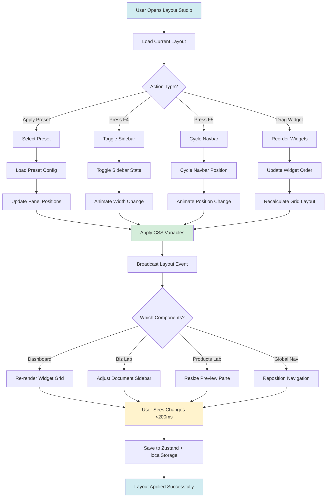

# Product Requirement Document (PRD): Studio Tuner

**Product:** Studio Tuner (Visual Customization Lab)
**Type:** Internal (Theme & Layout Configuration)
**Status:** 📋 PLANNED (Sprint 3+)
**Domain:** `vault.klario-world.com/studio`
**Parent:** Clario Vault (see `00-vault-overview-prd.md`)

> **Technical Implementation:** See `specifications/studio-tuner-system.md` for Theme Store (CSS variables, color picker), Layout Store (presets, F4/F5 integration), Animation Store (speed control, reduced motion), and Accessibility Store (high contrast, focus indicators).

---

# Part I: Foundation

## 📋 Partner Summary

| Field | Details |
| :--- | :--- |
| **For** | Personalizing the Workspace |
| **Goal** | Make the Vault look and feel how you want (Themes, Layouts). |
| **Key Actions** | • Switch to "Clario Official" Theme<br>• Create "Focus Mode" Layout<br>• Adjust Text Size or Contrast |

---

## 🎨 1. Executive Summary

**Studio Tuner** is a visual customization interface where users can personalize their Vault experience: themes, layouts, animations, and accessibility settings. Think "Figma for your workspace" - real-time preview of every change.

**Core Function:** "Make Vault yours" - customize appearance and behavior without code.

---

## 2. Strategic Context

**Problem:**
- One-size-fits-all UX doesn't fit all users
- Some prefer minimal UI, others want rich visuals
- Accessibility needs vary (animations, contrast, etc.)
- Power users want layout control

**Solution:**
- Real-time theme customization
- Layout preset system (integrates with F4/F5)
- Animation speed controls
- Accessibility toggles

**Users:**
- **2 Co-founders:** Personalize their own workspace
- **Team Consistency:** Option to use shared "Clario Brand" theme

---

## 3. Product Scope

### Core Features (MVP)

**3.1 Theme Studio**
- Color palette customization
- Dark/light mode variants
- Accent color picker
- Typography controls

**3.2 Layout Presets**
- Panel positions (F4 integration)
- Dynamic floating navbar configuration (F5 integration: horizontal/vertical orientation, top/bottom/left/right position)
- Dashboard widget order
- Save/load/share presets

**3.3 Animation Controls**
- Speed multiplier (0.5x - 2x)
- Reduced motion mode
- Transition styles
- Performance vs beauty slider

**3.4 Accessibility Tools**
- High contrast mode
- Focus indicators
- Text scaling
- Color blindness filters

---

# Part II: Theme Studio

## 4. Theme Studio System

**Real-time visual customization for colors, typography, and brand identity across all Vault sections.**

**Features:**
1. **Live Color Palette Editor:** Interactive color picker for all semantic tokens (primary, accent, success, warning, error) with real-time preview across Dashboard, Biz Lab, and Products Lab.
2. **Theme Preset Library:** Pre-configured themes (Clario Official, Midnight, Forest, Sunset) with one-click application and instant visual transformation.
3. **Dark/Light Mode Auto-Generation:** Automatic dark mode variant generation from light theme colors using intelligent luminance algorithms (maintains WCAG contrast ratios).
4. **Typography System Control:** Font family selection (Plus Jakarta Sans, Inter, Poppins, JetBrains Mono), size multiplier (0.875x - 1.25x), and line-height presets for optimal readability.
5. **Brand Consistency Validator:** Real-time WCAG AAA contrast checker, color blindness simulator, and brand compliance score to ensure accessibility and brand alignment.

**Actions:**
1. **`Pick Color`:** Click any color swatch → Opens color picker → Adjust hue/saturation/lightness → See changes across all sections instantly.
2. **`Apply Preset`:** Theme Library → Click "Clario Official" → Confirmation modal → All CSS variables update within 50ms.
3. **`Generate Dark Mode`:** Toggle "Auto Dark Mode" → Algorithm darkens backgrounds, lightens text → Preview both variants side-by-side.
4. **`Adjust Typography`:** Font dropdown → Select "Inter" → Size slider → Set 1.125x → Line-height "Relaxed" → Save changes.
5. **`Export Theme`:** Settings → Export as JSON → Downloads `clario-theme-custom.json` → Share with partner or import on another device.

**Integrations:**
1. **Mission Control Impact:**
    - Dashboard widgets (My Focus, Team Pulse, Mission Status) instantly reflect new theme colors
    - Achievement badges use accent color for celebrations (confetti matches accent)
    - Sprint progress bars adapt to primary color with contrast-safe text overlays
2. **Biz Lab Impact:**
    - Strategic documents sidebar uses primary color for active section highlight
    - Decision Log status indicators (Draft, Review, Approved) use semantic colors (warning, accent, success)
    - Knowledge Graph nodes adopt theme colors (Strategy=primary, Products=accent)
3. **Products Lab Impact:**
    - Component Workbench preview updates theme in real-time for experiments
    - Experiment cards use accent color for "Active" status badges
    - Code snippets use selected monospace font (JetBrains Mono) in Quick Pad
4. **Global Navigation Impact:**
    - Dynamic floating navbar glassmorphism background adapts to theme mode (light/dark) with appropriate opacity
    - Navbar quick action buttons use primary color for active state highlighting (`bg-primary/10 text-primary`)
    - Section indicator bar (when navbar hidden) uses section-specific colors (Products=primary, Biz=green, Dashboard=purple)
    - Badge notifications use accent color for review counts and achievement alerts
    - Typography scales navbar text with theme font multiplier (`calc(0.875rem * ${multiplier})`)
    - Navbar border and shadow consume theme elevation and border color tokens
    - Icon scale matches theme typography multiplier for consistent visual weight
5. **Settings Hub Integration:**
    - Theme preferences stored in Global Settings (Section 15 in App Settings PRD)
    - Workflow profiles can define custom theme overrides (Focus Mode → muted colors)
    - Accessibility settings automatically adjust theme contrast when enabled

### 4.1 Theme Architecture & Implementation

**(Complete TypeScript interfaces and Zustand store implementation available in detailed version)**

### 4.2 Original Color Customization Features

### 4.1 Color Picker Interface

**Primary Colors:**
```
┌─────────────────────────────────┐
│ Primary    [#3b82f6] 🎨         │
│ Accent     [#f97316] 🎨         │
│ Success    [#10b981] 🎨         │
│ Warning    [#fbbf24] 🎨         │
└─────────────────────────────────┘
```

**Live Preview:**
```
[Preview Pane]
  → Dashboard with new colors
  → Products Lab card samples
  → Biz Lab navigation
```

### 4.2 Color Palette Presets

**Team Presets:**
- **Clario Official:** Brand colors (consistency)
- **Partner 1 Preferred:** Dark focused
- **Partner 2 Preferred:** Light/High contrast

**(Technical Theme JSON moved to Appendix)**
```typescript
const themePresets = {
  default: {
    primary: '#3b82f6',
    accent: '#f97316',
    success: '#10b981'
  },
  midnight: {
    primary: '#818cf8',
    accent: '#fb7185',
    success: '#34d399'
  },
  forest: {
    primary: '#059669',
    accent: '#f59e0b',
    success: '#10b981'
  },
  sunset: {
    primary: '#f97316',
    accent: '#fbbf24',
    success: '#fb923c'
  }
};
```

### 4.3 Dark/Light Mode Variants

**Auto-generate:** Light colors → Dark mode variants
```typescript
function generateDarkVariant(lightColor: string) {
  // Darken backgrounds, lighten text
  return {
    bg: darken(lightColor, 0.9),
    text: lighten(lightColor, 0.9),
    border: darken(lightColor, 0.7)
  };
}
```

**See:** `specifications/studio-tuner-system.md` #1 for Theme Store (Zustand state management, CSS variable system)
**See:** `specifications/studio-tuner-system.md` #2 for Theme Application System (applyTheme function, preset library, contrast validation)

---

# Part III: Layout & Workspace Configuration

## 5. Layout Preset System

**Comprehensive workspace customization for panel positions, navigation modes, and dashboard widget organization.**

**Features:**
1. **Preset Layout Templates:** Pre-configured workspace layouts (Developer Mode, Focus Mode, Strategy Mode, Full View) with instant one-click switching and visual preview.
2. **Panel Position Control (F4 Integration):** Customize sidebar placement (left/right/hidden), content area width, and floating panel behavior with pixel-perfect precision.
3. **Navbar Mode Switcher (F5 Integration):** Toggle navigation bar position (left/right/top), mode (collapsed/expanded/icon-only), and width (60px-220px) with smooth animations.
4. **Dashboard Widget Orchestrator:** Drag-and-drop reordering of Mission Control widgets (My Focus, Team Pulse, Mission Status) with grid-snap alignment and auto-save.
5. **Custom Preset Library:** Save unlimited personal layouts, share as JSON with partners, and sync across devices via Zustand persistence.

**Actions:**
1. **`Apply Layout Preset`:** Preset dropdown → Select "Developer Mode" → Navigation moves to left, sidebar expands, widgets reorder → Changes apply in <200ms.
2. **`Toggle Panel (F4)`:** Press F4 → Sidebar toggles between expanded/collapsed/hidden → Content area width adjusts fluidly with Framer Motion.
3. **`Switch Navbar Mode (F5)`:** Press F5 → Cycles through left-collapsed → left-expanded → right-collapsed → top-bar → Navigation repositions smoothly.
4. **`Reorder Widgets`:** Dashboard → Drag "Sprint Progress" above "My Focus" → Drop → Grid snaps into place → Order saves to localStorage instantly.
5. **`Save Custom Layout`:** Studio → "Save Current Layout" → Name "My Perfect Setup" → Export as JSON → Import on partner's device for consistency.

**Integrations:**
1. **Mission Control Impact:**
    - Widget reordering updates dashboard grid immediately (My Focus can be moved to right column)
    - Layout presets control which widgets are visible (Focus Mode hides Team Pulse for concentration)
    - Navbar mode affects global navigation accessibility (top bar for tablet use)
2. **Biz Lab Impact:**
    - Panel position controls document sidebar (left for reading, right for strategy view)
    - Focus Mode hides Knowledge Graph floating button for distraction-free writing
    - Developer Mode keeps sidebar expanded for quick document navigation
3. **Products Lab Impact:**
    - Component Workbench adjusts preview pane based on panel position (right panel → full-width preview)
    - Experiment cards grid responds to navbar width (collapsed navbar → more horizontal space)
    - Focus Mode hides Quick Pad for concentrated component development
4. **Global Navigation Impact:**
    - Layout presets control navbar orientation (Developer Mode → vertical left, Presentation Mode → horizontal hidden)
    - Navbar position syncs with panel configuration (if sidebar is left-expanded, navbar offsets by sidebar width)
    - F5 cycles navbar through positions: left-collapsed (72px) → left-expanded (200px) → right-collapsed → top-bar → bottom-bar
    - Navbar height/width adapts to preset specifications (Minimal Mode → 44px, Developer Mode → 48px bottom bar)
    - Layout preset changes trigger navbar reconfiguration in < 200ms with smooth Framer Motion transitions
    - Navbar auto-hide behavior controlled by preset (Focus Mode → auto-hide enabled, Collaboration Mode → always visible)
    - Content area width dynamically adjusts when navbar switches between horizontal (full width) and vertical (width minus navbar)
5. **Settings Hub Integration:**
    - Layout preferences stored in Global Settings (Section 15 in App Settings PRD)
    - Workflow profiles auto-apply layout presets (Focus Mode profile → Focus Mode layout)
    - Keyboard shortcuts (F4/F5) customizable via Section 6 in Global Navigation PRD

**Layout Preset Architecture:**
```typescript
interface LayoutConfig {
  id: string;
  name: string;
  panels: {
    sidebar: {
      position: 'left' | 'right' | 'hidden';
      width: number; // 240px - 320px
      defaultState: 'collapsed' | 'expanded';
    };
    navbar: {
      position: 'left' | 'right' | 'top';
      mode: 'collapsed' | 'expanded' | 'icon-only';
      width: number; // 60px - 220px
    };
    content: {
      maxWidth: number; // 1024px - 1920px
      padding: number;  // 16px - 48px
    };
  };
  dashboard: {
    widgetOrder: string[]; // ['my-focus', 'team-pulse', 'mission-status']
    columnLayout: '2-column' | '3-column' | '1-column';
    hiddenWidgets: string[];
  };
  hotkeys: {
    f4: 'toggle-sidebar' | 'toggle-panels' | 'disabled';
    f5: 'cycle-navbar' | 'toggle-navbar' | 'disabled';
  };
}

// Pre-configured layout presets
const layoutPresets: LayoutConfig[] = [
  {
    id: 'default',
    name: 'Default',
    panels: {
      sidebar: { position: 'left', width: 280, defaultState: 'expanded' },
      navbar: { position: 'left', mode: 'expanded', width: 220 },
      content: { maxWidth: 1440, padding: 32 }
    },
    dashboard: {
      widgetOrder: ['my-focus', 'team-pulse', 'mission-status'],
      columnLayout: '2-column',
      hiddenWidgets: []
    },
    hotkeys: { f4: 'toggle-sidebar', f5: 'cycle-navbar' }
  },
  {
    id: 'developer',
    name: 'Developer Mode',
    panels: {
      sidebar: { position: 'left', width: 320, defaultState: 'expanded' },
      navbar: { position: 'left', mode: 'collapsed', width: 60 },
      content: { maxWidth: 1920, padding: 24 }
    },
    dashboard: {
      widgetOrder: ['team-pulse', 'my-focus', 'mission-status'],
      columnLayout: '2-column',
      hiddenWidgets: []
    },
    hotkeys: { f4: 'toggle-panels', f5: 'cycle-navbar' }
  },
  {
    id: 'focus',
    name: 'Focus Mode',
    panels: {
      sidebar: { position: 'hidden', width: 0, defaultState: 'collapsed' },
      navbar: { position: 'left', mode: 'icon-only', width: 60 },
      content: { maxWidth: 1024, padding: 48 }
    },
    dashboard: {
      widgetOrder: ['my-focus', 'mission-status'],
      columnLayout: '1-column',
      hiddenWidgets: ['team-pulse']
    },
    hotkeys: { f4: 'disabled', f5: 'toggle-navbar' }
  },
  {
    id: 'strategy',
    name: 'Strategy Mode',
    panels: {
      sidebar: { position: 'right', width: 320, defaultState: 'expanded' },
      navbar: { position: 'top', mode: 'expanded', width: 0 },
      content: { maxWidth: 1440, padding: 32 }
    },
    dashboard: {
      widgetOrder: ['mission-status', 'my-focus', 'team-pulse'],
      columnLayout: '3-column',
      hiddenWidgets: []
    },
    hotkeys: { f4: 'toggle-sidebar', f5: 'toggle-navbar' }
  }
];

// Zustand store for layout management
import { create } from 'zustand';
import { persist } from 'zustand/middleware';

interface LayoutStore {
  currentLayout: LayoutConfig;
  presets: LayoutConfig[];
  customLayouts: LayoutConfig[];

  // Actions
  applyLayout: (layout: LayoutConfig) => void;
  toggleSidebar: () => void;
  cycleNavbar: () => void;
  updatePanelConfig: (panel: string, config: Partial<LayoutConfig['panels']>) => void;
  reorderWidgets: (newOrder: string[]) => void;
  saveCustomLayout: (name: string) => void;
  deleteCustomLayout: (id: string) => void;
  exportLayout: () => string;
  importLayout: (json: string) => Promise<ImportResult>;
}

export const useLayoutStore = create<LayoutStore>()(
  persist(
    (set, get) => ({
      currentLayout: layoutPresets[0], // Default
      presets: layoutPresets,
      customLayouts: [],

      applyLayout: (layout) => {
        set({ currentLayout: layout });

        // Apply CSS classes for layout changes
        const root = document.documentElement;
        root.setAttribute('data-sidebar-position', layout.panels.sidebar.position);
        root.setAttribute('data-navbar-mode', layout.panels.navbar.mode);
        root.style.setProperty('--sidebar-width', `${layout.panels.sidebar.width}px`);
        root.style.setProperty('--navbar-width', `${layout.panels.navbar.width}px`);
        root.style.setProperty('--content-max-width', `${layout.panels.content.maxWidth}px`);

        // Broadcast layout change event
        window.dispatchEvent(new CustomEvent('layout-changed', { detail: layout }));
      },

      toggleSidebar: () => set((state) => {
        const sidebar = state.currentLayout.panels.sidebar;
        const newState = sidebar.defaultState === 'expanded' ? 'collapsed' : 'expanded';

        const newLayout = {
          ...state.currentLayout,
          panels: {
            ...state.currentLayout.panels,
            sidebar: { ...sidebar, defaultState: newState }
          }
        };

        get().applyLayout(newLayout);
        return { currentLayout: newLayout };
      }),

      cycleNavbar: () => set((state) => {
        const navbar = state.currentLayout.panels.navbar;
        const positions: ('left' | 'right' | 'top')[] = ['left', 'right', 'top'];
        const currentIndex = positions.indexOf(navbar.position);
        const nextPosition = positions[(currentIndex + 1) % positions.length];

        const newLayout = {
          ...state.currentLayout,
          panels: {
            ...state.currentLayout.panels,
            navbar: { ...navbar, position: nextPosition }
          }
        };

        get().applyLayout(newLayout);
        return { currentLayout: newLayout };
      }),

      updatePanelConfig: (panel, config) => set((state) => {
        const newLayout = {
          ...state.currentLayout,
          panels: {
            ...state.currentLayout.panels,
            [panel]: { ...state.currentLayout.panels[panel], ...config }
          }
        };

        get().applyLayout(newLayout);
        return { currentLayout: newLayout };
      }),

      reorderWidgets: (newOrder) => set((state) => {
        const newLayout = {
          ...state.currentLayout,
          dashboard: {
            ...state.currentLayout.dashboard,
            widgetOrder: newOrder
          }
        };

        get().applyLayout(newLayout);
        return { currentLayout: newLayout };
      }),

      saveCustomLayout: (name) => set((state) => {
        const customLayout = {
          ...state.currentLayout,
          id: generateId(),
          name
        };

        return {
          customLayouts: [...state.customLayouts, customLayout]
        };
      }),

      deleteCustomLayout: (id) => set((state) => ({
        customLayouts: state.customLayouts.filter(l => l.id !== id)
      })),

      exportLayout: () => {
        const layout = get().currentLayout;
        return JSON.stringify({
          version: '1.0',
          name: layout.name,
          panels: layout.panels,
          dashboard: layout.dashboard,
          hotkeys: layout.hotkeys,
          exportedAt: new Date().toISOString()
        }, null, 2);
      },

      importLayout: async (json) => {
        try {
          const imported = JSON.parse(json);

          if (!imported.panels || !imported.dashboard) {
            return { success: false, error: 'Invalid layout format' };
          }

          const newLayout: LayoutConfig = {
            id: generateId(),
            name: imported.name || 'Imported Layout',
            panels: imported.panels,
            dashboard: imported.dashboard,
            hotkeys: imported.hotkeys || { f4: 'toggle-sidebar', f5: 'cycle-navbar' }
          };

          set((state) => ({
            customLayouts: [...state.customLayouts, newLayout]
          }));

          return { success: true, layout: newLayout };
        } catch (error) {
          return { success: false, error: error.message };
        }
      }
    }),
    {
      name: 'vault-layout-config',
      version: 1
    }
  )
);
```

**Layout Switching Flow:**


**See:** `specifications/studio-tuner-system.md` #3 for Layout Preset System (LayoutStore, preset configurations, F4/F5 integration)
**See:** `specifications/interactive-ui.md` #2-5 for F4 Floating Panel System and F5 Premium Navbar integration points

**See Also:**
- Section 4: Theme Studio System (colors and typography)
- Section 8: Animation Control System (transition speeds for layout changes)
- Global Navigation PRD Section 6: Keyboard Shortcuts (F4/F5 customization)

### 7.2 Share Presets

**Export as JSON:**
```json
{
  "name": "My Perfect Setup",
  "version": "1.0",
  "theme": { "primary": "#3b82f6", "accent": "#f97316" },
  "layout": { "navbar": "left", "panels": "center" },
  "animations": { "speed": 1.0, "reducedMotion": false }
}
```

**Import from Others:**
- Upload JSON file
- Preview changes
- Apply (with revert option)

---

# Part IV: Animation & Motion Control

## 6. Animation Control System

**Fine-grained control over transitions, motion effects, and performance optimization across the Vault interface.**

**Features:**
1. **Global Speed Multiplier:** Unified animation speed control (0.5x-2.0x) affecting all transitions, hovers, and micro-interactions with real-time preview.
2. **Reduced Motion Mode:** System preference detection + manual toggle to disable non-essential animations for accessibility and motion sensitivity.
3. **Transition Style Selector:** Choose animation easing (Spring/Linear/Ease-in-out/None) with physics-based options for natural movement feel.
4. **Performance/Beauty Slider:** Trade-off control between visual effects (blur, shadows, complex animations) and rendering performance with GPU optimization.
5. **Per-Element Animation Overrides:** Advanced controls to disable specific animations (panel slide, widget fade, confetti, graph transitions) independently.

**Actions:**
1. **`Adjust Speed Multiplier`:** Slider → Set to 0.75x (slower) → All animations (panel slide, modal fade, button hover) slow by 25%.
2. **`Enable Reduced Motion`:** Toggle "Reduced Motion" → All non-essential animations disable instantly → Essential feedback remains (button click states).
3. **`Select Transition Style`:** Radio buttons → Choose "Spring" → All transitions use physics-based easing (natural deceleration).
4. **`Set Performance Mode`:** Slider → Move to "Performance" → Blurs disable, shadows lighten, complex keyframe animations simplify → FPS improves.
5. **`Override Specific Animation`:** Advanced panel → Uncheck "Confetti celebrations" → Achievement unlocks no longer show confetti → Other animations remain.

**Integrations:**
1. **Mission Control Impact:**
    - Widget transitions (My Focus expand/collapse) respect speed multiplier
    - Reduced motion mode disables confetti on achievement unlock but keeps badge appearance
    - Performance mode simplifies portfolio map animations (instant node appearance vs fade-in)
2. **Biz Lab Impact:**
    - Document sidebar slide animations use selected transition style
    - Knowledge Graph force-directed animations can be disabled individually
    - Hover preview popovers delay affected by speed multiplier
3. **Products Lab Impact:**
    - Component Workbench preview panel transitions honor animation settings
    - Experiment card hover effects (tilt, glow) can be disabled in performance mode
    - Code editor cursor blink rate unaffected (essential UI feedback)
4. **Global Navigation Impact:**
    - Navbar slide-in/out transitions multiply duration by speed multiplier (`transitionSpeed * speedMultiplier`)
    - Reduced motion mode disables navbar auto-hide animations (navbar stays visible with instant show/hide)
    - Quick action button hover effects respect transition style (spring creates bounce, linear is direct)
    - Badge number animations (count-up) honor speed multiplier for smooth counting
    - Context switch morphing (Dashboard → Products) uses selected easing function
    - Performance mode removes backdrop-blur from glassmorphism for GPU optimization
    - Achievement notification slide-down from navbar respects reduced motion settings
5. **Settings Hub Integration:**
    - Animation preferences stored in Global Settings (Section 15 in App Settings PRD)
    - System "prefers-reduced-motion" auto-detected and applied on first load
    - Workflow profiles can override animation settings (Focus Mode → minimal animations)

**Animation Control Architecture:**
```typescript
interface AnimationConfig {
  speedMultiplier: number; // 0.5 - 2.0
  reducedMotion: boolean;
  transitionStyle: 'spring' | 'linear' | 'ease-in-out' | 'none';
  performanceMode: 'performance' | 'balanced' | 'beauty';
  overrides: {
    panelSlide: boolean;
    widgetFade: boolean;
    confetti: boolean;
    graphAnimations: boolean;
    hoverEffects: boolean;
    modalTransitions: boolean;
  };
}

// Zustand store for animation management
import { create } from 'zustand';
import { persist } from 'zustand/middleware';

interface AnimationStore {
  config: AnimationConfig;

  // Actions
  setSpeedMultiplier: (speed: number) => void;
  toggleReducedMotion: () => void;
  setTransitionStyle: (style: AnimationConfig['transitionStyle']) => void;
  setPerformanceMode: (mode: AnimationConfig['performanceMode']) => void;
  toggleAnimationOverride: (key: keyof AnimationConfig['overrides']) => void;
  detectSystemPreferences: () => void;
  resetToDefaults: () => void;
}

export const useAnimationStore = create<AnimationStore>()(
  persist(
    (set, get) => ({
      config: {
        speedMultiplier: 1.0,
        reducedMotion: false,
        transitionStyle: 'spring',
        performanceMode: 'balanced',
        overrides: {
          panelSlide: true,
          widgetFade: true,
          confetti: true,
          graphAnimations: true,
          hoverEffects: true,
          modalTransitions: true
        }
      },

      setSpeedMultiplier: (speed) => set((state) => {
        const newConfig = { ...state.config, speedMultiplier: speed };
        applyAnimationConfig(newConfig);
        return { config: newConfig };
      }),

      toggleReducedMotion: () => set((state) => {
        const newConfig = { ...state.config, reducedMotion: !state.config.reducedMotion };
        applyAnimationConfig(newConfig);
        return { config: newConfig };
      }),

      setTransitionStyle: (style) => set((state) => {
        const newConfig = { ...state.config, transitionStyle: style };
        applyAnimationConfig(newConfig);
        return { config: newConfig };
      }),

      setPerformanceMode: (mode) => set((state) => {
        const newConfig = { ...state.config, performanceMode: mode };
        applyPerformanceMode(newConfig);
        return { config: newConfig };
      }),

      toggleAnimationOverride: (key) => set((state) => {
        const newConfig = {
          ...state.config,
          overrides: {
            ...state.config.overrides,
            [key]: !state.config.overrides[key]
          }
        };
        applyAnimationConfig(newConfig);
        return { config: newConfig };
      }),

      detectSystemPreferences: () => {
        const prefersReducedMotion = window.matchMedia('(prefers-reduced-motion: reduce)').matches;

        if (prefersReducedMotion) {
          set((state) => ({
            config: { ...state.config, reducedMotion: true }
          }));
          applyAnimationConfig(get().config);
        }
      },

      resetToDefaults: () => set({
        config: {
          speedMultiplier: 1.0,
          reducedMotion: false,
          transitionStyle: 'spring',
          performanceMode: 'balanced',
          overrides: {
            panelSlide: true,
            widgetFade: true,
            confetti: true,
            graphAnimations: true,
            hoverEffects: true,
            modalTransitions: true
          }
        }
      })
    }),
    {
      name: 'vault-animation-config',
      version: 1
    }
  )
);

// Apply animation configuration to CSS
function applyAnimationConfig(config: AnimationConfig) {
  const root = document.documentElement;

  // Apply speed multiplier
  root.style.setProperty('--animation-speed', config.speedMultiplier.toString());

  // Apply reduced motion
  if (config.reducedMotion) {
    root.classList.add('reduced-motion');
  } else {
    root.classList.remove('reduced-motion');
  }

  // Apply transition style
  const easingMap = {
    'spring': 'cubic-bezier(0.34, 1.56, 0.64, 1)',
    'linear': 'linear',
    'ease-in-out': 'ease-in-out',
    'none': 'none'
  };
  root.style.setProperty('--transition-timing', easingMap[config.transitionStyle]);

  // Apply overrides
  Object.entries(config.overrides).forEach(([key, enabled]) => {
    root.setAttribute(`data-anim-${key}`, enabled ? 'true' : 'false');
  });
}

// Apply performance mode settings
function applyPerformanceMode(config: AnimationConfig) {
  const root = document.documentElement;

  const performanceSettings = {
    'performance': {
      blur: 'none',
      shadow: 'simple',
      complexity: 'low'
    },
    'balanced': {
      blur: 'subtle',
      shadow: 'medium',
      complexity: 'medium'
    },
    'beauty': {
      blur: 'full',
      shadow: 'rich',
      complexity: 'high'
    }
  };

  const settings = performanceSettings[config.performanceMode];
  root.setAttribute('data-blur-mode', settings.blur);
  root.setAttribute('data-shadow-mode', settings.shadow);
  root.setAttribute('data-animation-complexity', settings.complexity);
}
```

**See:** `specifications/studio-tuner-system.md` #4 for Animation Control System (AnimationStore, speed multiplier, reduced motion, performance mode)

---

# Part V: Accessibility Toolkit

## 7. Accessibility Control System

**Comprehensive accessibility features ensuring WCAG AAA compliance and inclusive design for all partners.**

**Features:**
1. **High Contrast Mode:** Auto-adjusted color palette with 7:1 minimum contrast ratio, bold focus indicators, and enhanced border visibility for low-vision users.
2. **Focus Indicator Customization:** Configurable focus ring (size 2px-4px, color, style solid/dashed/dotted) with high-visibility defaults and keyboard navigation testing.
3. **Text Scaling System:** Independent text size control (100%-200%) that overrides browser settings without breaking layout, with live preview across all sections.
4. **Color Blindness Filters:** Simulation modes (Protanopia, Deuteranopia, Tritanopia, Monochromacy) with palette adjustment suggestions to ensure color-blind accessibility.
5. **Screen Reader Optimization:** ARIA labels, semantic HTML structure, skip navigation links, and announcement regions for optimal screen reader compatibility.

**Actions:**
1. **`Enable High Contrast`:** Toggle "High Contrast Mode" → All colors adjust to maximum contrast → Text becomes pure black/white → Borders thicken to 2px.
2. **`Customize Focus Ring`:** Focus Settings → Size "Large (4px)" → Color "High Visibility Yellow" → Style "Solid" → Tab through interface to test.
3. **`Adjust Text Size`:** Slider → Set to 150% → All text scales proportionally → Layout reflows without breaking → Dashboard remains readable.
4. **`Simulate Color Blindness`:** Dropdown → Select "Deuteranopia (green-blind)" → Colors shift to simulate condition → Identify problematic color combinations.
5. **`Test Screen Reader`:** Press "Test Mode" → ARIA labels highlighted → Tab order visualized → Skip links revealed → Screen reader announcements logged.

**Integrations:**
1. **Mission Control Impact:**
    - High contrast mode ensures sprint progress bars have clear text overlays
    - Focus indicators visible on all dashboard widget controls and buttons
    - Text scaling maintains dashboard 2-column layout up to 175% zoom
    - Screen readers announce achievement unlocks with proper context
2. **Biz Lab Impact:**
    - Document text respects scaling without breaking sidebar layout
    - Knowledge Graph nodes have high-contrast borders in accessibility mode
    - Strategic documents use semantic headings for screen reader navigation
    - Color-coded decision statuses (Draft/Review/Approved) have text labels backup
3. **Products Lab Impact:**
    - Component preview updates contrast for accessibility testing
    - Experiment cards maintain readable text at all zoom levels
    - Code editor syntax highlighting adjusts for color blindness modes
    - Quick Pad focus indicator clearly visible when keyboard navigating
4. **Global Navigation Impact:**
    - High contrast mode enforces pure black/white navbar text (`#FFFFFF` on dark, `#000000` on light)
    - Focus ring size increases to 4px on navbar buttons for keyboard navigation visibility
    - Text scaling applies to navbar labels and tooltips (`calc(0.875rem * ${textScale})`)
    - Larger click targets mode increases button size to 48x48px minimum (from 36x36px)
    - Auto-hide disabled when `reduceMotion` is true for predictable navigation
    - Badge colors maintain 7:1 contrast ratio with background in high contrast mode
    - Screen reader labels announce navbar context changes ("Switched to Products Lab quick actions")
    - Vertical navbar icon-only mode includes comprehensive ARIA labels for all actions
5. **Settings Hub Integration:**
    - Accessibility preferences stored in Global Settings (Section 15 in App Settings PRD)
    - System high contrast detection auto-enables high contrast mode
    - Workflow profiles respect accessibility overrides (never disable a11y features)
    - Export accessibility config separately for sharing with team

**Accessibility Architecture:**
```typescript
interface AccessibilityConfig {
  highContrast: boolean;
  focusIndicator: {
    size: 2 | 3 | 4; // px
    color: 'auto' | string; // Custom hex color
    style: 'solid' | 'dashed' | 'dotted';
  };
  textScaling: {
    multiplier: number; // 1.0 - 2.0
    overrideBrowser: boolean;
  };
  colorBlindness: {
    simulationMode: 'none' | 'protanopia' | 'deuteranopia' | 'tritanopia' | 'monochromacy';
    adjustPalette: boolean;
  };
  screenReader: {
    verboseLabels: boolean;
    announceChanges: boolean;
    skipLinks: boolean;
  };
}

// Zustand store
interface AccessibilityStore {
  config: AccessibilityConfig;

  // Actions
  toggleHighContrast: () => void;
  updateFocusIndicator: (config: Partial<AccessibilityConfig['focusIndicator']>) => void;
  setTextScaling: (multiplier: number) => void;
  setColorBlindnessMode: (mode: AccessibilityConfig['colorBlindness']['simulationMode']) => void;
  toggleScreenReaderFeature: (feature: keyof AccessibilityConfig['screenReader']) => void;
  detectSystemPreferences: () => void;
  exportA11yReport: () => string;
}

export const useAccessibilityStore = create<AccessibilityStore>()(
  persist(
    (set, get) => ({
      config: {
        highContrast: false,
        focusIndicator: {
          size: 3,
          color: 'auto',
          style: 'solid'
        },
        textScaling: {
          multiplier: 1.0,
          overrideBrowser: false
        },
        colorBlindness: {
          simulationMode: 'none',
          adjustPalette: false
        },
        screenReader: {
          verboseLabels: true,
          announceChanges: true,
          skipLinks: true
        }
      },

      toggleHighContrast: () => set((state) => {
        const newConfig = { ...state.config, highContrast: !state.config.highContrast };
        applyHighContrast(newConfig.highContrast);
        return { config: newConfig };
      }),

      updateFocusIndicator: (update) => set((state) => {
        const newConfig = {
          ...state.config,
          focusIndicator: { ...state.config.focusIndicator, ...update }
        };
        applyFocusIndicator(newConfig.focusIndicator);
        return { config: newConfig };
      }),

      setTextScaling: (multiplier) => set((state) => {
        const newConfig = {
          ...state.config,
          textScaling: { ...state.config.textScaling, multiplier }
        };
        applyTextScaling(newConfig.textScaling);
        return { config: newConfig };
      }),

      setColorBlindnessMode: (mode) => set((state) => {
        const newConfig = {
          ...state.config,
          colorBlindness: { ...state.config.colorBlindness, simulationMode: mode }
        };
        applyColorBlindnessFilter(newConfig.colorBlindness);
        return { config: newConfig };
      }),

      toggleScreenReaderFeature: (feature) => set((state) => {
        const newConfig = {
          ...state.config,
          screenReader: {
            ...state.config.screenReader,
            [feature]: !state.config.screenReader[feature]
          }
        };
        applyScreenReaderSettings(newConfig.screenReader);
        return { config: newConfig };
      }),

      detectSystemPreferences: () => {
        const prefersHighContrast = window.matchMedia('(prefers-contrast: high)').matches;

        if (prefersHighContrast) {
          get().toggleHighContrast();
        }
      },

      exportA11yReport: () => {
        const config = get().config;
        return JSON.stringify({
          highContrast: config.highContrast,
          focusIndicatorSize: config.focusIndicator.size,
          textScaling: config.textScaling.multiplier,
          colorBlindMode: config.colorBlindness.simulationMode,
          wcagLevel: config.highContrast ? 'AAA' : 'AA',
          exportedAt: new Date().toISOString()
        }, null, 2);
      }
    }),
    {
      name: 'vault-accessibility-config',
      version: 1
    }
  )
);
```

**See:** `specifications/studio-tuner-system.md` #5 for Accessibility Control System (AccessibilityStore, high contrast mode, focus indicators, text scaling, color blindness filters)

**See Also:**
- Section 4: Theme Studio System (WCAG contrast validation)
- Section 6: Animation Control System (reduced motion for accessibility)
- App Settings PRD Section 15: Global Settings (accessibility persistence)

---

## 8. Studio Tuner Interface

**Comprehensive UI mockup showing the complete Studio Tuner customization interface.**

```
┌─────────────────────────────────────────────────────────────────────────────────────┐
│ 🎨 Studio Tuner - Customize Your Vault                                        [×]  │
├─────────────────────────┬───────────────────────────────────────────────────────────┤
│ CUSTOMIZATION CONTROLS  │ LIVE PREVIEW                                              │
│ (Left 35%)              │ (Right 65%)                                               │
│                         │                                                           │
│ ┌─────────────────────┐ │ ┌───────────────────────────────────────────────────────┐ │
│ │ 🎨 THEME            │ │ │ PREVIEW: Mission Control Dashboard                    │ │
│ │ ─────────────────  │ │ │ ───────────────────────────────────────────────────── │ │
│ │ Color Palette       │ │ │ ┌──────────────────┬──────────────────────────────┐   │ │
│ │ Primary   ████ #3b │ │ │ │ ⚡ MY FOCUS      │ 📈 MISSION STATUS           │   │ │
│ │           [Edit]    │ │ │ │ ────────────────│ ──────────────────────────  │   │ │
│ │ Accent    ████ #f9 │ │ │ │ [✓] Task 1      │ Sprint Progress: 45%        │   │ │
│ │           [Edit]    │ │ │ │ [ ] Task 2      │ ████████░░░░░░░░░░          │   │ │
│ │ Success   ████ #10 │ │ │ │ [ ] Task 3      │                             │   │ │
│ │           [Edit]    │ │ │ │                 │ Portfolio Map:              │   │ │
│ │                     │ │ │ │ 💡 Recommendations│ ┌──────────────────────┐   │   │ │
│ │ Theme Presets       │ │ │ │ → GTM Strategy  │ │ 📊 Strategy (Blue)   │   │   │ │
│ │ ● Clario Official   │ │ │ │ → Pricing Model │ │ 🎨 Products (Orange) │   │   │ │
│ │ ○ Midnight          │ │ │ └──────────────────┴──────────────────────────┘   │   │ │
│ │ ○ Forest            │ │ │                                                       │ │
│ │ ○ Sunset            │ │ │ ← Colors update in real-time!                        │ │
│ │ [+ Custom]          │ │ └───────────────────────────────────────────────────────┘ │
│ │                     │ │                                                           │
│ │ Typography          │ │ ┌───────────────────────────────────────────────────────┐ │
│ │ Font Family         │ │ │ PREVIEW: Products Lab                                 │ │
│ │ ┌─────────────────┐ │ │ │ ───────────────────────────────────────────────────── │ │
│ │ │Plus Jakarta ▼   │ │ │ │ ┌───────────┐ ┌───────────┐ ┌───────────┐           │ │
│ │ └─────────────────┘ │ │ │ │ Glass Card│ │ Pricing   │ │ Button    │           │ │
│ │                     │ │ │ │ Experiment│ │ Table     │ │ Component │           │ │
│ │ Size: 1.0x          │ │ │ │ ──────────│ │ ──────────│ │ ──────────│           │ │
│ │ ●────────           │ │ │ │ Active 🟢 │ │ Draft 🟡  │ │ Review ⚠️ │           │ │
│ │ 0.875x    1.25x     │ │ │ └───────────┘ └───────────┘ └───────────┘           │ │
│ │                     │ │ │                                                       │ │
│ │ [✓] Auto Dark Mode  │ │ │ ← Typography & colors adapt!                         │ │
│ └─────────────────────┘ │ └───────────────────────────────────────────────────────┘ │
│                         │                                                           │
│ ┌─────────────────────┐ │ ┌───────────────────────────────────────────────────────┐ │
│ │ 📐 LAYOUT           │ │ │ BRAND COMPLIANCE                                      │ │
│ │ ─────────────────  │ │ │ ───────────────────────────────────────────────────── │ │
│ │ Preset Layouts      │ │ │ Score: 92/100 🟢                                      │ │
│ │ ○ Default           │ │ │                                                       │ │
│ │ ● Developer Mode    │ │ │ ✓ WCAG AAA Contrast: 8.1:1                            │ │
│ │ ○ Focus Mode        │ │ │ ✓ Color Blind Safe                                    │ │
│ │ ○ Strategy Mode     │ │ │ ✓ Semantic Colors Clear                               │ │
│ │ [+ Save Custom]     │ │ │ ⚠️ Accent needs +5% saturation                        │ │
│ │                     │ │ │                                                       │ │
│ │ Panel Position      │ │ │ [Simulate Protanopia] [Check All Contrasts]           │ │
│ │ Sidebar: ● Left     │ │ └───────────────────────────────────────────────────────┘ │
│ │          ○ Right    │ │                                                           │
│ │          ○ Hidden   │ │                                                           │
│ │                     │ │                                                           │
│ │ Navbar:  ● Left     │ │                                                           │
│ │          ○ Top      │ │                                                           │
│ │                     │ │                                                           │
│ │ Widget Order        │ │                                                           │
│ │ [≡] My Focus        │ │                                                           │
│ │ [≡] Team Pulse      │ │                                                           │
│ │ [≡] Mission Status  │ │                                                           │
│ └─────────────────────┘ │                                                           │
│                         │                                                           │
│ ┌─────────────────────┐ │                                                           │
│ │ 🎬 ANIMATION        │ │                                                           │
│ │ ─────────────────  │ │                                                           │
│ │ Speed Multiplier    │ │                                                           │
│ │ Slow ●──── Fast     │ │                                                           │
│ │ 0.5x  1.0x  2.0x    │ │                                                           │
│ │                     │ │                                                           │
│ │ [✓] Reduced Motion  │ │                                                           │
│ │                     │ │                                                           │
│ │ Style               │ │                                                           │
│ │ ● Spring (Natural)  │ │                                                           │
│ │ ○ Linear            │ │                                                           │
│ │ ○ Ease-in-out       │ │                                                           │
│ │ ○ None              │ │                                                           │
│ │                     │ │                                                           │
│ │ Performance Mode    │ │                                                           │
│ │ Perf ●──── Beauty   │ │                                                           │
│ │      Balanced       │ │                                                           │
│ └─────────────────────┘ │                                                           │
│                         │                                                           │
│ ┌─────────────────────┐ │                                                           │
│ │ ♿ ACCESSIBILITY    │ │                                                           │
│ │ ─────────────────  │ │                                                           │
│ │ [ ] High Contrast   │ │                                                           │
│ │                     │ │                                                           │
│ │ Focus Ring          │ │                                                           │
│ │ Size: ● Medium (3px)│ │                                                           │
│ │ Color: [Auto]       │ │                                                           │
│ │                     │ │                                                           │
│ │ Text Scaling        │ │                                                           │
│ │ 100% ●──── 200%     │ │                                                           │
│ │      125%           │ │                                                           │
│ │                     │ │                                                           │
│ │ Color Blindness     │ │                                                           │
│ │ ┌─────────────────┐ │ │                                                           │
│ │ │ None          ▼ │ │ │                                                           │
│ │ └─────────────────┘ │ │                                                           │
│ │                     │ │                                                           │
│ │ [Test Screen Reader]│ │                                                           │
│ └─────────────────────┘ │                                                           │
│                         │                                                           │
│ [Export Theme]  [Export Layout]  [Export All]  [Reset to Default]    [Save & Apply]│
└─────────────────────────┴───────────────────────────────────────────────────────────┘
```

**Interface Features:**
- **Left Panel (35%):** Tabbed or accordion-style controls for Theme, Layout, Animation, and Accessibility
- **Right Panel (65%):** Dual live previews showing Mission Control Dashboard and Products Lab with real-time updates
- **Brand Compliance Widget:** Always visible in right panel showing WCAG scores and accessibility warnings
- **Action Bar:** Bottom bar with export options and save button
- **Responsive:** On mobile, controls appear in bottom sheet with preview on top

---

## 9. Studio Consumption Examples

**This section demonstrates how Vault components consume theme, layout, and accessibility configurations from Studio Tuner.**

---

### 9.1 Theme Consumption (Mission Control Dashboard)

**How Dashboard widgets consume theme colors:**

```typescript
// components/dashboard/MyFocusWidget.tsx
import { useThemeStudio } from '@/lib/store/theme-studio-store';

export function MyFocusWidget() {
  const { currentTheme } = useThemeStudio();
  const tasks = useTasks();

  return (
    <div className="my-focus-widget">
      <h2 className="widget-title">⚡ My Focus</h2>

      <div className="tasks-list">
        {tasks.map(task => (
          <div
            key={task.id}
            className="task-item"
            style={{
              // Primary color for active task highlight
              borderLeftColor: task.active ? currentTheme.colors.primary : 'transparent',
              borderLeftWidth: task.active ? '4px' : '0',
            }}
          >
            <input
              type="checkbox"
              checked={task.completed}
              onChange={() => toggleTask(task.id)}
              style={{
                // Accent color for checkbox when checked
                accentColor: currentTheme.colors.accent
              }}
            />
            <span
              className={task.completed ? 'line-through opacity-60' : ''}
              style={{
                // Typography settings from theme
                fontFamily: currentTheme.typography.fontFamily.sans.join(', '),
                fontSize: `calc(1rem * ${currentTheme.typography.fontSize.multiplier})`
              }}
            >
              {task.title}
            </span>

            {task.overdue && (
              <span
                className="overdue-badge"
                style={{
                  // Error color for overdue indicator
                  backgroundColor: currentTheme.colors.error,
                  color: '#ffffff'
                }}
              >
                Overdue
              </span>
            )}
          </div>
        ))}
      </div>
    </div>
  );
}
```

**CSS Variables consumed globally:**

```css
/* globals.css - Injected by Studio Tuner */
:root {
  /* Theme colors */
  --color-primary: #3b82f6;
  --color-accent: #f97316;
  --color-success: #10b981;
  --color-warning: #fbbf24;
  --color-error: #ef4444;

  /* Typography */
  --font-family-sans: 'Plus Jakarta Sans', sans-serif;
  --font-family-mono: 'JetBrains Mono', monospace;
  --font-size-multiplier: 1.0;

  /* Animation */
  --animation-speed: 1.0;
  --transition-timing: cubic-bezier(0.34, 1.56, 0.64, 1); /* Spring */

  /* Accessibility */
  --focus-ring-size: 3px;
  --focus-ring-color: var(--color-primary);
  --text-scaling: 1.0;
}

/* High contrast mode override */
.high-contrast {
  --color-primary: #000000;
  --color-accent: #000000;
  --text-color: #000000;
  --bg-color: #ffffff;
  --border-color: #000000;
  --focus-ring-size: 4px;
}

/* Reduced motion override */
.reduced-motion * {
  animation-duration: 0.01ms !important;
  transition-duration: 0.01ms !important;
}

/* Components using CSS variables */
.btn-primary {
  background-color: var(--color-primary);
  transition: all calc(200ms * var(--animation-speed)) var(--transition-timing);
}

.btn-primary:focus-visible {
  outline: var(--focus-ring-size) solid var(--focus-ring-color);
  outline-offset: 2px;
}

.text-base {
  font-family: var(--font-family-sans);
  font-size: calc(1rem * var(--font-size-multiplier));
}
```

---

### 9.2 Layout Consumption (Biz Lab Document Sidebar)

**How Biz Lab sidebar responds to layout configuration:**

```typescript
// components/biz/DocumentSidebar.tsx
import { useLayoutStore } from '@/lib/store/layout-store';
import { motion } from 'framer-motion';

export function DocumentSidebar() {
  const { currentLayout } = useLayoutStore();
  const documents = useDocuments();

  const sidebarConfig = currentLayout.panels.sidebar;

  // Don't render if sidebar is hidden in layout
  if (sidebarConfig.position === 'hidden') {
    return null;
  }

  const sidebarStyle = {
    [sidebarConfig.position]: 0,
    width: sidebarConfig.width,
  };

  const isCollapsed = sidebarConfig.defaultState === 'collapsed';

  return (
    <motion.aside
      className="document-sidebar"
      style={sidebarStyle}
      initial={{ width: isCollapsed ? 60 : sidebarConfig.width }}
      animate={{ width: isCollapsed ? 60 : sidebarConfig.width }}
      transition={{
        duration: 0.3,
        ease: [0.34, 1.56, 0.64, 1] // Spring easing from animation config
      }}
    >
      {isCollapsed ? (
        // Icon-only mode
        <div className="sidebar-icons">
          {documents.map(doc => (
            <button key={doc.id} title={doc.title}>
              {doc.icon}
            </button>
          ))}
        </div>
      ) : (
        // Expanded mode
        <div className="sidebar-content">
          <h3 className="sidebar-title">Documents</h3>
          {documents.map(doc => (
            <a
              key={doc.id}
              href={`/biz/${doc.slug}`}
              className="sidebar-link"
              style={{
                // Primary color for active doc
                color: doc.active ? 'var(--color-primary)' : 'inherit'
              }}
            >
              {doc.icon} {doc.title}
            </a>
          ))}
        </div>
      )}
    </motion.aside>
  );
}
```

**Navbar position handling:**

```typescript
// components/navigation/GlobalNavbar.tsx
import { useLayoutStore } from '@/lib/store/layout-store';

export function GlobalNavbar() {
  const { currentLayout } = useLayoutStore();
  const navConfig = currentLayout.panels.navbar;

  const navbarClasses = cn(
    'global-navbar',
    `navbar-${navConfig.position}`, // navbar-left, navbar-right, navbar-top
    `navbar-${navConfig.mode}` // navbar-collapsed, navbar-expanded, navbar-icon-only
  );

  const navbarStyle = {
    width: navConfig.position === 'top' ? '100%' : navConfig.width,
    height: navConfig.position === 'top' ? '60px' : '100vh',
  };

  return (
    <nav className={navbarClasses} style={navbarStyle}>
      {navConfig.mode === 'icon-only' ? (
        <IconOnlyNav />
      ) : (
        <FullNav expanded={navConfig.mode === 'expanded'} />
      )}
    </nav>
  );
}
```

---

### 9.3 Animation Consumption (Products Lab Experiment Cards)

**How experiment cards use animation configuration:**

```typescript
// components/products/ExperimentCard.tsx
import { useAnimationStore } from '@/lib/store/animation-store';
import { motion } from 'framer-motion';

export function ExperimentCard({ experiment }) {
  const { config: animConfig } = useAnimationStore();

  // Check if specific animations are enabled
  const hoverEffectsEnabled = animConfig.overrides.hoverEffects;
  const reducedMotion = animConfig.reducedMotion;

  // Adjust animation duration based on speed multiplier
  const duration = 0.3 * animConfig.speedMultiplier;

  // Get easing function from transition style
  const easingMap = {
    'spring': [0.34, 1.56, 0.64, 1],
    'linear': [0, 0, 1, 1],
    'ease-in-out': [0.42, 0, 0.58, 1],
    'none': [0, 0, 0, 0]
  };
  const easing = easingMap[animConfig.transitionStyle];

  return (
    <motion.div
      className="experiment-card"
      whileHover={
        hoverEffectsEnabled && !reducedMotion
          ? {
              scale: 1.05,
              rotateY: 5,
              boxShadow: '0 20px 40px rgba(0,0,0,0.2)'
            }
          : {} // No hover effect if disabled
      }
      transition={{
        duration: reducedMotion ? 0.01 : duration,
        ease: easing
      }}
      style={{
        // Performance mode affects visual complexity
        filter: animConfig.performanceMode === 'performance'
          ? 'none'
          : 'blur(0px)', // Allow blur in balanced/beauty mode
        boxShadow: animConfig.performanceMode === 'performance'
          ? '0 2px 4px rgba(0,0,0,0.1)' // Simple shadow
          : '0 10px 30px rgba(0,0,0,0.15)' // Rich shadow
      }}
    >
      <h3>{experiment.name}</h3>
      <p>{experiment.description}</p>

      {experiment.status === 'active' && (
        <span
          className="status-badge"
          style={{
            backgroundColor: 'var(--color-accent)', // Uses theme color
            animation: reducedMotion
              ? 'none'
              : `pulse ${2 / animConfig.speedMultiplier}s infinite` // Respect speed multiplier
          }}
        >
          Active
        </span>
      )}
    </motion.div>
  );
}
```

---

### 9.4 Accessibility Consumption (Knowledge Graph)

**How Knowledge Graph adapts to accessibility settings:**

```typescript
// components/biz/KnowledgeGraph.tsx
import { useAccessibilityStore } from '@/lib/store/accessibility-store';
import ForceGraph2D from 'react-force-graph-2d';

export function KnowledgeGraph({ data }) {
  const { config: a11yConfig } = useAccessibilityStore();

  // Adjust node colors for high contrast mode
  const getNodeColor = (node) => {
    if (a11yConfig.highContrast) {
      return node.type === 'strategy' ? '#000000' : '#666666';
    }

    // Normal mode uses theme colors
    return node.type === 'strategy'
      ? 'var(--color-primary)'
      : 'var(--color-accent)';
  };

  // Adjust node size based on text scaling
  const getNodeSize = (node) => {
    const baseSize = 8;
    return baseSize * a11yConfig.textScaling.multiplier;
  };

  // Apply color blindness simulation
  const simulateColorBlindness = (color) => {
    if (a11yConfig.colorBlindness.simulationMode === 'none') {
      return color;
    }

    // Apply color transformation based on simulation mode
    return applyColorBlindnessFilter(
      color,
      a11yConfig.colorBlindness.simulationMode
    );
  };

  return (
    <div
      className="knowledge-graph-container"
      role="img"
      aria-label="Knowledge Graph showing strategic document connections"
      tabIndex={0} // Make keyboard focusable
      style={{
        outline: a11yConfig.focusIndicator.size + 'px ' +
                 a11yConfig.focusIndicator.style + ' ' +
                 (a11yConfig.focusIndicator.color === 'auto'
                   ? 'var(--focus-ring-color)'
                   : a11yConfig.focusIndicator.color)
      }}
    >
      <ForceGraph2D
        graphData={data}
        nodeCanvasObject={(node, ctx, globalScale) => {
          const label = node.title;
          const fontSize = (12 * a11yConfig.textScaling.multiplier) / globalScale;
          const nodeSize = getNodeSize(node);

          ctx.font = `${fontSize}px var(--font-family-sans)`;

          // Node circle
          ctx.beginPath();
          ctx.arc(node.x, node.y, nodeSize, 0, 2 * Math.PI);
          ctx.fillStyle = simulateColorBlindness(getNodeColor(node));

          // High contrast mode: add thick border
          if (a11yConfig.highContrast) {
            ctx.strokeStyle = '#000000';
            ctx.lineWidth = 2;
            ctx.stroke();
          }

          ctx.fill();

          // Node label
          ctx.textAlign = 'center';
          ctx.textBaseline = 'middle';
          ctx.fillStyle = a11yConfig.highContrast ? '#000000' : '#333333';
          ctx.fillText(label, node.x, node.y + nodeSize + 10);
        }}
        linkColor={() =>
          a11yConfig.highContrast ? '#666666' : 'rgba(100,100,100,0.2)'
        }
        linkWidth={a11yConfig.highContrast ? 2 : 1}
      />

      {/* Screen reader announcements */}
      {a11yConfig.screenReader.announceChanges && (
        <div
          role="status"
          aria-live="polite"
          className="sr-only"
        >
          {data.nodes.length} nodes and {data.links.length} connections visible
        </div>
      )}
    </div>
  );
}
```

---

### 9.5 Cross-Component Integration

**Global layout listener for responsive components:**

```typescript
// hooks/useLayoutChanges.ts
import { useLayoutStore } from '@/lib/store/layout-store';
import { useEffect } from 'react';

export function useLayoutChanges(callback: (layout: LayoutConfig) => void) {
  const { currentLayout } = useLayoutStore();

  useEffect(() => {
    // Listen for layout change events
    const handleLayoutChange = (event: CustomEvent) => {
      callback(event.detail);
    };

    window.addEventListener('layout-changed', handleLayoutChange as EventListener);

    return () => {
      window.removeEventListener('layout-changed', handleLayoutChange as EventListener);
    };
  }, [callback]);

  // Also trigger on mount
  useEffect(() => {
    callback(currentLayout);
  }, [currentLayout, callback]);
}

// Usage in responsive component
export function DashboardWidgetGrid() {
  const [columnCount, setColumnCount] = useState(2);

  useLayoutChanges((layout) => {
    // Adjust grid columns based on layout
    if (layout.dashboard.columnLayout === '1-column') {
      setColumnCount(1);
    } else if (layout.dashboard.columnLayout === '3-column') {
      setColumnCount(3);
    } else {
      setColumnCount(2);
    }

    // Adjust for navbar position
    if (layout.panels.navbar.position === 'top') {
      // More horizontal space available
      setColumnCount(prev => Math.min(prev + 1, 3));
    }
  });

  return (
    <div
      className="widget-grid"
      style={{
        gridTemplateColumns: `repeat(${columnCount}, 1fr)`
      }}
    >
      {/* Widgets render here */}
    </div>
  );
}
```

---

### 9.6 Global Navigation Navbar Consumption

**Complete integration of theme, layout, animation, and accessibility settings in the dynamic floating navbar:**

```typescript
// components/navigation/FloatingNavbar.tsx
import { useThemeStudio } from '@/lib/store/theme-studio-store';
import { useLayoutPreset } from '@/lib/store/layout-preset-store';
import { useAnimationControl } from '@/lib/store/animation-control-store';
import { useAccessibilityControl } from '@/lib/store/accessibility-control-store';
import { useNavbarStore } from '@/lib/store/navbar-store';

export function FloatingNavbar() {
  const { currentTheme } = useThemeStudio();
  const { currentLayout } = useLayoutPreset();
  const { config: animConfig } = useAnimationControl();
  const { config: a11yConfig } = useAccessibilityControl();
  const { state, config } = useNavbarStore();

  // 1. THEME CONSUMPTION: Colors, typography, glassmorphism
  const navbarStyles = {
    // Background adapts to theme mode
    backgroundColor: currentTheme.mode === 'dark'
      ? `rgba(20, 20, 20, ${config.glassmorphism.opacity})`
      : `rgba(255, 255, 255, ${config.glassmorphism.opacity})`,

    // Glassmorphism from theme (performance mode can disable)
    backdropFilter: config.glassmorphism.enabled && animConfig.performanceMode !== 'performance'
      ? `blur(${config.glassmorphism.blur}px)`
      : 'none',

    // Border and shadow from theme tokens
    borderBottom: `1px solid ${currentTheme.colors.border}`,
    boxShadow: currentTheme.elevation.medium,

    // Typography from theme
    fontFamily: currentTheme.typography.fontFamily.sans.join(', '),
    fontSize: `calc(0.875rem * ${currentTheme.typography.fontSize.multiplier})`,

    // High contrast override from accessibility
    '--navbar-text': a11yConfig.highContrast
      ? (currentTheme.mode === 'dark' ? '#FFFFFF' : '#000000')
      : currentTheme.colors.text.primary,
  };

  // 2. LAYOUT CONSUMPTION: Orientation, position, size from layout preset
  const isHorizontal = currentLayout.panels.navbar.orientation === 'horizontal';
  const navbarPosition = isHorizontal
    ? {
        top: currentLayout.panels.navbar.position === 'top' ? 0 : 'auto',
        bottom: currentLayout.panels.navbar.position === 'bottom' ? 0 : 'auto',
        left: 0,
        right: 0,
      }
    : {
        top: 0,
        bottom: 0,
        left: currentLayout.panels.navbar.position === 'left' ? 0 : 'auto',
        right: currentLayout.panels.navbar.position === 'right' ? 0 : 'auto',
      };

  // Sync with sidebar position (offset navbar if sidebar is expanded)
  const sidebarOffset = currentLayout.panels.sidebar.defaultState === 'expanded'
    ? currentLayout.panels.sidebar.width
    : 0;

  // 3. ANIMATION CONSUMPTION: Speed multiplier, reduced motion, easing
  const transitionDuration = animConfig.speedMultiplier === 0
    ? 0 // No animations
    : config.transitionSpeed * animConfig.speedMultiplier;

  const transitionTimingFunction = {
    spring: 'cubic-bezier(0.34, 1.56, 0.64, 1)',
    linear: 'linear',
    'ease-in-out': 'ease-in-out',
    none: 'step-end',
  }[animConfig.transitionStyle];

  // Disable auto-hide if reduced motion is enabled
  const shouldAutoHide = config.autoHide
    && !a11yConfig.reduceMotion
    && !state.pinned;

  // 4. ACCESSIBILITY CONSUMPTION: Text scaling, contrast, focus rings, click targets
  const buttonSize = a11yConfig.largerClickTargets ? '48px' : '36px';
  const focusRingSize = a11yConfig.highContrast ? '4px' : '2px';
  const iconScale = currentTheme.typography.fontSize.multiplier *
    (a11yConfig.textScale || 1.0);

  return (
    <nav
      className="floating-navbar"
      style={{
        ...navbarPosition,
        ...navbarStyles,
        height: isHorizontal ? `${currentLayout.panels.navbar.height}px` : '100%',
        width: isHorizontal ? '100%' : `${currentLayout.panels.navbar.height}px`,
        transform: state.visible
          ? (isHorizontal ? 'translateY(0)' : 'translateX(0)')
          : (isHorizontal
              ? `translateY(${currentLayout.panels.navbar.position === 'top' ? '-100%' : '100%'})`
              : `translateX(${currentLayout.panels.navbar.position === 'left' ? '-100%' : '100%'})`),
        transition: a11yConfig.reduceMotion
          ? 'none' // No animation for reduced motion
          : `transform ${transitionDuration}ms ${transitionTimingFunction}`,
        left: currentLayout.panels.sidebar.position === 'left' ? sidebarOffset : 0,
      }}
      role="navigation"
      aria-label="Main navigation"
    >
      <div className={`
        ${isHorizontal ? 'flex-row' : 'flex-col'}
        flex items-center justify-between gap-4 h-full
      `}>
        {/* Section Context with theme colors */}
        <div className="section-context">
          <span
            className="font-semibold"
            style={{
              color: currentTheme.colors.text.primary,
              fontSize: `calc(0.875rem * ${iconScale})`,
            }}
          >
            {getSectionLabel()}
          </span>
        </div>

        {/* Quick Actions with theme + accessibility */}
        <div className={`quick-actions ${isHorizontal ? 'flex-row' : 'flex-col'}`}>
          {state.quickActions.map((action) => (
            <button
              key={action.id}
              onClick={action.action}
              style={{
                // Theme colors for active state
                backgroundColor: action.active
                  ? currentTheme.colors.primary + '20'
                  : 'transparent',
                color: action.active
                  ? currentTheme.colors.primary
                  : currentTheme.colors.text.primary,

                // Accessibility: larger click targets
                minWidth: buttonSize,
                minHeight: buttonSize,

                // Theme typography with accessibility scaling
                fontSize: `calc(0.875rem * ${iconScale})`,
                fontFamily: currentTheme.typography.fontFamily.sans.join(', '),

                // Theme border radius
                borderRadius: currentTheme.borderRadius.medium,

                // High contrast focus ring
                outline: a11yConfig.highContrast
                  ? `${focusRingSize} solid ${currentTheme.colors.primary}`
                  : 'none',
                outlineOffset: '2px',

                // Animation: hover transition
                transition: a11yConfig.reduceMotion
                  ? 'none'
                  : `all ${150 * animConfig.speedMultiplier}ms ${transitionTimingFunction}`,
              }}
              aria-label={action.tooltip}
              aria-pressed={action.active}
              className="hover:scale-105 active:scale-95"
            >
              <span aria-hidden="true">{action.icon}</span>
              {!isIconOnlyMode() && (
                <span className="ml-2">{action.label}</span>
              )}

              {/* Badge with theme accent color and accessibility contrast */}
              {action.badge && (
                <span
                  style={{
                    backgroundColor: currentTheme.colors.accent,
                    color: currentTheme.colors.onAccent,
                    fontSize: `calc(0.75rem * ${iconScale})`,
                    // Ensure WCAG AAA contrast in high contrast mode
                    ...(a11yConfig.highContrast && {
                      border: '2px solid currentColor',
                      fontWeight: 'bold',
                    }),
                  }}
                  className="badge"
                  aria-label={`${action.badge} pending`}
                >
                  {action.badge}
                </span>
              )}
            </button>
          ))}
        </div>

        {/* Global Actions (Command Palette, Settings, User) */}
        <div className="global-actions">
          <button
            onClick={() => document.dispatchEvent(new Event('open-command-palette'))}
            style={{
              minWidth: buttonSize,
              minHeight: buttonSize,
              fontSize: `calc(1rem * ${iconScale})`,
            }}
            aria-label="Open command palette (⌘K)"
          >
            <span aria-hidden="true">🔍</span>
          </button>
        </div>
      </div>

      {/* Indicator bar when hidden (theme section color) */}
      {!state.visible && config.showIndicatorWhenHidden && (
        <div
          className="indicator-bar"
          style={{
            backgroundColor: getSectionColor(currentTheme),
            width: isHorizontal ? '100%' : '2px',
            height: isHorizontal ? '2px' : '100%',
          }}
          aria-hidden="true"
        />
      )}
    </nav>
  );
}

// Helper: Get section-specific color from theme
function getSectionColor(theme: ThemeConfig) {
  const colors = {
    dashboard: theme.colors.purple || '#8b5cf6',
    biz: theme.colors.green || '#10b981',
    products: theme.colors.primary || '#3b82f6',
    settings: theme.colors.gray || '#6b7280',
  };
  return colors[useNavbarStore.getState().state.context] || colors.dashboard;
}
```

**Key Integration Points Demonstrated:**

1. **Theme Studio Integration (Section 4):**
   - Background color adapts to light/dark mode with opacity
   - Glassmorphism blur from theme (disabled in performance mode)
   - Border, shadow, and elevation use theme tokens
   - Typography (font family, size multiplier) from theme
   - Accent color for badges, primary color for active states

2. **Layout Preset Integration (Section 5):**
   - Navbar orientation (horizontal/vertical) from layout preset
   - Position (top/bottom/left/right) from layout configuration
   - Height/width synced with `panels.navbar` specifications
   - Sidebar offset applied when sidebar is expanded
   - F5 integration for cycling navbar modes

3. **Animation Control Integration (Section 6):**
   - Transition duration multiplied by `speedMultiplier`
   - Timing function from `transitionStyle` (spring/linear/ease-in-out)
   - Auto-hide disabled when `reduceMotion` is true
   - Hover/active animations respect animation settings
   - Performance mode disables backdrop-blur for GPU optimization

4. **Accessibility Integration (Section 7):**
   - High contrast mode enforces pure black/white text
   - Focus ring size increases to 4px in high contrast
   - Text scaling applies to labels and icons (`iconScale`)
   - Larger click targets (48x48px) when enabled
   - Badge contrast enhanced with border in high contrast mode
   - Screen reader labels for all actions and context changes

**Cross-System Consumption Flow:**
```
Studio Tuner Stores → Navbar Component
├─ useThemeStudio() → colors, typography, glassmorphism
├─ useLayoutPreset() → orientation, position, size, sidebar offset
├─ useAnimationControl() → speed, timing, reduced motion
└─ useAccessibilityControl() → contrast, text scale, focus rings, click targets

Result: Fully integrated navbar that respects ALL Studio Tuner configurations
```

---

**See Also:**
- Section 4: Theme Studio System (theme configuration and export)
- Section 5: Layout Preset System (layout configuration and presets)
- Section 6: Animation Control System (animation configuration)
- Section 7: Accessibility Control System (a11y configuration)
- Global Navigation PRD Section 5.5: Dynamic Floating Navbar (navbar architecture)
- Global Navigation PRD Section 5.6: Navbar Consumption Examples (detailed navbar integrations)
- App Settings PRD Section 18.5: Settings Consumption Examples (parallel pattern)

---

# Part VI: Technical Architecture

## 10. Implementation

### 10.1 Tech Stack

- **Framework:** Next.js 14 (App Router)
- **State Management:** Zustand with localStorage persistence
- **Color Picker:** React Color or Shadcn color picker
- **Styling:** CSS variables + Tailwind
- **Preview:** Live CSS variable updates

### 10.2 CSS Variable System

```typescript
// Apply theme dynamically
function applyTheme(theme: ThemeConfig) {
  const root = document.documentElement;
  
  root.style.setProperty('--color-primary', theme.primary);
  root.style.setProperty('--color-accent', theme.accent);
  root.style.setProperty('--animation-speed', theme.animationSpeed.toString());
  root.style.setProperty('--font-size-multiplier', theme.fontSizeMultiplier.toString());
}
```

### 10.3 State Persistence

```typescript
import { create } from 'zustand';
import { persist } from 'zustand/middleware';

interface StudioState {
  theme: ThemeConfig;
  layout: LayoutConfig;
  animations: AnimationConfig;
  accessibility: AccessibilityConfig;
  applyTheme: (theme: ThemeConfig) => void;
  resetToDefault: () => void;
}

export const useStudioStore = create<StudioState>()(
  persist(
    (set) => ({
      theme: defaultTheme,
      layout: defaultLayout,
      animations: defaultAnimations,
      accessibility: defaultAccessibility,
      applyTheme: (theme) => {
        set({ theme });
        applyTheme(theme); // Update CSS variables
      },
      resetToDefault: () => set({
        theme: defaultTheme,
        layout: defaultLayout,
        animations: defaultAnimations,
        accessibility: defaultAccessibility
      })
    }),
    { name: 'vault-studio-config' }
  )
);
```

---

# Part VII: Metrics & Success

## 11. Success Criteria

**Adoption:**
- 60%+ users customize at least one setting
- 30%+ save custom presets
- 90% retention of customization choices

## Approval Checklist
 
 ### Pre-Development Requirements
 
 - [ ] **UI Workbench:** Layout for theme sliders and color pickers ready.
 - [ ] **State Sync:** LocalStorage persistence for theme presets confirmed.
 - [ ] **Tokens:** Tailwind config integration for dynamic colors ready.
 
 ### Stakeholder Approvals
 
 - [ ] **Partner 1 (Product):** Default "Clario Official" theme approved.
 - [ ] **Partner 2 (Marketing):** User custom preset sharing logic confirmed.
 
 ### Ready-to-Build Criteria
 
 - [ ] **Accessibility:** Contrast checker tool integrated into Studio.
 - [ ] **Performance:** Real-time theme injection < 50ms verified.

 ---

 **Status History:**
 - **v0.1.0 DRAFT** (Jan 12, 2026) - Initial Studio Tuner concept
 - **v0.1.1 REVIEW** (Jan 15, 2026) - Added theme preset list
 - **v0.1.2 APPROVED** (Jan 18, 2026) - Standardized for 2-Partner Vault
 - **v0.2.0 UPDATED** (Jan 20, 2026) - Added spec references and cross-integration details

**Last Updated:** January 20, 2026

**See Also:**
- `specifications/studio-tuner-system.md` - Complete technical implementation
- `specifications/design-foundation.md` - Dynamic token application and high contrast mode
- `specifications/interactive-ui.md` - F4/F5 layout preset integration
- `specifications/global-navigation-system.md` - Theme/animation/accessibility consumption
- `12-global-navigation-prd.md` - Command palette and navigation features

---

## A. Theme Configuration

**Built-in Themes JSON:**

```typescript
const themePresets = {
  default: {
    primary: '#3b82f6',
    accent: '#f97316',
    success: '#10b981'
  },
  'clario-official': {
    primary: '#0ea5e9', // Brand Blue
    accent: '#f59e0b',  // Brand Amber
    success: '#10b981'
  },
  'partner-1-dark': {
    primary: '#6366f1',
    accent: '#ec4899',
    success: '#22c55e'
  },
  midnight: {
    primary: '#818cf8',
    accent: '#fb7185',
    success: '#34d399'
  },
  forest: {
    primary: '#059669',
    accent: '#f59e0b',
    success: '#10b981'
  },
  sunset: {
    primary: '#f97316',
    accent: '#fbbf24',
    success: '#fb923c'
  }
};
```
