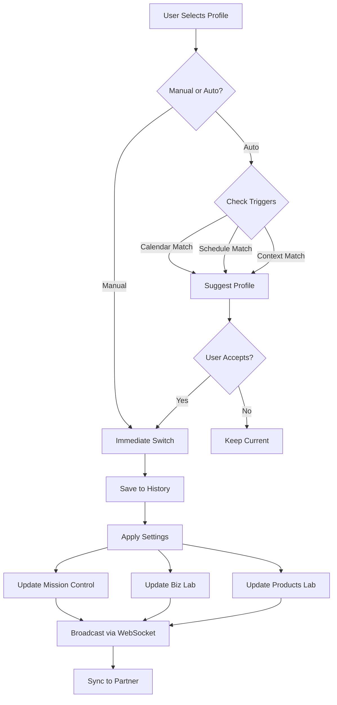
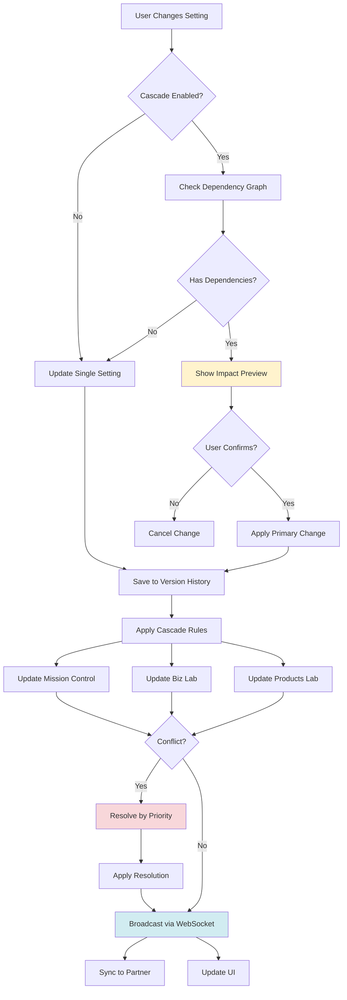

# Product Requirement Document (PRD): Vault Settings Hub

**Product:** Vault Settings Hub (Unified Preferences & Configuration Center)
**Type:** Intelligent Settings System with Cross-App Synchronization
**Status:** 📋 PLANNED (Sprint 3+)
**Domain:** `vault.klario-world.com/settings`
**Parent:** Clario Vault (see `00-vault-overview-prd.md`)

> **Technical Implementation:** See `specifications/app-settings-system.md` for Workflow Profile Store (Zustand state management, profile switching), Collaboration Settings Store (Pusher WebSocket sync, partner presence), Cross-App Cascade Engine (synchronization rules, dependency graph), App-Specific Settings Stores (Products Lab, Biz Lab, Dashboard), Version History System (rollback, export/import), and Real-Time Sync (Pusher integration).

---

# Part I: Foundation

## 📋 Partner Summary

| Field | Details |
| :--- | :--- |
| **For** | Founders, Product Team & All Vault Users |
| **Goal** | The "Configuration Brain" - unified control center for personalizing workflows, behaviors, and integrations across Mission Control, Biz Lab, and Products Lab. |
| **Key Actions** | • Personalize Workflow Preferences<br>• Configure Cross-App Behaviors<br>• Manage Partner Collaboration Settings<br>• Sync Configurations Across Devices<br>• Set Notification & Alert Rules |

---

## ⚙️ 1. Executive Summary

**Vault Settings Hub** is the high-performance **"Configuration Brain"** for the entire Vault ecosystem. It goes beyond basic preferences to become an intelligent settings system that understands relationships between apps, synchronizes partner workflows, and provides context-aware configuration recommendations.

**Core Philosophy:**
1.  **Intelligent Defaults:** Smart recommendations based on partner usage patterns and role.
2.  **Cross-App Synchronization:** Changes in one app's settings can trigger related updates in others.
3.  **Collaborative Configuration:** Shared team settings vs. personal preferences with clear delineation.
4.  **Real-time Sync:** Settings changes propagate instantly across all Vault sections.
5.  **Context-Aware:** Settings adapt based on current task, time of day, and workflow context.
6.  **Deep Integration:** Every setting is bidirectionally connected to Mission Control, Biz Lab, and Products Lab.

**Core Functions:**
- **Workflow Personalization:** Customize how each Vault app behaves based on role and preferences
- **Cross-App Configuration:** Unified settings that affect multiple sections simultaneously
- **Partner Collaboration Settings:** Manage how partners coordinate, review, and share work
- **Notification Intelligence:** Smart alerts based on context, urgency, and partner availability
- **Configuration Profiles:** Save and switch between different workflow configurations (Focus Mode, Collaboration Mode, Review Mode)

---

## 2. Strategic Context

**Problem:**
- Each Vault app has unique workflows but settings are scattered
- Partners need both shared team defaults AND personal customization
- Changes in one app's workflow should intelligently affect related apps
- No way to save and switch between different work modes (deep focus vs. collaboration)
- Settings changes don't propagate in real-time to partner
- Missing intelligence: settings don't adapt to context or suggest optimizations

**Solution:**
An **Engineered Configuration System** that thinks. It uses **intelligent defaults** based on role and usage patterns, **cross-app synchronization** to keep workflows aligned, **collaborative configuration** for team vs. personal settings, **real-time propagation** via WebSocket, and **context-aware profiles** that adapt to current work mode.

**Users:**
- **Founders & Executives:** High-level workflow preferences, notification priorities, strategic dashboard configurations
- **Product Team (Primary):** Development workflow settings, experiment defaults, component library preferences
- **Business/Strategy Team:** Document reading preferences, decision governance settings, market intelligence alerts
- **Goal:** Each partner can personalize while maintaining team workflow consistency

---

# Part II: Cross-App Unified Settings

## 3. Workflow Intelligence & Profiles

**Smart configuration profiles that adapt multiple apps simultaneously based on work mode.**

**Features:**
1.  **Pre-Configured Profiles:** Focus Mode, Collaboration Mode, Review Mode, Strategy Planning Mode, Deep Work Mode.
2.  **Profile Auto-Switching:** Detects context (e.g., calendar event "Sprint Planning") and suggests profile switch.
3.  **Custom Profile Creation:** Save current configuration across all apps as named profile.
4.  **One-Click Activation:** Switch entire Vault configuration instantly with single click.
5.  **Profile-Specific Overrides:** Each profile can override app-specific settings (e.g., Focus Mode hides all notifications).

**Actions:**
1.  **`Switch Profile`:** One-click to activate pre-configured workflow mode across all Vault apps.
2.  **`Save Current as Profile`:** Snapshot current settings state across Mission Control, Biz Lab, Products Lab.
3.  **`Schedule Profile`:** Auto-activate profile at specific times (e.g., "Focus Mode" daily 9am-12pm).
4.  **`Suggest Profile`:** AI recommends profile based on calendar, current task, and time of day.

**Integrations:**
1.  **Zustand Global Store:** Single source of truth for active profile affecting all apps.
2.  **WebSocket Broadcast:** Profile changes propagate to all open Vault tabs instantly.
3.  **Calendar Integration:** (Future) Reads calendar events to suggest appropriate profile.
4.  **Time-Based Scheduler:** Cron-like system for automatic profile switching.

**Profile Configuration Example:**
```typescript
interface WorkflowProfile {
  name: "Focus Mode" | "Collaboration Mode" | "Review Mode" | string
  description: "Deep work without interruptions"
  settings: {
    missionControl: {
      widgetVisibility: ["My Focus", "Current Sprint"],
      notifications: {
        enabled: false,
        exceptions: ["critical-alerts"]
      }
    },
    bizLab: {
      sidebarState: "collapsed",
      zenMode: true,
      autoSave: { interval: 30 }
    },
    productsLab: {
      sidebarState: "collapsed",
      hotReload: false, // Reduce distractions
      console: "hidden"
    },
    global: {
      commandPaletteScope: "current-app", // Don't search across apps
      linkBehavior: "same-tab" // No new tabs
    }
  },
  triggers: {
    calendar: ["Deep Work", "Focus Time"],
    schedule: { daily: "09:00-12:00" },
    manual: true
  }
}
```

**Example Setting UI:**
```
┌─────────────────────────────────────────────────────────────┐
│ Workflow Intelligence & Profiles                            │
├─────────────────────────────────────────────────────────────┤
│ 🟢 Currently Active: Focus Mode                             │
│                                                             │
│ Available Profiles:                                         │
│                                                             │
│   ● Focus Mode                  [✓ Active]                  │
│     Deep work without interruptions                         │
│     • Notifications: Off (except critical)                  │
│     • Sidebars: Collapsed                                   │
│     • Search: Current app only                              │
│                                                             │
│   ○ Collaboration Mode          [Activate]                  │
│     Team coordination and shared work                       │
│     • Notifications: All enabled                            │
│     • Sidebars: Expanded                                    │
│     • Search: All apps                                      │
│                                                             │
│   ○ Review Mode                 [Activate]                  │
│     Document and experiment review workflow                 │
│     • Review Queue: Prioritized                             │
│     • Sidebars: Expanded                                    │
│     • Notifications: Review-related only                    │
│                                                             │
│   ○ Strategy Planning Mode      [Activate]                  │
│     Strategic thinking and planning                         │
│     • Knowledge Graph: Visible                              │
│     • Recent Docs: Pinned                                   │
│     • Distractions: Minimized                               │
│                                                             │
│ [+ Create Custom Profile]                                   │
│                                                             │
│ ⏰ Auto-Switching Schedule:                                 │
│   Focus Mode:           Mon-Fri 9:00am - 12:00pm           │
│   Collaboration Mode:   Mon-Fri 1:00pm - 5:00pm            │
│   [Edit Schedule]                                           │
│                                                             │
│ 🔔 Smart Suggestions:                                       │
│   ☑ Suggest based on calendar events                       │
│   ☑ Suggest based on time of day                           │
│   ☐ Suggest based on task context                          │
│                                                             │
│ 💡 Integration Note: Profile changes apply instantly to    │
│    Mission Control, Biz Lab, and Products Lab.             │
└─────────────────────────────────────────────────────────────┘
```

**Profile Switching Flow:**


**See:** `specifications/app-settings-system.md` #1 for Workflow Profile Store (WorkflowProfile interface, default profiles, profile switching logic, auto-scheduling)

**See Also:**
- **Section 5:** Cross-App Synchronization Rules (cascade effects when switching profiles)
- **Section 6:** Notification Intelligence System (profile-specific notification rules)
- **Section 14:** Team Collaboration & Shared Configuration (shared profile enforcement)

---

## 4. Partner Collaboration Configuration

**Settings that govern how partners coordinate, review, and share work across the Vault.**

**Features:**
1.  **Shared vs. Personal Settings:** Clear visual distinction between team-enforced and personally-customizable settings.
2.  **Review Workflow Preferences:** Configure approval chains, notification triggers, and review assignment rules.
3.  **Presence Sharing:** Control what activity information is visible to partner (viewing, editing, experimenting).
4.  **Notification Routing:** Define which partner gets notified for specific event types.
5.  **Work Handoff Settings:** Auto-notify partner when task is ready for review or next phase.

**Actions:**
1.  **`Set Shared Default`:** Mark a setting as "team standard" that affects both partners unless overridden.
2.  **`Request Partner Approval`:** Flag settings change as requiring partner sign-off (e.g., notification routing).
3.  **`Override Personal`:** Explicitly override a shared default with personal preference.
4.  **`Sync to Partner`:** Push current configuration as suggestion to partner.

**Integrations:**
1.  **Clerk Team Metadata:** Stores shared team settings at workspace level vs. user level.
2.  **Pusher Notifications:** Real-time alerts when partner changes shared settings.
3.  **Review Queue Integration:** Collabor settings directly affect Mission Control Review Queue behavior.
4.  **Presence API:** Activity sharing settings control Clerk Presence data visibility.

**Shared Settings Example:**
```typescript
interface CollaborationSettings {
  shared: {
    enforced: true, // Cannot be overridden
    settings: {
      experimentTemplate: "shadcn-ui-default",
      graphColorScheme: "category-based",
      decisionApprovalChain: ["Partner 1", "Partner 2"]
    }
  },
  reviewWorkflow: {
    autoAssign: {
      bizLabStrategies: "Partner 1", // Business strategy owner
      productsLabComponents: "Partner 2", // Product component owner
      crossSectionDecisions: "both-required"
    },
    notificationRules: {
      "strategy-approved": { notify: ["Partner 2"], urgent: true },
      "component-promoted": { notify: ["Partner 1"], urgent: false },
      "experiment-results": { notify: ["both"], urgent: true }
    }
  },
  presenceSharing: {
    shareLocation: true, // Show which app partner is in
    shareActiveDoc: true, // Show specific doc being viewed
    shareEditStatus: true, // Show when actively typing
    hideDuringFocusMode: true // Respect partner's focus time
  }
}
```

**Example Setting UI:**
```
┌─────────────────────────────────────────────────────────────┐
│ Partner Collaboration Configuration                         │
├─────────────────────────────────────────────────────────────┤
│ 👥 Working with: Partner 2                                  │
│                                                             │
│ Shared Team Settings (🔒 Enforced):                        │
│   Experiment Template:    [Shadcn UI Default ▼] 🔒         │
│   Graph Color Scheme:     [Category-Based ▼] 🔒            │
│   Decision Approval:      [Both Required ▼] 🔒             │
│                                                             │
│   ℹ️ These settings apply to both partners and cannot be   │
│      overridden individually.                               │
│                                                             │
│ ─────────────────────────────────────────────────────────── │
│                                                             │
│ Review Workflow & Auto-Assignment:                          │
│                                                             │
│   Biz Lab Strategies:                                       │
│     Auto-assign to:       [Partner 1 ▼]                     │
│     Notify on approval:   [☑] Partner 2                     │
│     Priority level:       [● Urgent  ○ Normal]              │
│                                                             │
│   Products Lab Components:                                  │
│     Auto-assign to:       [Partner 2 ▼]                     │
│     Notify on approval:   [☑] Partner 1                     │
│     Priority level:       [○ Urgent  ● Normal]              │
│                                                             │
│   Cross-Section Decisions:                                  │
│     Approval required:    [● Both  ○ Either  ○ Any]         │
│     Notify all partners:  [☑] On submission                 │
│                           [☑] On approval                   │
│                                                             │
│ ─────────────────────────────────────────────────────────── │
│                                                             │
│ Presence & Activity Sharing:                                │
│   [☑] Share which app I'm currently in                      │
│   [☑] Share which document I'm viewing                      │
│   [☑] Show when I'm actively editing                        │
│   [☑] Hide my activity during Focus Mode                    │
│                                                             │
│   Partner Status: 🟢 Online in Biz Lab                      │
│   Currently viewing: "2026 Strategy Overview"               │
│                                                             │
│ ─────────────────────────────────────────────────────────── │
│                                                             │
│ Notification Routing Rules:                                 │
│                                                             │
│   Strategy Approved        → Notify: Partner 2  (Urgent)    │
│   Component Promoted       → Notify: Partner 1  (Normal)    │
│   Experiment Results       → Notify: Both       (Urgent)    │
│   Build Failed             → Notify: Both       (Critical)  │
│   Document Updated         → Notify: Author     (Normal)    │
│                                                             │
│   [+ Add Custom Rule]                                       │
│                                                             │
│ 💡 Integration Note: Changes sync to partner via Pusher    │
│    WebSocket and affect Review Queue assignments.          │
└─────────────────────────────────────────────────────────────┘
```

**See:** `specifications/app-settings-system.md` #2 for Collaboration Settings Store (CollaborationSettings interface, shared vs personal settings, review workflow auto-assignment, presence sharing, Pusher WebSocket integration)

**See Also:**
- **Section 3:** Workflow Intelligence & Profiles (profile-based collaboration modes)
- **Section 6:** Notification Intelligence System (partner-aware notification routing)
- **Section 14:** Team Collaboration & Shared Configuration (shared defaults and enforcement)
- **Section 18.3:** Real-Time Partner Synchronization (technical implementation)

---

## 5. Cross-App Synchronization Rules

**Intelligent settings propagation across Mission Control, Biz Lab, and Products Lab.**

**Features:**
1.  **Cascading Settings:** Change in one app triggers intelligent updates in related apps.
2.  **Conflict Resolution:** When personal and shared settings conflict, clear precedence rules.
3.  **Impact Preview:** Before applying setting, see which other apps will be affected.
4.  **Rollback Support:** Undo recent settings changes with full restore to previous state.
5.  **Version History:** Track all settings changes with timestamps and partner attribution.

**Actions:**
1.  **`Preview Impact`:** Hover over setting to see cascade effect across all apps.
2.  **`Apply with Sync`:** Save setting and immediately propagate to affected apps.
3.  **`Rollback`:** Restore settings to previous state (last hour, last day, last week).
4.  **`View History`:** See timeline of all settings changes by partner.

**Integrations:**
1.  **Settings Dependency Graph:** Build-time analysis of which settings affect others.
2.  **Real-time Sync Engine:** Pusher WebSocket ensures changes propagate in < 500ms.
3.  **Zustand Middleware:** Intercepts setting changes and applies cascading rules.
4.  **Git-like Versioning:** LocalStorage stores last 10 settings states for rollback.

**Cascade Rules Example:**
```typescript
// When changing notification preferences in Mission Control...
const cascadeRules = {
  "missionControl.notifications.enabled": {
    affects: [
      "bizLab.quickCapture.notifyOnSave",
      "productsLab.experimentCompletion.showNotification"
    ],
    logic: (newValue: boolean) => ({
      "bizLab.quickCapture.notifyOnSave": newValue,
      "productsLab.experimentCompletion.showNotification": newValue
    })
  },
  "global.readingMode.fontSize": {
    affects: [
      "bizLab.document.fontSize",
      "productsLab.componentDocs.fontSize"
    ],
    logic: (newValue: number) => ({
      "bizLab.document.fontSize": newValue,
      "productsLab.componentDocs.fontSize": newValue
    })
  }
}
```

**Example Setting UI:**
```
┌─────────────────────────────────────────────────────────────┐
│ Cross-App Synchronization Rules                             │
├─────────────────────────────────────────────────────────────┤
│ Configure how settings changes propagate across apps        │
│                                                             │
│ 🔗 Cascading Settings:                                      │
│   [☑] Enable automatic synchronization                      │
│   [☑] Show impact preview before applying                   │
│   [☑] Ask confirmation for multi-app changes                │
│                                                             │
│ ─────────────────────────────────────────────────────────── │
│                                                             │
│ Active Cascade Rules:                                       │
│                                                             │
│   📢 Notifications (Mission Control)                        │
│      ↓ Affects 2 other settings                            │
│      • Biz Lab Quick Capture notifications                  │
│      • Products Lab experiment completion alerts            │
│      [Preview Impact]  [Edit Rule]                          │
│                                                             │
│   📝 Reading Font Size (Global)                             │
│      ↓ Affects 2 other settings                            │
│      • Biz Lab document font size                           │
│      • Products Lab component docs font size                │
│      [Preview Impact]  [Edit Rule]                          │
│                                                             │
│   🎨 Graph Color Scheme (Biz Lab)                           │
│      ↓ Affects 1 other setting                             │
│      • Mission Control portfolio map colors                 │
│      [Preview Impact]  [Edit Rule]                          │
│                                                             │
│   [+ Add Custom Cascade Rule]                               │
│                                                             │
│ ─────────────────────────────────────────────────────────── │
│                                                             │
│ Conflict Resolution:                                        │
│   When settings conflict, priority order:                   │
│   1. [●] Workflow Profile    (highest priority)             │
│   2. [●] Shared Team Default                                │
│   3. [●] Personal Override   (lowest priority)              │
│                                                             │
│ ─────────────────────────────────────────────────────────── │
│                                                             │
│ 📜 Version History (Last 10 changes):                       │
│                                                             │
│   Jan 19, 3:45pm - You changed font size                    │
│   → Affected: Biz Lab, Products Lab                         │
│   [Rollback]                                                │
│                                                             │
│   Jan 19, 2:30pm - Partner 2 changed graph colors           │
│   → Affected: Mission Control                               │
│   [Rollback]                                                │
│                                                             │
│   Jan 19, 11:15am - You switched to Focus Mode              │
│   → Affected: All apps                                      │
│   [Rollback]                                                │
│                                                             │
│   [View Full History]                                       │
│                                                             │
│ 💡 Integration Note: All changes sync in <500ms via        │
│    WebSocket. Version history available for 24 hours.      │
└─────────────────────────────────────────────────────────────┘
```

**Cascade Flow Diagram:**


**See:** `specifications/app-settings-system.md` #3 for Cascade Rules & Synchronization Engine (CascadeRule interface, cascade middleware, change detection, dependency graph, conflict resolution)

**See Also:**
- **Section 3:** Workflow Intelligence & Profiles (profiles trigger cascades automatically)
- **Section 4:** Partner Collaboration Configuration (shared settings propagation)
- **Section 15:** Global Cross-App Preferences (global font size cascade example)
- **Section 16:** Configuration Sync, Export & Reset (version history and rollback)
- **Section 18.2:** State Management Architecture (Zustand middleware for cascades)

---

## 6. Notification Intelligence System

**Context-aware notification system that adapts to partner availability, task urgency, and work mode.**

**Features:**
1.  **Smart Delivery Timing:** Delays non-urgent notifications until partner exits Focus Mode.
2.  **Urgency Classification:** Auto-categorizes notifications (Critical, Important, Informational) based on content.
3.  **Batching:** Groups related notifications (e.g., "5 experiments completed") instead of individual alerts.
4.  **Do Not Disturb Schedule:** Auto-mute notifications during configured hours (e.g., after 6pm, weekends).
5.  **Partner-Aware Routing:** If Partner 1 is in Focus Mode, route their notifications to Partner 2 if relevant.

**Actions:**
1.  **`Set Urgency Rules`:** Define what makes a notification critical vs. informational.
2.  **`Configure DND`:** Set quiet hours with exceptions for critical alerts.
3.  **`Batch Preferences`:** Choose which notification types should be batched vs. immediate.
4.  **`Mute Temporarily`:** Snooze all notifications for next 1hr/4hr/today.

**Integrations:**
1.  **Pusher Priority Channels:** Different WebSocket channels for critical vs. normal notifications.
2.  **Clerk Presence:** Checks if partner is active before sending notification.
3.  **Calendar Integration:** (Future) Detects meetings and auto-enables DND.
4.  **Profile System:** Current profile (Focus Mode) overrides notification settings.

**Notification Configuration:**
```typescript
interface NotificationIntelligence {
  urgencyRules: {
    critical: [
      "decision-requires-approval",
      "build-failed",
      "security-alert"
    ],
    important: [
      "review-requested",
      "experiment-completed",
      "strategy-approved"
    ],
    informational: [
      "doc-updated",
      "partner-online",
      "achievement-unlocked"
    ]
  },
  deliveryRules: {
    immediate: ["critical"],
    batched: ["informational"], // Deliver every 1 hour
    deferred: ["important"], // Wait until partner exits Focus Mode
  },
  doNotDisturb: {
    schedule: {
      weekdays: "18:00-09:00",
      weekends: "all-day"
    },
    exceptions: ["critical"],
    respectPartnerFocus: true // Don't notify if partner in Focus Mode
  },
  partnerRouting: {
    enabled: true,
    fallbackRules: {
      "Partner 1 unavailable": "route-to-Partner-2-if-relevant"
    }
  }
}
```

**Example Setting UI:**
```
┌─────────────────────────────────────────────────────────────┐
│ Notification Intelligence System                            │
├─────────────────────────────────────────────────────────────┤
│ 🧠 Smart notification delivery based on context & urgency   │
│                                                             │
│ Urgency Classification Rules:                               │
│                                                             │
│   🔴 Critical (Immediate delivery):                         │
│   • Decision requires approval                              │
│   • Build failed                                            │
│   • Security alert                                          │
│   [+ Add Event Type]                                        │
│                                                             │
│   🟡 Important (Deferred if in Focus Mode):                 │
│   • Review requested                                        │
│   • Experiment completed                                    │
│   • Strategy approved                                       │
│   [+ Add Event Type]                                        │
│                                                             │
│   🟢 Informational (Batched every hour):                    │
│   • Document updated                                        │
│   • Partner came online                                     │
│   • Achievement unlocked                                    │
│   [+ Add Event Type]                                        │
│                                                             │
│ ─────────────────────────────────────────────────────────── │
│                                                             │
│ 🌙 Do Not Disturb Schedule:                                 │
│   [☑] Enable automatic DND                                  │
│                                                             │
│   Weekdays:      [6:00 PM] to [9:00 AM]                     │
│   Weekends:      [○ Same  ● All day  ○ Custom]              │
│                                                             │
│   Exceptions (always notify):                               │
│   [☑] Critical alerts                                       │
│   [☐] Partner messages                                      │
│   [☐] Meeting reminders                                     │
│                                                             │
│   Current Status: 🌙 DND Active (until 9:00 AM tomorrow)    │
│   [Temporarily Disable]                                     │
│                                                             │
│ ─────────────────────────────────────────────────────────── │
│                                                             │
│ 📦 Notification Batching:                                   │
│   [☑] Group similar notifications                           │
│   Batch interval:     [Every hour ▼]                        │
│   Max batch size:     [5 notifications]                     │
│                                                             │
│   Preview: "5 experiments completed" instead of 5 separate  │
│                                                             │
│ ─────────────────────────────────────────────────────────── │
│                                                             │
│ 👥 Partner-Aware Routing:                                   │
│   [☑] Respect partner's Focus Mode                          │
│   [☑] Route to available partner when relevant              │
│                                                             │
│   Partner Status: 🟢 Partner 2 (Available)                  │
│                   🔴 You (In Focus Mode)                     │
│                                                             │
│   Fallback Rules:                                           │
│   • If Partner 1 unavailable → Route to Partner 2           │
│   • If both unavailable → Queue for later                   │
│                                                             │
│ ─────────────────────────────────────────────────────────── │
│                                                             │
│ ⏸️ Quick Mute:                                              │
│   [Mute 1 hour]  [Mute 4 hours]  [Mute until tomorrow]     │
│                                                             │
│ 💡 Integration Note: Works with Workflow Profiles -        │
│    Focus Mode automatically enables smart delivery.        │
└─────────────────────────────────────────────────────────────┘
```

**See:** `specifications/app-settings-system.md` #2 for Notification Intelligence implementation (urgency classification, smart delivery timing, batching rules, Pusher priority channels integration)
**See:** `specifications/collaboration-features.md` for Team Pulse and notification routing architecture

**See Also:**
- **Section 3:** Workflow Intelligence & Profiles (Focus Mode affects notification delivery)
- **Section 4:** Partner Collaboration Configuration (partner-aware routing rules)
- **Section 12:** Notification & Achievement Preferences (dashboard notification settings)
- **Section 18.3:** Real-Time Partner Synchronization (Pusher priority channels)

---

# Part III: App-Specific Settings with Deep Integration

**Each setting below includes explicit integration annotations showing cascade effects across Mission Control, Biz Lab, and Products Lab.**

---

# Part III.A: Products Lab Settings

## 7. Experiment Workbench Preferences

**Settings for experiment creation, workbench layout, and component testing workflows with deep cross-app integration.**

**Features:**
1.  **Default Experiment Template:** Auto-fill new experiments with preferred framework (Shadcn, Tailwind, Framer).
2.  **Smart Auto-Save:** Configurable save intervals (30s to 5min) with version history retention.
3.  **Workbench Layout Presets:** Code editor width, preview position, console visibility, file tree preferences.
4.  **Hot Reload Configuration:** Live preview on save, component grid overlay, responsive breakpoint indicators.
5.  **Performance Mode:** Choose rendering fidelity (Full/Optimized/Minimal) for faster iteration.

**Actions:**
1.  **`Set Default Template`:** Choose framework, animation options, responsive defaults for all new experiments.
2.  **`Configure Auto-Save`:** Set interval, blur/navigate triggers, version retention policy.
3.  **`Customize Workbench Layout`:** Adjust panel sizes, preview position, console auto-show rules.
4.  **`Toggle Hot Reload Features`:** Enable/disable grid overlay, breakpoint indicators, auto-tab opening.

**Integrations:**
1.  **Mission Control Impact:**
    - "Create Experiment" quick action → Uses default template settings
    - Recent experiments widget → Shows auto-save timestamps
    - Task completion triggers → Notifies based on experiment save events
2.  **Biz Lab Impact:**
    - Experiment results linked from strategy docs → Preview using workbench layout settings
    - Strategic decisions → May recommend specific experiment templates
    - Cross-section feedback loop → Experiment template preferences inform product direction docs
3.  **Settings Hub Integration:**
    - Workflow Profiles override workbench layout (Focus Mode → minimalist layout)
    - Partner Collaboration Settings → Shared default template enforced unless personally overridden
    - Notification Intelligence → Batches auto-save notifications to avoid interruptions

**UI Configuration:**
```typescript
interface ExperimentWorkbenchSettings {
  defaultTemplate: {
    framework: 'tailwind' | 'shadcn' | 'framer';
    includeAnimations: boolean;
    includeResponsive: boolean;
    defaultLayout: 'page' | 'component';
  },
  autoSave: {
    enabled: boolean;
    intervalSeconds: 30 | 60 | 120 | 300; // 30s, 1min, 2min, 5min
    onBlur: boolean;
    onNavigate: boolean;
    showIndicator: boolean;
    versionHistoryLimit: number; // Default: 10
  },
  workbenchLayout: {
    codeEditorWidthPercent: number; // 40-80%
    previewPosition: 'right' | 'bottom' | 'floating';
    consoleVisibility: 'always' | 'auto' | 'hidden';
    showFileTree: boolean;
  },
  hotReload: {
    enabled: boolean;
    showGridOverlay: boolean;
    showBreakpointIndicator: boolean;
    autoOpenNewTab: boolean;
  },
  performanceMode: 'full' | 'optimized' | 'minimal'
}
```

**Example Setting UI:**
```
┌─────────────────────────────────────────────────────────────┐
│ Experiment Workbench Preferences                            │
├─────────────────────────────────────────────────────────────┤
│ Default Template:                                           │
│   Framework:       [Shadcn UI ▼]                            │
│   □ Framer Motion animations  ☑ Responsive breakpoints      │
│   Layout:          [○ Page  ● Component]                    │
│                                                             │
│ Auto-Save:         [Enabled ▼]   Interval: [2 minutes ▼]   │
│   ☑ On blur        ☑ On navigate    ☑ Show indicator       │
│                                                             │
│ Workbench Layout:                                           │
│   Editor Width:    [────●─────] 60%                         │
│   Preview:         [Right ▼]   Console: [Auto ▼]           │
│                                                             │
│ 💡 Integration Note: Your "Focus Mode" profile will        │
│    override layout to minimize distractions.               │
└─────────────────────────────────────────────────────────────┘
```

**See:** `specifications/app-settings-system.md` #4 for Products Lab Settings Store (ExperimentWorkbenchSettings interface, default templates, auto-save configuration, hot reload settings)
**See:** `specifications/products-lab-system.md` for Component Workbench and Experiment Playground integration

---

## 8. Component Library & Documentation Preferences

**Settings for component preview behavior, token visualization, and documentation display.**

**Features:**
1.  **Live Preview Controls:** Hot reload toggle, grid overlay, responsive viewport simulation.
2.  **Token Visualizer Defaults:** Choose which design tokens display by default (colors, typography, spacing).
3.  **Documentation Display:** Font size, code syntax theme, collapsible section defaults.
4.  **Component Search Scope:** Limit to local experiments or include shared component library.
5.  **Export Format Preferences:** Default export format for components (React, Vue, HTML+CSS).

**Actions:**
1.  **`Toggle Live Preview Features`:** Enable/disable hot reload, grid overlays, breakpoint indicators.
2.  **`Set Token Visualizer Default`:** Choose which token categories show on component load.
3.  **`Customize Documentation Display`:** Adjust font size, syntax theme, section expansion defaults.
4.  **`Configure Component Search`:** Set search scope (local only vs. shared library).

**Integrations:**
1.  **Mission Control Impact:**
    - Component search results → Filtered by search scope setting
    - Quick Actions "Search Components" → Uses configured scope
    - Dashboard widgets → Component stats respect search scope filter
2.  **Biz Lab Impact:**
    - Strategy docs linking to components → Preview using documentation display settings
    - Market research docs → Component export format used when sharing with stakeholders
    - Decision logs → Component library scope affects product direction recommendations
3.  **Settings Hub Integration:**
    - Reading Mode preferences (from Biz Lab settings) → Syncs to documentation font size
    - Workflow Profiles → "Collaboration Mode" auto-enables shared library search
    - Notification Intelligence → Component promotion alerts respect urgency rules

**UI Configuration:**
```typescript
interface ComponentLibrarySettings {
  livePreview: {
    hotReload: boolean;
    showGridOverlay: boolean;
    responsiveViewports: boolean;
    autoOpenNewTab: boolean;
  },
  tokenVisualizer: {
    defaultView: 'colors' | 'typography' | 'spacing' | 'all';
    expandCategories: boolean;
    showUsageExamples: boolean;
  },
  documentation: {
    fontSize: number; // 12-18px
    syntaxTheme: 'github-light' | 'github-dark' | 'dracula' | 'nord';
    collapsibleSectionsDefault: 'expanded' | 'collapsed';
    showTableOfContents: boolean;
  },
  componentSearch: {
    scope: 'local' | 'shared-library' | 'all';
    includeArchived: boolean;
  },
  exportFormat: {
    default: 'react' | 'vue' | 'html-css' | 'tailwind';
    includeComments: boolean;
  }
}
```

**Example Setting UI:**
```
┌─────────────────────────────────────────────────────────────┐
│ Component Library & Documentation Preferences               │
├─────────────────────────────────────────────────────────────┤
│ Configure component previews, tokens, and documentation     │
│                                                             │
│ 🎬 Live Preview Controls:                                   │
│   [☑] Hot reload on save                                    │
│   [☐] Show grid overlay                                     │
│   [☑] Responsive viewport simulation                        │
│   [☐] Auto-open components in new tab                       │
│                                                             │
│ ─────────────────────────────────────────────────────────── │
│                                                             │
│ 🎨 Design Token Visualizer:                                 │
│   Default view:       [● All  ○ Colors  ○ Typography]       │
│   [☑] Expand token categories by default                    │
│   [☑] Show usage examples                                   │
│                                                             │
│   Preview:                                                  │
│   ┌──────────────────────────────────────────────┐         │
│   │ Colors (12)        ▼                         │         │
│   │ • Primary:    #2563eb  [Used in 45 places]  │         │
│   │ • Secondary:  #64748b  [Used in 23 places]  │         │
│   │ Typography (8) ▼                             │         │
│   │ Spacing (6)    ▼                             │         │
│   └──────────────────────────────────────────────┘         │
│                                                             │
│ ─────────────────────────────────────────────────────────── │
│                                                             │
│ 📖 Documentation Display:                                   │
│   Font size:          [────●────] 16px                      │
│   Syntax theme:       [GitHub Dark ▼]                       │
│   Code sections:      [● Expanded  ○ Collapsed]             │
│   [☑] Show table of contents                                │
│                                                             │
│   Preview:                                                  │
│   ┌──────────────────────────────────────────────┐         │
│   │ Button Component                             │         │
│   │ ─────────────────                            │         │
│   │ ## Props                                     │         │
│   │ variant?: 'default' | 'outline' | 'ghost'    │         │
│   │ size?: 'sm' | 'md' | 'lg'                    │         │
│   │                                              │         │
│   │ ## Usage                                     │         │
│   │ ```tsx                                       │         │
│   │ <Button variant="outline">Click me</Button> │         │
│   │ ```                                          │         │
│   └──────────────────────────────────────────────┘         │
│                                                             │
│ ─────────────────────────────────────────────────────────── │
│                                                             │
│ 🔍 Component Search Scope:                                  │
│   Search in:          [● All  ○ Local  ○ Shared Library]   │
│   [☐] Include archived components                           │
│                                                             │
│   Stats: 156 total components (89 local, 67 shared)        │
│                                                             │
│ ─────────────────────────────────────────────────────────── │
│                                                             │
│ 📤 Export Format Preferences:                               │
│   Default format:     [React ▼]                             │
│                       • React (JSX/TSX)                     │
│                       • Vue (SFC)                           │
│                       • HTML + CSS                          │
│                       • Tailwind CSS                        │
│   [☑] Include code comments                                 │
│   [☑] Include TypeScript types                              │
│                                                             │
│ 💡 Integration Note: Documentation font size syncs with    │
│    Global settings if cascade is enabled (see Section 15). │
└─────────────────────────────────────────────────────────────┘
```

**See:** `specifications/app-settings-system.md` #4 for Component Library Settings (ComponentLibrarySettings interface, live preview controls, token visualizer, export format preferences)
**See:** `specifications/products-lab-system.md` for Design Token Browser and Component Library architecture

**See Also:**
- **Section 7:** Experiment Workbench Preferences (component creation settings)
- **Section 10:** Strategic Document Reading & Workspace Preferences (reading mode sync)
- **Section 15:** Global Cross-App Preferences (global font size cascade)
- **Section 16:** Configuration Sync, Export & Reset (export format preferences)

---

# Part III.B: Biz Lab Settings

## 9. Strategic Brain & Knowledge Graph Preferences

**Settings for knowledge graph visualization, strategic document browsing, and brain-like intelligence features.**

**Features:**
1.  **Graph Visualization Defaults:** Node size, link style, color scheme (category/status), physics simulation strength.
2.  **Auto-Open Behavior:** Configure how clicking graph nodes opens documents (floating panel, sidebar, new page).
3.  **Smart Connection Algorithms:** Adjust semantic similarity threshold for auto-linking strategic documents.
4.  **Graph Filter Presets:** Save frequently-used filters (e.g., "2026 Strategy Only", "Financial Docs", "Decision Logs").
5.  **Minimap & Navigation:** Toggle minimap visibility, cluster highlighting, and navigation shortcuts.

**Actions:**
1.  **`Set Graph Visualization Style`:** Choose node size, link curvature, color scheme, physics behavior.
2.  **`Configure Auto-Open Behavior`:** Define how graph node clicks open related documents.
3.  **`Adjust Smart Connection Threshold`:** Set sensitivity for auto-linking related strategic documents.
4.  **`Save Graph Filter Preset`:** Snapshot current filters as named preset for quick recall.

**Integrations:**
1.  **Mission Control Impact:**
    - Dashboard "Strategy Map" widget → Uses graph visualization defaults
    - Quick Actions "Open Knowledge Graph" → Opens with configured filter preset
    - Strategic insights panel → Graph color scheme affects insight categorization
2.  **Products Lab Impact:**
    - Experiment-to-strategy links → Graph auto-open behavior used when navigating from Products Lab
    - Design decisions → Component library links use same graph visualization style
    - Cross-section integration → Graph shows product-strategy connections using configured physics
3.  **Settings Hub Integration:**
    - Workflow Profiles → "Strategy Planning Mode" auto-applies strategic filter presets
    - Reading Mode preferences → Graph documentation uses same font size/theme
    - Notification Intelligence → Graph node updates trigger notifications based on urgency rules

**UI Configuration:**
```typescript
interface KnowledgeGraphSettings {
  visualization: {
    nodeSize: 'small' | 'medium' | 'large';
    linkStyle: 'straight' | 'curved' | 'organic';
    colorScheme: 'category' | 'status' | 'priority' | 'custom';
    physics: {
      enabled: boolean;
      strength: number; // 0.1 - 1.0
      repulsionDistance: number;
    };
  },
  autoOpenBehavior: {
    onClick: 'floating-panel' | 'sidebar' | 'new-page' | 'quick-preview';
    previewDelay: number; // milliseconds
    keepGraphVisible: boolean;
  },
  smartConnections: {
    semanticSimilarityThreshold: number; // 0.5 - 0.95
    autoLinkNewDocs: boolean;
    showSuggestions: boolean;
  },
  filterPresets: Array<{
    name: string;
    filters: {
      categories: string[];
      dateRange?: { start: string; end: string };
      tags?: string[];
    };
  }>,
  minimap: {
    enabled: boolean;
    position: 'top-right' | 'bottom-right' | 'bottom-left';
    showClusters: boolean;
  }
}
```

**Example Setting UI:**
```
┌─────────────────────────────────────────────────────────────┐
│ Strategic Brain & Knowledge Graph Preferences               │
├─────────────────────────────────────────────────────────────┤
│ Graph Visualization:                                        │
│   Node Size:       [Medium ▼]      Link Style: [Curved ▼]  │
│   Color By:        [Category ▼]    Physics: [☑] Enabled    │
│   Strength:        [────●────] 0.6                          │
│                                                             │
│ Auto-Open Behavior:                                         │
│   On Click:        [● Sidebar  ○ Floating  ○ New Page]     │
│   ☑ Keep graph visible when opening docs                   │
│                                                             │
│ Smart Connections:                                          │
│   Similarity:      [──────●──] 0.75 (Higher = Stricter)    │
│   ☑ Auto-link new strategic documents                      │
│                                                             │
│ 💡 Integration Note: Graph style syncs with Dashboard      │
│    "Strategy Map" widget visualization.                    │
└─────────────────────────────────────────────────────────────┘
```

---

## 10. Strategic Document Reading & Workspace Preferences

**Settings for document preview, reading mode typography, sidebar layout, and strategic workspace organization.**

**Features:**
1.  **Hover Preview Cards:** Enable document previews on hover with configurable delay and metadata display.
2.  **Reading Mode Typography:** Font size, line height, column width for optimal strategic document reading.
3.  **Reading Progress Tracking:** Auto-scroll to last position, highlight unread sections, show progress bar.
4.  **Sidebar Layout Preferences:** Default state (expanded/collapsed), width, auto-collapse rules, favorites pinning.
5.  **Quick Capture Integration:** Auto-tag new strategic captures, default save location, notification triggers.

**Actions:**
1.  **`Configure Hover Previews`:** Set delay, choose metadata to display (title, read time, key takeaways).
2.  **`Customize Reading Typography`:** Adjust font size, line height, column width for comfortable reading.
3.  **`Set Progress Tracking Options`:** Enable auto-scroll, unread highlighting, progress indicators.
4.  **`Adjust Sidebar Layout`:** Define default state, width, auto-collapse behavior, favorites display.

**Integrations:**
1.  **Mission Control Impact:**
    - Dashboard "Recent Strategic Docs" widget → Uses hover preview settings
    - Quick Actions "Open Strategy Room" → Opens with configured sidebar state
    - Achievement "Strategic Reader" → Tracks reading progress using configured metrics
2.  **Products Lab Impact:**
    - Strategy-to-experiment links → Preview cards use same hover delay and metadata display
    - Component documentation → Typography settings sync with documentation font size
    - Cross-section decisions → Reading progress tracked across both strategic and product docs
3.  **Settings Hub Integration:**
    - Workflow Profiles → "Focus Mode" auto-collapses sidebar, "Review Mode" expands it
    - Global font size cascade → Changes here affect Products Lab documentation display
    - Notification Intelligence → Quick Capture notifications respect DND schedule

**UI Configuration:**
```typescript
interface DocumentReadingSettings {
  hoverPreviews: {
    enabled: boolean;
    delayMs: number; // 300-1000ms
    showMetadata: {
      title: boolean;
      readTime: boolean;
      keyTakeaways: boolean;
      lastModified: boolean;
    };
  },
  readingMode: {
    typography: {
      fontSize: number; // 12-20px
      lineHeight: number; // 1.4-2.0
      columnWidth: number; // 600-800px
    },
    behavior: {
      autoScrollToLastPosition: boolean;
      highlightUnreadSections: boolean;
      showProgressBar: boolean;
      estimateTimeRemaining: boolean;
    };
  },
  sidebarLayout: {
    defaultState: 'expanded' | 'collapsed';
    width: number; // 200-400px
    autoCollapse: {
      onMobile: boolean;
      onNarrowViewport: boolean;
      viewportThreshold: number; // pixels
    };
    favorites: {
      enabled: boolean;
      showIcons: boolean;
      showLabels: boolean;
    };
  },
  quickCapture: {
    autoTag: boolean;
    defaultLocation: '/biz/quick-captures' | '/biz/inbox' | string;
    notifyOnSave: boolean;
  }
}
```

**Example Setting UI:**
```
┌─────────────────────────────────────────────────────────────┐
│ Strategic Document Reading & Workspace Preferences          │
├─────────────────────────────────────────────────────────────┤
│ Hover Previews:                                             │
│   ☑ Enabled    Delay: [500ms ▼]                            │
│   Show: [☑] Title  [☑] Read time  [☑] Key takeaways        │
│                                                             │
│ Reading Mode Typography:                                    │
│   Font Size:       [──────●──] 16px                         │
│   Line Height:     [────●────] 1.5                          │
│   Column Width:    [──●──────] 680px                        │
│                                                             │
│ Reading Behavior:                                           │
│   ☑ Auto-scroll to last position                           │
│   ☑ Highlight unread sections                              │
│   □ Show reading progress bar                              │
│                                                             │
│ Sidebar:                                                    │
│   Default State:   [Expanded ▼]    Width: [240px]          │
│   Auto-collapse:   [☑] On narrow viewport (< 1024px)       │
│                                                             │
│ 💡 Integration Note: Typography settings sync to Products  │
│    Lab component documentation for consistent reading.     │
└─────────────────────────────────────────────────────────────┘
```

---

# Part III.C: Mission Control Dashboard Settings

## 11. Widget Configuration & Dashboard Personalization

**Settings for dashboard widget visibility, order, chart styles, and intelligent layout customization.**

**Features:**
1.  **Widget Visibility & Order:** Drag-to-reorder active widgets, enable/disable optional widgets.
2.  **Chart Visualization Preferences:** Choose chart type (bar, line, area), color scheme, animation settings.
3.  **Intelligent Widget Sizing:** Auto-resize widgets based on viewport, customize grid layout.
4.  **Widget-Specific Settings:** Configure data range, refresh intervals, display density per widget.
5.  **Dashboard Layouts:** Save multiple dashboard configurations (e.g., "Executive View", "Sprint Focus", "Analytics Deep Dive").

**Actions:**
1.  **`Reorder Widgets`:** Drag-and-drop to customize dashboard layout order.
2.  **`Toggle Widget Visibility`:** Enable/disable specific widgets from available library.
3.  **`Set Chart Style`:** Choose visualization type, color scheme, animation preferences.
4.  **`Save Dashboard Layout`:** Snapshot current widget configuration as named layout preset.

**Integrations:**
1.  **Biz Lab Impact:**
    - "Strategy Map" widget → Uses Biz Lab graph visualization settings
    - "Recent Strategic Docs" widget → Applies Biz Lab hover preview preferences
    - Decision governance widget → Shows approval chains from Biz Lab settings
2.  **Products Lab Impact:**
    - "Experiment Progress" widget → Uses Products Lab auto-save timestamps
    - "Component Library Stats" widget → Respects component search scope setting
    - Quick Actions "Create Experiment" → Uses Products Lab default template
3.  **Settings Hub Integration:**
    - Workflow Profiles → Auto-switch dashboard layouts (Focus Mode → minimal widgets)
    - Partner Collaboration Settings → Shared widgets vs. personal widget customization
    - Notification Intelligence → Widget update alerts respect urgency classification

**UI Configuration:**
```typescript
interface DashboardSettings {
  widgets: {
    active: Array<{
      id: string; // 'sprint-progress', 'achievements', 'portfolio-map', etc.
      order: number;
      size: 'small' | 'medium' | 'large' | 'full-width';
      settings?: {
        refreshInterval?: number; // seconds
        dataRange?: '7d' | '30d' | '90d' | 'all-time';
        displayDensity?: 'compact' | 'comfortable' | 'spacious';
      };
    }>;
    available: string[]; // Disabled widgets that can be enabled
  },
  charts: {
    defaultType: 'bar' | 'line' | 'area' | 'donut';
    colorScheme: 'vibrant' | 'muted' | 'monochrome' | 'custom';
    animations: boolean;
    showLegend: 'always' | 'on-hover' | 'never';
    showValues: 'always' | 'on-hover' | 'never';
  },
  layout: {
    gridColumns: number; // 2-4 columns
    autoResize: boolean;
    presets: Array<{
      name: string; // 'Executive View', 'Sprint Focus', etc.
      widgetConfiguration: typeof widgets.active;
    }>;
  }
}
```

**Example Setting UI:**
```
┌─────────────────────────────────────────────────────────────┐
│ Dashboard Widget Configuration                              │
├─────────────────────────────────────────────────────────────┤
│ Active Widgets (drag to reorder):                           │
│   [≡] Sprint Progress           [⚙️ Settings]               │
│   [≡] Achievements              [⚙️ Settings]               │
│   [≡] Portfolio Map             [⚙️ Settings]               │
│   [≡] Quick Actions             [⚙️ Settings]               │
│   [≡] Recent Strategic Docs     [⚙️ Settings]               │
│                                                             │
│ Available Widgets:                                          │
│   [ ] Company Snapshot    [ ] Smart Recommendations         │
│   [ ] Experiment Queue    [ ] Decision Log                  │
│                                                             │
│ Chart Preferences:                                          │
│   Type:       [Bar ▼]     Colors: [Vibrant ▼]              │
│   Animation:  [☑] Enabled Legend: [On hover ▼]             │
│                                                             │
│ [Save Current Layout]  [Load Preset ▼]                      │
│                                                             │
│ 💡 Integration Note: "Strategy Map" widget uses Biz Lab    │
│    graph visualization preferences.                        │
└─────────────────────────────────────────────────────────────┘
```

---

## 12. Notification & Achievement Preferences

**Settings for achievement notifications, document update alerts, and intelligent notification routing.**

**Features:**
1.  **Achievement Notification Triggers:** Choose when to notify (badge unlocked, milestone reached, daily/weekly digests).
2.  **Notification Display Styles:** Toast, confetti modal, subtle badge, or disabled.
3.  **Document Update Intelligence:** Smart alerts for related docs, cross-section updates, experiment promotions.
4.  **Notification Grouping:** Batch similar notifications (e.g., "5 experiments completed") vs. individual alerts.
5.  **Achievement Celebration Modes:** Full confetti, subtle toast, silent badge update.

**Actions:**
1.  **`Set Achievement Triggers`:** Define which achievement events trigger notifications.
2.  **`Choose Display Style`:** Select notification presentation (toast, modal, badge, disabled).
3.  **`Configure Doc Update Alerts`:** Enable smart alerts for strategically-linked document updates.
4.  **`Set Notification Batching`:** Choose which events get batched vs. immediate alerts.

**Integrations:**
1.  **Biz Lab Impact:**
    - Strategic doc updates → Notification triggered based on smart link relationships
    - Decision approvals → Achievement notifications when strategic milestones reached
    - Quick Capture saves → Optional notification with configured display style
2.  **Products Lab Impact:**
    - Experiment completion → Achievement notification with confetti or subtle badge
    - Component promotion → Document update alert respecting batching rules
    - Design token changes → Smart alerts to related components/experiments
3.  **Settings Hub Integration:**
    - Notification Intelligence System → Achievement notifications respect urgency classification
    - DND Schedule → Delays achievement notifications during quiet hours (except critical)
    - Workflow Profiles → Focus Mode mutes all achievement notifications temporarily

**UI Configuration:**
```typescript
interface NotificationAchievementSettings {
  achievements: {
    triggers: {
      badgeUnlocked: boolean;
      milestoneReached: boolean;
      dailySummary: boolean;
      weeklyDigest: boolean;
      customGoals: boolean;
    },
    displayStyle: 'toast' | 'confetti-modal' | 'subtle-badge' | 'disabled';
    celebrationMode: 'full' | 'minimal' | 'silent';
  },
  documentUpdates: {
    smartLinkedDocs: boolean; // Notify when related docs via smart links update
    anyBizLabDoc: boolean;
    experimentsPromoted: boolean;
    crossSectionChanges: boolean; // Biz Lab → Products Lab or vice versa
  },
  batching: {
    enabled: boolean;
    batchInterval: number; // minutes: 15, 30, 60
    batchableEvents: string[]; // ['doc-updated', 'experiment-completed', etc.]
    alwaysImmediate: string[]; // ['critical-decision', 'build-failed', etc.]
  }
}
```

**Example Setting UI:**
```
┌─────────────────────────────────────────────────────────────┐
│ Notification & Achievement Preferences                      │
├─────────────────────────────────────────────────────────────┤
│ Achievement Notifications:                                  │
│   Trigger On:                                               │
│     ☑ Badge unlocked       ☑ Milestone reached             │
│     □ Daily summary        □ Weekly digest                 │
│                                                             │
│   Display Style:                                            │
│     ○ Toast (3s)   ● Confetti + Modal   ○ Badge Only       │
│                                                             │
│ Document Update Alerts:                                     │
│   ☑ Related docs via smart links                           │
│   □ Any Biz Lab document update                            │
│   ☑ Experiment promoted to production                      │
│   ☑ Cross-section changes (Biz ↔ Products)                 │
│                                                             │
│ Notification Batching:                                      │
│   ☑ Enabled    Batch every: [30 minutes ▼]                 │
│   Always immediate: Critical decisions, Build failures     │
│                                                             │
│ 💡 Integration Note: DND schedule (Part II, Section 6)     │
│    overrides these settings during quiet hours.            │
└─────────────────────────────────────────────────────────────┘
```

---

## 13. Quick Actions & Default View Customization

**Settings for pinned quick actions, command palette defaults, and dashboard landing behavior.**

**Features:**
1.  **Pinned Quick Actions:** Choose up to 6 actions for Dashboard quick access panel.
2.  **Default Dashboard Tab:** Configure which tab opens on Dashboard load (Overview, Sprint, Achievements).
3.  **Command Palette Scope:** Set global search default scope (all apps, current app, favorites).
4.  **Quick Action Shortcuts:** Customize keyboard shortcuts for frequently-used actions.
5.  **Context-Aware Actions:** Show different quick actions based on current workflow profile.

**Actions:**
1.  **`Pin Quick Action`:** Add/remove actions from Dashboard quick access panel (max 6).
2.  **`Set Default Tab`:** Choose which Dashboard tab loads first.
3.  **`Configure Command Palette`:** Set default search scope and result limit.
4.  **`Customize Shortcuts`:** Assign keyboard shortcuts to pinned actions.

**Integrations:**
1.  **Biz Lab Impact:**
    - "Open Knowledge Graph" quick action → Opens with Biz Lab graph filter preset
    - "Search Documents" → Uses Biz Lab search scope and preview settings
    - "Quick Capture" → Creates strategic note using Biz Lab default location
2.  **Products Lab Impact:**
    - "Create Experiment" quick action → Uses Products Lab default template
    - "Open Component Library" → Respects component search scope setting
    - "Run Build" → Uses Products Lab workbench performance mode
3.  **Settings Hub Integration:**
    - Workflow Profiles → Auto-switch quick actions (Focus Mode → hide distracting actions)
    - Global Search Settings → Command palette uses configured scope and filters
    - Partner Collaboration → Shared quick actions vs. personal quick actions

**UI Configuration:**
```typescript
interface QuickActionsSettings {
  pinnedActions: Array<{
    id: string; // 'create-experiment', 'open-graph', 'search-docs', etc.
    label: string;
    icon: string;
    shortcut?: string; // 'Cmd+Shift+E', etc.
    context?: 'products' | 'biz' | 'dashboard' | 'global';
  }>;
  defaultDashboardTab: 'overview' | 'sprint-progress' | 'achievements' | 'last-visited';
  commandPalette: {
    defaultScope: 'all-apps' | 'current-app' | 'favorites' | 'recent';
    maxResults: number; // 5-20
    showRecentSearches: boolean;
  },
  contextAwareActions: {
    enabled: boolean;
    showProfileSpecificActions: boolean; // Different actions per workflow profile
  }
}
```

**Example Setting UI:**
```
┌─────────────────────────────────────────────────────────────┐
│ Quick Actions & Default View Customization                  │
├─────────────────────────────────────────────────────────────┤
│ Pinned Quick Actions (max 6):                               │
│   [☑] Create Experiment        (Cmd+Shift+E)                │
│   [☑] Open Knowledge Graph     (Cmd+Shift+G)                │
│   [☑] Search Documents         (Cmd+K)                      │
│   [☑] View Achievements        (Cmd+Shift+A)                │
│   [☑] Quick Capture            (Cmd+Shift+N)                │
│   [ ] Export Progress Report                                │
│   [ ] Open Studio Tuner                                     │
│   [ ] Strategy Room                                         │
│                                                             │
│ Default Dashboard Tab:                                      │
│   ○ Overview   ● Sprint Progress   ○ Achievements           │
│   ○ Last visited tab                                        │
│                                                             │
│ Command Palette (⌘K):                                       │
│   Default Scope:  [All apps ▼]    Max Results: [10 ▼]      │
│   ☑ Show recent searches                                   │
│                                                             │
│ 💡 Integration Note: Quick actions respect current         │
│    Workflow Profile (Focus Mode hides some actions).       │
└─────────────────────────────────────────────────────────────┘
```

---

# Part IV: Team & Global Settings

## 14. Team Collaboration & Shared Configuration

**Settings governing partner coordination, shared defaults, review workflows, and team-enforced standards.**

**Features:**
1.  **Shared Configuration Standards:** Define team-enforced defaults for experiment templates, graph visualization, dashboard widgets.
2.  **Partner Notification Rules:** Configure which partner gets notified for specific actions (review requests, approvals, deployments).
3.  **Shared vs. Personal Overrides:** Clear delineation between team-standard settings and personal customization.
4.  **Review Workflow Configuration:** Approval chains, auto-assignment rules, decision governance paths.
5.  **Team Presence Settings:** Activity sharing, collaborative editing indicators, focus mode respect.

**Actions:**
1.  **`Set Shared Default`:** Mark a configuration as team-standard (affects both partners unless overridden).
2.  **`Configure Notification Rules`:** Define which partner receives alerts for specific event types.
3.  **`Allow Personal Override`:** Enable/disable partner ability to customize specific shared settings.
4.  **`Set Review Workflow`:** Configure approval chains and auto-assignment rules.

**Integrations:**
1.  **Mission Control Impact:**
    - Dashboard widgets → Shared default layout vs. personal customization
    - Review Queue → Auto-assignment uses team notification rules
    - Achievements → Team milestones vs. personal achievements
2.  **Biz Lab Impact:**
    - Strategic decisions → Approval chains enforce team review workflow
    - Knowledge graph → Shared visualization defaults ensure consistency
    - Document collaboration → Presence settings control activity visibility
3.  **Products Lab Impact:**
    - Experiment templates → Shared default ensures team consistency
    - Component library → Team standards for export formats and documentation
    - Build/deployment → Notification rules route alerts to appropriate partner

**UI Configuration:**
```typescript
interface TeamCollaborationSettings {
  sharedDefaults: {
    enforced: boolean; // Cannot be overridden personally
    settings: {
      productsLab: {
        experimentTemplate: string; // 'shadcn-ui-default', etc.
        autoSaveInterval: number;
      },
      bizLab: {
        graphColorScheme: 'category' | 'status' | 'custom';
        documentFontSize: number;
      },
      dashboard: {
        widgetLayout: 'standard' | 'executive' | 'custom';
        allowPersonalization: boolean;
      }
    }
  },
  notificationRules: {
    [partnerId: string]: {
      reviewRequests: boolean;
      documentApprovals: boolean;
      experimentCreation: boolean;
      buildFailures: boolean;
      strategicDecisions: boolean;
      criticalAlerts: boolean;
    }
  },
  reviewWorkflow: {
    approvalChains: Array<{
      category: 'biz-strategy' | 'product-component' | 'cross-section';
      requiredApprovers: string[]; // ['Partner 1', 'Partner 2'] or ['either']
      autoAssign: string; // Partner ID
    }>,
    decisionGovernance: {
      crossSectionDecisionsRequireBothApprovals: boolean;
      autoNotifyStakeholders: boolean;
    }
  },
  presenceSettings: {
    shareLocation: boolean; // Show which app partner is in
    shareActiveDocument: boolean;
    shareEditingStatus: boolean;
    respectFocusMode: boolean; // Hide presence when partner in Focus Mode
  }
}
```

**Example Setting UI:**
```
┌─────────────────────────────────────────────────────────────┐
│ Team Collaboration & Shared Configuration                   │
├─────────────────────────────────────────────────────────────┤
│ Shared Defaults (Team-Enforced):                            │
│   Experiment Template:    [Shadcn UI Standard ▼]            │
│   Graph Visualization:    [Category-Based Colors ▼]         │
│   Dashboard Widgets:      [☑] Allow personal customization  │
│                                                             │
│ Partner Notification Rules:                                 │
│   Notify Partner 1 when:                                    │
│     [☑] Review requested    [☑] Doc approved                │
│     [☑] Strategic decision  [☑] Build failure               │
│                                                             │
│   Notify Partner 2 when:                                    │
│     [☑] Review requested    [☑] Experiment completed        │
│     [☑] Component promoted  [□] Daily summary               │
│                                                             │
│ Review Workflow:                                            │
│   Biz Lab Strategies:       [Auto-assign to Partner 1]      │
│   Products Lab Components:  [Auto-assign to Partner 2]      │
│   Cross-Section Decisions:  [Require both approvals]        │
│                                                             │
│ Team Presence:                                              │
│   [☑] Share app location    [☑] Share active document      │
│   [☑] Share editing status  [☑] Respect Focus Mode         │
│                                                             │
│ 💡 These settings are stored at workspace level and        │
│    affect both partners. Personal overrides available.     │
└─────────────────────────────────────────────────────────────┘
```

---

## 15. Global Cross-App Preferences

**Universal settings affecting navigation, search, linking behavior, and global UI consistency across all Vault sections.**

**Features:**
1.  **Global Search Behavior:** Default scope (all apps, current app, favorites), max results, sort preference.
2.  **Internal Link Navigation:** Configure how links open (same tab, new tab, floating panel, back button behavior).
3.  **Global Font Size Cascade:** Master font size setting that propagates to all apps (with app-specific overrides).
4.  **Keyboard Shortcut Customization:** Rebind global shortcuts (Command Palette, Quick Capture, Focus Mode).
5.  **Accessibility Preferences:** Reduced motion, high contrast, screen reader optimizations.

**Actions:**
1.  **`Set Global Search Scope`:** Choose default search scope for Command Palette (⌘K).
2.  **`Configure Link Behavior`:** Define how internal links navigate between Vault sections.
3.  **`Adjust Global Font Size`:** Set master font size that cascades to all apps.
4.  **`Customize Keyboard Shortcuts`:** Rebind global shortcuts for accessibility or personal preference.

**Integrations:**
1.  **Mission Control Impact:**
    - Command Palette → Uses global search scope and result limit
    - Dashboard links → Follow global link navigation behavior
    - Quick Actions → Respect global keyboard shortcut customization
2.  **Biz Lab Impact:**
    - Document search → Global search scope filters strategic documents
    - Smart links → Use global link behavior for navigation
    - Reading mode → Global font size cascade affects document typography
3.  **Products Lab Impact:**
    - Component search → Global scope determines library search range
    - Experiment links → Navigate using global link behavior
    - Documentation → Global font size syncs with component docs

**UI Configuration:**
```typescript
interface GlobalCrossAppSettings {
  search: {
    defaultScope: 'all-apps' | 'current-app' | 'favorites' | 'recent';
    maxResults: number; // 5-20
    sortBy: 'relevance' | 'recent' | 'alphabetical';
    quickFilters: {
      recentItems: boolean;
      favorites: boolean;
      modifiedToday: boolean;
    }
  },
  linkBehavior: {
    internalLinks: 'same-tab' | 'same-tab-with-back' | 'new-tab' | 'floating-panel';
    externalLinks: 'new-tab' | 'same-tab';
    preserveScrollPosition: boolean;
  },
  globalFontSizeCascade: {
    enabled: boolean;
    masterFontSize: number; // 12-20px, propagates to all apps
    allowAppOverrides: boolean;
  },
  keyboardShortcuts: {
    commandPalette: string; // Default: 'Cmd+K'
    quickCapture: string; // Default: 'Cmd+Shift+N'
    focusMode: string; // Default: 'Cmd+Shift+F'
    globalSearch: string; // Default: 'Cmd+/'
    customShortcuts: Array<{ action: string; shortcut: string }>;
  },
  accessibility: {
    reducedMotion: boolean;
    highContrast: boolean;
    screenReaderOptimizations: boolean;
    keyboardNavigationEnhanced: boolean;
  }
}
```

**Example Setting UI:**
```
┌─────────────────────────────────────────────────────────────┐
│ Global Cross-App Preferences                                │
├─────────────────────────────────────────────────────────────┤
│ Global Search (⌘K):                                         │
│   Default Scope:  [All apps ▼]      Max Results: [10 ▼]    │
│   Sort By:        [Relevance ▼]                             │
│   Quick Filters:  [☑] Recent  [☑] Favorites  [□] Today     │
│                                                             │
│ Link Navigation:                                            │
│   Internal Links: [● Same tab with ←  ○ New tab]           │
│   External Links: [New tab ▼]                               │
│   ☑ Preserve scroll position when navigating               │
│                                                             │
│ Global Font Size Cascade:                                   │
│   [☑] Enabled    Master Size: [──────●──] 16px             │
│   [☑] Allow app-specific overrides                         │
│                                                             │
│ Keyboard Shortcuts:                                         │
│   Command Palette:  [Cmd+K]      Quick Capture: [Cmd+⇧+N]  │
│   Focus Mode:       [Cmd+⇧+F]    Global Search: [Cmd+/]    │
│   [Customize More Shortcuts...]                             │
│                                                             │
│ Accessibility:                                              │
│   [☑] Reduced motion    [□] High contrast                  │
│   [☑] Screen reader optimizations                          │
│                                                             │
│ 💡 Integration Note: Global font size cascades to Biz Lab  │
│    reading mode and Products Lab documentation.            │
└─────────────────────────────────────────────────────────────┘
```

---

## 15.1 Developer Mode Settings

**Dev-only features and advanced customization tools (this entire section only exists in development builds, not rendered in production).**

**Features:**
1. **Studio Tuner Visibility Toggle:** Show/hide the floating Studio Tuner window and its expand/collapse button - useful when you want to examine the UI without any Studio Tuner controls visible.
2. **Dev Tools Panel Access:** Quick access to React DevTools, performance monitoring, and state inspection.
3. **Debug Mode Toggle:** Enable verbose logging, error boundaries with stack traces, and API request/response logging.
4. **Feature Flag Management:** Toggle experimental features for testing (e.g., new widgets, beta integrations).
5. **Build Environment Indicator:** Visual badge showing current environment (dev/staging/production) in navbar.

**Actions:**
1. **`Show Studio Tuner`:** Toggle ON → Floating Studio Tuner window appears → Expand/collapse button visible → Access theme/layout/animation/accessibility controls.
2. **`Hide Studio Tuner`:** Toggle OFF → Entire floating window hidden (including expand/collapse button) → Clean UI for examining layouts/themes without any Studio Tuner controls.
3. **`Enable Debug Mode`:** Toggle → Console shows detailed logs → Error boundaries display stack traces → API calls logged to console.
4. **`Toggle Feature Flags`:** Experimental Features → Check "New Knowledge Graph Beta" → Feature becomes available in Biz Lab → Uncheck to revert.
5. **`View Build Info`:** Click environment badge → Modal shows: Build version, commit hash, NODE_ENV, feature flags status.

**Integrations:**
1. **Mission Control Impact:**
    - Studio Tuner floating window appears over dashboard (when enabled)
    - Dev mode badge appears in dashboard navbar (top-right corner)
    - Debug mode logs all widget render cycles and state changes
    - Feature flags control new dashboard widget visibility
2. **Biz Lab Impact:**
    - Studio Tuner floating window can customize document reading themes in real-time
    - Debug mode shows Knowledge Graph rendering performance metrics
    - Feature flags enable beta graph visualization modes
3. **Products Lab Impact:**
    - Studio Tuner floating window customizes component workbench themes live
    - Debug mode logs experiment build processes and hot reload events
    - Feature flags enable experimental framework support (Svelte, Vue beta)
4. **Studio Tuner Impact:**
    - Floating window with expand/collapse button (🎨) fixed to bottom-right of viewport
    - When visibility toggle is OFF: Entire floating UI hidden for clean examination
    - When visibility toggle is ON: Button visible → Click to expand/collapse full Studio Tuner panel
5. **Settings Hub Impact:**
    - Developer Mode settings page only exists in dev builds
    - Toggle controls floating Studio Tuner window visibility globally
    - Debug mode shows settings state tree in real-time
    - Feature flags section only visible in developer mode settings

**UI Configuration:**
```typescript
interface DeveloperModeSettings {
  studioTuner: {
    enabled: boolean; // Controls Settings sidebar visibility
  };
  devTools: {
    reactDevTools: boolean;
    performanceMonitor: boolean;
    stateInspector: boolean;
  };
  debugMode: {
    enabled: boolean;
    verboseLogging: boolean;
    showStackTraces: boolean;
    logApiCalls: boolean;
  };
  featureFlags: {
    [featureName: string]: boolean;
    // Example flags:
    newKnowledgeGraphBeta: boolean;
    experimentalSvelteSupport: boolean;
    advancedDashboardWidgets: boolean;
  };
  buildEnvironment: {
    showIndicator: boolean;
    indicatorPosition: 'navbar' | 'bottom-right' | 'hidden';
  };
}

// Zustand store for developer settings (dev-only)
import { create } from 'zustand';
import { persist } from 'zustand/middleware';

interface DeveloperSettingsStore {
  settings: DeveloperModeSettings;

  // Actions
  toggleStudioTuner: () => void;
  toggleDebugMode: () => void;
  setFeatureFlag: (flag: string, enabled: boolean) => void;
  resetDevSettings: () => void;
}

export const useDeveloperSettings = create<DeveloperSettingsStore>()(
  persist(
    (set, get) => ({
      settings: {
        studioTuner: {
          enabled: false, // Disabled by default
        },
        devTools: {
          reactDevTools: false,
          performanceMonitor: false,
          stateInspector: false,
        },
        debugMode: {
          enabled: false,
          verboseLogging: false,
          showStackTraces: true,
          logApiCalls: false,
        },
        featureFlags: {
          newKnowledgeGraphBeta: false,
          experimentalSvelteSupport: false,
          advancedDashboardWidgets: false,
        },
        buildEnvironment: {
          showIndicator: true,
          indicatorPosition: 'navbar',
        },
      },

      toggleStudioTuner: () => set((state) => ({
        settings: {
          ...state.settings,
          studioTuner: {
            enabled: !state.settings.studioTuner.enabled,
          },
        },
      })),

      toggleDebugMode: () => set((state) => ({
        settings: {
          ...state.settings,
          debugMode: {
            ...state.settings.debugMode,
            enabled: !state.settings.debugMode.enabled,
          },
        },
      })),

      setFeatureFlag: (flag, enabled) => set((state) => ({
        settings: {
          ...state.settings,
          featureFlags: {
            ...state.settings.featureFlags,
            [flag]: enabled,
          },
        },
      })),

      resetDevSettings: () => set(() => ({
        settings: {
          studioTuner: { enabled: false },
          devTools: { reactDevTools: false, performanceMonitor: false, stateInspector: false },
          debugMode: { enabled: false, verboseLogging: false, showStackTraces: true, logApiCalls: false },
          featureFlags: {},
          buildEnvironment: { showIndicator: true, indicatorPosition: 'navbar' },
        },
      })),
    }),
    {
      name: 'vault-developer-settings',
      version: 1,
    }
  )
);
```

**Settings Page UI:**
```typescript
// app/(settings)/developer/page.tsx (only exists in dev builds)
import { useDeveloperSettings } from '@/lib/store/developer-settings-store';

export default function DeveloperSettingsPage() {
  const { settings, toggleStudioTuner, toggleDebugMode, setFeatureFlag } = useDeveloperSettings();

  return (
    <div className="settings-page">
      <h1 className="text-2xl font-bold">Developer Mode Settings</h1>
      <p className="text-sm text-gray-600 mb-6">
        Advanced customization and debugging tools
      </p>

      {/* Studio Tuner Visibility Toggle */}
      <div className="setting-group">
        <div className="flex items-center justify-between">
          <div>
            <label className="font-semibold">Show Studio Tuner Window</label>
            <p className="text-sm text-gray-500">
              Toggle visibility of the floating Studio Tuner window (including expand/collapse button).
              Useful for examining UI without any customization controls visible.
            </p>
          </div>
          <input
            type="checkbox"
            checked={settings.studioTuner.enabled}
            onChange={toggleStudioTuner}
            className="toggle"
          />
        </div>
        {settings.studioTuner.enabled ? (
          <div className="mt-2 p-3 bg-blue-50 border border-blue-200 rounded">
            <p className="text-sm text-blue-800">
              👁️ Studio Tuner floating window is visible
            </p>
          </div>
        ) : (
          <div className="mt-2 p-3 bg-gray-50 border border-gray-200 rounded">
            <p className="text-sm text-gray-600">
              🙈 Studio Tuner completely hidden for clean UI examination
            </p>
          </div>
        )}
      </div>

      {/* Debug Mode */}
      <div className="setting-group">
        <div className="flex items-center justify-between">
          <div>
            <label className="font-semibold">Debug Mode</label>
            <p className="text-sm text-gray-500">
              Enable verbose logging, stack traces, and API request logging
            </p>
          </div>
          <input
            type="checkbox"
            checked={settings.debugMode.enabled}
            onChange={toggleDebugMode}
            className="toggle"
          />
        </div>
      </div>

      {/* Feature Flags */}
      <div className="setting-group">
        <label className="font-semibold">Experimental Features</label>
        <p className="text-sm text-gray-500 mb-3">
          Enable beta features for testing (may be unstable)
        </p>

        <div className="space-y-2">
          <div className="flex items-center justify-between p-2 border rounded">
            <span className="text-sm">New Knowledge Graph (Beta)</span>
            <input
              type="checkbox"
              checked={settings.featureFlags.newKnowledgeGraphBeta || false}
              onChange={(e) => setFeatureFlag('newKnowledgeGraphBeta', e.target.checked)}
              className="toggle-sm"
            />
          </div>
          <div className="flex items-center justify-between p-2 border rounded">
            <span className="text-sm">Experimental Svelte Support</span>
            <input
              type="checkbox"
              checked={settings.featureFlags.experimentalSvelteSupport || false}
              onChange={(e) => setFeatureFlag('experimentalSvelteSupport', e.target.checked)}
              className="toggle-sm"
            />
          </div>
          <div className="flex items-center justify-between p-2 border rounded">
            <span className="text-sm">Advanced Dashboard Widgets</span>
            <input
              type="checkbox"
              checked={settings.featureFlags.advancedDashboardWidgets || false}
              onChange={(e) => setFeatureFlag('advancedDashboardWidgets', e.target.checked)}
              className="toggle-sm"
            />
          </div>
        </div>
      </div>

      {/* Environment Info */}
      <div className="setting-group">
        <label className="font-semibold">Build Environment</label>
        <div className="p-4 bg-gray-50 border rounded mt-2">
          <div className="grid grid-cols-2 gap-4 text-sm">
            <div>
              <span className="text-gray-600">Environment:</span>
              <span className="ml-2 font-mono bg-green-100 text-green-800 px-2 py-0.5 rounded">
                development
              </span>
            </div>
            <div>
              <span className="text-gray-600">Studio Tuner:</span>
              <span className={`ml-2 font-mono px-2 py-0.5 rounded ${
                settings.studioTuner.enabled
                  ? 'bg-green-100 text-green-800'
                  : 'bg-gray-100 text-gray-600'
              }`}>
                {settings.studioTuner.enabled ? 'Accessible' : 'Disabled'}
              </span>
            </div>
          </div>
        </div>
      </div>
    </div>
  );
}
```

**Studio Tuner Floating Window Integration:**
```typescript
// components/studio-tuner/FloatingStudioTuner.tsx
import { useDeveloperSettings } from '@/lib/store/developer-settings-store';
import { useState } from 'react';

export function FloatingStudioTuner() {
  const { settings } = useDeveloperSettings();
  const [isExpanded, setIsExpanded] = useState(false);

  // Don't render at all if hidden via Developer Mode settings
  if (!settings.studioTuner.enabled) {
    return null; // Completely hidden - no button, no window, clean UI
  }

  return (
    <>
      {/* Expand/Collapse Button (only visible when Studio Tuner is enabled) */}
      <button
        onClick={() => setIsExpanded(!isExpanded)}
        className="fixed bottom-4 right-4 z-50 bg-primary text-white p-3 rounded-full shadow-lg"
        title={isExpanded ? 'Collapse Studio Tuner' : 'Expand Studio Tuner'}
      >
        {isExpanded ? '✕' : '🎨'}
      </button>

      {/* Floating Studio Tuner Window */}
      {isExpanded && (
        <div className="fixed bottom-20 right-4 w-96 h-[600px] bg-white dark:bg-gray-900 rounded-lg shadow-2xl z-50 border border-gray-200">
          <div className="p-4 h-full overflow-y-auto">
            <h2 className="text-lg font-bold mb-4">🎨 Studio Tuner</h2>

            {/* Theme Controls */}
            <div className="mb-6">
              <h3 className="font-semibold mb-2">Theme Studio</h3>
              {/* Color pickers, theme presets, etc. */}
            </div>

            {/* Layout Controls */}
            <div className="mb-6">
              <h3 className="font-semibold mb-2">Layout Presets</h3>
              {/* Layout configurations, navbar settings, etc. */}
            </div>

            {/* Animation Controls */}
            <div className="mb-6">
              <h3 className="font-semibold mb-2">Animation Control</h3>
              {/* Speed multiplier, reduced motion, etc. */}
            </div>

            {/* Accessibility Controls */}
            <div className="mb-6">
              <h3 className="font-semibold mb-2">Accessibility</h3>
              {/* High contrast, text scaling, etc. */}
            </div>
          </div>
        </div>
      )}
    </>
  );
}

// In root layout (only in dev builds)
export default function RootLayout({ children }) {
  return (
    <html>
      <body>
        {children}
        <FloatingStudioTuner /> {/* Floating window + button */}
      </body>
    </html>
  );
}
```

**How It Works:**
1. **Toggle ON (default):** Floating button visible in bottom-right → Click to expand Studio Tuner window → Access all customization controls
2. **Toggle OFF:** Floating button completely hidden → Studio Tuner window inaccessible → Clean UI for examining layouts/themes
3. **Use Case:** When testing responsive layouts or examining UI polish, turn OFF to see the interface without any dev tools visible
4. **Production:** Entire `FloatingStudioTuner` component not included in production bundle

**See Also:**
- Section 16: Configuration Sync, Export & Reset (developer settings export)
- Studio Tuner PRD: Complete theme/layout/animation/accessibility system (dev-only access)
- Global Navigation PRD Section 5.5: Dynamic Floating Navbar (consumes Studio Tuner configs in dev)

---

## 16. Configuration Sync, Export & Reset

**Settings for backing up configurations, importing/exporting settings, and resetting to defaults.**

**Features:**
1.  **LocalStorage Persistence:** Auto-save all settings to browser localStorage for device-specific persistence.
2.  **Export/Import Configurations:** Backup entire settings state as JSON, import from file.
3.  **Cloud Sync (Future):** Multi-device synchronization via Clerk user metadata (planned feature).
4.  **Selective Reset:** Reset specific app settings or all settings to factory defaults.
5.  **Version History:** Track last 10 configuration states for rollback (synced with Section 5 cascade rollback).

**Actions:**
1.  **`Export All Settings`:** Download complete settings configuration as JSON file.
2.  **`Import Settings`:** Upload and apply settings from previously exported JSON file.
3.  **`Reset App Settings`:** Reset specific app (Products Lab, Biz Lab, Dashboard) to defaults.
4.  **`Reset All Settings`:** Factory reset all Vault settings (requires confirmation).

**Integrations:**
1.  **Mission Control Impact:**
    - Dashboard configuration → Export includes widget layout and quick action pinning
    - Import settings → Automatically refreshes dashboard to apply new configuration
    - Reset dashboard → Restores default widget visibility and order
2.  **Biz Lab Impact:**
    - Strategic document settings → Export includes graph visualization and reading preferences
    - Import → Auto-applies knowledge graph filters and document typography
    - Reset → Restores default graph physics and sidebar layout
3.  **Products Lab Impact:**
    - Experiment workbench → Export includes default templates and auto-save rules
    - Import → Applies workbench layout and hot reload preferences
    - Reset → Restores default experiment template and component library scope
4.  **Settings Hub Integration:**
    - Workflow Profiles → Export includes all saved profiles (Focus Mode, Collaboration Mode, etc.)
    - Cross-App Sync Rules → Export preserves cascade rules and conflict resolution settings
    - Partner Collaboration → Export includes both shared and personal settings with clear delineation

**UI Configuration:**
```typescript
interface SyncExportSettings {
  storage: {
    method: 'localStorage' | 'cloudSync'; // cloudSync = future feature
    autoSave: boolean;
    lastSyncedAt: string | null;
  },
  export: {
    format: {
      version: string; // '1.0'
      includeMetadata: boolean; // exportedAt, exportedBy, etc.
      prettify: boolean; // Human-readable JSON vs. minified
    },
    scope: 'all' | 'products' | 'biz' | 'dashboard' | 'global';
  },
  import: {
    validation: boolean; // Validate schema before applying
    backupBeforeImport: boolean; // Auto-backup current settings
    mergeStrategy: 'replace' | 'merge'; // Replace all vs. merge with existing
  },
  reset: {
    confirmation: boolean; // Require confirmation before reset
    backupBeforeReset: boolean; // Auto-backup before resetting
    resetScope: 'products' | 'biz' | 'dashboard' | 'global' | 'all';
  },
  versionHistory: {
    enabled: boolean;
    limit: number; // Last N states to keep (default: 10)
    states: Array<{
      timestamp: string;
      triggeredBy: 'user' | 'import' | 'profile-switch';
      snapshot: any; // Full settings state
    }>;
  }
}

interface ExportedSettingsFormat {
  version: '1.0';
  exportedAt: string; // ISO 8601
  exportedBy: string; // Partner name/ID
  settings: {
    productsLab: ExperimentWorkbenchSettings & ComponentLibrarySettings;
    bizLab: KnowledgeGraphSettings & DocumentReadingSettings;
    dashboard: DashboardSettings & NotificationAchievementSettings & QuickActionsSettings;
    team: TeamCollaborationSettings;
    global: GlobalCrossAppSettings;
    workflowProfiles: WorkflowProfile[];
    crossAppSync: any; // Cascade rules, etc.
  }
}
```

**Example Setting UI:**
```
┌─────────────────────────────────────────────────────────────┐
│ Configuration Sync, Export & Reset                          │
├─────────────────────────────────────────────────────────────┤
│ Storage:                                                    │
│   ● localStorage (this device)   ○ Cloud Sync (Coming Soon)│
│   Last auto-saved: 2 minutes ago                            │
│                                                             │
│ Export Settings:                                            │
│   Scope:     [● All  ○ Products  ○ Biz  ○ Dashboard]       │
│   [Export All Settings] → Download vault-settings.json     │
│                                                             │
│ Import Settings:                                            │
│   [Choose File]  [Import & Apply]                           │
│   ☑ Validate before applying                               │
│   ☑ Backup current settings before import                  │
│   Merge: [● Replace all  ○ Merge with existing]            │
│                                                             │
│ Reset to Defaults:                                          │
│   [ ] Products Lab    [ ] Biz Lab    [ ] Dashboard          │
│   [×] All Settings                                          │
│   [Reset Selected] ⚠️ Backup created before reset           │
│                                                             │
│ Version History (Rollback):                                 │
│   Last 10 states saved. [View History & Rollback...]       │
│                                                             │
│ 💡 Integration Note: Export includes Workflow Profiles     │
│    and Cross-App Sync Rules from Part II.                  │
└─────────────────────────────────────────────────────────────┘
```


# Part V: Metrics & Success

## 17. Success Criteria

**Adoption Metrics:**
- **Basic Customization:** 70%+ partners customize at least one app-specific setting
- **Cross-App Integration:** 40%+ partners use Workflow Profiles (Focus Mode, Collaboration Mode, etc.)
- **Advanced Features:** 25%+ partners configure Cross-App Synchronization Rules or Notification Intelligence
- **Settings Persistence:** 95%+ settings successfully persist across sessions
- **Team Collaboration:** 80%+ partners configure Partner Collaboration Settings

**Usability Metrics:**
- **Time to Configure:** Settings change applies in < 30 seconds
- **Import/Export Reliability:** 100% success rate for valid JSON files, < 1% corruption rate
- **Rollback Effectiveness:** Version history allows successful rollback 100% of the time
- **Search & Discovery:** Partners find desired setting via Command Palette in < 10 seconds
- **Zero Data Loss:** No settings lost during reset, import, or profile switching

**Integration Impact:**
- **Workflow Efficiency:** 30%+ improvement in task completion time (user survey)
- **Partner Coordination:** 50%+ reduction in notification overload via Notification Intelligence
- **Cross-App Awareness:** 60%+ partners report understanding how settings affect multiple apps
- **Reduced Support Load:** 40%+ reduction in support questions about default behaviors

**Technical Performance:**
- **Settings Load Time:** < 100ms to load all settings from localStorage on app initialization
- **Real-time Sync:** Settings changes propagate to partner in < 500ms via Pusher WebSocket
- **Export File Size:** < 100KB for typical settings export (uncompressed JSON)
- **Version History Storage:** < 1MB total for last 10 configuration states

---

**See Also:**
- `00-vault-overview-prd.md` - Vault ecosystem overview
- `10-biz-lab-prd.md` - Strategic Brain & Biz Lab features
- `11-products-lab-prd.md` - Products Lab & UI Playground features
- `12-global-navigation-prd.md` - Command palette, shortcuts
- `13-studio-tuner-prd.md` - Global theme & layout

---

# Part VI: Technical Architecture

## 18. Technical Implementation

**This section provides technical specifications for implementing features described in Sections 3-16.**

**See Also:**
- **Section 5:** Cross-App Synchronization Rules (cascade engine requirements)
- **Section 4:** Partner Collaboration Configuration (Pusher WebSocket integration)
- **Section 16:** Configuration Sync, Export & Reset (version history implementation)

---

### 18.1 Tech Stack

**Core Framework:**
- **Framework:** Next.js 14 (App Router)
- **State Management:** Zustand with localStorage persistence + Pusher WebSocket sync
- **UI Components:** Shadcn form, select, checkbox, slider, tabs, accordion
- **Validation:** Zod schema validation for import/export
- **Real-time Sync:** Pusher for partner-to-partner settings propagation

**Integration Layer:**
- **Authentication:** Clerk (for team/workspace-level shared settings)
- **Storage:** LocalStorage (primary), Clerk Metadata (shared team settings), Future: Cloud Sync
- **Cascade Engine:** Custom Zustand middleware for cross-app setting synchronization
- **Version History:** LocalStorage array of last 10 setting snapshots

### 18.2 State Management Architecture

**Zustand Store with Cascade Middleware:**
```typescript
import { create } from 'zustand';
import { persist } from 'zustand/middleware';

interface VaultSettingsState {
  // Cross-App Unified Settings (Part II)
  workflowProfiles: WorkflowProfile[];
  activeProfile: string | null;
  partnerCollaboration: CollaborationSettings;
  crossAppSync: CascadeRules;
  notificationIntelligence: NotificationIntelligence;

  // App-Specific Settings (Part III)
  productsLab: ExperimentWorkbenchSettings & ComponentLibrarySettings;
  bizLab: KnowledgeGraphSettings & DocumentReadingSettings;
  dashboard: DashboardSettings & NotificationAchievementSettings & QuickActionsSettings;

  // Team & Global (Part IV)
  team: TeamCollaborationSettings;
  global: GlobalCrossAppSettings;

  // Sync & Export (Part IV)
  versionHistory: VersionHistoryState;

  // Actions
  switchProfile: (profileName: string) => void;
  updateSetting: (path: string, value: any) => void; // Triggers cascade
  exportSettings: (scope: 'all' | 'products' | 'biz' | 'dashboard') => ExportedSettingsFormat;
  importSettings: (data: ExportedSettingsFormat, mergeStrategy: 'replace' | 'merge') => void;
  resetSettings: (scope: 'products' | 'biz' | 'dashboard' | 'all') => void;
  rollback: (timestamp: string) => void;
}

// Cascade Middleware: Applies cross-app synchronization rules
const cascadeMiddleware = (config) => (set, get, api) =>
  config((args) => {
    const prevState = get();
    set(args);
    const newState = get();

    // Apply cascade rules
    const cascadeChanges = applyCascadeRules(prevState, newState, get().crossAppSync);
    if (Object.keys(cascadeChanges).length > 0) {
      set(cascadeChanges);
    }

    // Save to version history
    saveVersionSnapshot(newState, get().versionHistory);

    // Broadcast to partner via Pusher
    if (pusherEnabled) {
      broadcastSettingChange(newState);
    }
  }, get, api);

export const useVaultSettings = create<VaultSettingsState>()(
  persist(
    cascadeMiddleware((set, get) => ({
      // Initial state...
      workflowProfiles: defaultProfiles,
      activeProfile: null,
      productsLab: defaultProductsLabSettings,
      bizLab: defaultBizLabSettings,
      dashboard: defaultDashboardSettings,
      team: defaultTeamSettings,
      global: defaultGlobalSettings,
      versionHistory: { limit: 10, states: [] },

      // Actions...
      switchProfile: (profileName) => {
        const profile = get().workflowProfiles.find(p => p.name === profileName);
        if (profile) {
          set({
            activeProfile: profileName,
            dashboard: { ...get().dashboard, ...profile.settings.missionControl },
            bizLab: { ...get().bizLab, ...profile.settings.bizLab },
            productsLab: { ...get().productsLab, ...profile.settings.productsLab }
          });
        }
      },

      updateSetting: (path, value) => {
        // Use lodash set() or similar to update nested path
        const newState = setNestedValue(get(), path, value);
        set(newState);
      },

      exportSettings: (scope) => ({
        version: '1.0',
        exportedAt: new Date().toISOString(),
        exportedBy: getCurrentPartnerId(),
        settings: scope === 'all' ? get() : filterByScope(get(), scope)
      }),

      importSettings: (data, mergeStrategy) => {
        const currentState = get();
        const backupState = { ...currentState };

        // Save backup to version history
        saveVersionSnapshot(backupState, get().versionHistory);

        // Apply import
        if (mergeStrategy === 'replace') {
          set(data.settings);
        } else {
          set(deepMerge(currentState, data.settings));
        }
      },

      resetSettings: (scope) => {
        const currentState = get();
        saveVersionSnapshot(currentState, get().versionHistory);

        if (scope === 'all') {
          set({
            productsLab: defaultProductsLabSettings,
            bizLab: defaultBizLabSettings,
            dashboard: defaultDashboardSettings,
            global: defaultGlobalSettings
          });
        } else {
          set({ [scope === 'products' ? 'productsLab' : scope === 'biz' ? 'bizLab' : 'dashboard']:
            defaults[scope] });
        }
      },

      rollback: (timestamp) => {
        const snapshot = get().versionHistory.states.find(s => s.timestamp === timestamp);
        if (snapshot) {
          set(snapshot.snapshot);
        }
      }
    })),
    { name: 'vault-settings-hub' }
  )
);
```

### 18.3 Real-Time Partner Synchronization

**Pusher WebSocket Integration:**
```typescript
import Pusher from 'pusher-js';

const pusher = new Pusher(process.env.NEXT_PUBLIC_PUSHER_KEY, {
  cluster: process.env.NEXT_PUBLIC_PUSHER_CLUSTER,
});

const workspaceChannel = pusher.subscribe(`workspace-${workspaceId}`);

// Listen for partner settings changes
workspaceChannel.bind('settings-changed', (data: {
  partnerId: string;
  settingPath: string;
  newValue: any;
  cascadeAffects: string[]; // Which other settings were affected by cascade
}) => {
  const currentPartnerId = getCurrentPartnerId();

  // Ignore own changes (already applied locally)
  if (data.partnerId === currentPartnerId) return;

  // Apply partner's setting change
  useVaultSettings.getState().updateSetting(data.settingPath, data.newValue);

  // Show toast notification if significant change
  if (data.cascadeAffects.length > 0) {
    showToast({
      title: 'Partner Updated Settings',
      description: `${data.settingPath} changed by partner, affecting ${data.cascadeAffects.length} other settings.`
    });
  }
});

// Broadcast local changes to partner
const broadcastSettingChange = (newState: VaultSettingsState) => {
  workspaceChannel.trigger('client-settings-changed', {
    partnerId: getCurrentPartnerId(),
    settingPath: getChangedPath(prevState, newState),
    newValue: getNewValue(prevState, newState),
    cascadeAffects: getCascadeAffectedPaths(newState)
  });
};
```

### 18.4 Settings Page UI Structure

**Multi-Tab Navigation with Search:**
```tsx
import { Tabs, TabsList, TabsTrigger, TabsContent } from '@/components/ui/tabs';
import { Input } from '@/components/ui/input';
import { CommandPalette } from '@/components/command-palette';

export default function SettingsPage() {
  const [searchQuery, setSearchQuery] = useState('');

  return (
    <div className="container mx-auto py-8">
      <div className="mb-6">
        <h1>Vault Settings Hub</h1>
        <Input
          placeholder="Search settings... (⌘K)"
          value={searchQuery}
          onChange={(e) => setSearchQuery(e.target.value)}
        />
      </div>

      <Tabs defaultValue="unified" className="w-full">
        <TabsList>
          <TabsTrigger value="unified">Unified Settings</TabsTrigger>
          <TabsTrigger value="products">Products Lab</TabsTrigger>
          <TabsTrigger value="biz">Biz Lab</TabsTrigger>
          <TabsTrigger value="dashboard">Dashboard</TabsTrigger>
          <TabsTrigger value="team">Team & Global</TabsTrigger>
          <TabsTrigger value="sync">Sync & Export</TabsTrigger>
        </TabsList>

        <TabsContent value="unified">
          <WorkflowProfilesSettings /> {/* Section 3 */}
          <PartnerCollaborationSettings /> {/* Section 4 */}
          <CrossAppSyncSettings /> {/* Section 5 */}
          <NotificationIntelligenceSettings /> {/* Section 6 */}
        </TabsContent>

        <TabsContent value="products">
          <ExperimentWorkbenchSettings /> {/* Section 7 */}
          <ComponentLibrarySettings /> {/* Section 8 */}
        </TabsContent>

        <TabsContent value="biz">
          <KnowledgeGraphSettings /> {/* Section 9 */}
          <DocumentReadingSettings /> {/* Section 10 */}
        </TabsContent>

        <TabsContent value="dashboard">
          <WidgetConfigSettings /> {/* Section 11 */}
          <NotificationAchievementSettings /> {/* Section 12 */}
          <QuickActionsSettings /> {/* Section 13 */}
        </TabsContent>

        <TabsContent value="team">
          <TeamCollaborationSettings /> {/* Section 14 */}
          <GlobalCrossAppSettings /> {/* Section 15 */}
        </TabsContent>

        <TabsContent value="sync">
          <SyncExportResetSettings /> {/* Section 16 */}
        </TabsContent>
      </Tabs>
    </div>
  );
}
```

---

### 18.5 Settings Consumption Examples

**How Mission Control, Biz Lab, and Products Lab components actually consume settings.**

#### Mission Control Dashboard Widgets

**Widget Visibility (Section 11):**
```tsx
// app/(dashboard)/page.tsx
import { useDashboardSettings } from '@/lib/store/settings-store';

export default function DashboardPage() {
  const { widgets } = useDashboardSettings();

  // Only render widgets that are in the active list
  const activeWidgetIds = widgets.active.map(w => w.id);

  return (
    <div className="dashboard-grid">
      {activeWidgetIds.includes('sprint-progress') && (
        <SprintProgressWidget
          size={widgets.active.find(w => w.id === 'sprint-progress')?.size}
          refreshInterval={widgets.active.find(w => w.id === 'sprint-progress')?.settings?.refreshInterval}
        />
      )}

      {activeWidgetIds.includes('achievements') && (
        <AchievementsWidget />
      )}

      {activeWidgetIds.includes('portfolio-map') && (
        <PortfolioMapWidget
          colorScheme={widgets.charts.colorScheme}
          chartType={widgets.charts.defaultType}
        />
      )}
    </div>
  );
}
```

**Chart Preferences (Section 11):**
```tsx
// components/dashboard/PortfolioMapWidget.tsx
import { useDashboardSettings } from '@/lib/store/settings-store';
import { BarChart, LineChart, AreaChart, DonutChart } from 'recharts';

export function PortfolioMapWidget() {
  const { widgets } = useDashboardSettings();

  // Use chart preferences from settings
  const ChartComponent = {
    'bar': BarChart,
    'line': LineChart,
    'area': AreaChart,
    'donut': DonutChart,
  }[widgets.charts.defaultType];

  return (
    <ChartComponent
      data={portfolioData}
      colors={getColorScheme(widgets.charts.colorScheme)}
      animate={widgets.charts.animations}
      showLegend={widgets.charts.showLegend === 'always'}
    />
  );
}
```

**Quick Actions (Section 13):**
```tsx
// components/dashboard/QuickActionsPanel.tsx
import { useQuickActionsSettings } from '@/lib/store/settings-store';

export function QuickActionsPanel() {
  const { pinnedActions, contextAwareActions } = useQuickActionsSettings();

  return (
    <div className="quick-actions">
      {pinnedActions.map(action => (
        <button
          key={action.id}
          onClick={() => executeAction(action.id)}
          data-shortcut={action.shortcut}
        >
          <Icon name={action.icon} />
          {action.label}
        </button>
      ))}

      {contextAwareActions.enabled && (
        <ContextualActions profile={getCurrentProfile()} />
      )}
    </div>
  );
}
```

---

#### Biz Lab Components

**Knowledge Graph Visualization (Section 9):**
```tsx
// components/graph/GraphView.tsx
import { useKnowledgeGraphSettings } from '@/lib/store/settings-store';
import ForceGraph2D from 'react-force-graph-2d';

export function GraphView({ data }) {
  const { visualization, autoOpenBehavior, smartConnections } = useKnowledgeGraphSettings();

  // Apply visualization settings to graph
  const graphConfig = {
    nodeRelSize: visualization.nodeSize === 'small' ? 4 :
                 visualization.nodeSize === 'medium' ? 6 : 8,
    linkCurvature: visualization.linkStyle === 'curved' ? 0.5 : 0,
    d3AlphaDecay: visualization.physics.enabled ? 0.0228 : 1,
    d3VelocityDecay: visualization.physics.enabled ? 0.4 : 1,
    cooldownTime: visualization.physics.enabled ? 15000 : 0,
  };

  // Apply color scheme
  const nodeColor = (node) => {
    if (visualization.colorScheme === 'category') {
      return getCategoryColor(node.category);
    } else if (visualization.colorScheme === 'status') {
      return getStatusColor(node.status);
    } else if (visualization.colorScheme === 'priority') {
      return getPriorityColor(node.priority);
    }
    return node.customColor;
  };

  // Handle node click based on auto-open settings
  const handleNodeClick = (node) => {
    if (autoOpenBehavior.onClick === 'floating-panel') {
      openFloatingPanel(node, autoOpenBehavior.keepGraphVisible);
    } else if (autoOpenBehavior.onClick === 'sidebar') {
      openSidebar(node);
    } else if (autoOpenBehavior.onClick === 'new-page') {
      navigateToDocument(node.id);
    } else {
      showQuickPreview(node, autoOpenBehavior.previewDelay);
    }
  };

  return (
    <ForceGraph2D
      graphData={data}
      {...graphConfig}
      nodeColor={nodeColor}
      onNodeClick={handleNodeClick}
      nodeCanvasObject={(node, ctx, globalScale) => {
        // Render node with size from settings
        drawNode(ctx, node, graphConfig.nodeRelSize);
      }}
    />
  );
}
```

**Document Reading Mode (Section 10):**
```tsx
// app/biz/[slug]/page.tsx
import { useDocumentReadingSettings } from '@/lib/store/settings-store';

export default function DocumentPage({ params }) {
  const { readingMode, hoverPreviews, sidebarLayout } = useDocumentReadingSettings();

  return (
    <div className="document-layout">
      {/* Sidebar visibility based on settings */}
      <aside
        className={cn(
          "sidebar",
          sidebarLayout.defaultState === 'collapsed' && "collapsed"
        )}
        style={{ width: sidebarLayout.width }}
      >
        <DocumentTree />
      </aside>

      {/* Document content with reading mode typography */}
      <article
        style={{
          fontSize: `${readingMode.typography.fontSize}px`,
          lineHeight: readingMode.typography.lineHeight,
          maxWidth: `${readingMode.typography.columnWidth}px`,
        }}
      >
        <MDXContent
          components={{
            a: (props) => (
              <WikiLink
                {...props}
                enablePreview={hoverPreviews.enabled}
                previewDelay={hoverPreviews.delayMs}
                showMetadata={hoverPreviews.showMetadata}
              />
            )
          }}
        />

        {/* Progress bar if enabled */}
        {readingMode.behavior.showProgressBar && (
          <ReadingProgressBar />
        )}
      </article>
    </div>
  );
}
```

**Hover Previews (Section 10):**
```tsx
// components/biz/WikiLink.tsx
import { useDocumentReadingSettings } from '@/lib/store/settings-store';
import { HoverCard } from '@/components/ui/hover-card';

export function WikiLink({ href, children, ...props }) {
  const { hoverPreviews } = useDocumentReadingSettings();

  if (!hoverPreviews.enabled) {
    return <a href={href} {...props}>{children}</a>;
  }

  return (
    <HoverCard openDelay={hoverPreviews.delayMs}>
      <HoverCardTrigger asChild>
        <a href={href} {...props}>{children}</a>
      </HoverCardTrigger>
      <HoverCardContent>
        {hoverPreviews.showMetadata.title && <h3>{getDocTitle(href)}</h3>}
        {hoverPreviews.showMetadata.readTime && <span>{getReadTime(href)} min read</span>}
        {hoverPreviews.showMetadata.keyTakeaways && <ul>{getKeyTakeaways(href)}</ul>}
        {hoverPreviews.showMetadata.lastModified && <time>{getLastModified(href)}</time>}
      </HoverCardContent>
    </HoverCard>
  );
}
```

---

#### Products Lab Components

**Experiment Workbench (Section 7):**
```tsx
// app/products/experiments/[id]/page.tsx
import { useExperimentWorkbenchSettings } from '@/lib/store/settings-store';
import { useEffect } from 'react';

export default function ExperimentPage({ params }) {
  const { defaultTemplate, autoSave, workbenchLayout, hotReload } = useExperimentWorkbenchSettings();

  // Auto-save based on settings
  useEffect(() => {
    if (!autoSave.enabled) return;

    const interval = setInterval(() => {
      saveExperiment();
      if (autoSave.showIndicator) {
        showSaveIndicator();
      }
    }, autoSave.intervalSeconds * 1000);

    return () => clearInterval(interval);
  }, [autoSave.enabled, autoSave.intervalSeconds]);

  // Save on blur if enabled
  useEffect(() => {
    if (!autoSave.onBlur) return;

    const handleBlur = () => saveExperiment();
    window.addEventListener('blur', handleBlur);
    return () => window.removeEventListener('blur', handleBlur);
  }, [autoSave.onBlur]);

  return (
    <div className="workbench-layout">
      {/* Code editor with width from settings */}
      <div
        className="code-editor"
        style={{ width: `${workbenchLayout.codeEditorWidthPercent}%` }}
      >
        <CodeEditor
          defaultFramework={defaultTemplate.framework}
          includeAnimations={defaultTemplate.includeAnimations}
          hotReload={hotReload.enabled}
        />
      </div>

      {/* Preview panel positioned based on settings */}
      <div
        className={cn(
          "preview-panel",
          `position-${workbenchLayout.previewPosition}`
        )}
      >
        <LivePreview
          showGrid={hotReload.showGridOverlay}
          showBreakpoints={hotReload.showBreakpointIndicator}
        />
      </div>

      {/* Console visibility based on settings */}
      {workbenchLayout.consoleVisibility !== 'hidden' && (
        <Console
          autoHide={workbenchLayout.consoleVisibility === 'auto'}
        />
      )}
    </div>
  );
}
```

**Component Library Documentation (Section 8):**
```tsx
// app/products/components/[slug]/page.tsx
import { useComponentLibrarySettings } from '@/lib/store/settings-store';
import { Shiki } from 'shiki';

export default function ComponentDocPage({ params }) {
  const { documentation, tokenVisualizer, livePreview } = useComponentLibrarySettings();

  return (
    <div className="component-docs">
      {/* Token visualizer with settings */}
      <TokenVisualizer
        defaultView={tokenVisualizer.defaultView}
        expandCategories={tokenVisualizer.expandCategories}
        showUsageExamples={tokenVisualizer.showUsageExamples}
      />

      {/* Documentation with typography settings */}
      <article
        style={{
          fontSize: `${documentation.fontSize}px`,
        }}
      >
        <MDXContent
          components={{
            code: ({ children, className }) => (
              <Shiki
                code={children}
                theme={documentation.syntaxTheme}
                lang={getLanguage(className)}
              />
            ),
            details: ({ children }) => (
              <details
                open={documentation.collapsibleSectionsDefault === 'expanded'}
              >
                {children}
              </details>
            )
          }}
        />

        {/* Table of contents if enabled */}
        {documentation.showTableOfContents && (
          <TableOfContents />
        )}
      </article>

      {/* Live preview with settings */}
      <LiveComponentPreview
        hotReload={livePreview.hotReload}
        showGrid={livePreview.showGridOverlay}
        responsiveViewports={livePreview.responsiveViewports}
      />
    </div>
  );
}
```

---

#### Workflow Profile Integration (Section 3)

**Profile affects all apps simultaneously:**
```tsx
// lib/store/settings-store.ts
switchProfile: (profileName) => {
  const profile = get().workflowProfiles.find(p => p.name === profileName);
  if (!profile) return;

  // Apply to Mission Control
  set({
    dashboard: {
      ...get().dashboard,
      widgets: {
        ...get().dashboard.widgets,
        active: get().dashboard.widgets.active.filter(w =>
          profile.settings.missionControl.widgetVisibility.includes(w.id)
        ),
      },
      notifications: {
        ...get().dashboard.notifications,
        achievements: {
          ...get().dashboard.notifications.achievements,
          triggers: {
            ...get().dashboard.notifications.achievements.triggers,
            badgeUnlocked: profile.settings.missionControl.notifications.enabled,
            milestoneReached: profile.settings.missionControl.notifications.enabled,
          }
        }
      }
    },

    // Apply to Biz Lab
    bizLab: {
      ...get().bizLab,
      documentReading: {
        ...get().bizLab.documentReading,
        sidebarLayout: {
          ...get().bizLab.documentReading.sidebarLayout,
          defaultState: profile.settings.bizLab.sidebarState,
        }
      }
    },

    // Apply to Products Lab
    productsLab: {
      ...get().productsLab,
      experimentWorkbench: {
        ...get().productsLab.experimentWorkbench,
        hotReload: {
          ...get().productsLab.experimentWorkbench.hotReload,
          enabled: profile.settings.productsLab.hotReload,
        },
        workbenchLayout: {
          ...get().productsLab.experimentWorkbench.workbenchLayout,
          consoleVisibility: profile.settings.productsLab.console === 'visible'
            ? 'always'
            : profile.settings.productsLab.console === 'hidden'
            ? 'hidden'
            : 'auto',
        }
      }
    },

    activeProfile: profileName,
  });

  // Broadcast to partner via Pusher
  broadcastProfileChange(profileName);
}
```

**Components react to profile changes:**
```tsx
// components/dashboard/SprintProgressWidget.tsx
import { useVaultSettings } from '@/lib/store/settings-store';

export function SprintProgressWidget() {
  const { activeProfile, dashboard } = useVaultSettings();

  // Widget might not be visible in certain profiles
  if (activeProfile === 'Focus Mode') {
    const visibleWidgets = dashboard.widgets.active.map(w => w.id);
    if (!visibleWidgets.includes('sprint-progress')) {
      return null; // Hidden in Focus Mode
    }
  }

  return <div>Sprint Progress...</div>;
}
```

---

#### Cross-App Cascade Example (Section 5)

**Font size cascade from Global to Biz Lab and Products Lab:**
```tsx
// When user changes global font size
const { updateSetting } = useVaultSettings();

// This triggers cascade
updateSetting('global.globalFontSizeCascade.masterFontSize', 18);

// Cascade middleware automatically updates:
// - bizLab.documentReading.readingMode.typography.fontSize → 18
// - productsLab.componentLibrary.documentation.fontSize → 18

// Components automatically re-render with new fontSize
```

**Cascade middleware implementation:**
```tsx
// lib/store/cascade-middleware.ts
const applyCascadeRules = (prevState, newState, cascadeRules) => {
  const changes = {};

  // Check if global font size changed
  if (newState.global.globalFontSizeCascade.masterFontSize !==
      prevState.global.globalFontSizeCascade.masterFontSize) {

    const newSize = newState.global.globalFontSizeCascade.masterFontSize;

    // Cascade to Biz Lab
    changes['bizLab.documentReading.readingMode.typography.fontSize'] = newSize;

    // Cascade to Products Lab
    changes['productsLab.componentLibrary.documentation.fontSize'] = newSize;
  }

  // Check if notification enabled changed
  if (newState.dashboard.notifications.achievements.triggers.badgeUnlocked !==
      prevState.dashboard.notifications.achievements.triggers.badgeUnlocked) {

    const enabled = newState.dashboard.notifications.achievements.triggers.badgeUnlocked;

    // Cascade to Biz Lab quick capture
    changes['bizLab.documentReading.quickCapture.notifyOnSave'] = enabled;

    // Cascade to Products Lab experiments
    changes['productsLab.experimentWorkbench.autoSave.showIndicator'] = enabled;
  }

  return changes;
};
```

---

## Approval Checklist
 
 ### Pre-Development Requirements
 
 - [ ] **Storage:** React Hook Form + Zod validation schemas defined.
 - [ ] **Persistence:** Zustand `persist` middleware configured for LocalStorage.
 - [ ] **State:** Atoms for user preferences (Theme, Layout, Icons) ready.
 
 ### Stakeholder Approvals
 
 - [ ] **Partner 1 (Product):** Default workspace settings approved.
 - [ ] **Partner 2 (Marketing):** Personal notifications preferences logic confirmed.
 
 ### Ready-to-Build Criteria
 
 - [ ] **A11y:** Settings forms are fully keyboard navigable.
 - [ ] **UX:** Form "Save" states (loading/success) are visually clear.
 
 ---

 **Status History:**
 - **v0.1.0 DRAFT** (Jan 13, 2026) - Initial App Settings concept
 - **v0.1.1 REVIEW** (Jan 15, 2026) - Added user preference list
 - **v0.1.2 APPROVED** (Jan 18, 2026) - Standardized for 2-Partner Vault
 - **v0.2.0 UPDATED** (Jan 20, 2026) - Added spec references and cross-integration details

**Last Updated:** January 20, 2026

**See Also:**

**Core Specifications:**
- `specifications/app-settings-system.md` - Complete technical implementation (Workflow Profiles, Collaboration Settings, Cascade Engine, App-Specific Stores, Version History, Pusher Sync)
- `specifications/collaboration-features.md` - Team Pulse, Review Queue, Achievements, Partner Presence integration
- `specifications/design-foundation.md` - Design tokens consumed by global font size cascade

**App-Specific Integrations:**
- `specifications/dashboard-system.md` - Widget configuration, notification preferences, quick actions customization
- `specifications/products-lab-system.md` - Experiment Workbench preferences, Component Library settings, Design Token Browser
- `specifications/biz-lab-system.md` - Knowledge Graph visualization, Strategic Brain preferences, Document Reading settings

**Cross-Cutting Features:**
- `specifications/global-navigation-system.md` - Command Palette scope, keyboard shortcuts customization
- `specifications/studio-tuner-system.md` - Theme and Layout Preset integration with Workflow Profiles
- `specifications/interactive-ui.md` - F4/F5 panel position control from Global Settings

**Related PRDs:**
- `00-vault-overview-prd.md` - Vault ecosystem overview
- `10-biz-lab-prd.md` - Biz Lab features that consume settings
- `11-products-lab-prd.md` - Products Lab features that consume settings
- `12-global-navigation-prd.md` - Global navigation features that consume settings
- `13-studio-tuner-prd.md` - Theme and layout customization that integrates with profiles
