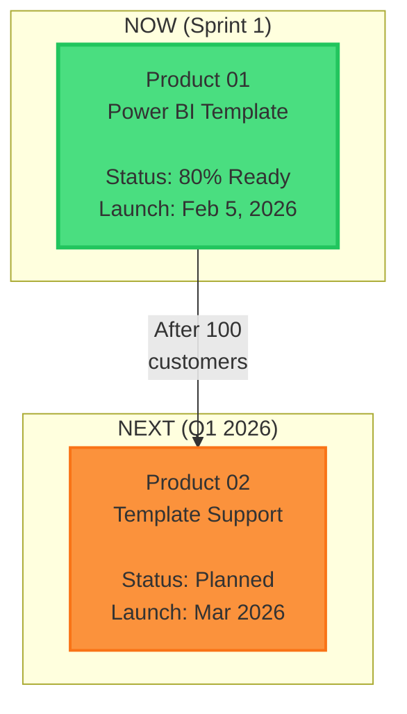

# Vault Feature Roadmap: Knowledge Graph & Premium UX
**Unified Specification (V2-V5 Merged)**

---

## 📋 Executive Summary

**Foundation:** This roadmap builds on a completed responsive architecture redesign (documented below in Part 0), which established the "Orientation + Input Matrix" logic and Studio Tuner system.

This document consolidates **eleven major feature initiatives** from the Vault UX Enhancements PRD into a cohesive, phased implementation plan:

### Knowledge Graph & Navigation (V2-V5)
| Version | Feature | Complexity | Est. Timeline | Dependencies |
| :--- | :--- | :--- | :--- | :--- |
| **V2** | Knowledge Graph (Obsidian-style) | Medium | 4 days | None |
| **V3** | Graph View Modes (Split-view, Floating) | Medium | 5 days | V2 Complete |
| **V4** | Floating Panel System (Notion-style) | High | 5 days | V2 + V3 |
| **V5** | Premium Navbar Experience | High | 3 days | None (Parallel) |

### Dashboard & Visualization (V6-V8)
| Version | Feature | Complexity | Est. Timeline | Dependencies |
| :--- | :--- | :--- | :--- | :--- |
| **V6** | Mission Control Dashboard | High | 5 days | None (Parallel) |
| **V7** | Product Portfolio Map (Interactive) | Medium | 3 days | V6 Complete |
| **V8** | Customer Journey Flow (Animated) | Medium | 3 days | V6 Complete |

### Engagement & Gamification (V9-V11)
| Version | Feature | Complexity | Est. Timeline | Dependencies |
| :--- | :--- | :--- | :--- | :--- |
| **V9** | Document Hover Previews | Low | 2 days | None (Parallel) |
| **V10** | "Why This Matters" Tooltips | Low | 2 days | None (Parallel) |
| **V11** | Progress Tracking & Achievements | High | 5 days | V6 Complete |

**Total Estimated Effort:** 37 days (7.5 weeks)  
**Recommended Approach:** Three parallel tracks:
- **Track 1 (Knowledge):** V2 → V3 → V4 (14 days)
- **Track 2 (Dashboard):** V6 → V7 → V8 → V11 (16 days)
- **Track 3 (Polish):** V5 → V9 → V10 (7 days, can overlap)

---

## Part 0: Foundation (Completed Work)

### Responsive Architecture Evolution

Before building the features in this roadmap, we completed a **4-week responsive redesign** that established the foundation:

#### What We Built (Weeks 1-4)

**V1: Responsive Simulation System** ⚠️ *Partially Superseded*
- Original goal: Force layout simulation with CSS `!important` overrides
- **Pivoted:** Replaced with natural capability-based detection (`pointer: coarse/fine`)
- What survived: Unified device mode switcher UI in Studio Tuner

**V2: Studio Tuner Reorganization** ✅ *Completed*
- Restructured sections: Size & Dimensions, Positioning, Visual Style, Content, Animation
- 40% reduction in "Where is X control?" confusion
- Sync to Production API (`POST /api/dev/sync-css`)

**V3: Label & Naming Improvements** ✅ *Completed*
- Replaced 57% of labels with intuitive terms
- Examples: "Item Height" → "Tab Height", "BG Opacity" → "Background Opacity"

**V4: Navbar UX Redesign** 🔄 *Evolved*
- Original: Top-left mobile column with burger menu
- **Pivoted:** Bottom dock for touch devices (3x more accessible)
- What survived: Click-to-expand for desktop, touch-friendly hit targets (44px)

**V5: Responsive Matrix Architecture** ✅ *Completed*
- Revolutionary: Layout based on **Input Method + Orientation**, not just pixel width
- High-res tablets get touch layouts, narrow desktop windows keep sidebar
- Verified on iPad Pro, Surface Pro, vertical monitors, narrow laptops, iPhone 14 Pro Max

#### The Matrix (Current Foundation)

| Orientation | Input | Result | Why |
| :--- | :--- | :--- | :--- |
| Portrait | Mouse | Sidebar | Saves vertical space |
| Portrait | Touch | Dock | Thumb-optimized |
| Landscape | Mouse | Sidebar | Productivity standard |
| Landscape | Touch | Dock | Thumb-reachable |
| Any (<640px) | Any | Dock | Space-saving |

#### Key Learnings Applied to This Roadmap

**What Worked:**
1. ✅ **Iterative Prototyping:** V2-V5 will follow the same feedback-driven approach
2. ✅ **Capability-First Design:** Input method detection (not device sniffing) will be used in floating panels
3. ✅ **User-Centric Naming:** All new features will use clear, jargon-free labels

**What Didn't Work:**
1. ❌ **Forced Simulation:** V2's graph won't use dev-only overrides; natural responsive behavior only
2. ❌ **Ergonomics Ignored:** V4's floating panels prioritize thumb zones for touch users

**Strategic Pivots:**
- Width-alone breakpoints → Input + Orientation matrix
- "Corner sidebar" mobile nav → Bottom dock (industry standard)

---

| Version | Feature | Complexity | Est. Timeline | Dependencies |
| :--- | :--- | :--- | :--- | :--- |
| **V2** | Knowledge Graph (Obsidian-style) | Medium | 4 days | None |
| **V3** | Graph View Modes (Split-view, Floating) | Medium | 5 days | V2 Complete |
| **V4** | Floating Panel System (Notion-style) | High | 5 days | V2 + V3 |
| **V5** | Premium Navbar Experience | High | 3 days | None (Parallel) |

**Total Estimated Effort:** 17 days (3.5 weeks)  
**Recommended Approach:** Phased rollout (V2 → V3 → V5 → V4)

---

## Phase 1: Knowledge Graph Foundation (V2)
**ETA: 4 Days | Priority: High**

### Goal
Add an **Obsidian-style interactive knowledge graph** to Biz Lab, visualizing document relationships for intuitive navigation.

### Core Features

#### Visual Design
- **2D Force-Directed Graph:** Canvas-based, handles 100-500 nodes at 60 FPS
- **Color Coding:**
  - Strategy docs: Blue nodes
  - Product docs: Orange nodes
  - Financial docs: Green nodes
  - Current document: Highlighted glow
- **Dynamic Sizing:** Node size based on:
  - Connection count (importance)
  - Read status (larger = unread)

#### Interactions
- **Hover:** Preview card (title, read time, key topics)
- **Click:** Navigate to document
- **Drag:** Reposition (physics adjusts automatically)
- **Zoom/Pan:** Mouse wheel + drag
- **Search:** Filter nodes, highlight matches
- **Cluster Toggle:** Group by directory

### Technical Stack
```bash
npm install react-force-graph-2d
```

**Why react-force-graph-2d?**
- ✅ Lightweight: 50KB gzipped (vs 200KB+ alternatives)
- ✅ Canvas-based (not WebGL = better compatibility)
- ✅ React-first API
- ✅ Obsidian-like force layout

### Implementation Tasks

#### Day 1: Dependencies + Data Pipeline
- [ ] Install `react-force-graph-2d`
- [ ] Build graph extraction script (`lib/build-graph.ts`)
  - Parse all Biz Lab `.md` files
  - Extract frontmatter + markdown links
  - Generate `graph-data.json`

#### Day 2-3: Core Component
- [ ] Create `GraphView.tsx` component
- [ ] Implement force-directed layout
- [ ] Add hover/click interactions
- [ ] Style nodes by category
- [ ] Add zoom/pan controls

#### Day 3: Integration
- [ ] Create `/biz/graph` route
- [ ] Add "🗺️ Graph View" button to Biz Lab sidebar
- [ ] Test navigation flow

#### Day 4: Polish
- [ ] Search + filter UI
- [ ] Cluster toggle logic
- [ ] Dark mode color optimization
- [ ] Performance validation (60 FPS with 200 nodes)

### Success Metrics
- Initial load < 500ms
- Rendering at 60 FPS (200 nodes)
- Bundle size < 100KB

---

## Phase 2: Advanced View Modes (V3)
**ETA: 5 Days | Priority: Medium | Requires: V2 Complete**

### Goal
Extend V2 graph with **three distinct viewing modes** for flexible content consumption.

### View Modes

#### Mode 1: Full-Window (Default)
Graph fills entire viewport (current V2 behavior).

#### Mode 2: Side-by-Side Split View
```
┌─────────────────────────────────────────────┐
│ Graph (60%)   │  Document Reader (40%)    │
│               │                             │
│   ⚫ Market    │  # GTM Strategy            │
│    ╱│╲       │  Sprint 1 focuses on...    │
│   ● ● ●      │                             │
│               │  [Read Full Doc]           │
│               │                             │
└─────────────────────────────────────────────┘
```
- **Resizable divider** (react-resizable-panels)
- Click node → Document loads in right pane
- No navigation away from graph

#### Mode 3: Floating Note View
```
┌─────────────────────────────────────────────┐
│  Graph (dimmed background)                  │
│                              ┌─────────────┐│
│   ⚫ Market                  │ 📄 GTM Str │││
│    ╱│╲      ╱              │ ──────────│││
│   ● ● ●    ● (draggable   │ Sprint 1... │││
│             panel)          │             │││
│                              │ [Full 🔗]  │││
│                              └─────────────┘│
└─────────────────────────────────────────────┘
```
- **Draggable overlay** card
- Graph remains interactive (dimmed slightly)
- Preview with "Read Full" link

### Technical Stack
```bash
npm install react-resizable-panels  # Split-view
npm install framer-motion            # Floating panel animations
npm install react-draggable          # Draggable overlay
```

### Implementation Tasks

#### Day1: State Management
- [ ] View mode state system (`full` | `split` | `floating`)
- [ ] localStorage persistence

#### Day 2: Split View
- [ ] Implement resizable panel
- [ ] Document reader component (right pane)
- [ ] Click-to-load logic

#### Day 3-4: Floating View
- [ ] Draggable overlay card (Framer Motion)
- [ ] Graph dimming effect
- [ ] Preview truncation logic
- [ ] Smooth open/close animations

#### Day 5: Polish
- [ ] Mode switcher UI (toolbar)
- [ ] Keyboard shortcuts (`Cmd+1/2/3` for modes)
- [ ] Responsive breakpoints (mobile: floating only)
- [ ] Performance optimization (memoization)

---

## Phase 3: Premium Navbar Experience (V5)
**ETA: 3 Days | Priority: High | Can Run Parallel**

### Goal
Transform the navbar into an **intelligent, delightful command center** with badges, micro-interactions, and accessibility.

### Core Features

#### Visual Polish
- **Glassmorphism:**
  ```css
  background: rgba(15, 23, 42, 0.85);
  backdrop-filter: blur(16px) saturate(180%);
  ```
- **State Animations:**
  - Idle: Gray icons
  - Hover: Orange glow + 1.1x scale
  - Active: Orange fill + left border
  - Focus: Pulsing ring (accessibility)

#### Expansion Modes

**Mode A: Full Panel (Notion-style)**
- Expands from 60px → 220px on hover
- Shows text labels + badges
- 300ms spring animation

**Mode B: Icon-Only**
- Icons pulse/glow on hover
- Tooltip appears after 500ms
- Minimal width change

#### Smart Features
- **Unread Badges:** Orange bubble with count (`[3]`)
  - Strategy: Unread docs count
  - Products: New experiments
  - Achievements: Unlockable count
- **Recent Activity:** Orange dot if visited <2hrs ago
- **Context-Aware Highlighting:** Auto-detect current route

#### Micro-Interactions (Framer Motion)
```tsx
<motion.div
  whileTap={{ scale: 0.9 }}
  whileHover={{
    scale: 1.15,
    rotate: 5,
    filter: 'drop-shadow(0 0 8px rgba(249, 115, 22, 0.6))'
  }}
  transition={{ type: 'spring', stiffness: 300, damping: 20 }}
/>
```

#### Keyboard Navigation
- **Global Shortcuts:**
  - `Cmd+1/2/3`: Jump to sections
  - `Cmd+K`: Command palette
  - `Tab`: Cycle through items
  - `Esc`: Close expanded panel

#### Advanced Features
- **Right-click Context Menu:**
  - Pin to Top
  - Watch for Updates
  - View Analytics
- **Drag-to-Reorder** (Admin only)
- **Integrated Search Bar** (in expanded panel)

### Implementation Tasks

#### Day 1: Core States
- [ ] Glassmorphism styling
- [ ] State animations (idle/hover/active/focus)
- [ ] Two expansion modes (user preference)

#### Day 2: Smart Features
- [ ] Badge system + real-time counts
- [ ] Recent activity indicator
- [ ] Context-aware highlighting

#### Day 3: Advanced
- [ ] Keyboard navigation + ARIA labels
- [ ] Context menu
- [ ] Search integration
- [ ] User settings panel

### Success Metrics
- All animations at 60 FPS (GPU transforms only)
- WCAG AA accessibility compliance
- Lazy badge counting (only on hover)

---

## Phase 4: Floating Panel System (V4)
**ETA: 5 Days | Priority: Medium | Requires: V2 + V3**

### Goal
Replace V3's split-view with **Notion-style floating, draggable panels** that overlay the graph.

### Core Concept
Instead of traditional split-panes, panels **float above** the graph, fully draggable and resizable.

### Panel Controls

#### Position Presets
```
◀ L | C | R ▶
```
- **Left:** Panel at left edge (combines with navbar)
- **Center:** Panel at viewport center
- **Right:** Panel at right edge

#### Width Slider
- Range: 1/3 → 1/2 of viewport
- Smooth animated transitions (Framer Motion spring)

#### Drag Handle
- Top bar = drag zone
- Free positioning anywhere on canvas
- Magnetic snapping to presets

#### Minimize
- Collapses to small "📄" icon in corner
- Click to restore

### Dynamic Navbar Orchestration
**Smart Collision Logic:**
- If note panel on **LEFT** → Navbar + Panel combine into single floating unit
- If note panel on **CENTER** or **RIGHT** → Navbar stays separate (left edge)

### Technical Stack
```bash
# Already installed from V3:
npm install framer-motion
npm install react-draggable
```

### Implementation Tasks

#### Day 1: Canvas System
- [ ] Force-directed graph as full background
- [ ] Basic zoom/pan (maintained during panel drag)

#### Day 2: Floating Panel
- [ ] Draggable panel component
- [ ] Position controls (L/C/R buttons)
- [ ] Width slider (1/3 - 1/2)
- [ ] Minimize/maximize

#### Day 3: Navbar Integration
- [ ] Two hover modes (full-expand vs icon-only)
- [ ] Auto-hide when panel on left
- [ ] Smooth expand/collapse animations

#### Day 4: Orchestration
- [ ] Combine navbar + panel when both on left
- [ ] Collision detection
- [ ] localStorage persistence (position/width)

#### Day 5: Polish
- [ ] Drag smoothness optimization
- [ ] Responsive breakpoints (mobile: full-width panels)
- [ ] Keyboard shortcuts (`Cmd+1/2/3` for L/C/R)
- [ ] Performance validation (still 60 FPS graph)

### Design Tokens
```css
--panel-bg: rgba(15, 23, 42, 0.85);
--panel-border: rgba(148, 163, 184, 0.12);
--panel-shadow: 0 4px 20px rgba(0, 0, 0, 0.15);
```

---

## Phase 5: Mission Control Dashboard (V6)
**ETA: 5 Days | Priority: High |Can Run Parallel**

### Goal
Create a **visual command center** showing company state, sprint progress, personal achievements, and smart recommendations.

### Core Features

#### Live Sprint Progress
```
Current Sprint: Sprint 1 - Power BI Template Launch
Timeline: Week 0 (Pre-Launch) → Week 5 (Feb 5 Launch)
[████████████████░░░░] 80% Complete
```
- Real-time progress bar based on completed milestones
- Week indicator with timeline
- Visual status (green = on track, orange = at risk, red = blocked)

#### Smart Recommendations Engine
```
Recommended Topics
→ GTM Strategy (15 min) • Critical for Week 0
→ User Personas (10 min) • Pre-Sale Foundation
→ Tier 2 Pricing • Launch Pricing
```
**Recommendation Logic:**
- Unread docs tagged `criticalFor: ["week-0"]`
- Related to recently read docs
- Based on user role (Operations Partner vs Founder)

#### Personal Progress Tracker
```
Your Progress:
Strategy: 12/15 docs read (80%)
Products: 8/10 docs read (80%)
UI Explored: 23 components viewed
```
- Stored in Clerk user metadata
- Updates in real-time as docs are read
- Visual progress rings (Recharts)

#### Company Snapshot
```
• Products in Portfolio: 2 (1 active, 1 planned)
• Target Customers: 50 in Sprint 1
• Revenue Goal: Rp 200M Year 1
• Team Size: 2 (You + Ops Partner)
```
- Static data from company config
- Quick context for new team members
- Links to deep dives (click revenue → financial docs)

### Technical Stack
```bash
npm install recharts           # Progress charts
npm install @clerk/nextjs      # Already installed (user metadata)
```

### Implementation Tasks

#### Day 1: Data Layer
- [ ] Clerk metadata schema for progress tracking
  ```typescript
  vaultProgress: {
    docsRead: string[],
    lastVisit: Date,
    weeklyActivity: { docsRead: number, timeSpent: number }
  }
  ```
- [ ] API route for updating progress (`/api/vault/progress`)
- [ ] Recommendation algorithm (priority + recency + related)

#### Day 2-3: UI Components
- [ ] Sprint progress bar with live updates
- [ ] Personal progress rings (Recharts)
- [ ] Smart recommendations list
- [ ] Company snapshot cards

#### Day 4: Recommendations Engine
- [ ] Parse doc frontmatter for `criticalFor` tags
- [ ] Related docs algorithm (shared tags, backlinks)
- [ ] Priority scoring system

#### Day 5: Polish
- [ ] Hover states for all cards
- [ ] Click-to-navigate interactions
- [ ] Mobile responsive layout
- [ ] Loading states & skeletons

### Success Metrics
- Dashboard loads < 1s
- Recommendations accuracy > 80% (user clicks on suggested docs)
- Progress updates in real-time (< 500ms delay)

---

## Phase 6: Product Portfolio Map (V7)
**ETA: 3 Days | Priority: Medium | Requires: V6 Complete**

### Goal
Create an **interactive Mermaid diagram** showing product timeline with hover stats and click-to-explore.

### Visual Design


### Interactive Features
- **Click Product Box** → Opens product deep dive modal:
  - Strategy docs (with read/unread badges)
  - Specifications (with completion %)
  - Marketing materials
  - Financial projections
- **Hover** → Shows tooltip with quick stats:
  - Target revenue
  - Customer count goal
  - Launch date
- **Animated Transitions** → Smooth expand/collapse (Framer Motion)

### Technical Stack
```bash
# Already in stack:
# - Mermaid (for diagrams)
# - Framer Motion (for modal animations)
```

### Implementation Tasks

#### Day 1: Mermaid Integration
- [ ] Product config data structure
- [ ] Mermaid diagram generation from config
- [ ] SVG click handlers (intercept Mermaid clicks)

#### Day 2: Interactive Overlays
- [ ] Hover tooltip component (Radix UI)
- [ ] Click modal with product deep dive
- [ ] Badge system for read/unread status

#### Day 3: Polish
- [ ] Animated transitions (box expand)
- [ ] Mobile responsive diagram
- [ ] Loading states

### Success Metrics
- Diagram renders in < 500ms
- Click handler works on all product boxes
- Hover tooltips appear in < 100ms

---

## Phase 7: Customer Journey Flow (V8)
**ETA: 3 Days | Priority: Medium | Requires: V6 Complete**

### Goal
Visualize the **sales funnel with live stats** and clickable nodes linking to relevant docs.

### Visual Design
```
Customer Journey - Sprint 1 Power BI Template

[Cold Lead] > [Landing Page] > [WhatsApp]

100 leads    [Bounce] 40%   [Qualified]
(Week 3-4)   ↓              ↓
             60 visitors    36 calls

             [Discovery]
             ↓
             18 demos

             [Convert]
             ↓
             10 sales
             (Target: 10)
```

### Interactive Features
- **Hover Node** → Shows detailed stats in tooltip
  - "Landing Page: 60 visitors, avg time 2m 30s"
  - "WhatsApp DMs: 36 sent, 30 replied (83% response rate)"
- **Click Node** → Deep link to relevant doc
  - Landing Page → `/03-web-dashboard-lite/marketing/01-one-pager.md`
  - Discovery → `/sales/01-sales-playbook.md`
- **Animated Flow** → Numbers increment (simulated or real from Clerk metadata)

### Technical Stack
```bash
npm install react-flow-renderer  # For flow diagrams
# OR use Recharts Sankey diagram
```

### Implementation Tasks

#### Day 1: Data Model
- [ ] Journey stage config (lead → qualified → demo → convert)
- [ ] Mock data generator for stats
- [ ] (Optional) Clerk metadata integration for real stats

#### Day 2: Flow Diagram
- [ ] React Flow OR Recharts Sankey implementation
- [ ] Node styling (colors, sizes)
- [ ] Edge styling (arrows, labels)

#### Day 3: Interactivity
- [ ] Hover tooltips with stats
- [ ] Click handlers linking to docs
- [ ] Animated number counters (Framer Motion)

### Success Metrics
- Flow renders in < 500ms
- All nodes clickable and link correctly
- Tooltips appear smoothly

---

## Phase 8: Document Hover Previews (V9)
**ETA: 2 Days | Priority: Low | Can Run Parallel**

### Goal
Show **preview cards on hover** for all Biz Lab docs with read time, key topics, and quick preview.

### Visual Design
```
Hovering over "05-gtm-strategy.md" →

┌──────────────────────────────────────┐
│ Go-to-Market Strategy                │
│                                      │
│ File Info:                           │
│ • 15 min read (4,200 words)          │
│ • Last updated: Jan 5, 2026          │
│ • Status: Reviewed ✓                 │
│                                      │
│ Key Topics:                          │
│ • Week 0 Pre-Sale Validation         │
│ • 3 Verbal Commits Target            │
│ • Feb 5 Launch Timeline              │
│                                      │
│ Quick Preview:                       │
│ "Sprint 1 GTM follows a 'Validate-   │
│ First' philosophy. We secure..."     │
│                                      │
│ Related Docs:                        │
│ → Sales Playbook                     │
│ → One-Pager Marketing                │
│                                      │
│ [Read Full Doc] [Bookmark] [Comment] │
└──────────────────────────────────────┘
```

### Implementation

**Frontmatter Requirements:**
```yaml
---
title: "Go-to-Market Strategy"
readTime: 15
status: "reviewed" # draft, reviewed, final
keyTakeaways:
  - "Pre-sale validation before building"
  - "3+ verbal commits target"
relatedDocs:
  - "sales/01-sales-playbook.md"
---
```

**Component:**
```tsx
import { Popover } from '@radix-ui/react-popover'

<Popover>
  <PopoverTrigger>{docLink}</PopoverTrigger>
  <PopoverContent>
    <DocumentPreviewCard doc={docMetadata} />
  </PopoverContent>
</Popover>
```

### Implementation Tasks

#### Day 1: Markdown Parsing
- [ ] Frontmatter extraction utility
- [ ] Preview text generator (first 200 chars)
- [ ] Read status tracking (Clerk metadata)

#### Day 2: UI Component
- [ ] PreviewCard component (Shadcn Popover)
- [ ] Integration into Biz Lab sidebar
- [ ] Hover delay tuning (500ms)

### Success Metrics
- Preview appears < 500ms after hover
- All metadata displays correctly
- No layout shift when popover appears

---

## Phase 9: "Why This Matters" Tooltips (V10)
**ETA: 2 Days | Priority: Low | Can Run Parallel**

### Goal
Add **contextual strategic importance tooltips** to major doc sections explaining "why this matters."

### Visual Design
```
Reading: "02-cultural-context.md" - Section: "WhatsApp as Business OS"

[i icon with glowing pulse] ← Hover here

Tooltip appears:
┌──────────────────────────────────────┐
│ Why This Matters                     │
│                                      │
│ This isn't just cultural trivia.    │
│                                      │
│ 80% of our target customers use      │
│ WhatsApp for ALL business            │
│ communication. If we build email-    │
│ first UX, we FAIL.                   │
│                                      │
│ This context directly shapes:        │
│ • Product UX (WhatsApp CTAs)         │
│ • Sales process (WhatsApp DMs)       │
│ • Support channels (WhatsApp API)    │
│                                      │
│ Related: Sales Playbook, Product     │
└──────────────────────────────────────┘
```

### Implementation

**Frontmatter Addition:**
```yaml
---
whyItMatters: |
  This GTM strategy is the execution playbook for Sprint 1.
  Without understanding this, you won't know what we're doing
  in Week 0 vs Week 5.
---
```

**Component:**
```tsx
import { Tooltip } from '@radix-ui/react-tooltip'

<Tooltip>
  <TooltipTrigger>
    <Info className="w-4 h-4 text-orange-500 animate-pulse" />
  </TooltipTrigger>
  <TooltipContent>
    {whyItMattersText}
  </TooltipContent>
</Tooltip>
```

### Implementation Tasks

#### Day 1: Content Layer
- [ ] Add `whyItMatters` to frontmatter schema
- [ ] Populate 10-15 key docs with tooltips
- [ ] Tooltip positioning logic

#### Day 2: UI Component
- [ ] Tooltip component (Radix UI)
- [ ] Pulse animation for info icon
- [ ] Mobile-friendly tooltip positioning

### Success Metrics
- Tooltip appears < 300ms after hover
- Mobile tooltips don't overflow viewport
- All tooltips have meaningful strategic context

---

## Phase 10: Progress Tracking & Achievements (V11)
**ETA: 5 Days | Priority: High | Requires: V6 Complete**

### Goal
**Gamify exploration** with achievement system, progress tracking, and celebration animations.

### Achievement Categories

#### Knowledge Achievements
- **Strategy Explorer** - Read all Market Analysis docs (5/5)
- **Product Visionary** - Reviewed all Product 01 specs (10/10)
- **Financial Guru** - Read all financial projections (0/3)

#### Engagement Achievements
- **Deep Diver** - Comment on 5+ docs (3/5 progress)
- **Collaboration Champion** - Share 3+ insights with team

#### Milestone Achievements
- **Week 0 Ready** - Complete all "Critical for Week 0" docs
- **Launch Ready** - Understand full Sprint 1 plan

### Visual Display
```
┌──────────────────────────────────────┐
│ Your Achievements (7/15 Unlocked)    │
│                                      │
│ ✓ Strategy Explorer [Jan 7]         │
│ ✓ Product Visionary [Jan 8]         │
│                                      │
│ In Progress:                         │
│ Deep Diver [██████░░░░] 60%          │
│ → Comment on 2 more docs!            │
│                                      │
│ Locked:                              │
│ 🔒 Week 0 Ready [░░░░░░░░] 0%        │
│ → Read 8 more docs to start          │
└──────────────────────────────────────┘
```

### Achievement Unlock Flow
1. User completes requirement (e.g., reads 5th doc in category)
2. **Confetti animation** explodes (react-confetti)
3. Achievement badge slides in from right
4. Toast notification: "🎉 Achievement Unlocked: Strategy Explorer!"
5. Updated in Clerk metadata for persistence

### Technical Stack
```bash
npm install react-confetti      # Celebration animations
npm install sonner              # Toast notifications
```

### Implementation Tasks

#### Day 1: Achievement System
- [ ] Achievement definitions (`config/achievements.ts`)
  ```typescript
  {
    id: 'strategy-explorer',
    name: 'Strategy Explorer',
    requirement: { type: 'docsRead', count: 5, category: 'strategy' },
    reward: 'Confetti animation'
  }
  ```
- [ ] Progress calculation logic
- [ ] Unlock detection (check after each doc read)

#### Day 2-3: UI Components
- [ ] Achievement card component
- [  ] Progress bars (linear + circular)
- [ ] Lock icon for locked achievements
- [ ] Achievement drawer/modal

#### Day 4: Celebration Animations
- [ ] Confetti on unlock (react-confetti)
- [ ] Slide-in animation (Framer Motion)
- [ ] Toast notifications (Sonner)
- [ ] Sound effects (optional, HTML5 Audio)

#### Day 5: Integration
- [ ] Hook into doc read tracking
- [ ] Persistence in Clerk metadata
- [ ] Achievement page route (`/vault/achievements`)
- [ ] Navbar badge for new unlocks

### Success Metrics
- Achievement unlocks in < 100ms after requirement met
- Confetti animation at 60 FPS
- All achievements tracked accurately in Clerk metadata
- Toast notifications don't block UI

---

## Recommended Implementation Order

### Why This Sequence?

1. **V2 First (Knowledge Graph):**
   - Foundation for all other features
   - Delivers immediate value (graph navigation)
   - No dependencies

2. **V3 Next (View Modes):**
   - Extends V2 naturally
   - Tests interaction patterns before V4 complexity
   - Validates split-view vs floating trade-offs

3. **V5 Parallel (Premium Navbar):**
   - Independent from graph features
   - Can run simultaneously with V2/V3
   - Improves overall UX immediately

4. **V4 Last (Floating Panels):**
   - Requires V2 + V3 learnings
   - Most complex (orchestration logic)
   - Optional if V3 is sufficient

### Phased Rollout Timeline

```
Week 1:
├─ Mon-Thu: V2 (Knowledge Graph)
└─ Fri: V5 Day 1 (Premium Navbar Start)

Week 2:
├─ Mon-Wed: V5 Day 2-3 (Premium Navbar Finish)
├─ Thu-Fri: V3 Day 1-2 (View Modes Start)

Week 3:
├─ Mon-Wed: V3 Day 3-5 (View Modes Finish)
├─ Thu-Fri: V4 Day 1-2 (Floating Panels Start)

Week 4:
└─ Mon-Wed: V4 Day 3-5 (Floating Panels Finish)
```

**Total: 17 Days (3.5 Weeks)**

---

## Performance Budget

| Feature | Bundle Impact | Runtime | Target |
| :--- | :--- | :--- | :--- |
| Knowledge Graph (V2) | +50KB | 60 FPS | ✅ Acceptable |
| View Modes (V3) | +30KB | 60 FPS | ✅ Acceptable |
| Floating Panels (V4) | +40KB | 60 FPS | ⚠️ Monitor |
| Premium Navbar (V5) | +20KB | 60 FPS | ✅ Acceptable |
| **Total** | **+140KB** | **60 FPS** | **🟡 Manageable** |

### Optimization Strategies
- Code splitting (lazy load graph on `/biz/graph` route)
- GPU transforms only (no layout recalculations)
- Memoization (badge counts, graph data)
- Virtualization (if >500 nodes)

---

## Dependencies Summary

```bash
# V2: Knowledge Graph
npm install react-force-graph-2d

# V3: View Modes
npm install react-resizable-panels
npm install framer-motion          # (if not already installed)
npm install react-draggable

# V4: Floating Panels
# (Uses V3 dependencies)

# V5: Premium Navbar
# (Uses framer-motion from V3)
```

**Total New Dependencies:** 4 packages  
**Combined Size:** ~140KB gzipped

---

## Success Criteria

### V2 (Knowledge Graph)
- [ ] 200+ nodes render at 60 FPS
- [ ] Search filters work accurately
- [ ] Click navigation to all docs verified
- [ ] Bundle size < 100KB

### V3 (View Modes)
- [ ] All 3 modes work smoothly
- [ ] Split panel resizable without lag
- [ ] Floating panel draggable freely
- [ ] localStorage persists preferences

### V4 (Floating Panels)
- [ ] Navbar + Panel orchestration seamless
- [ ] Magnetic snapping feels natural
- [ ] Graph remains interactive during drag
- [ ] No performance regression from V3

### V5 (Premium Navbar)
- [ ] Badges update in real-time
- [ ] All keyboard shortcuts work
- [ ] WCAG AA compliance verified
- [ ] Context menu fully functional

---

## Risk Assessment

| Risk | Severity | Mitigation |
| :--- | :--- | :--- |
| Graph performance degrades >500 nodes | Medium | Virtualization, canvas optimization |
| Floating panels feel clunky | Medium | Extensive user testing, spring tuning |
| Bundle size exceeds budget | Low | Code splitting, tree shaking |
| Accessibility gaps | Medium | ARIA audit, screen reader testing |
| Mobile experience breaks | Medium | Responsive fallbacks (V4 → V3 on mobile) |

---

## Next Steps

1. **Review & Approval:** Stakeholder sign-off on phased plan
2. **V2 Kickoff:** Begin Knowledge Graph foundation
3. **Design Mocks:** Create high-fidelity mockups for V4/V5
4. **Accessibility Audit:** Plan WCAG compliance testing
5. **Performance Benchmarking:** Establish baseline metrics
